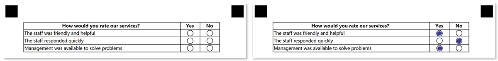

This element defines a group of questions with multiple evaluation criteria. The marked criteria for each question are summarized upon recognition and the resulting value is used as an answer for the question.

**Score_group** content is organized in a tabular view for better readability.

## Syntax

The element declaration begins with `?score_group=[name]` statement and ends with `&score_group` statement. These statements must be placed on separate lines.

`name` property is used as an element's identifier and as a reminder of the element's purpose in template source; for example, `"Satisfaction survey"`. The name is not displayed on the form.

{} 

Never add empty lines after the opening `?score_group=` statement. Doing so will result in an error when rendering a form.

{}

**score_group** element includes one or more [**score_question**]() elements.


## score_group attributes

The **score_group** element can be customized by adding optional attributes to it.

An attribute is written as `[attribute_name]=[value]`. Each attribute must be placed on a **new line** immediately after the opening `?score_group=` statement or another attribute, and must begin with a **tab character**.

Attribute | Default value | Description | Usage example
--------- | ------------- | ----------- | -------------
**score_type_table** | table | Layout of the **score_group** element.<br />This attribute is reserved for future use; you can omit it. | `score_type_table=table`

## score_question element

This element defines the question to be rated based on the underlying criteria.

The element declaration begins with `?score_question=` statement followed by the question's text and ends with `&score_question` statement. These statements must be placed on separate lines.

**Score_question** element includes [**score_header**](), [**score_answer**](), and optional [**table_content**]() elements.

### score_question attributes

An attribute is written as `[attribute_name]=[value]`. Each attribute must be placed on a **new line** immediately after the opening `?score_question=` statement or another attribute, and must begin with a **tab character**.

#### Required score_question attributes

Attribute | Default value | Description | Usage example
--------- | ------------- | ----------- | -------------
**row_proportions** | n/a | Criteria, bubbles and custom content for the question are organized in a tabular view. This attribute specifies the number of columns and their relative proportions.<br />The attribute value is provided in the following format: `{Column 1 width %}-{Column 2 width %}-...{Column N width %}`. The grand total of all column widths must not exceed 100%. | `row_proportions=80%-10%-10%`

#### Optional score_question attributes

Attribute | Default value | Description | Usage example
--------- | ------------- | ----------- | -------------
**score_display** | DontDisplay | Defines how to display the numeric score for each evaluation criterion (value of the **score** attribute of **score_answer** element):<ul><li>`DontDisplay` - do not show scores;</li><li>`DisplayInsideCell` - show scores inside bubbles;</li><li>`DisplayAsExtraColumn` - show scores in an additional column. This mode requires a dedicated column to be defined in **row_proportions** attribute and the corresponding [**score_header**]() element for that column.</li></ul> | `score_display=DisplayInsideCell`
**font_family** | Segoe UI | The font family for the question text. | `font_family=Courier New`
**font_style** | regular | The font style for the question text: `bold`, `italic` or `underline`.<br />Several font styles can be combined by listing them separated by commas. | `font_style=bold, italic`
**font_size** | 12 | Font size for the question text. | `font_size=16`

### score_header element

This element defines the text that will be displayed in the header cell of the corresponding column and determines the content of that column.

{} 

The total number of **score_header** elements must be 1 less than the number of columns defined in the **row_proportions** attribute of the parent [**score_question**]() element.

One column is always reserved for the [criteria text]().

{}

The element declaration begins with `?score_header=` statement followed by the header text. This statement must be placed on a separate line.

#### score_header attributes

An attribute is written as `[attribute_name]=[value]`. Each attribute must be placed on a **new line** immediately after the opening `?score_header=` statement or another attribute, and must begin with a **tab character**.

##### Required score_header attributes

The **header_type** attribute determines what will be displayed inside the corresponding column. This attribute can take one of the following values:

- `positive` (default) - draw a bubble that, if marked, will add the criteria score to the resulting score of the question.
- `negative` - draw a bubble that, if marked, will be ignored.
- `amount` - show the criterion score in the corresponding column. Requires **score_display** attribute of the parent [**score_question**]() element to be set to `DisplayAsExtraColumn`.
- `question` - moves the first column with criteria to this position. All other columns are shifted to the left.
- `content` - fills the column with the value of [**table_content**]() element.

##### Optional score_header attributes

Attribute | Default value | Description | Usage example
--------- | ------------- | ----------- | -------------
**font_family** | Segoe UI | The font family for the column header text. | `font_family=Courier New`
**font_style** | regular | The font style for the column header text: `bold`, `italic` or `underline`.<br />Several font styles can be combined by listing them separated by commas. | `font_style=bold, italic`
**font_size** | 12 | Font size for the column header text. | `font_size=16`
**align** | left | Horizontal alignment of the column header text: `left`, `center` or `right`. | `align=center`

### score_answer element

This element defines the evaluation criterion.

The element declaration begins with `?score_answer=` statement followed by the criterion text. This statement must be placed on a separate line.

#### score_answer attributes

An attribute is written as `[attribute_name]=[value]`. Each attribute must be placed on a **new line** immediately after the opening `?score_answer=` statement or another attribute, and must begin with a **tab character**.

##### Required score_answer attributes

The score (weight) of the criterion that is used for calculation is defined in **score** attribute. For example, `score=5`.

##### Optional score_answer attributes

Attribute | Default value | Description | Usage example
--------- | ------------- | ----------- | -------------
**font_family** | Segoe UI | The font family for the criterion text. | `font_family=Courier New`
**font_style** | regular | The font style for the criterion text: `bold`, `italic` or `underline`.<br />Several font styles can be combined by listing them separated by commas. | `font_style=bold, italic`
**font_size** | 12 | Font size for the criterion text. | `font_size=16`
**align** | left | Horizontal alignment of the criterion text: `left`, `center` or `right`. | `align=center`

### table_content element

This optional element allows you to define the content of the custom column declared with [**score_header**]() element with the **header_type** attribute equals to `content`.

The element declaration begins with `?table_content=` statement followed by the text to be put in the custom column. This statement must be placed on a separate line.

#### table_content attributes

An attribute is written as `[attribute_name]=[value]`. Each attribute must be placed on a **new line** immediately after the opening `?table_content=` statement or another attribute, and must begin with a **tab character**.

##### Required table_content attributes

Attribute | Default value | Description | Usage example
--------- | ------------- | ----------- | -------------
**column** | n/a | Determines the column number to insert the text into.<br />Note, that the column must be declared with [**score_header**]() element with the **header_type** attribute equals to `content`. | `column=2`
**row** | n/a | Determines the row number to insert the text into.<br />This value must not exceed the number of [**score_answer**]() elements! | `row=2`

##### Optional table_content attributes

Attribute | Default value | Description | Usage example
--------- | ------------- | ----------- | -------------
**font_family** | Segoe UI | The font family for the text. | `font_family=Courier New`
**font_style** | regular | The font style for the text: `bold`, `italic` or `underline`.<br />Several font styles can be combined by listing them separated by commas. | `font_style=bold, italic`
**font_size** | 12 | Font size for the text. | `font_size=16`
**align** | left | Horizontal alignment of the text: `left`, `center` or `right`. | `align=center`

## Examples

Check out the code examples to see how **score_group** elements can be used.

### Customer satisfaction survey

```
?score_group=Satisfaction survey
?score_question=How would you rate our services?
	row_proportions=80%-10%-10%
	font_style=bold
?score_header=Yes
	header_type=positive
	font_style=bold
	align=center
?score_header=No
	header_type=negative
	font_style=bold
	align=center
?score_answer=The staff was friendly and helpful
	score=1
?score_answer=The staff responded quickly
	score=1
?score_answer=Management was available to solve problems
	score=1
&score_question
&score_group
```



#### Recognition result

```
How would you rate our services?_total, "2"
Satisfaction survey_total, "2"
```

### Custom column ordering

```
?score_group=Satisfaction survey
?score_question=How would you rate our services?
	row_proportions=10%-10%-10%-70%
	score_display=DisplayAsExtraColumn
	font_style=bold
?score_header=Score
	header_type=amount
	font_style=bold
	align=center
?score_header=Yes
	header_type=positive
	font_style=bold
	align=center
?score_header=No
	header_type=negative
	font_style=bold
	align=center
?score_header=How would you rate our services?
	header_type=question
?score_answer=The staff was friendly and helpful
	score=1
?score_answer=The staff responded quickly
	score=3
?score_answer=Management was available to solve problems
	score=2
&score_question
&score_group
```


