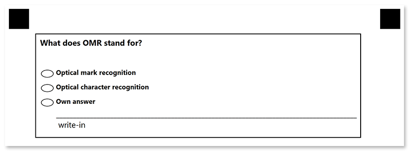

This element generates a vertical block with answers. 

**Vertical_choicebox** also supports [write_in](/omr/net/txt-markup/write_in/) element that allows for implementing open-ended questions.

## Syntax

The element declaration begins with `?vertical_choicebox=[name]` statement and ends with `&vertical_choicebox` statement. These statements must be placed on separate lines.

**vertical_choicebox** elements can only be nested within [block](/omr/net/txt-markup/block/) elements and cannot be used at the top level of the form hierarchy.

`name` property is used as an element's identifier in recognition results and as a reminder of the element's purpose in template source; for example, `"Preference"`. The name is not displayed on the form.

{} 

Never add empty lines after the opening `?vertical_choicebox=` statement. Doing so will result in an error when rendering a form.

{}

### Answers

Answers are provided using **answer** elements that are placed inside the **vertical_choicebox** declaration. An answer declaration begins with `?answer=<value>` statement and ends with `&answer` statement. These statements must be placed on separate lines.

`Value` property is used for identifying the marked answer in recognition results.

Each answer can include the following elements:

- [paragraph](/omr/net/txt-markup/paragraph/)
- [content](/omr/net/txt-markup/content/)
- [write_in](/omr/net/txt-markup/write_in/)

### Attributes

The **vertical_choicebox** element can be customized by adding optional attributes to it.

An attribute is written as `[attribute_name]=[value]`. Each attribute must be placed on a **new line** immediately after the opening `?vertical_choicebox=` statement or another attribute, and must begin with a **tab character**.

Attribute | Default value | Description | Usage example
--------- | ------------- | ----------- | -------------
**threshold** | 45 | Set the recognition accuracy for the answer bubbles, from 0 to 100. Lower values allow even the lightest marks to be recognized, but may cause dirt or paper defects to be treated as marks. Higher values require a more solid fill and may cause pencil marks or small checks to be ignored.<br /><br /> | `threshold=35`
**bubble_type** | round | Set the bubble design:<ul><li>`round` - circle</li><li>`square` - box</li></ul> | `bubble_type=square`
**top_padding** | 0 | The vertical spacing (in pixels) before the first **answer** element. | `top_padding=160`

## Combining with write_in elements

[**Write_in**](/omr/net/txt-markup/write_in/) element can be included into **vertical_choicebox** element to give the respondent the opportunity to provide a free-form answer to an open-ended question.

In this case, the content of the element is stored to [Images](https://reference.aspose.com/omr/net/aspose.omr.model/recognitionresult/properties/images) collection only if the respondent marks the corresponding bubble.

{}

If the corresponding bubble is marked, the contents of the [**write_in**](/omr/net/txt-markup/write_in/) element are always saved, even if its [`required`](/omr/net/txt-markup/write_in/#attributes) attribute is set to `false`.

{}

## Example

```
?container=Example
?block=Border
	border=Square
	border_size=5
?content=What does OMR stand for?
	font_style=Bold
	font_size=12
?vertical_choicebox=Definition
	top_padding=100
?answer=1
?content=Optical mark recognition
	font_style=Bold
	font_size=10
&answer
?answer=2
?content=Optical character recognition
	font_style=Bold
	font_size=10
&answer
?answer=3
?content=Own answer
	font_style=Bold
	font_size=10
?write_in=Own answer
&answer
&vertical_choicebox 	
&block
&container
```


