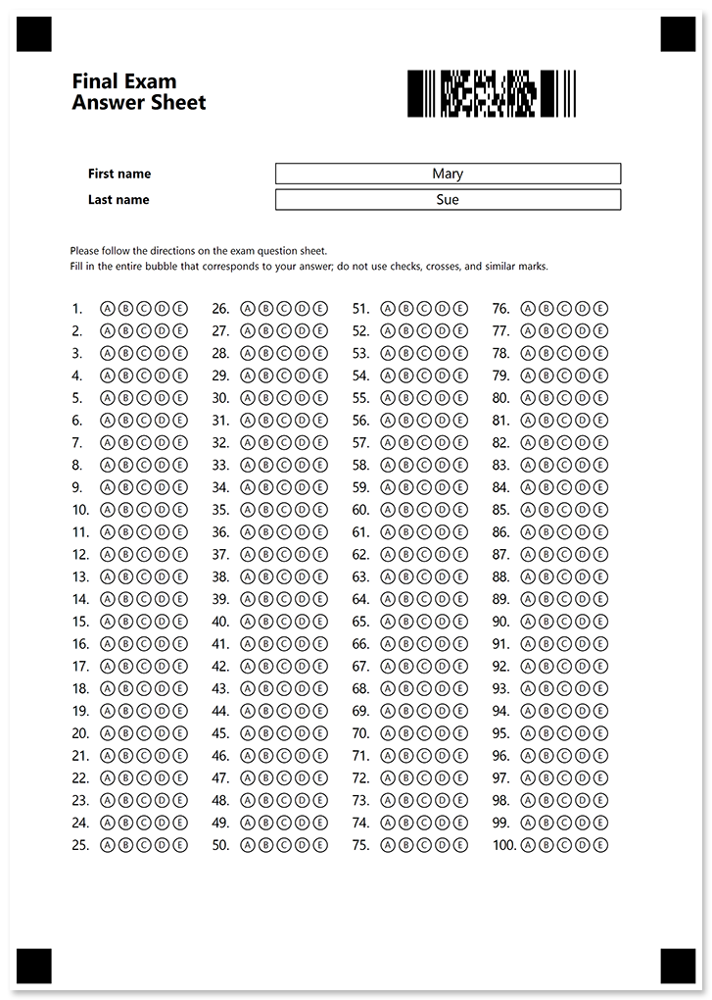
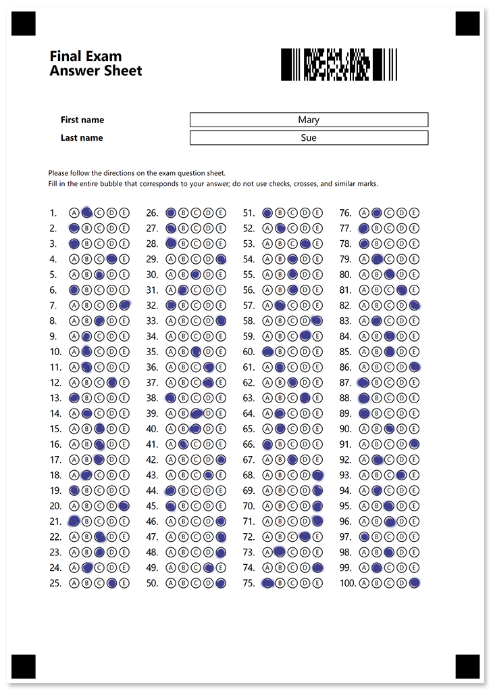

In this example, we'll show the source code for a standard 100-question answer sheet personalized with a barcode that encodes the student's name.

## Used elements

- [**answer_sheet**](/omr/net/txt-markup/answer_sheet/)  
  Generate a numbered matrix of bubbles arranged in multiple columns to make more efficient use of space.
- [**barcode**](/omr/net/txt-markup/elements-barcode/)  
  Add a QR-code to personalize or uniquely identify a form.
- [**empty_line**](/omr/net/txt-markup/empty_line/)  
  Add a vertical spacing between elements.
- [**input_group**](/omr/net/txt-markup/input_group/)  
  Insert unencrypted personalized information.
- [**paragraph**](/omr/net/txt-markup/paragraph/)  
  Combine texts with different formatting.
- [**text**](/omr/net/txt-markup/text/)  
  Add one or more lines of text to the form.

## Source code

```
?container=Personalized answer sheet
	columns_count=2
?block=
	column=1
?paragraph=
?content=Final Exam
	font_size=18
	font_style=bold
?content=Answer Sheet
	font_size=18
	font_style=bold
&paragraph
&block
?block=
	column=2
?barcode=Student
	value=Mary Sue
	barcode_type=PDF417
	height=200
&block
&container
?empty_line=
?input_group=First name
	input_border=square
?content=First name
	font_style=bold
	font_size=11
?content=Mary
	align=center
&input_group
?input_group=Last name
	input_border=square
?content=Last name
	font_style=bold
	font_size=11
?content=Sue
	align=center
&input_group
?empty_line=
?text=Please follow the directions on the exam question sheet.
Fill in the entire bubble that corresponds to your answer; do not use checks, crosses, and similar marks.
	font_size=9
?empty_line=
?answer_sheet=Answers
	columns_count=4
	elements_count=100
	answers_count=5
	bubble_size=small
	vertical_margin=10
```

## Printable form



## Filled form



## Recognition results

```
Element Name,Value,
Answers1,"B"
Answers2,"A"
Answers3,"A"
Answers4,"D"
Answers5,"C"
Answers6,"A"
Answers7,"E"
Answers8,"C"
Answers9,"B"
Answers10,"B"
Answers11,"B"
Answers12,"D"
Answers13,"A"
Answers14,"B"
Answers15,"C"
Answers16,"C"
Answers17,"C"
Answers18,"B"
Answers19,"A"
Answers20,"E"
Answers21,"A"
Answers22,"C"
Answers23,"C"
Answers24,"B"
Answers25,"D"
Answers26,"A"
Answers27,"A"
Answers28,"A"
Answers29,"E"
Answers30,"C"
Answers31,"B"
Answers32,"A"
Answers33,"E"
Answers34,""
Answers35,"C"
Answers36,"D"
Answers37,"D"
Answers38,"A"
Answers39,"C"
Answers40,"C"
Answers41,"B"
Answers42,"E"
Answers43,"D"
Answers44,"A"
Answers45,"A"
Answers46,"E"
Answers47,"E"
Answers48,"E"
Answers49,"D"
Answers50,"E"
Answers51,"A"
Answers52,"B"
Answers53,"D"
Answers54,"C"
Answers55,"C"
Answers56,"C"
Answers57,"B"
Answers58,"E"
Answers59,"D"
Answers60,"A"
Answers61,"B"
Answers62,"C"
Answers63,"D"
Answers64,"B"
Answers65,"B"
Answers66,"A"
Answers67,"C"
Answers68,"E"
Answers69,"E"
Answers70,"E"
Answers71,"E"
Answers72,"D"
Answers73,"B"
Answers74,"E"
Answers75,"A"
Answers76,"B"
Answers77,"A"
Answers78,"A"
Answers79,"B"
Answers80,"C"
Answers81,"D"
Answers82,"E"
Answers83,"B"
Answers84,"C"
Answers85,"C"
Answers86,"E"
Answers87,"A"
Answers88,"A"
Answers89,"A"
Answers90,"C"
Answers91,"E"
Answers92,"B"
Answers93,"D"
Answers94,"B"
Answers95,"C"
Answers96,"C"
Answers97,"A"
Answers98,"C"
Answers99,"B"
Answers100,"E"
Student,"Mary Sue"
```
