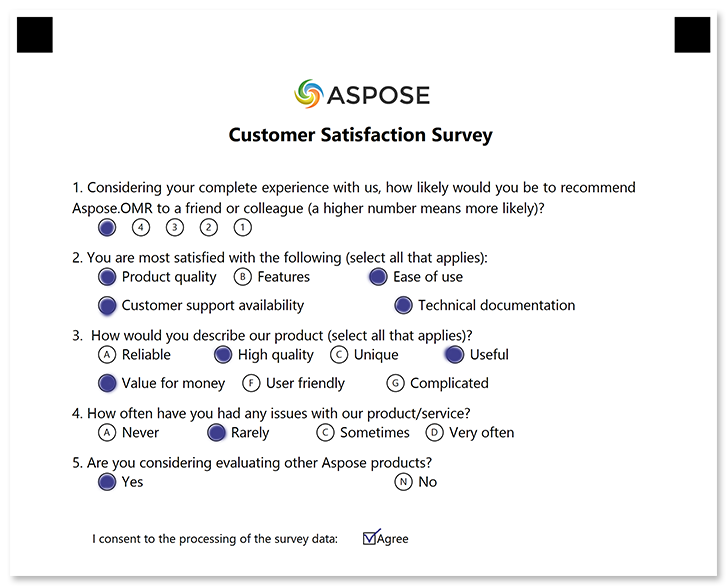

In this example, we'll show the source code for a customer satisfaction survey decorated with your logo.


## Used elements

- [checkbox](/omr/net/txt-markup/checkbox/)  
  Generate a list of answers with blank bubbles that can accommodate any kind of marks.
- [empty_line](/omr/net/txt-markup/empty_line/)  
  Add a vertical spacing between elements.
- [image](/omr/net/txt-markup/image/)  
  Insert a picture.
- [Question](/omr/net/txt-markup/question/)  
  Generate a question with a fixed number of answers.
- [text](/omr/net/txt-markup/text/)  
  Add one or more lines of text to the form.

## Source code

Adding images to a survey requires changes to both the application code and the template source.

### Application code

You must add all images you mention in the template to the [ImagesPaths](https://apireference.aspose.com/omr/net/aspose.omr.generation/globalpagesettings/fields/imagespaths) parameter of the [global page settings](https://apireference.aspose.com/omr/net/aspose.omr.generation/globalpagesettings).

If the image file is named `aspose-logo.png` and is located in the same folder as the application exactable:

```csharp
string appPath = Path.GetDirectoryName(typeof(Program).Assembly.Location);
GlobalPageSettings pageSettings = new GlobalPageSettings() {
	ImagesPaths = new string[] { Path.Combine(appPath, "aspose-logo.png") }
};
var result = engine.GenerateTemplate("source.txt", pageSettings);
```

{} 

Do not forget to reference `System.IO` and `Aspose.OMR.Generation` namespaces in your code.

{}

## Template source

```
?image=aspose-logo.png
	align=center
?text=Customer Satisfaction Survey
	align=center
	font_size=16
	font_style=bold
?empty_line=
#Considering your complete experience with us, how likely would you be to recommend
Aspose.OMR to a friend or colleague (a higher number means more likely)?
	(5) (4) (3) (2) (1)
#You are most satisfied with the following (select all that applies):
	() Product quality () Features () Ease of use
	() Customer support availability () Technical documentation
#How would you describe our product (select all that applies)?
	() Reliable () High quality () Unique () Useful
	() Value for money () User friendly () Complicated
#How often have you had any issues with our product/service?
	() Never () Rarely () Sometimes () Very often
#Are you considering evaluating other Aspose products?
	(Yes) Yes (No) No
?empty_line=
?checkbox=I consent to the processing of the survey data:
	bubble_size=extrasmall
	font_size=10
	threshold=15
?content=Agree
	font_size=10
&checkbox
```

## Printable form


## Filled form



## Recognition results

```
Element Name,Value,
I consent to the processing of the survey data:,"Agree"
Question1,"5"
Question2,"A,C,D,E"
Question3,"B,D,E"
Question4,"B"
Question5,"Y"
```
