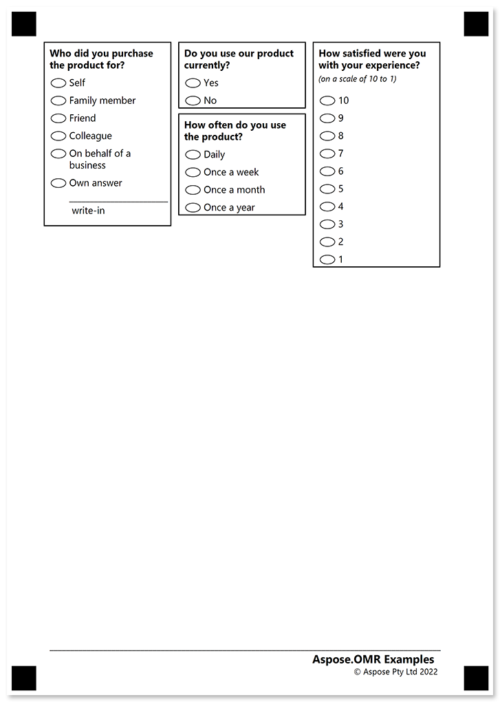
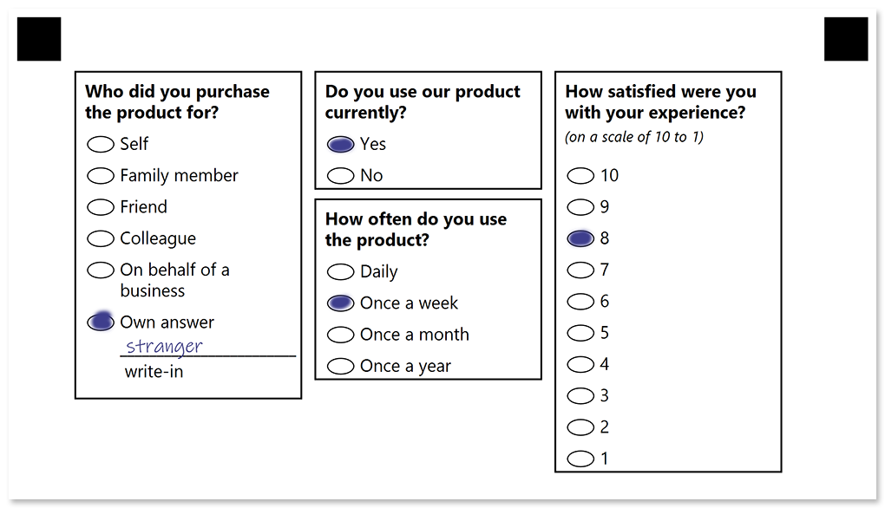

In this example, we will show the source code for a compact questionnaire with a multi-column layout, open-ended questions and a footer.

## Used elements

- [block](/omr/net/txt-markup/block/)  
  Organize other elements in container columns.
- [container](/omr/net/txt-markup/container/)  
  Break content into columns and to add a footer to the form.
- [content](/omr/net/txt-markup/content/)  
  Add a line of text to the parent element.
- [paragraph](/omr/net/txt-markup/paragraph/)  
  Combine texts with different formatting.
- [vertical_choicebox](/omr/net/txt-markup/vertical_choicebox/)  
  Generate a vertical question block with multiple answers.
- [write_in](/omr/net/txt-markup/write_in/)  
  Provide a blank field in which the respondent can hand write some text or draw a picture.

## Source code

```
?container=Multi-column questionnaire
	columns_count=3
?block=
	column=1
	border=square
	border_size=5
	border_color=Black
?content=Who did you purchase the product for?
	font_style=Bold
	font_size=12
?vertical_choicebox=Who did you purchase the product for?
?answer=Self
?content=Self
	font_size=12
&answer
?answer=Family member
?content=Family member
	font_size=12
&answer
?answer=Friend
?content=Friend
	font_size=12
&answer
?answer=Colleague
?content=Colleague
	font_size=12
&answer
?answer=On behalf of a business
?content=On behalf of a business
	font_size=12
&answer
?answer=Own answer
?content=Own answer
	font_size=12
?write_in=Own answer
	required=true
&answer
&vertical_choicebox
&block
?block=
	column=2
	border=square
	border_size=5
	border_color=Black
?content=Do you use our product currently?
	font_style=Bold
	font_size=12
?vertical_choicebox=Do you use our product currently?
?answer=Yes
?content=Yes
	font_size=12
&answer
?answer=No
?content=No
	font_size=12
&answer
&vertical_choicebox
&block
?block=
	column=2
	border=square
	border_size=5
	border_color=Black
?content=How often do you use the product?
	font_style=Bold
	font_size=12
?vertical_choicebox=How often do you use the product?
?answer=Daily
?content=Daily
	font_size=12
&answer
?answer=Once a week
?content=Once a week
	font_size=12
&answer
?answer=Once a month
?content=Once a month
	font_size=12
&answer
?answer=Once a year
?content=Once a year
	font_size=12
&answer
&vertical_choicebox
&block
?block=
	column=3
	border=square
	border_size=5
	border_color=Black
?paragraph=
?content=How satisfied were you with your experience?
	font_style=Bold
	font_size=12
?content=(on a scale of 10 to 1)
	font_style=Italic
	font_size=10
&paragraph
?vertical_choicebox=How satisfied were you with your experience?
?answer=10
?content=10
	font_size=12
&answer
?answer=9
?content=9
	font_size=12
&answer
?answer=8
?content=8
	font_size=12
&answer
?answer=7
?content=7
	font_size=12
&answer
?answer=6
?content=6
	font_size=12
&answer
?answer=5
?content=5
	font_size=12
&answer
?answer=4
?content=4
	font_size=12
&answer
?answer=3
?content=3
	font_size=12
&answer
?answer=2
?content=2
	font_size=12
&answer
?answer=1
?content=1
	font_size=12
&answer
&vertical_choicebox
&block
&container
?container=Footer
	type=footer
?block=Copyright
?paragraph=
?content=Aspose.OMR Examples
	align=right
	font_style=Bold
	font_size=14
?content=© Aspose Pty Ltd 2022
	align=right
	font_size=10
&paragraph
&block
&container
```

## Printable form



## Filled form



## Recognition results

```
Element Name,Value,
Do you use our product currently?,"Yes"
How often do you use the product?,"Once a week"
How satisfied were you with your experience?,"8"
Who did you purchase the product for?,"Own answer"
```

### Write-in field image


