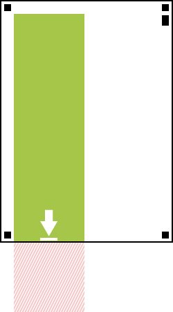
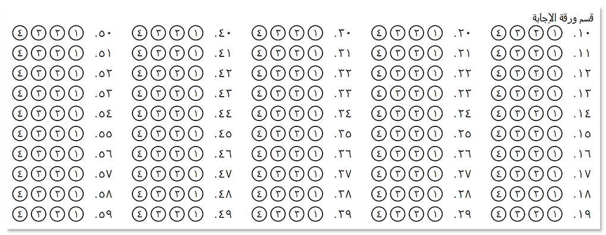

The paper size, orientation, font, and other layout settings are configured through [`GlobalPageSettings`](https://reference.aspose.com/omr/net/aspose.omr.generation/globalpagesettings) object. It also allows you to provide paths to images used in the form. `GlobalPageSettings` object is passed as an optional parameter to the [template generation methods](/omr/net/generate-template/).

## Page setup

You can customize the following page layout parameters through `GlobalPageSettings`:

Setting | Type | Default value | Description
------- | ---- | ------------- | -----------
[`PaperSize`](https://reference.aspose.com/omr/net/aspose.omr.generation/papersize) | `Aspose.OMR.Generation.PaperSize` | A4 (210 x 297 mm) | Physical page dimensions.
[`Orientation`](https://reference.aspose.com/omr/net/aspose.omr.generation/orientation) | `Aspose.OMR.Generation.Orientation` | Portrait (vertical) | Page orientation.
`PageMarginLeft` | `int` | 210 pixels | The size of the left page margin in pixels.
`PageMarginRight` | `int` | 210 pixels | The size of the right page margin in pixels.
`FontFamily` | `string` | Segoe UI | Font family for all texts, except for those directly overridden in the source code. For example, `"Courier New"`.<br />The selected font must be installed on the system that generates the printable form!
`FontSize` | `int` | 12 | Font size for all texts, except for those directly overridden in the source code.
[`FontStyle`](https://reference.aspose.com/omr/net/aspose.omr.generation/fontstyle) | `Aspose.OMR.Generation.FontStyle` | Regular | Font style for all texts, except for those directly overridden in the source code.
[`BubbleSize`](https://reference.aspose.com/omr/net/aspose.omr.generation/bubblesize) | `Aspose.OMR.Generation.BubbleSize` | Normal | Size of answer bubbles, except for those directly overridden in the source code.
[`BubbleColor`](https://reference.aspose.com/omr/net/aspose.omr.generation/color) | `Aspose.OMR.Generation.Color` | Black | [Color](/omr/net/supported-colors/) of all answer bubbles in the form.
[`Overflow`](https://reference.aspose.com/omr/net/aspose.omr.generation/overflow) | `Aspose.OMR.Generation.OverflowActions.<Algorithm>` | Do not clip and wrap elements | How to render elements that do not fit in the parent container.<br />See details [below](#clipping-and-wrapping-elements).
`ReferencePoints.Offset.Top` | `int` | 1% of the page height | Offset (in pixels) of the [reference point markers](/omr/net/omr-form-structure/) from the top edge of the page.
`ReferencePoints.Offset.Bottom` | `int` | 1% of the page height | Offset (in pixels) of the [reference point markers](/omr/net/omr-form-structure/) from the bottom edge of the page.
`ReferencePoints.Offset.Left` | `int` | 1% of the page width | Offset (in pixels) of the [reference point markers](/omr/net/omr-form-structure/) from the left edge of the page.
`ReferencePoints.Offset.Right` | `int` | 1% of the page width | Offset (in pixels) of the [reference point markers](/omr/net/omr-form-structure/) from the right edge of the page.
`ReferencePoints.RotationMarkerPosition` | `Aspose.OMR.Generation.RotationPointPosition` | Below the top-right square reference point marker | The placement of the rectangular [rotation marker](/omr/net/omr-form-structure/) that is used to detect the page orientation.<br />See details [below](#rotation-marker-placement).
[`WritingSystem`](https://reference.aspose.com/omr/net/aspose.omr.generation/globalpagesettings/writingsystem/) | `Aspose.OMR.Generation.WritingSystems.WritingSystem` | Left-to-right (LTR), Western numbering | [Localization](#form-localization), which affects text direction (LTR or RTL) and item numbering of generated OMR forms.
`ImagesPaths` | `string[]` | _n/a_ | Full path to each image mentioned in the [source code](/omr/net/design-form/).<br />Read more info in this [article](/omr/net/generate-template/images/).
`LongWordHandling` | `Aspose.OMR.Generation.LongWordHandling` | Draw word over element's bounds | How to render very long words that do not fit the parent element's width and cannot be wrapped.<ul><li>`DrawOver` (default) - draw long words until a space or end of line is encountered, even outside the bounds of an element.</li><li>`ThrowException` - throw an exception when rendering the form if the long word does not fit the width of the parent element. The form will not be generated.</li><li>`Hyphenation` - hyphenate word that reach the page or block margin.</li></ul>

## Supported paper sizes

The `PaperSize` property controls the paper size of the generated form. All form elements will be re-aligned to best match the selected paper size.

Enumeration | Page dimensions (pixels) | Page dimensions (mm) | Page dimensions (inches)
----------- | ------------------------ | -------------------- | ------------------------
`A3` | 3508 x 4961 | 297 x 420 | 11.7 x 16.5
`A4`| 2480 x 3508 | 210 x 297 | 8.3 x 11.7
`Legal` | 2551 x 4205 | 215.9 x 355.6 | 8.5 x 14
`Letter`| 2551 x 3295 | 215.9 x 279.4 | 8.5 x 11
`p8519` | 2551 x 5702 | 215.9 x 482.6 | 8.5 x 19
`p8521` | 2551 x 6302 | 215.9 x 533.4 | 8.5 x 21
`Tabloid` | 3295 x 5102 | 279 x 432 | 11 x 17

{} 
The selected paper size does not affect the size of bubbles, images or fonts. Changing the paper size only affects the positioning of elements on the page.
{} 

## Rotation marker placement

The `ReferencePoints.RotationMarkerPosition` property controls the placement of the rectangular [rotation marker](/omr/net/omr-form-structure/) that is used to detect the page orientation. It is provided one of the following values of `Aspose.OMR.Generation.RotationPointPosition` enumerator:

Enumeration | Value | Result
----------- | ----- | ------
`TopLeft1` | 10 | 
`TopLeft2` | 11 | 
`TopRight1` | 20 | 
`TopRight2` | 21 | 
`BottomLeft1` | 30 | 
`BottomLeft2` | 31 | 
`BottomRight1` | 40 | 
`BottomRight2` | 41 | 

## Clipping and wrapping elements

When designing OMR forms, you may run into a situation where the element does not fit on the page or inside the parent container. Aspose.OMR for .NET offers flexible handling of these edge cases through the use of `Overflow` page setting.

### Do not clip or wrap content

Overflow content is rendered outside the bounds of the parent element. This can result in content overlapping with other elements or being clipped at page boundaries.

This is the default rendering method.

```csharp
Aspose.OMR.Generation.GlobalPageSettings globalPageSettings = new Aspose.OMR.Generation.GlobalPageSettings() {
	Overflow = new Aspose.OMR.Generation.OverflowActions.NoClip()
};
```



### Hide content outside of parent's bounds

Overflow content will be invisible. Cropping will be done both horizontally and vertically. This may result in some content (images, bubbles, text, and so on) not being presented in the rendered OMR form.

```csharp
Aspose.OMR.Generation.GlobalPageSettings globalPageSettings = new Aspose.OMR.Generation.GlobalPageSettings() {
	Overflow = new Aspose.OMR.Generation.OverflowActions.Clip()
};
```


### Wrap content

Content that does not match the parent's bounds will automatically appear in the next column. This rendering method only applies to multi-column layouts and cannot slice monolithic elements such as images and barcodes.

```csharp
Aspose.OMR.Generation.GlobalPageSettings globalPageSettings = new Aspose.OMR.Generation.GlobalPageSettings() {
	Overflow = new Aspose.OMR.Generation.OverflowActions.Wrap()
};
```


## Form localization

The `WritingSystem` property controls the text direction (LTR or RTL) and item numbering of generated OMR forms. It is provided as an instance of one of the following classes:

Value | Default | Text direction | Item numbering
----- | ------- | -------------- | --------------
[`Aspose.OMR.Generation.WritingSystems.Arabic`](https://reference.aspose.com/omr/net/aspose.omr.generation.writingsystems/persian/) | | Right-to-left (RTL) | `useNativeNumber = true` - Eastern Arabic (٠,	 ١, ٢, ٣, ٤, ٥, ٦, ٧, ٨, ٩)<br />`useNativeNumber = false` - Western (0, 1, 2, 3, 4, 5, 6, 7, 8, 9)
[`Aspose.OMR.Generation.WritingSystems.Bengali`](https://reference.aspose.com/omr/net/aspose.omr.generation.writingsystems/bengali/) | | Left-to-right (LTR) | `useNativeNumber = true` - Bengali (০, ১, ২, ৩, ৪, ৫, ৬, ৭, ৮, ৯)<br />`useNativeNumber = false` - Western (0, 1, 2, 3, 4, 5, 6, 7, 8, 9)
[`Aspose.OMR.Generation.WritingSystems.Hebrew`](https://reference.aspose.com/omr/net/aspose.omr.generation.writingsystems/hebrew/) | | Right-to-left (RTL) | `useNativeNumber = true` - [Hebrew alphabetic numeral system](https://en.wikipedia.org/wiki/Hebrew_numerals)<br />`useNativeNumber = false` - Western (0, 1, 2, 3, 4, 5, 6, 7, 8, 9)
[`Aspose.OMR.Generation.WritingSystems.Persian`](https://reference.aspose.com/omr/net/aspose.omr.generation.writingsystems/western/) | | Right-to-left (RTL) | `useNativeNumber = true` - Persian (۰, ۱, ۲, ۳, ۴, ۵, ۶, ۷, ۸, ۹)<br />`useNativeNumber = false` - Western (0, 1, 2, 3, 4, 5, 6, 7, 8, 9)
[`Aspose.OMR.Generation.WritingSystems.Urdu`](https://reference.aspose.com/omr/net/aspose.omr.generation.writingsystems/urdu/) | | Right-to-left (RTL) | `useNativeNumber = true` - Urdu (۰, ١, ۲, ۳, ۴, ۵, ۶, ۷, ۸, ۹)<br />`useNativeNumber = false` - Western (0, 1, 2, 3, 4, 5, 6, 7, 8, 9)
[`Aspose.OMR.Generation.WritingSystems.Western`](https://reference.aspose.com/omr/net/aspose.omr.generation.writingsystems/arabic/) | Yes | Left-to-right (LTR) | Western (0, 1, 2, 3, 4, 5, 6, 7, 8, 9)

### Arabic answer sheet

Right-to-left answer sheet with Eastern Arabic numbering.

```csharp
Aspose.OMR.Generation.GlobalPageSettings globalPageSettings = new Aspose.OMR.Generation.GlobalPageSettings() {
	WritingSystem = new Aspose.OMR.Generation.WritingSystems.Arabic(true)
};
```



## Example

```csharp
Aspose.OMR.Generation.GlobalPageSettings globalPageSettings = new Aspose.OMR.Generation.GlobalPageSettings() {
	PaperSize = Aspose.OMR.Generation.PaperSize.Tabloid,
	Orientation = Aspose.OMR.Generation.Orientation.Horizontal,
	BubbleColor= Aspose.OMR.Generation.Color.Red,
	ImagesPaths = new string[] {
		@"c:\images\aspose-logo.png",
		@"c:\images\vignette.png"
	}
};
```
