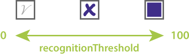

Different types of OMR forms can take different types of marks. Answer sheets usually require the bubbles to be completely filled in with a pen or marker. Ballot choices are typically marked with checkmarks or crosses. Surveys and applications are sometimes filled with a pencil so that corrections can be made.

In addition, paper quality, security watermarks, and lighting conditions when taking a photo of the filled form can adversely affect recognition accuracy.

All Aspose.OMR for .NET [recognition methods](/omr/net/recognition/) support `recognitionThreshold` parameter that allows you to fine-tune form processing and produce results with near 100% accuracy. This parameter is called **recognition accuracy threshold**.

From a technical point of view, it defines the fill percentage of the bubble from `0` (empty bubble) to `100` (completely filled bubble). Lower values allow even the lightest marks (like dots or crosses) to be recognized, but may cause dirt, paper defects or watermarks to be treated as false positives. Higher values require a more solid fill and may cause pencil marks or small checks to be ignored.



{} 

It is very important that all the bubbles in the form are filled in the same manner by all respondents. Otherwise, the recognition results in batch processing may be unreliable, regardless of fine tuning.

{} 

## Usage example

```csharp
Aspose.OMR.Api.OmrEngine omrEngine = new Aspose.OMR.Api.OmrEngine();
Aspose.OMR.Api.TemplateProcessor templateProcessor = omrEngine.GetTemplateProcessor("pattern.omr");
Aspose.OMR.Model.RecognitionResult recognitionResults[] = templateProcessor.RecognizeFolder(@"C:\final_exam\", 35);
```

## Adjusting recognition accuracy at run time

Aspose.OMR for .NET allows you to process the form image multiple times with different recognition accuracy thresholds. Use [`Recalculate`](https://reference.aspose.com/omr/net/aspose.omr.api/templateprocessor/recalculate/) method of [`Aspose.OMR.Api.TemplateProcessor`](https://reference.aspose.com/omr/net/aspose.omr.api/templateprocessor/) class:

```csharp
Aspose.OMR.Api.OmrEngine omrEngine = new Aspose.OMR.Api.OmrEngine();
Aspose.OMR.Api.TemplateProcessor templateProcessor = omrEngine.GetTemplateProcessor("pattern.omr");
// Results based on 60% fill percentage
Aspose.OMR.Model.RecognitionResult recognitionResult = templateProcessor.Recognize("filled-form.png", 60);
string result = recognitionResult.GetCsv();
Console.WriteLine(result);
// Results based on 80% fill percentage
templateProcessor.Recalculate(recognitionResult, 80);
result = recognitionResult.GetCsv();
Console.WriteLine(result);
```

## Predefined recognition accuracy thresholds

**CheckBox** and **VerticalChoiceBox** [elements](/omr/net/design-form/) support setting the recognition accuracy in the form source code. This setting overrides the value of `recognitionThreshold` parameter for individual form elements. This can be very useful if you want a certain form element (like the consent field) to support lighter marks than the rest of the bubbles.

### Example

A form that requires all bubbles to be completely filled in with a pen, except for the consent box, which supports light checkmarks.

#### Form

```
#Are you considering evaluating other Aspose products?
	(Yes) Yes (No) No

?checkbox=I consent to the processing of the survey data:
	bubble_size=extrasmall
	font_size=10
	threshold=15
?content=Agree
	font_size=10
&checkbox
```

#### Recognition

```csharp
Aspose.OMR.Api.OmrEngine omrEngine = new Aspose.OMR.Api.OmrEngine();
Aspose.OMR.Api.TemplateProcessor templateProcessor = omrEngine.GetTemplateProcessor("pattern.omr");
// Require bubbles to be filled with a pen or marker
Aspose.OMR.Model.RecognitionResult recognitionResult = templateProcessor.Recognize("filled-form.png", 60);
string result = recognitionResult.GetCsv();
Console.WriteLine(result);
```

#### Results


## Usage tips

- Increase the recognition accuracy threshold if the paper you are printing forms on has security watermarks, such as ballots or answer sheets. Otherwise, watermarks within bubbles may be considered as choices.
- It is not recommended to set the recognition accuracy threshold to values higher than `70`. This would require almost the entire bubble to be completely filled with a dark pen, which can be a burden on respondents.
- The automatic recognition threshold (if the `recognitionThreshold` parameter is omitted) depends on the bubble type and provides reliable results in most use cases.
