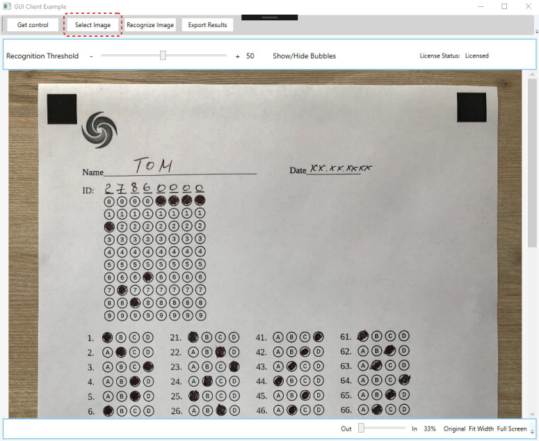
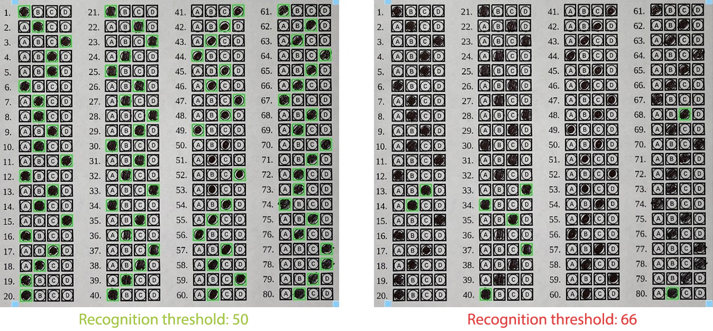
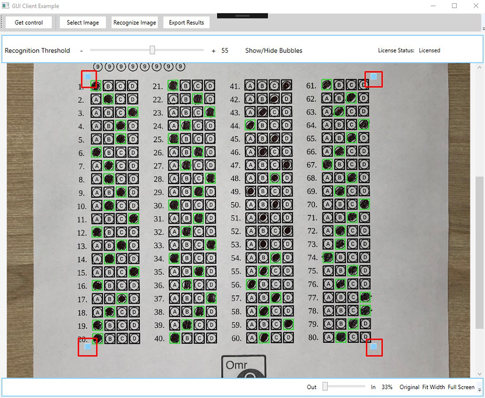

In addition to form generation and recognition API, Aspose.OMR for .NET provides a graphical user interface control that can be added to .NET UI applications. It allows you to interactively adjust recognition parameters and watch their effect in real time. This can be very useful for [fine tuning recognition accuracy](/omr/net/recognition/accuracy-threshold/) before batch processing a large number of scanned forms or for investigating recognition problems.

A full-featured example of working with the graphical control can be downloaded from [Aspose.OMR GitHub Repository](https://github.com/aspose-omr/Aspose.OMR-for-.NET) (**Aspose.OMR.GuiDemo** project).

## Initializing the control

Execute the following code:

```csharp
this.dataFolderPath = Path.Combine(FindDataFolder(), TestDataFolderName);
string templatePath = Path.Combine(this.dataFolderPath, TemplateName);

OmrEngine engine = new OmrEngine();
TemplateProcessor processor = engine.GetTemplateProcessor(templatePath);

control = engine.GetCorrectionControl(processor);
CustomContentControl.Content = control;
control.Initialize();
```

If you are working with an example application, click **Get control** button on top of the main screen. The user interface will show an empty graphical control which allows you to interactively adjust recognition parameters and run the optical mark recognition (OMR).


## Selecting a form image

To load an image into the initialized Aspose.OMR for .NET UI control, execute the following code:

```csharp
if(control == null) return;
string imagePath = DialogHelper.ShowOpenImageDialog(this.dataFolderPath);
if(string.IsNullOrEmpty(imagePath)) return;
this.UserImagePath = imagePath;
control.LoadAndDisplayImage(imagePath);
```

If you are working with an example application, click **Select Image** button on top of the main screen and browse for a scan or photo of the filled form.



## Recognizing the form

Simply execute the following code:

```csharp
if(control == null) return;
control.RecognizeImage();
```

If you are working with an example application, click **Recognize Image** button on top of the main screen. The overlay layer will show the recognized bubbles and the calculated position of the form body.

Move the **Recognition Threshold** slider to adjust the [recognition accuracy threshold](/omr/net/recognition/accuracy-threshold/) and see in real time how it affects the recognition. As the recognition accuracy threshold value increases, the number of detected marks will decrease; the labels with the least / lightest filling will be ignored.



### Form alignment

The UI control also provides 4 corner handles that allow you to interactively adjust the detected content positioning. Position detection is very reliable in most cases, but may require slight adjustment when dealing with heavily skewed photos from mobile phones and other hard cases.

Move the handles with the mouse to fix the detected grid position:



## Exporting recognition results

When you are satisfied with the precision and the results of the recognition, export the results by clicking **Export Results** on top of the main screen. The recognition results are [saved](/omr/net/recognition/save/) as CSV file.

In the background, the following code is executed:

```csharp
if(control == null) return;
string imageName = Path.GetFileNameWithoutExtension(this.UserImagePath);
string path = DialogHelper.ShowSaveDataDialog(imageName);
if(string.IsNullOrEmpty(path)) return;
control.ExportResults(path);
```
