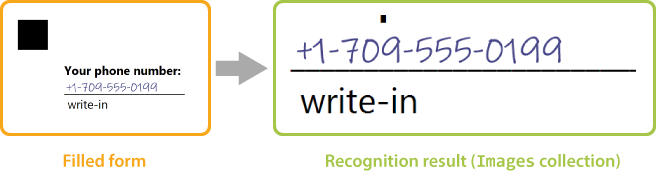
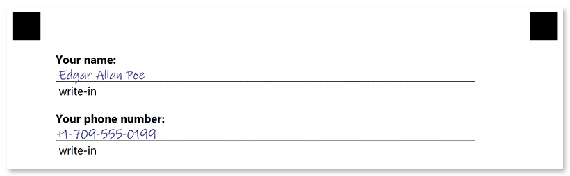
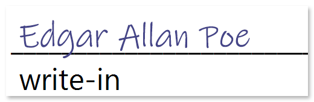

Aspose.OMR supports [several types of fields](/omr/net/design-form/) that allow the respondent to hand write some text or draw a picture. These fields are stored in `Images<System.Drawing.Bitmap>` collection in recognition results.



While Aspose.OMR does not support optical character recognition (OCR) at the moment, you can combine it with [Aspose.OCR](https://products.aspose.app/ocr) to process fields that contain hand-written text.

{} 

You must add a reference to `System.Drawing` assembly to your application in order to iterate through `Images` collection and save the contents of write-in fields to disk.

{} 

## Form

```
?container=Example
?block=Write-in elements
?content=Your name:
	font_style=Bold
?write_in=Full name
	required=true
?content=Your phone number:
	font_style=Bold
?write_in=Phone
	required=true
&block
&container
```



## Processing

```csharp
string appPath = Path.GetDirectoryName(typeof(Program).Assembly.Location);
Aspose.OMR.Api.OmrEngine omrEngine = new Aspose.OMR.Api.OmrEngine();
Aspose.OMR.Api.TemplateProcessor templateProcessor = omrEngine.GetTemplateProcessor("pattern.omr");
Aspose.OMR.Model.RecognitionResult recognitionResult = templateProcessor.Recognize("form-20220519.png");
int i = 1;
foreach(System.Drawing.Bitmap bitmap in recognitionResult.Images)
{
	string writeInPath = Path.Combine(appPath, $"image{i++}.png");
	bitmap.Save(writeInPath);
}
```

## Results

**image1.png**



**image2.png**


