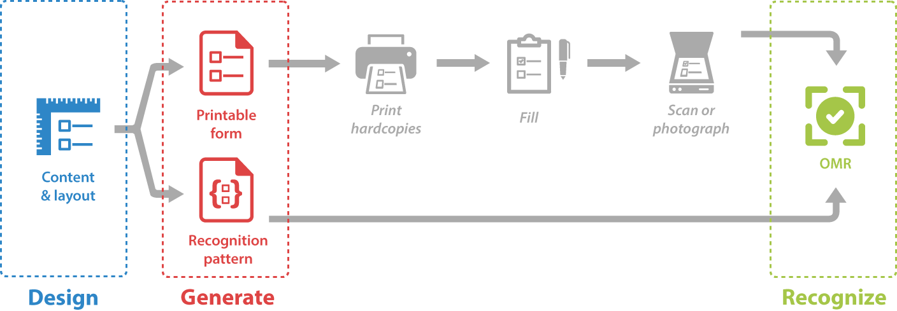

Aspose.OMR for .NET supports end-to-end OMR process - from designing a form to recognizing its filled hardcopies. The workflow includes three major stages:

{} 

Aspose.OMR for .NET is a software OMR solution that works without special hardware or accessories. Therefore, printing, filling out, and scanning forms are not covered in this reference.

{}

## Design

Describe the content and layout of the form using [**text**](/omr/txt-markup/) or [**JSON**](/omr/json-markup/) notations, or directly in the [**application code**](/omr/net/programmatic-layout/).

## Generate

[**Generate**](/omr/net/generate-template/) a **printable form** for the chosen **paper size** and a **recognition pattern** file that is used to produce highly accurate results with the Aspose.OMR recognition engine.

## Recognize

[**Recognize**](/omr/net/recognition/) scanned images or photos of filled forms and **get results** in CSV, XML or JSON formats.
