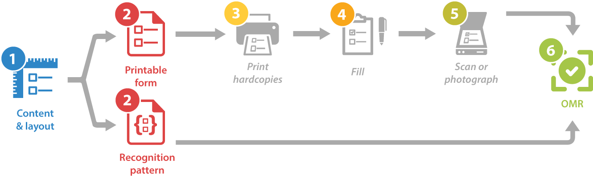
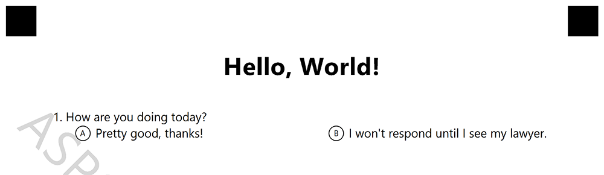
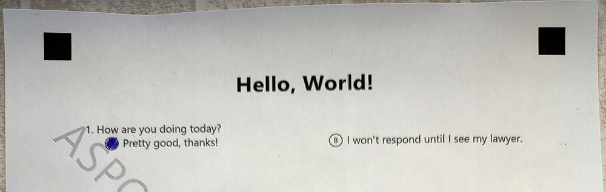

In this article, you will learn how to build a bare minimum application for creating and recognizing a simple questionnaire with **Aspose.OMR for .NET**.

{} 

We assume that you already have a basic knowledge of **Microsoft Visual Studio** and **C#**.

{} 


## You will need

- A [compatible](/omr/net/system-requirements/) OS with Microsoft Visual Studio installed. As an individual developer, you can use a free Visual Studio Community Edition.
- A printer for producing hardcopies (printed forms).
- A pen, a pencil, or a marker.
- A modern smartphone with a high-resolution camera.
- **15 minutes** of spare time.

## Steps to be taken

While our OMR application requires minimal coding, the underlying process is a bit more complex than the typical _Hello World_. Let's look at the necessary steps to be taken.



1. **Design** the questionnaire.
2. **Generate** print form and recognition pattern files.
3. **Print** the form.
4. **Fill** the form.
5. **Scan** or take a photo of the form.
6. **Recognize** the form.

## Designing the questionnaire

Aspose.OMR for .NET not only performs recognition, but also allows you to design OMR forms of any layout and complexity.

The structure and layout of the questionnaire (template source) is defined in a plain-text file that uses a special notation. You can create it with any text editor, including Notepad.

```
?text=Hello, World!
	font_style=bold
	font_size=24
	align=center

#How are you doing today?
	() Pretty good, thanks! () I won't respond until I see my lawyer.
```

In this article, we won't delve into the full syntax of the template. Let's just take a look at its key building blocks:

- The text after `?text=` keyword is rendered as a simple paragraph. You can optionally format it by adding layout attributes (font, style, and the like) on the lines immediately following the text. Each attribute definition must be preceded by a **tabulation** symbol.
- The question text is provided on a new line starting with a hash (`#`) symbol. The hash itself is not rendered.
- The answers are provided on new lines immediately following the question. You can either place all answers on a single line or on several lines by adding line breaks. Each line must begin with a **tabulation** symbol.

Save the template source somewhere on you disk under the name **template.txt**. You will need it on the next step.

## Generating a form

Once you have finished with the questionnaire structure and layout, let's build a simple utility that generates a printable form from it.

1. Create a new C# project in Visual Studio. You can use a very basic project template, such as **Console App (.NET framework)**.
2. [Install](/omr/net/installation/) **Aspose.OMR** NuGet package to the project.
3. Copy a form template file (**template.txt**) created on the previous step into **bin\Debug** directory of the project.
4. Create an instance of **Aspose.OMR.Api.OmrEngine** class:  
   ```c#
   Aspose.OMR.Api.OmrEngine omrEngine = new Aspose.OMR.Api.OmrEngine();
   ```
5. Generate a form from the template source file:  
   ```c#
   Aspose.OMR.Generation.GenerationResult generationResult = omrEngine.GenerateTemplate("template.txt");
   ```
6. Save the result:  
   ```c#
   generationResult.Save("", "Hello.OMR");
   ```

**Full listing:**

```c#
namespace HelloOMR
{
	internal class Program
	{
		static void Main(string[] args)
		{
			Aspose.OMR.Api.OmrEngine omrEngine = new Aspose.OMR.Api.OmrEngine();
			Aspose.OMR.Generation.GenerationResult generationResult = omrEngine.GenerateTemplate("template.txt");
			generationResult.Save("", "Hello.OMR");
		}
	}
}
```

Now run the program. If the template is correct, you should get 2 files in **bin\Debug** directory of the project:

- **Hello.OMR.png**  
  A print form in PNG format. Since we have not provided a [license](/omr/net/licensing/), there will be a watermark on the page.  
  
- **Hello.OMR.omr**  
  A recognition pattern used by Aspose.OMR recognition engine. **This file is required for recognizing filled forms, make sure you do not accidentally delete it!**

## Answering the questionnaire

Let's take a break from the computer and get back to the good old pen and paper.

1. Print the form (**Hello.OMR.png**) generated on the previous step.
2. Mark an answer bubble.
3. Take a photo of the filled form (the entire sheet with all 4 crop marks) with your smartphone.  
   

## Recognizing the questionnaire

Now we are ready for what OMR stands for – optical mark recognition.

1. Create a new C# project in Visual Studio. You can use a very basic project template, such as **Console App (.NET framework)**.
2. [Install](/omr/net/installation/) **Aspose.OMR** NuGet package to the project.
3. Copy the photo of the filled form (for example, **IMG_20220401.jpg**) into **bin\Debug** directory of the project.
4. Copy the previously generated recognition pattern (**Hello.OMR.omr**) into **bin\Debug** directory of the project.
5. Create an instance of **Aspose.OMR.Api.OmrEngine** class:  
   ```c#
   Aspose.OMR.Api.OmrEngine omrEngine = new Aspose.OMR.Api.OmrEngine();
   ```
6. Load the recognition pattern from **Hello.OMR.omr** file:  
   ```c#
   Aspose.OMR.Api.TemplateProcessor templateProcessor = omrEngine.GetTemplateProcessor("Hello.OMR.omr");
   ```
7. Recognize the photo of the filled form:  
   ```c#
   Aspose.OMR.Model.RecognitionResult recognitionResult = templateProcessor.RecognizeImage("IMG_20220401.jpg");
   ```
8. Convert the recognition result to comma-separated values (CSV) format and output it to the console:  
   ```c#
   string result = recognitionResult.GetCsv();
   Console.WriteLine(result);
   ```

**Full listing:**

```c#
using System;

namespace HelloOMR
{
	internal class Program
	{
		static void Main(string[] args)
		{
			Aspose.OMR.Api.OmrEngine omrEngine = new Aspose.OMR.Api.OmrEngine();
			Aspose.OMR.Api.TemplateProcessor templateProcessor = omrEngine.GetTemplateProcessor("Hello.OMR.omr");
			Aspose.OMR.Model.RecognitionResult recognitionResult = templateProcessor.RecognizeImage("IMG_20220401.jpg");
			string result = recognitionResult.GetCsv();
			Console.WriteLine(result);
			Console.ReadLine();
		}
	}
}
```

### Recognition result

Now run the program. You should see results of the recognition in the console output:

```
Element Name,Value,
Question1,"A"
```

## What's next?

Congratulations! You have taken the first steps in optical mark recognition technology. Read the [Developer reference](/omr/net/developer-guide/) and [API reference](https://apireference.aspose.com/omr/net) for details on developing OMR forms and applications with Aspose.OMR for .NET.
