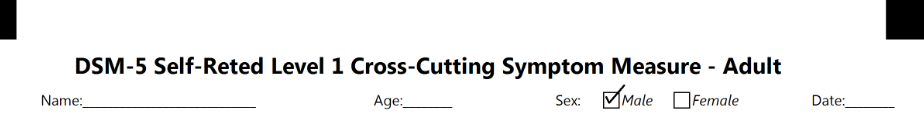

{} 

This page contains release notes information for Aspose.OMR for .NET 22.1

{} 
## **All Changes**
|**Key**|**Summary**|**Category**|
| :- | :- | :- |
|OMRNET-347|Add new element CheckBox|New Feature|

## **Public API and Backwards Incompatible Changes**
### **Added APIs:**
No Changes
### **Updated APIs:**
No Changes
### **Removed APIs:**
No Changes

## **Usage Example for CheckBox element**
```code
?checkbox=Sex:
	bubble_size=extrasmall
?content=Male
	font_style=italic
?content=Female
	font_style=italic
&checkbox
```
