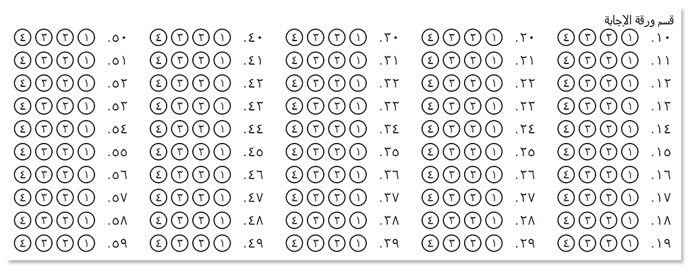
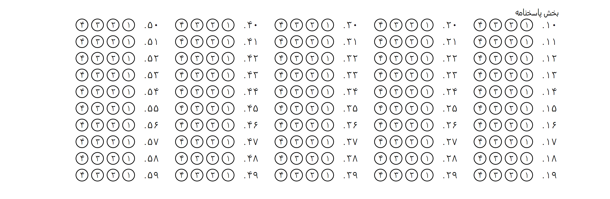
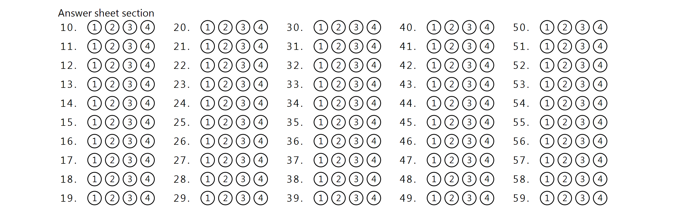

{} 
This article contains a summary of recent changes, enhancements and bug fixes in [**Aspose.OMR for .NET 22.12.1 (December 2022)**](https://www.nuget.org/packages/Aspose.OMR/22.12.1) release.
{} 

## What was changed

Key | Summary | Category
--- | ------- | --------
OMRNET-716 | Added support for **Arabic** and **Persian** writing systems. Support can be enabled by specifying it in [GlobalPageSettings]([/omr/net/generate-template/page-setup/) .<br />See [Right to Left writing system support](#RTL-support) for details. | New feature
OMRNET-715 | Fixed a layout issue with **Footer** container ([text markup](omr/net/txt-markup/container/) / [JSON markup](omr/net/json-markup/container/)) overlapping [Wrapped]([/omr/net/generate-template/page-setup/) container. | Fix

## Known issues and limitations

Key | Summary | Workaround
--- | ------- | ----------
OMRNET-462 | Recognition of multi-page PDF and TIFF files causes an error. | Scan each page of the filled form into a separate file and recognize them one-by-one.
OMRNET-555 | [`Recalculate`](https://reference.aspose.com/omr/net/aspose.omr.api/templateprocessor/recalculate/) method results in incorrect processing of **ScoreGroup** elements ([text markup](/omr/net/txt-markup/score_group/) / [JSON markup](/omr/net/json-markup/scoregroup/)) and **CustomAnswerSheet** elements ([text markup](/omr/net/txt-markup/custom_answer_sheet/) / [JSON markup](/omr/net/json-markup/customanswersheet/)). | Use [`RecognizeImage`](https://reference.aspose.com/omr/net/aspose.omr.api/templateprocessor/recognizeimage/) method with different threshold setting instead of [run-time adjustments of recognition accuracy](/omr/net/recognition/accuracy-threshold/#adjusting-recognition-accuracy-at-run-time).

## Public API changes and backwards compatibility

This section lists all public API changes introduced in **Aspose.OMR for .NET 22.12.1** that may affect the code of existing applications.

### Added public APIs:

The following public APIs have been added in this release:

#### RTL support

A new `WritingSystem` property has been added to [page settings](/omr/net/generate-template/page-setup/) that allows to enable support for different writing systems:

Value | Alignment
----- | ---------
`Aspose.OMR.Generation.WritingSystems.Western` | LeftToRight writing and 1, 2, 3, 4 as digits (default).
`Aspose.OMR.Generation.WritingSystems.Arabic` | RightToLeft writing and optional digits ١,۲, ۳, ٤
`Aspose.OMR.Generation.WritingSystems.Persian` | RightToLeft writing and optional digits ١,۲, ۳, ۴

### Updated public APIs:

_No changes._

### Removed public APIs:

_No changes._

## Usage examples

See the examples below to learn more about the changes introduced in this release:

### Using Arabic writing system

```
?text=قسم ورقة الإجابة
?answer_sheet=MainQuestions
	elements_count=50
	columns_count=5
	answers_list=(١)(۲)(۳)(٤)
```

```csharp
	var engine = new Aspose.OMR.Api.OmrEngine();
	var settings = new Aspose.OMR.GenerationGlobalPageSettings()
		{
			WritingSystem = new Aspose.OMR.Generation.WritingSystems.Arabic(true)
		};
	Aspose.OMR.Generation.GenerationResult result = engine.GenerateTemplate(configPath, settings);
	
```




### Using Persian writing system

```
?text=بخش پاسخنامه
?answer_sheet=MainQuestions
	elements_count=50
	columns_count=5
	answers_list=(١)(۲)(۳)(۴)
```

```csharp
	var engine = new Aspose.OMR.Api.OmrEngine();
	var settings = new Aspose.OMR.GenerationGlobalPageSettings()
		{
			WritingSystem = new Aspose.OMR.Generation.WritingSystems.Persian(true)
		};
	Aspose.OMR.Generation.GenerationResult result = engine.GenerateTemplate(configPath, settings);
	
```




### Using Western writing system

```
?text=Answer sheet section
?answer_sheet=MainQuestions
	elements_count=50
	columns_count=5
	answers_list=(1)(2)(3)(4)
```

```csharp
	var engine = new Aspose.OMR.Api.OmrEngine();
	Aspose.OMR.Generation.GenerationResult result = engine.GenerateTemplate(configPath, settings);
	
```


