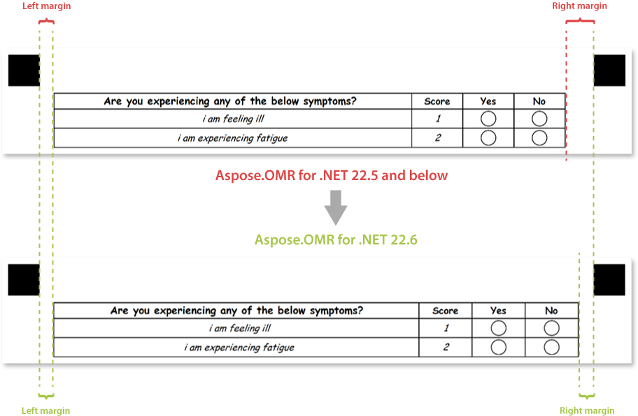

{} 

This article contains a summary of recent changes, enhancements and bug fixes in [**Aspose.OMR for .NET 22.6 (June 2022)**](https://www.nuget.org/packages/Aspose.OMR/22.6.0) release.

{} 

## What was changed

Key | Summary | Category
--- | ------- | --------
OMRNET-548 | Fixed recognition of barcodes placed at the bottom of the page when the resolution of scanned or photographed forms is less than the resolution of the original printable form. | Fix
OMRNET-549 | _threshold_ setting of **CheckBox** element ([text markup](/omr/txt-markup/checkbox/) / [JSON markup](/omr/json-markup/checkbox/)) is preserved during [run-time adjustments of recognition accuracy](/omr/net/recognition/accuracy-threshold/#adjusting-recognition-accuracy-at-run-time). | Fix
OMRNET-550 | Improved rendering of **Container** elements ([text markup](/omr/txt-markup/container/) / [JSON markup](/omr/json-markup/container/)): left and right margins are now equal. | Enhancement
OMRNET-551 | Fixed bubble coloring for **CustomAnswerSheet** element ([text markup](/omr/txt-markup/custom_answer_sheet/) / [JSON markup](/omr/json-markup/customanswersheet/)). | Fix
OMRNET-551 | Fixed handling of _vertical_margin_, _bubble_size_, _header_border_size_, _header_border_color_ parameters of **CompositeGrid** element ([text markup](/omr/txt-markup/composite_grid/) / [JSON markup](/omr/json-markup/compositegrid/)). | Fix

## Known issues and limitations

Key | Summary | Workaround
--- | ------- | ----------
OMRNET-462 | Recognition of multi-page PDF and TIFF files causes an error. | Scan each page of the filled form into a separate file and recognize them one-by-one.
OMRNET-555 | [`Recalculate`](https://reference.aspose.com/omr/net/aspose.omr.api/templateprocessor/recalculate/) method results in incorrect processing of **ScoreGroup** elements ([text markup](/omr/txt-markup/score_group/) / [JSON markup](/omr/json-markup/scoregroup/)) and **CustomAnswerSheet** elements containing **CustomTrigger** elements ([text markup](/omr/txt-markup/custom_answer_sheet/#custom_trigger) / [JSON markup](/omr/json-markup/customanswersheet/#customtrigger-element)). | Use [`RecognizeImage`](https://reference.aspose.com/omr/net/aspose.omr.api/templateprocessor/recognizeimage/) method with different threshold setting instead of [run-time adjustments of recognition accuracy](/omr/net/recognition/accuracy-threshold/#adjusting-recognition-accuracy-at-run-time).

## Public API changes and backwards compatibility

This section lists all public API changes introduced in **Aspose.OMR for .NET 22.6** that may affect the code of existing applications.

### Added public APIs:

_No changes._

### Updated public APIs:

_No changes._

### Removed public APIs:

_No changes._

## Changes in application logic

This section lists any changes to the program architecture and form processing algorithms introduced in **Aspose.OMR for .NET 22.6** that may affect the behavior of existing applications.

### Container rendering

The rendering of **Container** elements was improved so that the left and right margins are now equal.

It may result in recognition pattern (.OMR) files [generated](/omr/net/generate-template/) with **Aspose.OMR for .NET 22.6** to be incompatible with printable forms generated by earlier versions of the library.
