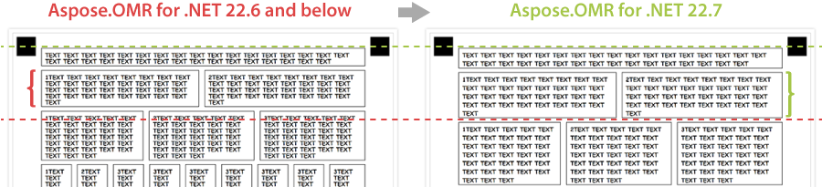
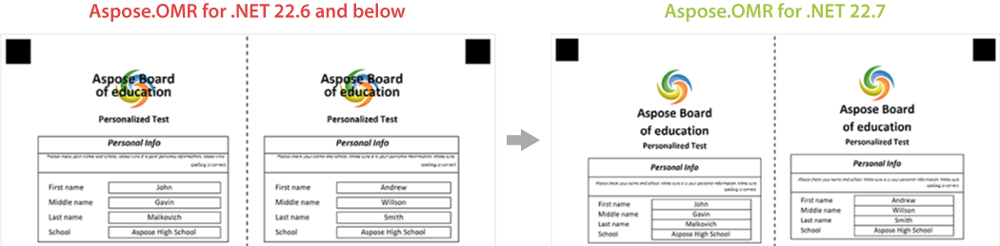

{} 

This article contains a summary of recent changes, enhancements and bug fixes in [**Aspose.OMR for .NET 22.7 (July 2022)**](https://www.nuget.org/packages/Aspose.OMR/22.7.0) release.

{} 

## What was changed

Key | Summary | Category
--- | ------- | --------
n/a | Fixed a line-height (leading) issue that caused adjacent lines with larger font sizes to overlap. | Fix
OMRNET-353 | Added an alternative bubble type (square) for **AnswerSheet**, **CustomAnswerSheet** (**CustomTrigger** element), **Grid**, **CompositeGrid**, and **CheckBox** elements. | New feature
OMRNET-499 | Fixed a layout issue with **Table** ([text markup](/omr/net/txt-markup/table/) / [JSON markup](/omr/net/json-markup/table/)) element when header text does not fit in one line. | Fix
OMRNET-541 | Added human-readable enumerators for `BarcodeType` and `BarcodeQRVersion` properties of [**BarcodeConfig**](/omr/net/programmatic-forms/elements-barcode/) element. | Enhancement
n/a | Fixed rendering issues for **Container** elements ([text markup](/omr/net/txt-markup/container/) / [JSON markup](/omr/net/json-markup/container/)) that caused left and right margins to be different. | Fix
n/a | **Container** ([text markup](/omr/net/txt-markup/container/) / [JSON markup](/omr/net/json-markup/container/)) elements can now be nested within other container elements. | Enhancement
n/a | **Paragraphs** ([text markup](/omr/net/txt-markup/paragraph/) / [JSON markup](/omr/net/json-markup/paragraph/)) can now be placed at the top level of the form hierarchy, without wrapping them in **block** elements. | Enhancement
n/a | Improved rendering of **EmptyLine** ([text markup](/omr/net/txt-markup/empty_line/) / [JSON markup](/omr/net/json-markup/emptyline/)) elements - now they handle vertical spacing between elements more accurately. | Enhancement
n/a | Improved page rendering: <ul><li>Left and right margins are rendered with pixel precision according to `PageMarginLeft` and `PageMarginRight` [page layout settings](/omr/net/generate-template/page-setup/).</li><li>Elements cannot appear outside the page bounds unless they are placed there by specifying an absolute position.</li><li>Top-level elements are now perfectly aligned to the right margin of the page.</li></ul> | Enhancement
n/a | Improved elements wrapping within **paragraphs** ([text markup](/omr/net/txt-markup/paragraph/) / [JSON markup](/omr/net/json-markup/paragraph/)). | Enhancement

## Known issues and limitations

Key | Summary | Workaround
--- | ------- | ----------
OMRNET-462 | Recognition of multi-page PDF and TIFF files causes an error. | Scan each page of the filled form into a separate file and recognize them one-by-one.
OMRNET-555 | [`Recalculate`](https://reference.aspose.com/omr/net/aspose.omr.api/templateprocessor/recalculate/) method results in incorrect processing of **ScoreGroup** elements ([text markup](/omr/net/txt-markup/score_group/) / [JSON markup](/omr/net/json-markup/scoregroup/)) and **CustomAnswerSheet** elements containing **CustomTrigger** elements ([text markup](/omr/net/txt-markup/custom_answer_sheet/#custom_trigger) / [JSON markup](/omr/net/json-markup/customanswersheet/#customtrigger-element)). | Use [`RecognizeImage`](https://reference.aspose.com/omr/net/aspose.omr.api/templateprocessor/recognizeimage/) method with different threshold setting instead of [run-time adjustments of recognition accuracy](/omr/net/recognition/accuracy-threshold/#adjusting-recognition-accuracy-at-run-time).

## Public API changes and backwards compatibility

This section lists all public API changes introduced in **Aspose.OMR for .NET 22.7** that may affect the code of existing applications.

### Added public APIs:

_No changes._

### Updated public APIs:

The following public APIs has been updated in this release:

#### New bubble styles

{}

**Compatibility: fully backward compatible.**

This change will not affect existing code, print forms, or recognition results.

{}

Added a new `bubble_type` property for the following elements:

- **AnswerSheet** ([text markup](/omr/net/txt-markup/answer_sheet/) / [JSON markup](/omr/net/json-markup/answersheet/))
- **CustomAnswerSheet** / **CustomTrigger** ([text markup](/omr/net/txt-markup/custom_answer_sheet/#custom_trigger) / [JSON markup](/omr/net/json-markup/customanswersheet/#customtrigger-element))
- **Grid** ([text markup](/omr/net/txt-markup/grid/) / [JSON markup](/omr/net/json-markup/grid/))
- **CompositeGrid** ([text markup](/omr/net/txt-markup/composite_grid/) / [JSON markup](/omr/net/json-markup/compositegrid/))
- **CheckBox** ([text markup](/omr/net/txt-markup/checkbox/) / [JSON markup](/omr/net/json-markup/checkbox/))

This property affects the design of the bubble and allows it to be displayed as either a circle (`round`) or a square (`square`). The recognition logic is unchanged, regardless of the display style.

#### `BarcodeType` enumerator

Added human-readable enumerator that allows you to specify the type of [programmatically generated barcode](/omr/net/programmatic-forms/elements-barcode/#optional-properties). The rendering of barcodes is not affected.

#### `BarcodeQRVersion` enumerator

Added human-readable enumerator that allows you to specify the version of [programmatically generated QR code](/omr/net/programmatic-forms/elements-barcode/#optional-properties). The rendering of QR codes is not affected.

### Removed public APIs:

_No changes._

## Changes in application logic

This section lists any changes to the program architecture and form processing algorithms introduced in **Aspose.OMR for .NET 22.7** that may affect the behavior of existing applications.

### Line height for texts

This release fixes a rendering issue that caused adjacent lines with larger font sizes to overlap. As a result, the leading may slightly increase, which may cause recognition pattern (.OMR) files [generated](/omr/net/generate-template/) with **Aspose.OMR for .NET 22.7** to be incompatible with printable forms generated by earlier versions of the library.



### General rendering improvements

The rendering algorithms have been significantly reworked to provide highly accurate form layout. The downside is that forms created with **Aspose.OMR for .NET 22.7** are no longer compatible with earlier versions of the library. The overall design and layout of the form have not changed, but you may need to tweak the source code for the updated rendering engine:

- If the form no longer fits the page width - try reducing the left or right margin in [page layout settings](/omr/net/generate-template/page-setup/).
- If the form gets too tall with a lot of vertical spacing between content blocks, try removing unnecessary **EmptyLine** ([text markup](/omr/net/txt-markup/empty_line/) / [JSON markup](/omr/net/ json-markup/emptyline/)) elements.



## Usage examples

See the examples below to learn more about the changes introduced in this release:

### New bubble styles

```
?checkbox=Sex:
	bubble_type=round
	font_style=italic
?content=Male
?content=Female
&checkbox
```


```
?checkbox=Sex:
	bubble_type=square
	font_style=italic
?content=Male
?content=Female
&checkbox
```


