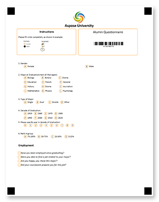
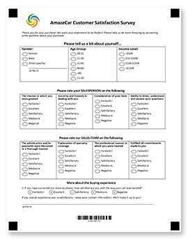
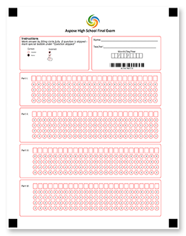
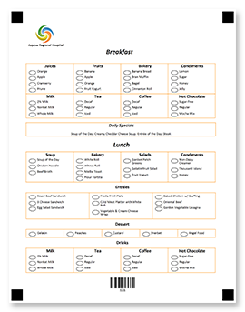
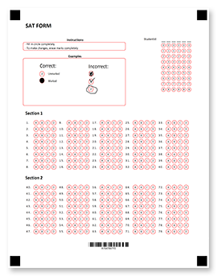
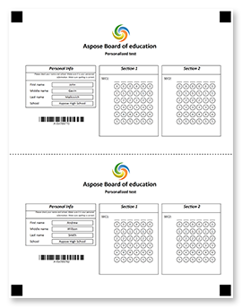

[Optical Mark Recognition (OMR) technology](/omr/net/omr-technology/) has many applications and can greatly simplify almost any part of your life when you need to collect and analyze manually filled data.

This article presents a number of ready-made form templates that can be automatically [processed](/omr/net/omr-stages/) with Aspose.OMR. All templates are [created](/omr/net/generate-template/) using Aspose.OMR for .NET, so you can easily [customize](/omr/net/design-form/) them to match your organization’s branding, add and modify elements, select a different color and paper size.

<table>
	<tr>
		<td></td>
		<td>
			<h2>Alumni questionnaire</h2>
			
Collect information about the post-grad employment and achievements of your former students as part of your ongoing alumni feedback program.

			
Batch-process dozens of hand-filled responses with a few lines of code.

			
<b>Choose the design that best suits your needs:</b>

			<ul>
				<li><a href="alumni/classic">Classic questionnaire with free-form answers</a></li>
				<li><a href="alumni/checkbox">Checkbox survey with free-form answers</a></li>
				<li><a href="alumni/compact">Compact survey</a></li>
			</ul>
		</td>
	</tr>
	<tr>
		<td></td>
		<td>
			<h2>Customer satisfaction survey</h2>
			
Understand how your clients are satisfied with your services, capabilities and their customer journey.

			
Integrate personalized optical mark recognition (OMR) results into your CRM system to better meet the needs of each customer.

			
<b>Choose the design that best suits your needs:</b>

			<ul>
				<li><a href="satisfaction/table">Table-based</a></li>
				<li><a href="satisfaction/grouped">Grouped</a></li>
				<li><a href="satisfaction/simple">Simple questionnaire</a></li>
			</ul>
		</td>
	</tr>
	<tr>
		<td></td>
		<td>
			<h2>Final exam answer sheet</h2>
			
Single-page OMR ready answer sheet for any type of test, exam, quiz, assessment and the like. Ensure the student's identity with a barcode.

			
Make grading lightning fast, effortless and reliable - just scan or take a photo of a filled answer sheet and automatically recognize it with Aspose.OMR.

			
<b>Choose the design that best suits your needs:</b>

			<ul>
				<li><a href="exam/grouped">Grouped answer sheet with question skipping</a></li>
				<li><a href="exam/plain">Plain 5-column answer sheet</a></li>
				<li><a href="exam/multipart">Multi-part answer sheet with fill-in line</a></li>
			</ul>
		</td>
	</tr>
	<tr>
		<td></td>
		<td>
			<h2>Meal preference</h2>
			
Request dietary restrictions or preferences from your attendees or residents and adjust the menu accordingly.

			
Automatically recognize and aggregate data at any scale - from small team building events to school lunches and hospital meals.

			
<b>Choose the design that best suits your needs:</b>

			<ul>
				<li><a href="meal/bw">Black and white</a></li>
				<li><a href="meal/color">Colorful</a></li>
			</ul>
		</td>
	</tr>
	<tr>
		<td></td>
		<td>
			<h2>SAT form</h2>
			
Ready-made answer sheet for SAT Exam - one of the most popular and globally accepted assessment tests for students.

			
Leave manual check-up in the past and let Aspose.OMR automatically recognize filled forms for you.

			
<b>Choose the design that best suits your needs:</b>

			<ul>
				<li><a href="sat/bw">Black and white</a></li>
				<li><a href="sat/color">Colorful</a></li>
				<li><a href="sat/grouped">Grouped</a></li>
			</ul>
		</td>
	</tr>
	<tr>
		<td></td>
		<td>
			<h2>OMR form with a tear line</h2>
			
Two identical forms on one sheet separated with a vertical or horizontal tear line. Both parts are filled identically; one part remains with the respondent.

			
Automatically recognize one part of the form. If the respondent does not agree with result, there is always a chance to resolve the conflict by comparing both parts.

			
<b>Choose the design that best suits your needs:</b>

			<ul>
				<li><a href="tear/horizontal-bw">Horizontal black and white</a></li>
				<li><a href="tear/horizontal-red">Horizontal red</a></li>
				<li><a href="tear/horizontal-yellow">Horizontal yellow</a></li>
				<li><a href="tear/vertical-bw">Vertical black and white</a></li>
				<li><a href="tear/vertical-red">Vertical red</a></li>
				<li><a href="tear/vertical-yellow">Vertical yellow</a></li>
			</ul>
		</td>
	</tr>
</table>

## How to use

1. Open the template page with the required design.
2. Download template sources.
3. [Customize](/omr/net/design-form/) the template if necessary. For example, you can add your logo and other branding information.
4. [Generate](/omr/net/generate-template/) the printable form using provided [page settings](/omr/net/generate-template/page-setup/).
5. Print out the empty form.
6. Fill in the form.
7. Scan or take a photo of the filled form.
8. [Recognize](/omr/net/recognition/) the form image.
