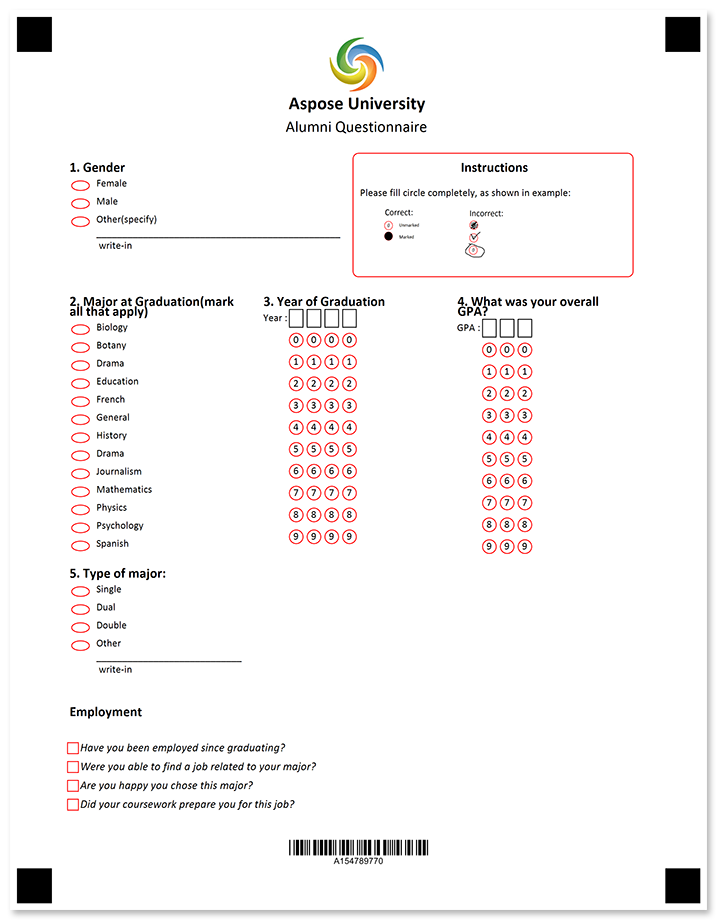
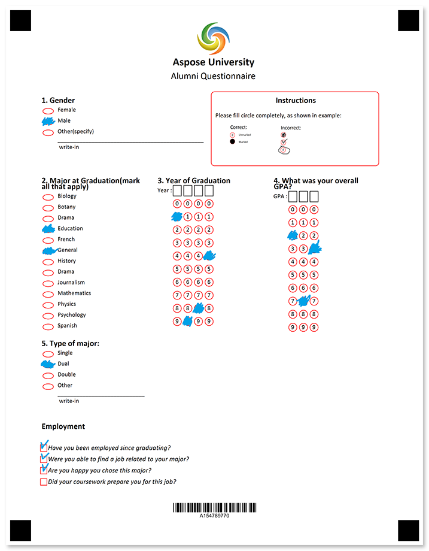

Collect information about the post-grad employment and achievements of your former students as part of your ongoing alumni feedback program.



## Source code

<details>
<summary>Text markup</summary>

```
?image=logo.jpg
	width=200
	height=200
	x=1169
	y=100
?text=Aspose University 
	font_style=bold
	font_size=16
	align=center
?text=Alumni Questionnaire
	font_size=bold
	font_size=14
	align=center
?empty_line=
	height=75
?container=instructions
	columns_count=2
?block=
	column=2
	border=rounded
	border_color=red
?content=Instructions
	align=center
	font_style=bold
	font_size=12
?empty_line=height
	height=50
?content=Please fill circle completely, as shown in example:
?image=example.png
	width=700
	height=280
	align=left
&block
?block=
	column=1
	border=none
?content=1. Gender
	font_style=bold
	font_size=12
?vertical_choicebox=Gender
?answer=Female
?content=Female
&answer
?answer=Male
?content=Male
&answer
?answer=Other(specify)
?content=Other(specify)
?write_in=Gender
&answer
&vertical_choicebox
&block
&container
?empty_line=
	height=50
?container=2-3
	columns_count=3
?block=
	column=1
	border=none
?content=2. Major at Graduation(mark all that apply)
	font_style=bold
	font_size=12
?vertical_choicebox=Major at Graduation
?answer=Biology
?content=Biology
&answer
?answer=Botany
?content=Botany
&answer
?answer=Drama
?content=Drama
&answer
?answer=Education
?content=Education
&answer
?answer=French
?content=French
&answer
?answer=General
?content=General
&answer
?answer=History
?content=History
&answer
?answer=Drama
?content=Drama
&answer
?answer=Journalism
?content=Journalism
&answer
?answer=Mathematics
?content=Mathematics
&answer
?answer=Physics
?content=Physics
&answer
?answer=Psychology
?content=Psychology
&answer
?answer=Spanish
?content=Spanish
&answer
&vertical_choicebox
&block
?block=
	column=2
	border=none
?content=3. Year of Graduation
	font_style=bold
	font_size=12
?empty_line=
	height=25
?composite_grid=Year
	columns_count=4
	header_type=square
	orientation=Horizontal
	values=(0) (1) (2) (3) (4) (5) (6) (7) (8) (9)
&block
?block=
	column=3
?content=4. What was your overall GPA?
	font_style=bold
	font_size=12
?empty_line=
	height=25
?composite_grid=GPA
	columns_count=3
	header_type=square
	orientation=Horizontal
	values=(0) (1) (2) (3) (4) (5) (6) (7) (8) (9)
&block
?block=
	column=1
?content=5. Type of major:
	font_style=bold
	font_size=12
?vertical_choicebox=Type of Major
?answer=Single
?content=Single
&answer
?answer=Dual
?content=Dual
&answer
?answer=Double
?content=Double
&answer
?answer=Other
?content=Other
?write_in=Type of Major
&answer
&vertical_choicebox
&block
&container
?text=Employment
	align=left
	font_style=bold
	font_size=12

?checkbox=Have you been employed since graduating?
	bubble_size=extrasmall
	font_size=10
	hide_name=true
?content=Have you been employed since graduating?
	font_style=italic
	font_size=10
&checkbox

?checkbox=Were you able to find a job related to your major?
	bubble_size=extrasmall
	font_size=10
	hide_name=true
?content=Were you able to find a job related to your major?
	font_style=italic
	font_size=10
&checkbox

?checkbox=Are you happy you chose this major?
	bubble_size=extrasmall
	font_size=10
	hide_name=true
?content=Are you happy you chose this major?
	font_style=italic
	font_size=10
&checkbox

?checkbox=Did your coursework prepare you for this job?
	bubble_size=extrasmall
	font_size=10
	hide_name=true
?content=Did your coursework prepare you for this job?
	font_style=italic
	font_size=10
&checkbox
?empty_line=
	height=150
?barcode=test_id
	codetext=true
	value=15478977
	barcode_type=Code32
```

</details>

<details>
<summary>JSON markup</summary>

```json
{
    "children": [{
            "children": [{
                    "align": "Center",
                    "name": "logo.jpg",
                    "x": 1169,
                    "y": 100,
                    "height": 200,
                    "width": 200,
                    "element_type": "Image"
                }, {
                    "name": "Aspose University ",
                    "font_style": "Bold",
                    "font_size": 16,
                    "align": "Center",
                    "element_type": "Text"
                }, {
                    "name": "Alumni Questionnaire",
                    "font_size": 14,
                    "align": "Center",
                    "element_type": "Text"
                }, {
                    "height": 75,
                    "element_type": "EmptyLine"
                }, {
                    "name": "instructions",
                    "children": [{
                            "children": [{
                                    "name": "Instructions",
                                    "font_style": "Bold",
                                    "font_size": 12,
                                    "align": "Center",
                                    "element_type": "Content"
                                }, {
                                    "name": "height",
                                    "height": 50,
                                    "element_type": "EmptyLine"
                                }, {
                                    "name": "Please fill circle completely, as shown in example:",
                                    "align": "Left",
                                    "element_type": "Content"
                                }, {
                                    "align": "Left",
                                    "name": "example.png",
                                    "height": 280,
                                    "width": 700,
                                    "element_type": "Image"
                                }
                            ],
                            "column": 2,
                            "border": "Rounded",
                            "border_color": "Red",
                            "element_type": "Block"
                        }, {
                            "children": [{
                                    "name": "1. Gender",
                                    "font_style": "Bold",
                                    "font_size": 12,
                                    "align": "Left",
                                    "element_type": "Content"
                                }, {
                                    "name": "Gender",
                                    "children": [{
                                            "name": "Female",
                                            "children": [{
                                                    "name": "Female",
                                                    "align": "Left",
                                                    "element_type": "Content"
                                                }
                                            ],
                                            "bubble_type": "Round",
                                            "element_type": "Answer"
                                        }, {
                                            "name": "Male",
                                            "children": [{
                                                    "name": "Male",
                                                    "align": "Left",
                                                    "element_type": "Content"
                                                }
                                            ],
                                            "bubble_type": "Round",
                                            "element_type": "Answer"
                                        }, {
                                            "name": "Other(specify)",
                                            "children": [{
                                                    "name": "Other(specify)",
                                                    "align": "Left",
                                                    "element_type": "Content"
                                                }, {
                                                    "name": "Gender",
                                                    "element_type": "WriteIn"
                                                }
                                            ],
                                            "bubble_type": "Round",
                                            "element_type": "Answer"
                                        }
                                    ],
                                    "element_type": "VerticalChoiceBox",
                                    "top_padding": 0
                                }
                            ],
                            "column": 1,
                            "element_type": "Block"
                        }
                    ],
                    "columns_count": 2,
                    "container_type": "Normal",
                    "element_type": "Container"
                }, {
                    "height": 50,
                    "element_type": "EmptyLine"
                }, {
                    "name": "2-3",
                    "children": [{
                            "children": [{
                                    "name": "2. Major at Graduation(mark all that apply)",
                                    "font_style": "Bold",
                                    "font_size": 12,
                                    "align": "Left",
                                    "element_type": "Content"
                                }, {
                                    "name": "Major at Graduation",
                                    "children": [{
                                            "name": "Biology",
                                            "children": [{
                                                    "name": "Biology",
                                                    "align": "Left",
                                                    "element_type": "Content"
                                                }
                                            ],
                                            "bubble_type": "Round",
                                            "element_type": "Answer"
                                        }, {
                                            "name": "Botany",
                                            "children": [{
                                                    "name": "Botany",
                                                    "align": "Left",
                                                    "element_type": "Content"
                                                }
                                            ],
                                            "bubble_type": "Round",
                                            "element_type": "Answer"
                                        }, {
                                            "name": "Drama",
                                            "children": [{
                                                    "name": "Drama",
                                                    "align": "Left",
                                                    "element_type": "Content"
                                                }
                                            ],
                                            "bubble_type": "Round",
                                            "element_type": "Answer"
                                        }, {
                                            "name": "Education",
                                            "children": [{
                                                    "name": "Education",
                                                    "align": "Left",
                                                    "element_type": "Content"
                                                }
                                            ],
                                            "bubble_type": "Round",
                                            "element_type": "Answer"
                                        }, {
                                            "name": "French",
                                            "children": [{
                                                    "name": "French",
                                                    "align": "Left",
                                                    "element_type": "Content"
                                                }
                                            ],
                                            "bubble_type": "Round",
                                            "element_type": "Answer"
                                        }, {
                                            "name": "General",
                                            "children": [{
                                                    "name": "General",
                                                    "align": "Left",
                                                    "element_type": "Content"
                                                }
                                            ],
                                            "bubble_type": "Round",
                                            "element_type": "Answer"
                                        }, {
                                            "name": "History",
                                            "children": [{
                                                    "name": "History",
                                                    "align": "Left",
                                                    "element_type": "Content"
                                                }
                                            ],
                                            "bubble_type": "Round",
                                            "element_type": "Answer"
                                        }, {
                                            "name": "Drama",
                                            "children": [{
                                                    "name": "Drama",
                                                    "align": "Left",
                                                    "element_type": "Content"
                                                }
                                            ],
                                            "bubble_type": "Round",
                                            "element_type": "Answer"
                                        }, {
                                            "name": "Journalism",
                                            "children": [{
                                                    "name": "Journalism",
                                                    "align": "Left",
                                                    "element_type": "Content"
                                                }
                                            ],
                                            "bubble_type": "Round",
                                            "element_type": "Answer"
                                        }, {
                                            "name": "Mathematics",
                                            "children": [{
                                                    "name": "Mathematics",
                                                    "align": "Left",
                                                    "element_type": "Content"
                                                }
                                            ],
                                            "bubble_type": "Round",
                                            "element_type": "Answer"
                                        }, {
                                            "name": "Physics",
                                            "children": [{
                                                    "name": "Physics",
                                                    "align": "Left",
                                                    "element_type": "Content"
                                                }
                                            ],
                                            "bubble_type": "Round",
                                            "element_type": "Answer"
                                        }, {
                                            "name": "Psychology",
                                            "children": [{
                                                    "name": "Psychology",
                                                    "align": "Left",
                                                    "element_type": "Content"
                                                }
                                            ],
                                            "bubble_type": "Round",
                                            "element_type": "Answer"
                                        }, {
                                            "name": "Spanish",
                                            "children": [{
                                                    "name": "Spanish",
                                                    "align": "Left",
                                                    "element_type": "Content"
                                                }
                                            ],
                                            "bubble_type": "Round",
                                            "element_type": "Answer"
                                        }
                                    ],
                                    "element_type": "VerticalChoiceBox",
                                    "top_padding": 0
                                }
                            ],
                            "column": 1,
                            "element_type": "Block"
                        }, {
                            "children": [{
                                    "name": "3. Year of Graduation",
                                    "font_style": "Bold",
                                    "font_size": 12,
                                    "align": "Left",
                                    "element_type": "Content"
                                }, {
                                    "height": 25,
                                    "element_type": "EmptyLine"
                                }, {
                                    "bubble_size": "undefined",
                                    "name": "Year",
                                    "columns_count": 4,
                                    "align": "Left",
                                    "header_type": "Square",
                                    "header_border_size": 3,
                                    "header_border_color": "Black",
                                    "orientation": "Horizontal",
                                    "values": [
                                        "0",
                                        "1",
                                        "2",
                                        "3",
                                        "4",
                                        "5",
                                        "6",
                                        "7",
                                        "8",
                                        "9"
                                    ],
                                    "element_type": "CompositeGrid"
                                }
                            ],
                            "column": 2,
                            "element_type": "Block"
                        }, {
                            "children": [{
                                    "name": "4. What was your overall GPA?",
                                    "font_style": "Bold",
                                    "font_size": 12,
                                    "align": "Left",
                                    "element_type": "Content"
                                }, {
                                    "height": 25,
                                    "element_type": "EmptyLine"
                                }, {
                                    "bubble_size": "undefined",
                                    "name": "GPA",
                                    "columns_count": 3,
                                    "align": "Left",
                                    "header_type": "Square",
                                    "header_border_size": 3,
                                    "header_border_color": "Black",
                                    "orientation": "Horizontal",
                                    "values": [
                                        "0",
                                        "1",
                                        "2",
                                        "3",
                                        "4",
                                        "5",
                                        "6",
                                        "7",
                                        "8",
                                        "9"
                                    ],
                                    "element_type": "CompositeGrid"
                                }
                            ],
                            "column": 3,
                            "element_type": "Block"
                        }, {
                            "children": [{
                                    "name": "5. Type of major:",
                                    "font_style": "Bold",
                                    "font_size": 12,
                                    "align": "Left",
                                    "element_type": "Content"
                                }, {
                                    "name": "Type of Major",
                                    "children": [{
                                            "name": "Single",
                                            "children": [{
                                                    "name": "Single",
                                                    "align": "Left",
                                                    "element_type": "Content"
                                                }
                                            ],
                                            "bubble_type": "Round",
                                            "element_type": "Answer"
                                        }, {
                                            "name": "Dual",
                                            "children": [{
                                                    "name": "Dual",
                                                    "align": "Left",
                                                    "element_type": "Content"
                                                }
                                            ],
                                            "bubble_type": "Round",
                                            "element_type": "Answer"
                                        }, {
                                            "name": "Double",
                                            "children": [{
                                                    "name": "Double",
                                                    "align": "Left",
                                                    "element_type": "Content"
                                                }
                                            ],
                                            "bubble_type": "Round",
                                            "element_type": "Answer"
                                        }, {
                                            "name": "Other",
                                            "children": [{
                                                    "name": "Other",
                                                    "align": "Left",
                                                    "element_type": "Content"
                                                }, {
                                                    "name": "Type of Major",
                                                    "element_type": "WriteIn"
                                                }
                                            ],
                                            "bubble_type": "Round",
                                            "element_type": "Answer"
                                        }
                                    ],
                                    "element_type": "VerticalChoiceBox",
                                    "top_padding": 0
                                }
                            ],
                            "column": 1,
                            "element_type": "Block"
                        }
                    ],
                    "columns_count": 3,
                    "container_type": "Normal",
                    "element_type": "Container"
                }, {
                    "name": "Employment",
                    "font_style": "Bold",
                    "font_size": 12,
                    "align": "Left",
                    "element_type": "Text"
                }, {
                    "element_type": "EmptyLine"
                }, {
                    "hide_name": true,
                    "name": "Have you been employed since graduating?",
                    "orientation": "Horizontal",
                    "bubble_size": "Extrasmall",
                    "threshold": 3,
                    "element_type": "CheckBox",
                    "children": [{
                            "name": "Have you been employed since graduating?",
                            "font_style": "Italic",
                            "font_size": 10,
                            "align": "Left",
                            "element_type": "Content"
                        }
                    ],
                    "font_size": 10
                }, {
                    "element_type": "EmptyLine"
                }, {
                    "hide_name": true,
                    "name": "Were you able to find a job related to your major?",
                    "orientation": "Horizontal",
                    "bubble_size": "Extrasmall",
                    "threshold": 3,
                    "element_type": "CheckBox",
                    "children": [{
                            "name": "Were you able to find a job related to your major?",
                            "font_style": "Italic",
                            "font_size": 10,
                            "align": "Left",
                            "element_type": "Content"
                        }
                    ],
                    "font_size": 10
                }, {
                    "element_type": "EmptyLine"
                }, {
                    "hide_name": true,
                    "name": "Are you happy you chose this major?",
                    "orientation": "Horizontal",
                    "bubble_size": "Extrasmall",
                    "threshold": 3,
                    "element_type": "CheckBox",
                    "children": [{
                            "name": "Are you happy you chose this major?",
                            "font_style": "Italic",
                            "font_size": 10,
                            "align": "Left",
                            "element_type": "Content"
                        }
                    ],
                    "font_size": 10
                }, {
                    "element_type": "EmptyLine"
                }, {
                    "hide_name": true,
                    "name": "Did your coursework prepare you for this job?",
                    "orientation": "Horizontal",
                    "bubble_size": "Extrasmall",
                    "threshold": 3,
                    "element_type": "CheckBox",
                    "children": [{
                            "name": "Did your coursework prepare you for this job?",
                            "font_style": "Italic",
                            "font_size": 10,
                            "align": "Left",
                            "element_type": "Content"
                        }
                    ],
                    "font_size": 10
                }, {
                    "height": 150,
                    "element_type": "EmptyLine"
                }, {
                    "name": "test_id",
                    "value": "15478977",
                    "barcode_type": "code32",
                    "align": "Center",
                    "codetext": true,
                    "element_type": "Barcode"
                }
            ],
            "element_type": "Page"
        }
    ],
    "element_type": "Template"
}
```

</details>

## Page settings

This template was generated using the following paper size, orientation, font, and other [layout settings](/omr/net/generate-template/page-setup/):

```csharp
GlobalPageSettings settings = new GlobalPageSettings
{
    PaperSize = PaperSize.Letter,
    Orientation = Orientation.Vertical,
    BubbleColor = Color.Red,
    BubbleSize = BubbleSize.Small,
    FontStyle = FontStyle.Regular,
    FontSize = 9,
    FontFamily = "Calibri",
};
```

## Recognition results



```
Element Name,Value,
Are you happy you chose this major?,"Are you happy you chose this major?"
Did your coursework prepare you for this job?,""
Gender,"Male"
GPA,"273"
Have you been employed since graduating?,"Have you been employed since graduating?"
Major at Graduation,"Education,General"
test_id,"154789770"
Type of Major,"Dual"
Were you able to find a job related to your major?,"Were you able to find a job related to your major?"
Year,"1984"
```

## Download

[Click here](https://github.com/aspose-omr/Aspose.OMR-Documentation/blob/master/net/showcases/download/alumni-questionnaire-checkbox.zip) to download full template sources and related files. 

**Package structure:**

File | Description
---- | -----------
**alumni.csv** | recognition results based on the filled form available in this package
**alumni.json** | source code in [JSON markup](/omr/net/json-markup/)
**alumni.omr** | recognition pattern
**alumni.png** | printable form
**alumni.txt** | source code in [text markup](/omr/net/txt-markup/)
**alumni-recognized.png** | filled form
**example.png** | "how to fill" guidelines
**logo.jpg** | company logo
**settings.txt** | [page settings](/omr/net/generate-template/page-setup/)
