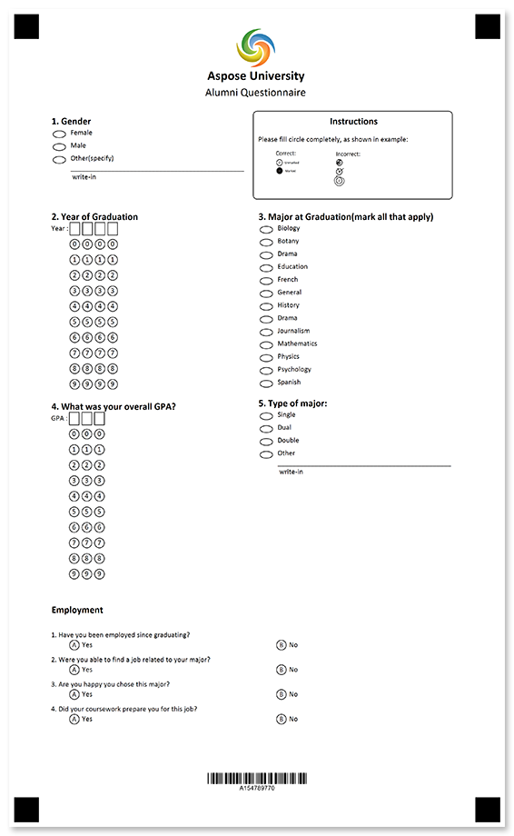
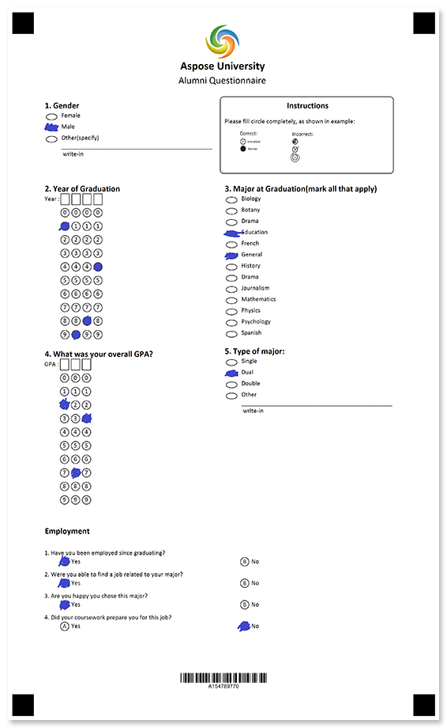

Collect information about the post-grad employment and achievements of your former students as part of your ongoing alumni feedback program.



## Source code

<details>
<summary>Text markup</summary>

```
?image=logo.jpg
	width=200
	height=200
	x=1169
	y=100
?text=Aspose University 
	font_style=bold
	font_size=16
	align=center
?text=Alumni Questionnaire
	font_size=bold
	font_size=14
	align=center
?empty_line=
	height=75
?container=instructions
	columns_count=2
?block=
	column=2
	border=rounded
?content=Instructions
	align=center
	font_style=bold
	font_size=12
?empty_line=height
	height=50
?content=Please fill circle completely, as shown in example:
?image=example.png
	width=700
	height=280
	align=left
&block
?block=
	column=1
	border=none
?content=1. Gender
	font_style=bold
	font_size=12
?vertical_choicebox=Gender
?answer=Female
?content=Female
&answer
?answer=Male
?content=Male
&answer
?answer=Other(specify)
?content=Other(specify)
?write_in=Gender
&answer
&vertical_choicebox
&block
&container
?empty_line=
	height=50
?container=2-3
	columns_count=2	
?block=
	column=1
	border=none
?content=2. Year of Graduation
	font_style=bold
	font_size=12
?empty_line=
	height=25
?composite_grid=Year
	columns_count=4
	header_type=square
	orientation=Horizontal
	values=(0) (1) (2) (3) (4) (5) (6) (7) (8) (9)
&block
?block=
	column=2
	border=none
?content=3. Major at Graduation(mark all that apply)
	font_style=bold
	font_size=12
?vertical_choicebox=Major at Graduation
?answer=Biology
?content=Biology
&answer
?answer=Botany
?content=Botany
&answer
?answer=Drama
?content=Drama
&answer
?answer=Education
?content=Education
&answer
?answer=French
?content=French
&answer
?answer=General
?content=General
&answer
?answer=History
?content=History
&answer
?answer=Drama
?content=Drama
&answer
?answer=Journalism
?content=Journalism
&answer
?answer=Mathematics
?content=Mathematics
&answer
?answer=Physics
?content=Physics
&answer
?answer=Psychology
?content=Psychology
&answer
?answer=Spanish
?content=Spanish
&answer
&vertical_choicebox
&block
?block=
	column=1
?content=4. What was your overall GPA?
	font_style=bold
	font_size=12
?empty_line=
	height=25
?composite_grid=GPA
	columns_count=3
	header_type=square
	orientation=Horizontal
	values=(0) (1) (2) (3) (4) (5) (6) (7) (8) (9)
&block
?block=
	column=2
?content=5. Type of major:
	font_style=bold
	font_size=12
?vertical_choicebox=Type of Major
?answer=Single
?content=Single
&answer
?answer=Dual
?content=Dual
&answer
?answer=Double
?content=Double
&answer
?answer=Other
?content=Other
?write_in=Type of Major
&answer
&vertical_choicebox
&block
&container

?text=Employment
	align=left
	font_style=bold
	font_size=12

#Have you been employed since graduating?
	() Yes () No
#Were you able to find a job related to your major?
	() Yes () No
#Are you happy you chose this major?
	() Yes () No
#Did your coursework prepare you for this job?
	() Yes () No

?empty_line=150
	height=150
?barcode=test_id
	codetext=true
	value=15478977
	barcode_type=Code32
```

</details>

<details>
<summary>JSON markup</summary>

```json
{
  "name": null,
  "children": [
    {
      "name": null,
      "children": [
        {
          "align": "Center",
          "name": "logo.jpg",
          "image_path": null,
          "x": 1169,
          "y": 100,
          "height": 200,
          "width": 200,
          "element_type": "Image"
        },
        {
          "name": "Aspose University \r\n",
          "font_family": "Calibri",
          "font_style": "Bold",
          "font_size": 16,
          "align": "Center",
          "element_type": "Text"
        },
        {
          "name": "Alumni Questionnaire\r\n",
          "font_family": "Calibri",
          "font_style": "Regular",
          "font_size": 14,
          "align": "Center",
          "element_type": "Text"
        },
        {
          "name": "",
          "height": 75,
          "element_type": "EmptyLine"
        },
        {
          "name": "instructions",
          "children": [
            {
              "name": "",
              "children": [
                {
                  "name": "Instructions",
                  "font_family": "Calibri",
                  "font_style": "Bold",
                  "font_size": 12,
                  "content_type": "Normal",
                  "align": "Center",
                  "element_type": "Content"
                },
                {
                  "name": "height",
                  "height": 50,
                  "element_type": "EmptyLine"
                },
                {
                  "name": "Please fill circle completely, as shown in example:",
                  "font_family": "Calibri",
                  "font_style": "Regular",
                  "font_size": 9,
                  "content_type": "Normal",
                  "align": "Left",
                  "element_type": "Content"
                },
                {
                  "align": "Left",
                  "name": "example.png",
                  "image_path": null,
                  "x": -1,
                  "y": -1,
                  "height": 280,
                  "width": 700,
                  "element_type": "Image"
                }
              ],
              "column": 2,
              "border": "Rounded",
              "border_size": 3,
              "border_color": "Black",
              "is_clipped": false,
              "element_type": "Block"
            },
            {
              "name": "",
              "children": [
                {
                  "name": "1. Gender",
                  "font_family": "Calibri",
                  "font_style": "Bold",
                  "font_size": 12,
                  "content_type": "Normal",
                  "align": "Left",
                  "element_type": "Content"
                },
                {
                  "name": "Gender",
                  "children": [
                    {
                      "name": "Female",
                      "children": [
                        {
                          "name": "Female",
                          "font_family": "Calibri",
                          "font_style": "Regular",
                          "font_size": 9,
                          "content_type": "Normal",
                          "align": "Left",
                          "element_type": "Content"
                        }
                      ],
                      "bubble_type": "Round",
                      "element_type": "Answer"
                    },
                    {
                      "name": "Male",
                      "children": [
                        {
                          "name": "Male",
                          "font_family": "Calibri",
                          "font_style": "Regular",
                          "font_size": 9,
                          "content_type": "Normal",
                          "align": "Left",
                          "element_type": "Content"
                        }
                      ],
                      "bubble_type": "Round",
                      "element_type": "Answer"
                    },
                    {
                      "name": "Other(specify)",
                      "children": [
                        {
                          "name": "Other(specify)",
                          "font_family": "Calibri",
                          "font_style": "Regular",
                          "font_size": 9,
                          "content_type": "Normal",
                          "align": "Left",
                          "element_type": "Content"
                        },
                        {
                          "name": "Gender",
                          "required": false,
                          "element_type": "WriteIn"
                        }
                      ],
                      "bubble_type": "Round",
                      "element_type": "Answer"
                    }
                  ],
                  "element_type": "VerticalChoiceBox",
                  "threshold": 0,
                  "top_padding": 0
                }
              ],
              "column": 1,
              "border": "None",
              "border_size": 3,
              "border_color": "Black",
              "is_clipped": false,
              "element_type": "Block"
            }
          ],
          "columns_count": 2,
          "columns_proportions": null,
          "container_type": "Normal",
          "block_right_margin": 40,
          "block_bottom_margin": 20,
          "block_top_padding": 20,
          "element_type": "Container"
        },
        {
          "name": "",
          "height": 50,
          "element_type": "EmptyLine"
        },
        {
          "name": "2-3",
          "children": [
            {
              "name": "",
              "children": [
                {
                  "name": "2. Year of Graduation",
                  "font_family": "Calibri",
                  "font_style": "Bold",
                  "font_size": 12,
                  "content_type": "Normal",
                  "align": "Left",
                  "element_type": "Content"
                },
                {
                  "name": "",
                  "height": 25,
                  "element_type": "EmptyLine"
                },
                {
                  "vertical_margin": 0,
                  "bubble_size": "Small",
                  "name": "Year",
                  "column": 0,
                  "columns_count": 4,
                  "align": "Left",
                  "header_type": "Square",
                  "header_border_size": 3,
                  "header_border_color": "Black",
                  "orientation": "Horizontal",
                  "bubble_type": "Round",
                  "x": -1,
                  "y": -1,
                  "values": [
                    "0",
                    "1",
                    "2",
                    "3",
                    "4",
                    "5",
                    "6",
                    "7",
                    "8",
                    "9"
                  ],
                  "extra_row": [],
                  "rotate": 0,
                  "element_type": "CompositeGrid"
                }
              ],
              "column": 1,
              "border": "None",
              "border_size": 3,
              "border_color": "Black",
              "is_clipped": false,
              "element_type": "Block"
            },
            {
              "name": "",
              "children": [
                {
                  "name": "3. Major at Graduation(mark all that apply)",
                  "font_family": "Calibri",
                  "font_style": "Bold",
                  "font_size": 12,
                  "content_type": "Normal",
                  "align": "Left",
                  "element_type": "Content"
                },
                {
                  "name": "Major at Graduation",
                  "children": [
                    {
                      "name": "Biology",
                      "children": [
                        {
                          "name": "Biology",
                          "font_family": "Calibri",
                          "font_style": "Regular",
                          "font_size": 9,
                          "content_type": "Normal",
                          "align": "Left",
                          "element_type": "Content"
                        }
                      ],
                      "bubble_type": "Round",
                      "element_type": "Answer"
                    },
                    {
                      "name": "Botany",
                      "children": [
                        {
                          "name": "Botany",
                          "font_family": "Calibri",
                          "font_style": "Regular",
                          "font_size": 9,
                          "content_type": "Normal",
                          "align": "Left",
                          "element_type": "Content"
                        }
                      ],
                      "bubble_type": "Round",
                      "element_type": "Answer"
                    },
                    {
                      "name": "Drama",
                      "children": [
                        {
                          "name": "Drama",
                          "font_family": "Calibri",
                          "font_style": "Regular",
                          "font_size": 9,
                          "content_type": "Normal",
                          "align": "Left",
                          "element_type": "Content"
                        }
                      ],
                      "bubble_type": "Round",
                      "element_type": "Answer"
                    },
                    {
                      "name": "Education",
                      "children": [
                        {
                          "name": "Education",
                          "font_family": "Calibri",
                          "font_style": "Regular",
                          "font_size": 9,
                          "content_type": "Normal",
                          "align": "Left",
                          "element_type": "Content"
                        }
                      ],
                      "bubble_type": "Round",
                      "element_type": "Answer"
                    },
                    {
                      "name": "French",
                      "children": [
                        {
                          "name": "French",
                          "font_family": "Calibri",
                          "font_style": "Regular",
                          "font_size": 9,
                          "content_type": "Normal",
                          "align": "Left",
                          "element_type": "Content"
                        }
                      ],
                      "bubble_type": "Round",
                      "element_type": "Answer"
                    },
                    {
                      "name": "General",
                      "children": [
                        {
                          "name": "General",
                          "font_family": "Calibri",
                          "font_style": "Regular",
                          "font_size": 9,
                          "content_type": "Normal",
                          "align": "Left",
                          "element_type": "Content"
                        }
                      ],
                      "bubble_type": "Round",
                      "element_type": "Answer"
                    },
                    {
                      "name": "History",
                      "children": [
                        {
                          "name": "History",
                          "font_family": "Calibri",
                          "font_style": "Regular",
                          "font_size": 9,
                          "content_type": "Normal",
                          "align": "Left",
                          "element_type": "Content"
                        }
                      ],
                      "bubble_type": "Round",
                      "element_type": "Answer"
                    },
                    {
                      "name": "Drama",
                      "children": [
                        {
                          "name": "Drama",
                          "font_family": "Calibri",
                          "font_style": "Regular",
                          "font_size": 9,
                          "content_type": "Normal",
                          "align": "Left",
                          "element_type": "Content"
                        }
                      ],
                      "bubble_type": "Round",
                      "element_type": "Answer"
                    },
                    {
                      "name": "Journalism",
                      "children": [
                        {
                          "name": "Journalism",
                          "font_family": "Calibri",
                          "font_style": "Regular",
                          "font_size": 9,
                          "content_type": "Normal",
                          "align": "Left",
                          "element_type": "Content"
                        }
                      ],
                      "bubble_type": "Round",
                      "element_type": "Answer"
                    },
                    {
                      "name": "Mathematics",
                      "children": [
                        {
                          "name": "Mathematics",
                          "font_family": "Calibri",
                          "font_style": "Regular",
                          "font_size": 9,
                          "content_type": "Normal",
                          "align": "Left",
                          "element_type": "Content"
                        }
                      ],
                      "bubble_type": "Round",
                      "element_type": "Answer"
                    },
                    {
                      "name": "Physics",
                      "children": [
                        {
                          "name": "Physics",
                          "font_family": "Calibri",
                          "font_style": "Regular",
                          "font_size": 9,
                          "content_type": "Normal",
                          "align": "Left",
                          "element_type": "Content"
                        }
                      ],
                      "bubble_type": "Round",
                      "element_type": "Answer"
                    },
                    {
                      "name": "Psychology",
                      "children": [
                        {
                          "name": "Psychology",
                          "font_family": "Calibri",
                          "font_style": "Regular",
                          "font_size": 9,
                          "content_type": "Normal",
                          "align": "Left",
                          "element_type": "Content"
                        }
                      ],
                      "bubble_type": "Round",
                      "element_type": "Answer"
                    },
                    {
                      "name": "Spanish",
                      "children": [
                        {
                          "name": "Spanish",
                          "font_family": "Calibri",
                          "font_style": "Regular",
                          "font_size": 9,
                          "content_type": "Normal",
                          "align": "Left",
                          "element_type": "Content"
                        }
                      ],
                      "bubble_type": "Round",
                      "element_type": "Answer"
                    }
                  ],
                  "element_type": "VerticalChoiceBox",
                  "threshold": 0,
                  "top_padding": 0
                }
              ],
              "column": 2,
              "border": "None",
              "border_size": 3,
              "border_color": "Black",
              "is_clipped": false,
              "element_type": "Block"
            },
            {
              "name": "",
              "children": [
                {
                  "name": "4. What was your overall GPA?",
                  "font_family": "Calibri",
                  "font_style": "Bold",
                  "font_size": 12,
                  "content_type": "Normal",
                  "align": "Left",
                  "element_type": "Content"
                },
                {
                  "name": "",
                  "height": 25,
                  "element_type": "EmptyLine"
                },
                {
                  "vertical_margin": 0,
                  "bubble_size": "Small",
                  "name": "GPA",
                  "column": 0,
                  "columns_count": 3,
                  "align": "Left",
                  "header_type": "Square",
                  "header_border_size": 3,
                  "header_border_color": "Black",
                  "orientation": "Horizontal",
                  "bubble_type": "Round",
                  "x": -1,
                  "y": -1,
                  "values": [
                    "0",
                    "1",
                    "2",
                    "3",
                    "4",
                    "5",
                    "6",
                    "7",
                    "8",
                    "9"
                  ],
                  "extra_row": [],
                  "rotate": 0,
                  "element_type": "CompositeGrid"
                }
              ],
              "column": 1,
              "border": "None",
              "border_size": 3,
              "border_color": "Black",
              "is_clipped": false,
              "element_type": "Block"
            },
            {
              "name": "",
              "children": [
                {
                  "name": "5. Type of major:",
                  "font_family": "Calibri",
                  "font_style": "Bold",
                  "font_size": 12,
                  "content_type": "Normal",
                  "align": "Left",
                  "element_type": "Content"
                },
                {
                  "name": "Type of Major",
                  "children": [
                    {
                      "name": "Single",
                      "children": [
                        {
                          "name": "Single",
                          "font_family": "Calibri",
                          "font_style": "Regular",
                          "font_size": 9,
                          "content_type": "Normal",
                          "align": "Left",
                          "element_type": "Content"
                        }
                      ],
                      "bubble_type": "Round",
                      "element_type": "Answer"
                    },
                    {
                      "name": "Dual",
                      "children": [
                        {
                          "name": "Dual",
                          "font_family": "Calibri",
                          "font_style": "Regular",
                          "font_size": 9,
                          "content_type": "Normal",
                          "align": "Left",
                          "element_type": "Content"
                        }
                      ],
                      "bubble_type": "Round",
                      "element_type": "Answer"
                    },
                    {
                      "name": "Double",
                      "children": [
                        {
                          "name": "Double",
                          "font_family": "Calibri",
                          "font_style": "Regular",
                          "font_size": 9,
                          "content_type": "Normal",
                          "align": "Left",
                          "element_type": "Content"
                        }
                      ],
                      "bubble_type": "Round",
                      "element_type": "Answer"
                    },
                    {
                      "name": "Other",
                      "children": [
                        {
                          "name": "Other",
                          "font_family": "Calibri",
                          "font_style": "Regular",
                          "font_size": 9,
                          "content_type": "Normal",
                          "align": "Left",
                          "element_type": "Content"
                        },
                        {
                          "name": "Type of Major",
                          "required": false,
                          "element_type": "WriteIn"
                        }
                      ],
                      "bubble_type": "Round",
                      "element_type": "Answer"
                    }
                  ],
                  "element_type": "VerticalChoiceBox",
                  "threshold": 0,
                  "top_padding": 0
                }
              ],
              "column": 2,
              "border": "None",
              "border_size": 3,
              "border_color": "Black",
              "is_clipped": false,
              "element_type": "Block"
            }
          ],
          "columns_count": 2,
          "columns_proportions": null,
          "container_type": "Normal",
          "block_right_margin": 40,
          "block_bottom_margin": 20,
          "block_top_padding": 20,
          "element_type": "Container"
        },
        {
          "name": null,
          "height": 0,
          "element_type": "EmptyLine"
        },
        {
          "name": "Employment\r\n",
          "font_family": "Calibri",
          "font_style": "Bold",
          "font_size": 12,
          "align": "Left",
          "element_type": "Text"
        },
        {
          "name": null,
          "height": 0,
          "element_type": "EmptyLine"
        },
        {
          "name": null,
          "font_family": "Calibri",
          "font_style": "Regular",
          "font_size": 9,
          "align": "Left",
          "answers_string": "\t() Yes () No\r\n",
          "question_text": "Have you been employed since graduating?\r\n",
          "element_type": "ChoiceBox"
        },
        {
          "name": null,
          "font_family": "Calibri",
          "font_style": "Regular",
          "font_size": 9,
          "align": "Left",
          "answers_string": "\t() Yes () No\r\n",
          "question_text": "Were you able to find a job related to your major?\r\n",
          "element_type": "ChoiceBox"
        },
        {
          "name": null,
          "font_family": "Calibri",
          "font_style": "Regular",
          "font_size": 9,
          "align": "Left",
          "answers_string": "\t() Yes () No\r\n",
          "question_text": "Are you happy you chose this major?\r\n",
          "element_type": "ChoiceBox"
        },
        {
          "name": null,
          "font_family": "Calibri",
          "font_style": "Regular",
          "font_size": 9,
          "align": "Left",
          "answers_string": "\t() Yes () No\r\n",
          "question_text": "Did your coursework prepare you for this job?\r\n",
          "element_type": "ChoiceBox"
        },
        {
          "name": null,
          "height": 0,
          "element_type": "EmptyLine"
        },
        {
          "name": "150",
          "height": 150,
          "element_type": "EmptyLine"
        },
        {
          "name": "test_id",
          "value": "15478977",
          "barcode_type": "Code32",
          "qr_version": "Auto",
          "align": "Center",
          "height": -1,
          "codetext": true,
          "X": -1,
          "Y": -1,
          "element_type": "Barcode"
        }
      ],
      "element_type": "Page"
    }
  ],
  "element_type": "Template"
}
```

</details>

## Page settings

This template was generated using the following paper size, orientation, font, and other [layout settings](/omr/net/generate-template/page-setup/):

```csharp
GlobalPageSettings settings = new GlobalPageSettings
{
    PaperSize = PaperSize.Legal,
    Orientation = Orientation.Vertical,
    BubbleColor = Color.Black,
    BubbleSize = BubbleSize.Small,
    FontStyle = FontStyle.Regular,
    FontSize = 9,
    FontFamily = "Calibri",
};
```

## Recognition results



```
Element Name,Value,
Gender,"Male"
GPA,"273"
Major at Graduation,"Education,General"
Question1,"A"
Question2,"A"
Question3,"A"
Question4,"B"
test_id,"154789770"
Type of Major,"Dual"
Year,"1984"
```

## Download

[Click here](https://github.com/aspose-omr/Aspose.OMR-Documentation/blob/master/net/showcases/download/alumni-questionnaire-classic.zip) to download full template sources and related files. 

**Package structure:**

File | Description
---- | -----------
**alumni.csv** | recognition results based on the filled form available in this package
**alumni.json** | source code in [JSON markup](/omr/net/json-markup/)
**alumni.omr** | recognition pattern
**alumni.png** | printable form
**alumni.txt** | source code in [text markup](/omr/net/txt-markup/)
**alumni-recognized.png** | filled form
**example.png** | "how to fill" guidelines
**logo.jpg** | company logo
**settings.json** | [page settings](/omr/net/generate-template/page-setup/)
