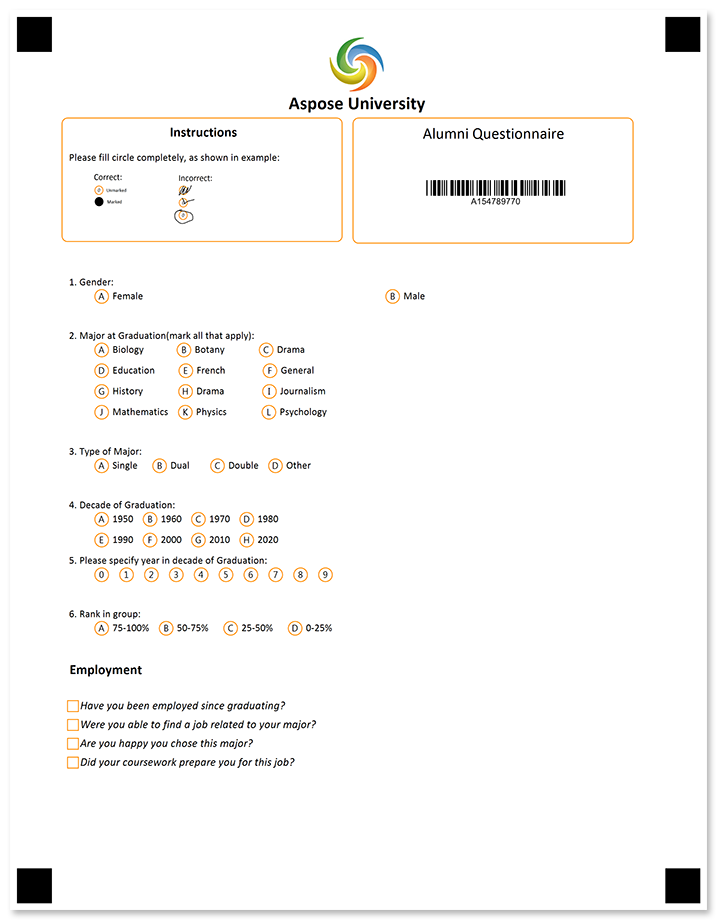
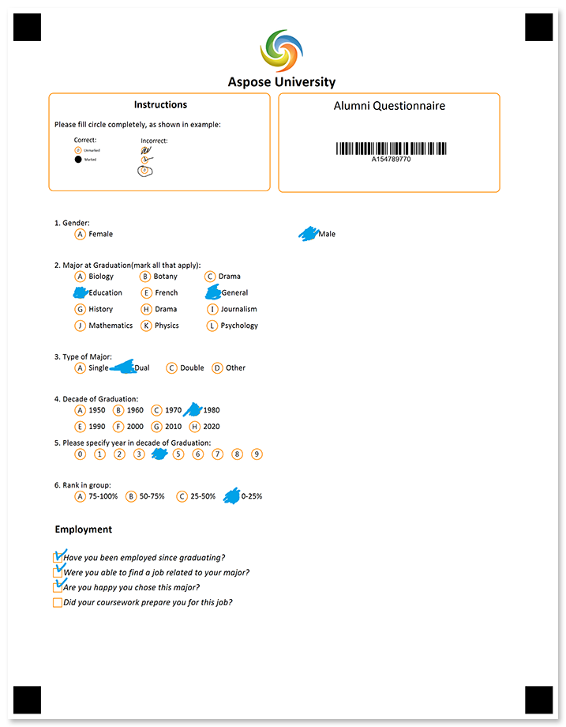

Collect information about the post-grad employment and achievements of your former students as part of your ongoing alumni feedback program.



## Source code

<details>
<summary>Text markup</summary>

```
?image=logo.jpg
	width=200
	height=200
	x=1169
	y=100
?text=Aspose University 
	font_style=bold
	font_size=16
	align=center
?empty_line=
	height=25
?container=instructions
	columns_count=2
?block=
	column=1
	border=rounded
	border_color=darkorange
?content=Instructions
	align=center
	font_style=bold
	font_size=12
?empty_line=height
	height=50
?content=Please fill circle completely, as shown in example:
?image=example.png
	width=700
	height=280
	align=left
&block
?block=
	column=2
	border=rounded
	border_color=darkorange
?content=Alumni Questionnaire
	font_size=bold
	font_size=14
	align=center
?empty_line=
	height=150
?barcode=test_id
	codetext=true
	value=15478977
	barcode_type=Code32
?empty_line=
	height=125
&block
&container

#Gender:
	() Female () Male 

#Major at Graduation(mark all that apply):
	() Biology           () Botany      () Drama
	() Education       () French   () General
	() History            () Drama    () Journalism
	() Mathematics () Physics  () Psychology

#Type of Major:
	() Single () Dual () Double () Other

#Decade of Graduation:
	() 1950 () 1960 () 1970 () 1980
	() 1990	() 2000 () 2010 () 2020
	
#Please specify year in decade of Graduation:
	(0) (1) (2) (3) (4) (5) (6) (7) (8) (9)

#Rank in group:
	() 75-100% () 50-75% () 25-50% () 0-25%

?text=Employment
	align=left
	font_style=bold
	font_size=12

?checkbox=Have you been employed since graduating?
	bubble_size=extrasmall
	font_size=10
	hide_name=true
?content=Have you been employed since graduating?
	font_style=italic
	font_size=10
&checkbox
?checkbox=Were you able to find a job related to your major?
	bubble_size=extrasmall
	font_size=10
	hide_name=true
?content=Were you able to find a job related to your major?
	font_style=italic
	font_size=10
&checkbox
?checkbox=Are you happy you chose this major?
	bubble_size=extrasmall
	font_size=10
	hide_name=true
?content=Are you happy you chose this major?
	font_style=italic
	font_size=10
&checkbox
?checkbox=Did your coursework prepare you for this job?
	bubble_size=extrasmall
	font_size=10
	hide_name=true
?content=Did your coursework prepare you for this job?
	font_style=italic
	font_size=10
&checkbox
?empty_line=
	height=150
```

</details>

<details>
<summary>JSON markup</summary>

```json
{
  "name": null,
  "children": [
    {
      "name": null,
      "children": [
        {
          "align": "Center",
          "name": "logo.jpg",
          "image_path": null,
          "x": 1169,
          "y": 100,
          "height": 200,
          "width": 200,
          "element_type": "Image"
        },
        {
          "name": "Aspose University \r\n",
          "font_family": "Calibri",
          "font_style": "Bold",
          "font_size": 16,
          "align": "Center",
          "element_type": "Text"
        },
        {
          "name": "",
          "height": 25,
          "element_type": "EmptyLine"
        },
        {
          "name": "instructions",
          "children": [
            {
              "name": "",
              "children": [
                {
                  "name": "Instructions",
                  "font_family": "Calibri",
                  "font_style": "Bold",
                  "font_size": 12,
                  "content_type": "Normal",
                  "align": "Center",
                  "element_type": "Content"
                },
                {
                  "name": "height",
                  "height": 50,
                  "element_type": "EmptyLine"
                },
                {
                  "name": "Please fill circle completely, as shown in example:",
                  "font_family": "Calibri",
                  "font_style": "Regular",
                  "font_size": 9,
                  "content_type": "Normal",
                  "align": "Left",
                  "element_type": "Content"
                },
                {
                  "align": "Left",
                  "name": "example.png",
                  "image_path": null,
                  "x": -1,
                  "y": -1,
                  "height": 280,
                  "width": 700,
                  "element_type": "Image"
                }
              ],
              "column": 1,
              "border": "Rounded",
              "border_size": 3,
              "border_color": "DarkOrange",
              "is_clipped": false,
              "element_type": "Block"
            },
            {
              "name": "",
              "children": [
                {
                  "name": "Alumni Questionnaire",
                  "font_family": "Calibri",
                  "font_style": "Regular",
                  "font_size": 14,
                  "content_type": "Normal",
                  "align": "Center",
                  "element_type": "Content"
                },
                {
                  "name": "",
                  "height": 150,
                  "element_type": "EmptyLine"
                },
                {
                  "name": "test_id",
                  "value": "15478977",
                  "barcode_type": "Code32",
                  "qr_version": "Auto",
                  "align": "Center",
                  "height": -1,
                  "codetext": true,
                  "X": -1,
                  "Y": -1,
                  "element_type": "Barcode"
                },
                {
                  "name": "",
                  "height": 125,
                  "element_type": "EmptyLine"
                }
              ],
              "column": 2,
              "border": "Rounded",
              "border_size": 3,
              "border_color": "DarkOrange",
              "is_clipped": false,
              "element_type": "Block"
            }
          ],
          "columns_count": 2,
          "columns_proportions": null,
          "container_type": "Normal",
          "block_right_margin": 40,
          "block_bottom_margin": 20,
          "block_top_padding": 20,
          "element_type": "Container"
        },
        {
          "name": null,
          "height": 0,
          "element_type": "EmptyLine"
        },
        {
          "name": null,
          "font_family": "Calibri",
          "font_style": "Regular",
          "font_size": 9,
          "align": "Left",
          "answers_string": "\t() Female () Male \r\n",
          "question_text": "Gender:\r\n",
          "element_type": "ChoiceBox"
        },
        {
          "name": null,
          "height": 0,
          "element_type": "EmptyLine"
        },
        {
          "name": null,
          "font_family": "Calibri",
          "font_style": "Regular",
          "font_size": 9,
          "align": "Left",
          "answers_string": "\t() Biology           () Botany      () Drama\r\n\t() Education       () French   () General\r\n\t() History            () Drama    () Journalism\r\n\t() Mathematics () Physics  () Psychology\r\n",
          "question_text": "Major at Graduation(mark all that apply):\r\n",
          "element_type": "ChoiceBox"
        },
        {
          "name": null,
          "height": 0,
          "element_type": "EmptyLine"
        },
        {
          "name": null,
          "font_family": "Calibri",
          "font_style": "Regular",
          "font_size": 9,
          "align": "Left",
          "answers_string": "\t() Single () Dual () Double () Other\r\n",
          "question_text": "Type of Major:\r\n",
          "element_type": "ChoiceBox"
        },
        {
          "name": null,
          "height": 0,
          "element_type": "EmptyLine"
        },
        {
          "name": null,
          "font_family": "Calibri",
          "font_style": "Regular",
          "font_size": 9,
          "align": "Left",
          "answers_string": "\t() 1950 () 1960 () 1970 () 1980\r\n\t() 1990\t() 2000 () 2010 () 2020\r\n\t\r\n",
          "question_text": "Decade of Graduation:\r\n",
          "element_type": "ChoiceBox"
        },
        {
          "name": null,
          "font_family": "Calibri",
          "font_style": "Regular",
          "font_size": 9,
          "align": "Left",
          "answers_string": "\t(0) (1) (2) (3) (4) (5) (6) (7) (8) (9)\r\n",
          "question_text": "Please specify year in decade of Graduation:\r\n",
          "element_type": "ChoiceBox"
        },
        {
          "name": null,
          "height": 0,
          "element_type": "EmptyLine"
        },
        {
          "name": null,
          "font_family": "Calibri",
          "font_style": "Regular",
          "font_size": 9,
          "align": "Left",
          "answers_string": "\t() 75-100% () 50-75% () 25-50% () 0-25%\r\n",
          "question_text": "Rank in group:\r\n",
          "element_type": "ChoiceBox"
        },
        {
          "name": null,
          "height": 0,
          "element_type": "EmptyLine"
        },
        {
          "name": "Employment\r\n",
          "font_family": "Calibri",
          "font_style": "Bold",
          "font_size": 12,
          "align": "Left",
          "element_type": "Text"
        },
        {
          "name": null,
          "height": 0,
          "element_type": "EmptyLine"
        },
        {
          "hide_name": true,
          "name": "Have you been employed since graduating?",
          "orientation": "Horizontal",
          "bubble_size": "Extrasmall",
          "bubble_type": "Square",
          "threshold": 3,
          "element_type": "CheckBox",
          "children": [
            {
              "name": "Have you been employed since graduating?",
              "font_family": "Calibri",
              "font_style": "Italic",
              "font_size": 10,
              "content_type": "Normal",
              "align": "Left",
              "element_type": "Content"
            }
          ],
          "font_family": "Calibri",
          "font_style": "Regular",
          "font_size": 10
        },
        {
          "hide_name": true,
          "name": "Were you able to find a job related to your major?",
          "orientation": "Horizontal",
          "bubble_size": "Extrasmall",
          "bubble_type": "Square",
          "threshold": 3,
          "element_type": "CheckBox",
          "children": [
            {
              "name": "Were you able to find a job related to your major?",
              "font_family": "Calibri",
              "font_style": "Italic",
              "font_size": 10,
              "content_type": "Normal",
              "align": "Left",
              "element_type": "Content"
            }
          ],
          "font_family": "Calibri",
          "font_style": "Regular",
          "font_size": 10
        },
        {
          "hide_name": true,
          "name": "Are you happy you chose this major?",
          "orientation": "Horizontal",
          "bubble_size": "Extrasmall",
          "bubble_type": "Square",
          "threshold": 3,
          "element_type": "CheckBox",
          "children": [
            {
              "name": "Are you happy you chose this major?",
              "font_family": "Calibri",
              "font_style": "Italic",
              "font_size": 10,
              "content_type": "Normal",
              "align": "Left",
              "element_type": "Content"
            }
          ],
          "font_family": "Calibri",
          "font_style": "Regular",
          "font_size": 10
        },
        {
          "hide_name": true,
          "name": "Did your coursework prepare you for this job?",
          "orientation": "Horizontal",
          "bubble_size": "Extrasmall",
          "bubble_type": "Square",
          "threshold": 3,
          "element_type": "CheckBox",
          "children": [
            {
              "name": "Did your coursework prepare you for this job?",
              "font_family": "Calibri",
              "font_style": "Italic",
              "font_size": 10,
              "content_type": "Normal",
              "align": "Left",
              "element_type": "Content"
            }
          ],
          "font_family": "Calibri",
          "font_style": "Regular",
          "font_size": 10
        },
        {
          "name": "",
          "height": 150,
          "element_type": "EmptyLine"
        }
      ],
      "element_type": "Page"
    }
  ],
  "element_type": "Template"
}
```

</details>

## Page settings

This template was generated using the following paper size, orientation, font, and other [layout settings](/omr/net/generate-template/page-setup/):

```csharp
GlobalPageSettings settings = new GlobalPageSettings
{
    PaperSize = PaperSize.Letter,
    Orientation = Orientation.Vertical,
    BubbleColor = Color.DarkOrange,
    BubbleSize = BubbleSize.Small,
    FontStyle = FontStyle.Regular,
    FontSize = 9,
    FontFamily = "Calibri",
};
```

## Recognition results



```
Element Name,Value,
Are you happy you chose this major?,"Are you happy you chose this major?"
Did your coursework prepare you for this job?,""
Have you been employed since graduating?,"Have you been employed since graduating?"
Question1,"B"
Question2,"D,F"
Question3,"B"
Question4,"D"
Question5,"4"
Question6,"D"
test_id,"154789770"
Were you able to find a job related to your major?,"Were you able to find a job related to your major?"
```

## Download

[Click here](https://github.com/aspose-omr/Aspose.OMR-Documentation/blob/master/net/showcases/download/alumni-questionnaire-compact.zip) to download full template sources and related files. 

**Package structure:**

File | Description
---- | -----------
**alumni.csv** | recognition results based on the filled form available in this package
**alumni.json** | source code in [JSON markup](/omr/net/json-markup/)
**alumni.omr** | recognition pattern
**alumni.png** | printable form
**alumni.txt** | source code in [text markup](/omr/net/txt-markup/)
**alumni-recognized.png** | filled form
**example.png** | "how to fill" guidelines
**logo.jpg** | company logo
**settings.json** | [page settings](/omr/net/generate-template/page-setup/)
