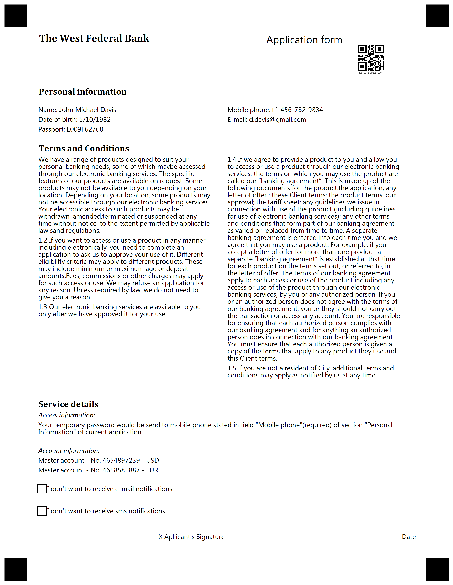

{} 

This example constructed for custom GlobalPageSettings. Please use provided settings from text below for best result.

{}


**Template generation call**

<details>
<summary>C# Code</summary>

````java
var license = new License();
license.SetLicense(@"C:\Users\User\Desktop\Aspose.license");

var engine = new OmrEngine();
var settings = new GlobalPageSettings
{
	PaperSize = PaperSize.Letter,
	Orientation = Orientation.Vertical,
	BubbleColor = Color.Black,
	BubbleSize = BubbleSize.Small,
	FontStyle = FontStyle.Regular,
	FontSize = 9,
	FontFamily = "Segoe UI",
	ImagesPaths = images
};
var configPath = @"C:\Users\User\Desktop\template\template.json";

var result = engine.GenerateJSONTemplate(configPath, settings);
result.Save(@"C:\Users\User\Desktop\template", "generated_template");
````

</details>


**Template JSON markdown**

<details>
<summary>JSON markdown</summary>

```json
{
  "name": null,
  "children": [
    {
      "name": "1",
      "children": [
        {
          "name": "header",
          "children": [
            {
              "name": "left",
              "children": [
                {
                  "name": "The West Federal Bank",
                  "font_family": "Cambria",
                  "font_style": "Bold",
                  "font_size": 14,
                  "content_type": "Normal",
                  "align": "Left",
                  "element_type": "Content"
                }
              ],
              "column": 1,
              "border": "None",
              "border_size": 3,
              "border_color": "Black",
              "is_clipped": false,
              "element_type": "Block"
            },
            {
              "name": "right",
              "children": [
                {
                  "name": "Application form",
                  "font_family": "Segoe UI",
                  "font_style": "Regular",
                  "font_size": 14,
                  "content_type": "Normal",
                  "align": "Left",
                  "element_type": "Content"
                },
                {
                  "name": "form id",
                  "value": "ESK3JFSGHEJFSDA",
                  "barcode_type": "qr",
                  "qr_version": 0,
                  "align": "Center",
                  "height": 200,
                  "codetext": true,
                  "X": 2000,
                  "Y": -1,
                  "element_type": "Barcode"
                }
              ],
              "column": 2,
              "border": "None",
              "border_size": 3,
              "border_color": "Black",
              "is_clipped": false,
              "element_type": "Block"
            }
          ],
          "columns_count": 0,
          "columns_proportions": [
            60,
            40
          ],
          "container_type": "Normal",
          "element_type": "Container"
        },
        {
          "name": "personal",
          "children": [
            {
              "name": "left",
              "children": [
                {
                  "name": "Personal information",
                  "font_family": "Cambria",
                  "font_style": "Bold",
                  "font_size": 12,
                  "content_type": "Normal",
                  "align": "Left",
                  "element_type": "Content"
                }
              ],
              "column": 1,
              "border": "None",
              "border_size": 3,
              "border_color": "Black",
              "is_clipped": false,
              "element_type": "Block"
            }
          ],
          "columns_count": 2,
          "columns_proportions": null,
          "container_type": "Normal",
          "element_type": "Container"
        },
        {
          "name": "information",
          "children": [
            {
              "name": "left",
              "children": [
                {
                  "name": "Name: John Michael Davis",
                  "font_family": "Segoe UI",
                  "font_style": "Regular",
                  "font_size": 9,
                  "content_type": "Normal",
                  "align": "Left",
                  "element_type": "Content"
                },
                {
                  "name": "Date of birth: 5/10/1982",
                  "font_family": "Segoe UI",
                  "font_style": "Regular",
                  "font_size": 9,
                  "content_type": "Normal",
                  "align": "Left",
                  "element_type": "Content"
                },
                {
                  "name": "Passport: E009F62768",
                  "font_family": "Segoe UI",
                  "font_style": "Regular",
                  "font_size": 9,
                  "content_type": "Normal",
                  "align": "Left",
                  "element_type": "Content"
                }
              ],
              "column": 1,
              "border": "None",
              "border_size": 3,
              "border_color": "Black",
              "is_clipped": false,
              "element_type": "Block"
            },
            {
              "name": "right",
              "children": [
                {
                  "name": "Mobile phone:+1 456-782-9834",
                  "font_family": "Segoe UI",
                  "font_style": "Regular",
                  "font_size": 9,
                  "content_type": "Normal",
                  "align": "Left",
                  "element_type": "Content"
                },
                {
                  "name": "E-mail: d.davis@gmail.com",
                  "font_family": "Segoe UI",
                  "font_style": "Regular",
                  "font_size": 9,
                  "content_type": "Normal",
                  "align": "Left",
                  "element_type": "Content"
                }
              ],
              "column": 2,
              "border": "None",
              "border_size": 3,
              "border_color": "Black",
              "is_clipped": false,
              "element_type": "Block"
            }
          ],
          "columns_count": 2,
          "columns_proportions": null,
          "container_type": "Normal",
          "element_type": "Container"
        },
        {
          "name": "Terms and Conditions\r\n",
          "font_family": "Cambria",
          "font_style": "Bold",
          "font_size": 12,
          "align": "Left",
          "element_type": "Text"
        },
        {
          "name": "terms",
          "children": [
            {
              "name": "left",
              "children": [
                {
                  "name": "We have a range of products designed to suit your personal banking needs, some of which maybe accessed through our electronic banking services. The specific features of our products are available on request. Some products may not be available to you depending on your location. Depending on your location, some products may not be accessible through our electronic banking services. Your electronic access to such products may be withdrawn, amended,terminated or suspended at any time without notice, to the extent permitted by applicable law sand regulations. ",
                  "font_family": "Segoe UI",
                  "font_style": "Regular",
                  "font_size": 9,
                  "content_type": "Normal",
                  "align": "Left",
                  "element_type": "Content"
                },
                {
                  "name": "1.2 If you want to access or use a product in any manner including electronically, you need to complete an application to ask us to approve your use of it. Different eligibility criteria may apply to different products. These may include minimum or maximum age or deposit amounts.Fees, commissions or other charges may apply for such access or use. We may refuse an application for any reason. Unless required by law, we do not need to give you a reason.",
                  "font_family": "Segoe UI",
                  "font_style": "Regular",
                  "font_size": 9,
                  "content_type": "Normal",
                  "align": "Left",
                  "element_type": "Content"
                },
                {
                  "name": "1.3 Our electronic banking services are available to you only after we have approved it for your use.",
                  "font_family": "Segoe UI",
                  "font_style": "Regular",
                  "font_size": 9,
                  "content_type": "Normal",
                  "align": "Left",
                  "element_type": "Content"
                }
              ],
              "column": 1,
              "border": "None",
              "border_size": 3,
              "border_color": "Black",
              "is_clipped": false,
              "element_type": "Block"
            },
            {
              "name": "right",
              "children": [
                {
                  "name": "1.4 If we agree to provide a product to you and allow you to access or use a product through our electronic banking services, the terms on which you may use the product are called our “banking agreement”. This is made up of the following documents for the product:the application; any letter of offer ; these Client terms; the product terms; our approval; the tariff sheet; any guidelines we issue in connection with use of the product (including guidelines for use of electronic banking services); any other terms and conditions that form part of our banking agreement as varied or replaced from time to time. A separate banking agreement is entered into each time you and we agree that you may use a product. For example, if you accept a letter of offer for more than one product, a separate “banking agreement” is established at that time for each product on the terms set out, or referred to, in the letter of offer. The terms of our banking agreement apply to each access or use of the product including any access or use of the product through our electronic banking services, by you or any authorized person. If you or an authorized person does not agree with the terms of our banking agreement, you or they should not carry out the transaction or access any account. You are responsible for ensuring that each authorized person complies with our banking agreement and for anything an authorized person does in connection with our banking agreement. You must ensure that each authorized person is given a copy of the terms that apply to any product they use and this Client terms. ",
                  "font_family": "Segoe UI",
                  "font_style": "Regular",
                  "font_size": 9,
                  "content_type": "Normal",
                  "align": "Left",
                  "element_type": "Content"
                },
                {
                  "name": "1.5 If you are not a resident of City, additional terms and conditions may apply as notified by us at any time.",
                  "font_family": "Segoe UI",
                  "font_style": "Regular",
                  "font_size": 9,
                  "content_type": "Normal",
                  "align": "Left",
                  "element_type": "Content"
                }
              ],
              "column": 2,
              "border": "None",
              "border_size": 3,
              "border_color": "Black",
              "is_clipped": false,
              "element_type": "Block"
            }
          ],
          "columns_count": 2,
          "columns_proportions": null,
          "container_type": "Normal",
          "element_type": "Container"
        },
        {
          "name": "______________________________________________________________________________________________________________\r\n",
          "font_family": "Segoe UI",
          "font_style": "Regular",
          "font_size": 9,
          "align": "Left",
          "element_type": "Text"
        },
        {
          "name": "Service details\r\n",
          "font_family": "Cambria",
          "font_style": "Bold",
          "font_size": 12,
          "align": "Left",
          "element_type": "Text"
        },
        {
          "name": "service",
          "children": [
            {
              "name": "access",
              "children": [
                {
                  "name": "Access information:",
                  "font_family": "Segoe UI",
                  "font_style": "Italic",
                  "font_size": 9,
                  "content_type": "Normal",
                  "align": "Left",
                  "element_type": "Content"
                },
                {
                  "name": "Your temporary password would be send to mobile phone stated in field \"Mobile phone\"(required) of section \"Personal Information\" of current application.",
                  "font_family": "Segoe UI",
                  "font_style": "Regular",
                  "font_size": 9,
                  "content_type": "Normal",
                  "align": "Left",
                  "element_type": "Content"
                }
              ],
              "column": 1,
              "border": "None",
              "border_size": 3,
              "border_color": "Black",
              "is_clipped": false,
              "element_type": "Block"
            }
          ],
          "columns_count": 1,
          "columns_proportions": null,
          "container_type": "Normal",
          "element_type": "Container"
        },
        {
          "name": "Account information:\r\n",
          "font_family": "Segoe UI",
          "font_style": "Italic",
          "font_size": 9,
          "align": "Left",
          "element_type": "Text"
        },
        {
          "name": "accounts",
          "children": [
            {
              "name": "",
              "children": [
                {
                  "name": "Master account - No. 4654897239 - USD",
                  "font_family": "Segoe UI",
                  "font_style": "Regular",
                  "font_size": 9,
                  "content_type": "Normal",
                  "align": "Left",
                  "element_type": "Content"
                },
                {
                  "name": "Master account - No. 4658585887 - EUR",
                  "font_family": "Segoe UI",
                  "font_style": "Regular",
                  "font_size": 9,
                  "content_type": "Normal",
                  "align": "Left",
                  "element_type": "Content"
                }
              ],
              "column": 1,
              "border": "None",
              "border_size": 3,
              "border_color": "Black",
              "is_clipped": false,
              "element_type": "Block"
            }
          ],
          "columns_count": 2,
          "columns_proportions": null,
          "container_type": "Normal",
          "element_type": "Container"
        },
        {
          "name": "checkboxes",
          "children": [
            {
              "name": "left",
              "children": [
                {
                  "hide_name": true,
                  "name": "email",
                  "orientation": "Horizontal",
                  "bubble_size": "Small",
                  "threshold": 3,
                  "element_type": "CheckBox",
                  "children": [
                    {
                      "name": "I don't want to receive e-mail notifications",
                      "font_family": "Segoe UI",
                      "font_style": "Regular",
                      "font_size": 9,
                      "content_type": "Normal",
                      "align": "Right",
                      "element_type": "Content"
                    }
                  ],
                  "font_family": "Segoe UI",
                  "font_style": "Regular",
                  "font_size": 9
                },
                {
                  "name": "10",
                  "height": 0,
                  "element_type": "EmptyLine"
                }
              ],
              "column": 1,
              "border": "None",
              "border_size": 3,
              "border_color": "Black",
              "is_clipped": false,
              "element_type": "Block"
            },
            {
              "name": "left",
              "children": [
                {
                  "hide_name": true,
                  "name": "sms",
                  "orientation": "Horizontal",
                  "bubble_size": "Small",
                  "threshold": 3,
                  "element_type": "CheckBox",
                  "children": [
                    {
                      "name": "I don't want to receive sms notifications",
                      "font_family": "Segoe UI",
                      "font_style": "Regular",
                      "font_size": 9,
                      "content_type": "Normal",
                      "align": "Right",
                      "element_type": "Content"
                    }
                  ],
                  "font_family": "Segoe UI",
                  "font_style": "Regular",
                  "font_size": 9
                }
              ],
              "column": 1,
              "border": "None",
              "border_size": 3,
              "border_color": "Black",
              "is_clipped": false,
              "element_type": "Block"
            }
          ],
          "columns_count": 1,
          "columns_proportions": null,
          "container_type": "Normal",
          "element_type": "Container"
        },
        {
          "name": "",
          "height": 40,
          "element_type": "EmptyLine"
        },
        {
          "name": "",
          "children": [
            {
              "name": "1",
              "children": [
                {
                  "name": "_______________________________________",
                  "font_family": "Segoe UI",
                  "font_style": "Regular",
                  "font_size": 9,
                  "content_type": "Normal",
                  "align": "Right",
                  "element_type": "Content"
                },
                {
                  "name": "X Apllicant's Signature",
                  "font_family": "Segoe UI",
                  "font_style": "Regular",
                  "font_size": 9,
                  "content_type": "Normal",
                  "align": "Right",
                  "element_type": "Content"
                }
              ],
              "column": 1,
              "border": "None",
              "border_size": 3,
              "border_color": "Black",
              "is_clipped": true,
              "element_type": "Block"
            },
            {
              "name": "2",
              "children": [
                {
                  "name": "_________________",
                  "font_family": "Segoe UI",
                  "font_style": "Regular",
                  "font_size": 9,
                  "content_type": "Normal",
                  "align": "Right",
                  "element_type": "Content"
                },
                {
                  "name": "Date",
                  "font_family": "Segoe UI",
                  "font_style": "Regular",
                  "font_size": 9,
                  "content_type": "Normal",
                  "align": "Right",
                  "element_type": "Content"
                }
              ],
              "column": 2,
              "border": "None",
              "border_size": 3,
              "border_color": "Black",
              "is_clipped": true,
              "element_type": "Block"
            }
          ],
          "columns_count": 0,
          "columns_proportions": [
            50,
            50
          ],
          "container_type": "Normal",
          "element_type": "Container"
        }
      ],
      "element_type": "Page"
    }
  ],
  "element_type": "Template"
}
```

</details>

**Template result**

****