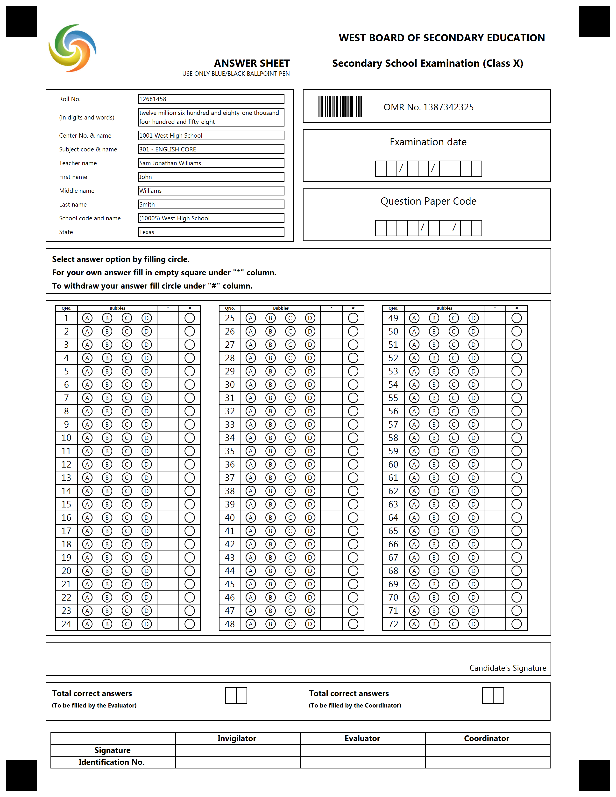

{} 

This example constructed for custom GlobalPageSettings. Please use provided settings from text below for best result.

{}


**Template generation call**

<details>
<summary>C# Code</summary>

````java
var license = new License();
license.SetLicense(@"C:\Users\User\Desktop\Aspose.license");

var engine = new OmrEngine();
var settings = new GlobalPageSettings
{
	PaperSize = PaperSize.Letter,
	Orientation = Orientation.Vertical,
	BubbleColor = Color.Black,
	BubbleSize = BubbleSize.Small,
	FontStyle = FontStyle.Regular,
	FontSize = 9,
	FontFamily = "Segoe UI",
	ImagesPaths = images
};
var configPath = @"C:\Users\User\Desktop\template\template.json";

var result = engine.GenerateJSONTemplate(configPath, settings);
result.Save(@"C:\Users\User\Desktop\template", "generated_template");
````

</details>


**Template JSON markdown**

<details>
<summary>JSON markdown</summary>

```json
{
  "name": null,
  "children": [
    {
      "name": null,
      "children": [
        {
          "name": "start",
          "height": 5,
          "element_type": "EmptyLine"
        },
        {
          "name": "1",
          "children": [
            {
              "name": "2",
              "children": [
                {
                  "align": "Center",
                  "name": "icon.jpg",
                  "image_path": null,
                  "x": 200,
                  "y": 100,
                  "height": 200,
                  "width": 200,
                  "element_type": "Image"
                },
                {
                  "name": "WEST BOARD OF SECONDARY EDUCATION",
                  "font_family": "Segoe UI",
                  "font_style": "Bold",
                  "font_size": 10,
                  "content_type": "Normal",
                  "align": "Right",
                  "element_type": "Content"
                }
              ],
              "column": 1,
              "border": "None",
              "border_size": 3,
              "border_color": "Black",
              "is_clipped": false,
              "element_type": "Block"
            }
          ],
          "columns_count": 1,
          "columns_proportions": null,
          "container_type": "Normal",
          "block_right_margin": 40,
          "block_bottom_margin": 20,
          "block_top_padding": 20,
          "element_type": "Container"
        },
        {
          "name": "co2",
          "children": [
            {
              "name": "b2",
              "children": [
                {
                  "name": "ANSWER SHEET",
                  "font_family": "Comic Sans MS",
                  "font_style": "Bold",
                  "font_size": 10,
                  "content_type": "Normal",
                  "align": "Right",
                  "element_type": "Content"
                },
                {
                  "name": "USE ONLY BLUE/BLACK BALLPOINT PEN",
                  "font_family": "Comic Sans MS",
                  "font_style": "Italic",
                  "font_size": 6,
                  "content_type": "Normal",
                  "align": "Right",
                  "element_type": "Content"
                }
              ],
              "column": 1,
              "border": "None",
              "border_size": 3,
              "border_color": "Black",
              "is_clipped": false,
              "element_type": "Block"
            },
            {
              "name": "b3",
              "children": [
                {
                  "name": "Secondary School Examination (Class X)",
                  "font_family": "Comic Sans MS",
                  "font_style": "Bold",
                  "font_size": 10,
                  "content_type": "Normal",
                  "align": "Center",
                  "element_type": "Content"
                }
              ],
              "column": 2,
              "border": "None",
              "border_size": 3,
              "border_color": "Black",
              "is_clipped": false,
              "element_type": "Block"
            }
          ],
          "columns_count": 2,
          "columns_proportions": null,
          "container_type": "Normal",
          "block_right_margin": 40,
          "block_bottom_margin": 20,
          "block_top_padding": 20,
          "element_type": "Container"
        },
        {
          "name": "c344",
          "children": [
            {
              "name": "b34",
              "children": [
                {
                  "name": "b344",
                  "element_type": "InputGroup",
                  "children": [
                    {
                      "name": "Roll No.",
                      "font_family": "Comic Sans MS",
                      "font_style": "Italic",
                      "font_size": 6,
                      "content_type": "Normal",
                      "align": "Left",
                      "element_type": "Content"
                    },
                    {
                      "name": "   12681458",
                      "font_family": "Comic Sans MS",
                      "font_style": "Italic",
                      "font_size": 6,
                      "content_type": "Normal",
                      "align": "Left",
                      "element_type": "Content"
                    }
                  ],
                  "label_border": "None",
                  "input_border": "Square",
                  "border_size": 3,
                  "border_color": "Black"
                },
                {
                  "name": "b344",
                  "element_type": "InputGroup",
                  "children": [
                    {
                      "name": "(in digits and words)",
                      "font_family": "Comic Sans MS",
                      "font_style": "Italic",
                      "font_size": 6,
                      "content_type": "Normal",
                      "align": "Left",
                      "element_type": "Content"
                    },
                    {
                      "name": "twelve million six hundred and eighty-one thousand four hundred and fifty-eight",
                      "font_family": "Comic Sans MS",
                      "font_style": "Italic",
                      "font_size": 6,
                      "content_type": "Normal",
                      "align": "Left",
                      "element_type": "Content"
                    }
                  ],
                  "label_border": "None",
                  "input_border": "Square",
                  "border_size": 3,
                  "border_color": "Black"
                },
                {
                  "name": "b344",
                  "element_type": "InputGroup",
                  "children": [
                    {
                      "name": "Center No. & name",
                      "font_family": "Comic Sans MS",
                      "font_style": "Italic",
                      "font_size": 6,
                      "content_type": "Normal",
                      "align": "Left",
                      "element_type": "Content"
                    },
                    {
                      "name": "1001 West High School",
                      "font_family": "Comic Sans MS",
                      "font_style": "Italic",
                      "font_size": 6,
                      "content_type": "Normal",
                      "align": "Left",
                      "element_type": "Content"
                    }
                  ],
                  "label_border": "None",
                  "input_border": "Square",
                  "border_size": 3,
                  "border_color": "Black"
                },
                {
                  "name": "b344",
                  "element_type": "InputGroup",
                  "children": [
                    {
                      "name": "Subject code & name",
                      "font_family": "Comic Sans MS",
                      "font_style": "Italic",
                      "font_size": 6,
                      "content_type": "Normal",
                      "align": "Left",
                      "element_type": "Content"
                    },
                    {
                      "name": "301 - ENGLISH CORE",
                      "font_family": "Comic Sans MS",
                      "font_style": "Italic",
                      "font_size": 6,
                      "content_type": "Normal",
                      "align": "Left",
                      "element_type": "Content"
                    }
                  ],
                  "label_border": "None",
                  "input_border": "Square",
                  "border_size": 3,
                  "border_color": "Black"
                },
                {
                  "name": "b344",
                  "element_type": "InputGroup",
                  "children": [
                    {
                      "name": "Teacher name",
                      "font_family": "Comic Sans MS",
                      "font_style": "Italic",
                      "font_size": 6,
                      "content_type": "Normal",
                      "align": "Left",
                      "element_type": "Content"
                    },
                    {
                      "name": "Sam Jonathan Williams",
                      "font_family": "Comic Sans MS",
                      "font_style": "Italic",
                      "font_size": 6,
                      "content_type": "Normal",
                      "align": "Left",
                      "element_type": "Content"
                    }
                  ],
                  "label_border": "None",
                  "input_border": "Square",
                  "border_size": 3,
                  "border_color": "Black"
                },
                {
                  "name": "b344",
                  "element_type": "InputGroup",
                  "children": [
                    {
                      "name": "First name",
                      "font_family": "Comic Sans MS",
                      "font_style": "Italic",
                      "font_size": 6,
                      "content_type": "Normal",
                      "align": "Left",
                      "element_type": "Content"
                    },
                    {
                      "name": "John",
                      "font_family": "Comic Sans MS",
                      "font_style": "Italic",
                      "font_size": 6,
                      "content_type": "Normal",
                      "align": "Left",
                      "element_type": "Content"
                    }
                  ],
                  "label_border": "None",
                  "input_border": "Square",
                  "border_size": 3,
                  "border_color": "Black"
                },
                {
                  "name": "b344",
                  "element_type": "InputGroup",
                  "children": [
                    {
                      "name": "Middle name",
                      "font_family": "Comic Sans MS",
                      "font_style": "Italic",
                      "font_size": 6,
                      "content_type": "Normal",
                      "align": "Left",
                      "element_type": "Content"
                    },
                    {
                      "name": "Williams",
                      "font_family": "Comic Sans MS",
                      "font_style": "Italic",
                      "font_size": 6,
                      "content_type": "Normal",
                      "align": "Left",
                      "element_type": "Content"
                    }
                  ],
                  "label_border": "None",
                  "input_border": "Square",
                  "border_size": 3,
                  "border_color": "Black"
                },
                {
                  "name": "b344",
                  "element_type": "InputGroup",
                  "children": [
                    {
                      "name": "Last name",
                      "font_family": "Comic Sans MS",
                      "font_style": "Italic",
                      "font_size": 6,
                      "content_type": "Normal",
                      "align": "Left",
                      "element_type": "Content"
                    },
                    {
                      "name": "Smith",
                      "font_family": "Comic Sans MS",
                      "font_style": "Italic",
                      "font_size": 6,
                      "content_type": "Normal",
                      "align": "Left",
                      "element_type": "Content"
                    }
                  ],
                  "label_border": "None",
                  "input_border": "Square",
                  "border_size": 3,
                  "border_color": "Black"
                },
                {
                  "name": "b344",
                  "element_type": "InputGroup",
                  "children": [
                    {
                      "name": "School code and name",
                      "font_family": "Comic Sans MS",
                      "font_style": "Italic",
                      "font_size": 6,
                      "content_type": "Normal",
                      "align": "Left",
                      "element_type": "Content"
                    },
                    {
                      "name": "(10005) West High School",
                      "font_family": "Comic Sans MS",
                      "font_style": "Italic",
                      "font_size": 6,
                      "content_type": "Normal",
                      "align": "Left",
                      "element_type": "Content"
                    }
                  ],
                  "label_border": "None",
                  "input_border": "Square",
                  "border_size": 3,
                  "border_color": "Black"
                },
                {
                  "name": "b433",
                  "element_type": "InputGroup",
                  "children": [
                    {
                      "name": "State",
                      "font_family": "Comic Sans MS",
                      "font_style": "Italic",
                      "font_size": 6,
                      "content_type": "Normal",
                      "align": "Left",
                      "element_type": "Content"
                    },
                    {
                      "name": "Texas",
                      "font_family": "Comic Sans MS",
                      "font_style": "Italic",
                      "font_size": 6,
                      "content_type": "Normal",
                      "align": "Left",
                      "element_type": "Content"
                    }
                  ],
                  "label_border": "None",
                  "input_border": "Square",
                  "border_size": 3,
                  "border_color": "Black"
                }
              ],
              "column": 1,
              "border": "Square",
              "border_size": 3,
              "border_color": "Black",
              "is_clipped": false,
              "element_type": "Block"
            },
            {
              "name": "",
              "children": [
                {
                  "name": "barcode omr",
                  "children": [
                    {
                      "name": "",
                      "height": 25,
                      "element_type": "EmptyLine"
                    },
                    {
                      "name": "OMR No. 1387342325",
                      "font_family": "Comic Sans MS",
                      "font_style": "Italic",
                      "font_size": 9,
                      "content_type": "Normal",
                      "align": "Center",
                      "element_type": "Content"
                    },
                    {
                      "name": "1",
                      "value": "1387342325",
                      "barcode_type": "code128",
                      "qr_version": 0,
                      "align": "Center",
                      "height": 100,
                      "codetext": false,
                      "X": 1270,
                      "Y": 390,
                      "element_type": "Barcode"
                    }
                  ],
                  "paragraph_type": "Normal",
                  "element_type": "Paragraph"
                }
              ],
              "column": 2,
              "border": "Square",
              "border_size": 3,
              "border_color": "Black",
              "is_clipped": false,
              "element_type": "Block"
            },
            {
              "name": "12312",
              "children": [
                {
                  "name": "Examination date",
                  "font_family": "Comic Sans MS",
                  "font_style": "Italic",
                  "font_size": 10,
                  "content_type": "Normal",
                  "align": "Center",
                  "element_type": "Content"
                },
                {
                  "name": "",
                  "height": 55,
                  "element_type": "EmptyLine"
                },
                {
                  "name": "  /  /    ",
                  "font_family": "Comic Sans MS",
                  "font_style": "Italic",
                  "font_size": 9,
                  "content_type": "Cells",
                  "align": "Center",
                  "element_type": "Content"
                }
              ],
              "column": 2,
              "border": "Square",
              "border_size": 3,
              "border_color": "Black",
              "is_clipped": true,
              "element_type": "Block"
            },
            {
              "name": "12312",
              "children": [
                {
                  "name": "Question Paper Code",
                  "font_family": "Comic Sans MS",
                  "font_style": "Italic",
                  "font_size": 10,
                  "content_type": "Normal",
                  "align": "Center",
                  "element_type": "Content"
                },
                {
                  "name": "",
                  "height": 55,
                  "element_type": "EmptyLine"
                },
                {
                  "name": "    /  /  ",
                  "font_family": "Comic Sans MS",
                  "font_style": "Italic",
                  "font_size": 9,
                  "content_type": "Cells",
                  "align": "Center",
                  "element_type": "Content"
                }
              ],
              "column": 2,
              "border": "Square",
              "border_size": 3,
              "border_color": "Black",
              "is_clipped": true,
              "element_type": "Block"
            }
          ],
          "columns_count": 2,
          "columns_proportions": null,
          "container_type": "Normal",
          "block_right_margin": 40,
          "block_bottom_margin": 20,
          "block_top_padding": 20,
          "element_type": "Container"
        },
        {
          "name": "",
          "children": [
            {
              "name": "",
              "children": [
                {
                  "name": "Select answer option by filling circle.",
                  "font_family": "Comic Sans MS",
                  "font_style": "Bold",
                  "font_size": 8,
                  "content_type": "Normal",
                  "align": "Left",
                  "element_type": "Content"
                },
                {
                  "name": "For your own answer fill in empty square under \"*\" column.",
                  "font_family": "Comic Sans MS",
                  "font_style": "Bold",
                  "font_size": 8,
                  "content_type": "Normal",
                  "align": "Left",
                  "element_type": "Content"
                },
                {
                  "name": "To withdraw your answer fill circle under \"#\" column.",
                  "font_family": "Comic Sans MS",
                  "font_style": "Bold",
                  "font_size": 8,
                  "content_type": "Normal",
                  "align": "Left",
                  "element_type": "Content"
                }
              ],
              "column": 1,
              "border": "Square",
              "border_size": 3,
              "border_color": "Black",
              "is_clipped": false,
              "element_type": "Block"
            }
          ],
          "columns_count": 1,
          "columns_proportions": null,
          "container_type": "Normal",
          "block_right_margin": 40,
          "block_bottom_margin": 20,
          "block_top_padding": 20,
          "element_type": "Container"
        },
        {
          "name": "custom_answer_sheet_container",
          "children": [
            {
              "name": "all",
              "children": [
                {
                  "columns_count": 3,
                  "amount": 72,
                  "name": "72 questions",
                  "border": "None",
                  "border_size": 0,
                  "border_color": "Aqua",
                  "children": [
                    {
                      "font_family": "Comic Sans MS",
                      "font_style": "Italic",
                      "font_size": 9,
                      "name": "123",
                      "children": [
                        {
                          "name": "QNo.",
                          "font_family": "Comic Sans MS",
                          "font_style": "Bold",
                          "font_size": 4,
                          "content_type": "Normal",
                          "align": "Center",
                          "element_type": "Content"
                        },
                        {
                          "name": "Bubbles",
                          "font_family": "Comic Sans MS",
                          "font_style": "Bold",
                          "font_size": 4,
                          "content_type": "Normal",
                          "align": "Center",
                          "element_type": "Content"
                        },
                        {
                          "name": "*",
                          "font_family": "Comic Sans MS",
                          "font_style": "Bold",
                          "font_size": 4,
                          "content_type": "Normal",
                          "align": "Center",
                          "element_type": "Content"
                        },
                        {
                          "name": "#",
                          "font_family": "Comic Sans MS",
                          "font_style": "Bold",
                          "font_size": 4,
                          "content_type": "Normal",
                          "align": "Center",
                          "element_type": "Content"
                        }
                      ],
                      "element_type": "TableHeader"
                    },
                    {
                      "name": "row_%index%",
                      "children": [
                        {
                          "name": "%index%",
                          "font_family": "Comic Sans MS",
                          "font_style": "Regular",
                          "font_size": 9,
                          "content_type": "Normal",
                          "align": "Center",
                          "element_type": "Content"
                        },
                        {
                          "name": "b_%index%",
                          "answers_list": [
                            "A",
                            "B",
                            "C",
                            "D"
                          ],
                          "font_family": "Comic Sans MS",
                          "font_style": "Regular",
                          "font_size": 6,
                          "bubble_size": "Extrasmall",
                          "element_type": "BubbleArray"
                        },
                        {
                          "name": "customWriteIn",
                          "required": true,
                          "element_type": "WriteIn"
                        },
                        {
                          "bubble_size": "Extrasmall",
                          "value": "question skipped",
                          "name": "trigger_to_skip_question",
                          "target": "60 questions_%index%",
                          "trigger_type": "ReplaceValue",
                          "element_type": "CustomTrigger"
                        }
                      ],
                      "element_type": "CustomRow"
                    }
                  ],
                  "element_type": "CustomAnswerSheet",
                  "row_proportions": [
                    15,
                    55,
                    15,
                    15
                  ]
                },
                {
                  "name": "",
                  "height": 20,
                  "element_type": "EmptyLine"
                }
              ],
              "column": 1,
              "border": "Square",
              "border_size": 3,
              "border_color": "Black",
              "is_clipped": false,
              "element_type": "Block"
            }
          ],
          "columns_count": 1,
          "columns_proportions": null,
          "container_type": "Normal",
          "block_right_margin": 40,
          "block_bottom_margin": 20,
          "block_top_padding": 20,
          "element_type": "Container"
        },
        {
          "name": "123",
          "children": [
            {
              "name": "",
              "children": [
                {
                  "name": "",
                  "height": 60,
                  "element_type": "EmptyLine"
                },
                {
                  "name": "Candidate's Signature",
                  "font_family": "Comic Sans MS",
                  "font_style": "Italic",
                  "font_size": 8,
                  "content_type": "Normal",
                  "align": "Right",
                  "element_type": "Content"
                }
              ],
              "column": 1,
              "border": "Square",
              "border_size": 3,
              "border_color": "Black",
              "is_clipped": true,
              "element_type": "Block"
            }
          ],
          "columns_count": 1,
          "columns_proportions": null,
          "container_type": "Normal",
          "block_right_margin": 40,
          "block_bottom_margin": 20,
          "block_top_padding": 20,
          "element_type": "Container"
        },
        {
          "name": "total_answers",
          "children": [
            {
              "name": "all",
              "children": [
                {
                  "name": "left1",
                  "children": [
                    {
                      "name": "Total correct answers",
                      "font_family": "Comic Sans MS",
                      "font_style": "Bold",
                      "font_size": 8,
                      "content_type": "Normal",
                      "align": "Left",
                      "element_type": "Content"
                    },
                    {
                      "name": "(To be filled by the Evaluator)",
                      "font_family": "Comic Sans MS",
                      "font_style": "Bold",
                      "font_size": 6,
                      "content_type": "Normal",
                      "align": "Left",
                      "element_type": "Content"
                    }
                  ],
                  "column": 1,
                  "border": "None",
                  "border_size": 3,
                  "border_color": "Black",
                  "is_clipped": false,
                  "element_type": "Block"
                },
                {
                  "name": "left2",
                  "children": [
                    {
                      "name": "  ",
                      "font_family": "Comic Sans MS",
                      "font_style": "Italic",
                      "font_size": 9,
                      "content_type": "Cells",
                      "align": "Center",
                      "element_type": "Content"
                    }
                  ],
                  "column": 2,
                  "border": "None",
                  "border_size": 3,
                  "border_color": "Black",
                  "is_clipped": false,
                  "element_type": "Block"
                },
                {
                  "name": "right1",
                  "children": [
                    {
                      "name": "Total correct answers",
                      "font_family": "Comic Sans MS",
                      "font_style": "Bold",
                      "font_size": 8,
                      "content_type": "Normal",
                      "align": "Left",
                      "element_type": "Content"
                    },
                    {
                      "name": "(To be filled by the Coordinator)",
                      "font_family": "Comic Sans MS",
                      "font_style": "Bold",
                      "font_size": 6,
                      "content_type": "Normal",
                      "align": "Left",
                      "element_type": "Content"
                    }
                  ],
                  "column": 3,
                  "border": "None",
                  "border_size": 3,
                  "border_color": "Black",
                  "is_clipped": false,
                  "element_type": "Block"
                },
                {
                  "name": "right2",
                  "children": [
                    {
                      "name": "  ",
                      "font_family": "Comic Sans MS",
                      "font_style": "Italic",
                      "font_size": 9,
                      "content_type": "Cells",
                      "align": "Center",
                      "element_type": "Content"
                    }
                  ],
                  "column": 4,
                  "border": "None",
                  "border_size": 3,
                  "border_color": "Black",
                  "is_clipped": false,
                  "element_type": "Block"
                },
                {
                  "name": "",
                  "height": 1,
                  "element_type": "EmptyLine"
                }
              ],
              "column": 1,
              "border": "Square",
              "border_size": 3,
              "border_color": "Black",
              "is_clipped": true,
              "element_type": "Block"
            }
          ],
          "columns_count": 4,
          "columns_proportions": null,
          "container_type": "Normal",
          "block_right_margin": 40,
          "block_bottom_margin": 20,
          "block_top_padding": 20,
          "element_type": "Container"
        },
        {
          "name": "signatures",
          "children": [
            {
              "name": "",
              "children": [
                {
                  "name": "signature_table",
                  "children": [
                    {
                      "font_family": "Comic Sans MS",
                      "font_style": "Bold",
                      "font_size": 9,
                      "name": "header",
                      "children": [
                        {
                          "name": "",
                          "font_family": "Comic Sans MS",
                          "font_style": "Italic",
                          "font_size": 9,
                          "content_type": "Normal",
                          "align": "Left",
                          "element_type": "Content"
                        },
                        {
                          "name": "Invigilator",
                          "font_family": "Comic Sans MS",
                          "font_style": "Bold",
                          "font_size": 8,
                          "content_type": "Normal",
                          "align": "Center",
                          "element_type": "Content"
                        },
                        {
                          "name": "Evaluator",
                          "font_family": "Comic Sans MS",
                          "font_style": "Bold",
                          "font_size": 8,
                          "content_type": "Normal",
                          "align": "Center",
                          "element_type": "Content"
                        },
                        {
                          "name": "Coordinator",
                          "font_family": "Comic Sans MS",
                          "font_style": "Bold",
                          "font_size": 8,
                          "content_type": "Normal",
                          "align": "Center",
                          "element_type": "Content"
                        },
                        {
                          "name": "Observer",
                          "font_family": "Comic Sans MS",
                          "font_style": "Bold",
                          "font_size": 8,
                          "content_type": "Normal",
                          "align": "Center",
                          "element_type": "Content"
                        }
                      ],
                      "element_type": "TableHeader"
                    },
                    {
                      "name": "Signature",
                      "font_family": "Comic Sans MS",
                      "font_style": "Bold",
                      "font_size": 8,
                      "content_type": "Normal",
                      "align": "Center",
                      "element_type": "Content"
                    },
                    {
                      "name": "Identification No.",
                      "font_family": "Comic Sans MS",
                      "font_style": "Bold",
                      "font_size": 8,
                      "content_type": "Normal",
                      "align": "Center",
                      "element_type": "Content"
                    }
                  ],
                  "answers_count": 4,
                  "table_type": "EqualCells",
                  "element_type": "Table"
                }
              ],
              "column": 1,
              "border": "None",
              "border_size": 3,
              "border_color": "Black",
              "is_clipped": true,
              "element_type": "Block"
            }
          ],
          "columns_count": 1,
          "columns_proportions": null,
          "container_type": "Normal",
          "block_right_margin": 40,
          "block_bottom_margin": 20,
          "block_top_padding": 20,
          "element_type": "Container"
        }
      ],
      "element_type": "Page"
    }
  ],
  "element_type": "Template"
}
```

</details>

**Template result**

****