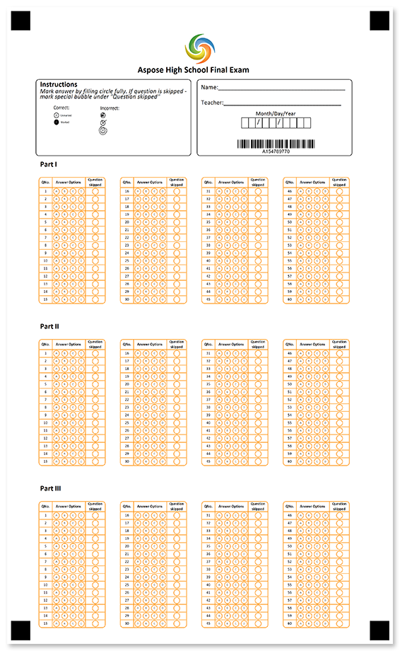
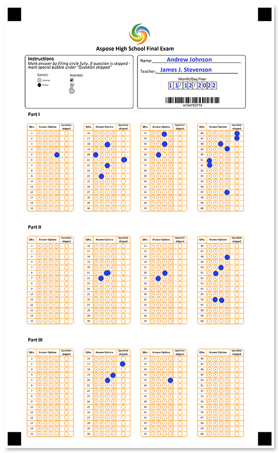

Single-page OMR ready answer sheet for any type of test, exam, quiz, assessment and the like. Ensure the student's identity with a barcode.



## Source code

<details>
<summary>Text markup</summary>

```
?image=logo.jpg
	align=center
	width=200
	height=200
?container=header
	columns_count=1
?block=text
	column=1
?content=Aspose High School Final Exam
	font_style=bold
	font_size=14
	align=center
&block
&container
?container=
	columns_count=2
	block_bottom_margin=0
	block_top_padding=0
?block=
	column=1
	border=rounded
?content=Instructions
	font_style=bold
	font_size=12
?content=Mark answer by filling circle fully. If question is skipped - mark special bubble under "Question skipped"
	font_style=italic
	font_size=10
?image=example.png
	width=700
	height=300
	align=left
&block
?block=
	column=2
	border=rounded
?empty_line=
	height=25
?content=Name:________________________________________
	font_size=10
?empty_line=
	height=50
?content=Teacher:_____________________________________
	font_size=10
?empty_line=
	height=25
?content=Month/Day/Year
	align=center
?content=  /  /    
	font_size=10
	align=left
	content_type=cells
	align=center
?barcode=test_id
	codetext=true
	value=15478977
	barcode_type=Code32
?empty_line=
	height=15
&block
&container
?empty_line=
	height=50
?text=Part I
	font_size=12
	font_style=bold
	align=left
?container=1
?block=2
?custom_answer_sheet=PartI
	border=rounded
	amount=60
	columns_count=4	
	row_proportions=20%-50%-30%
	border_color=DarkOrange
?header=123
?column=QNo.
	font_size=6
	font_style=bold
	align=center
?column=Answer Options
	font_size=6
	font_style=bold
	align=center
?column=Question skipped
	font_size=6
	font_style=bold
	align=center
&header
?custom_row=row_%index%
?content=%index%
	font_size=6
	align=center
?bubble_array=b_%index%
	answers_list=(A)(B)(C)(D)
	bubble_size=extrasmall
	font_size=4
?custom_trigger=trigger_to_skip_question
	trigger_type=replaceValue
	value=question skipped
	target=PartI_%index%
	bubble_size=extrasmall
&custom_row
&custom_answer_sheet
&block
&container
?empty_line=
	height=50
?text=Part II
	font_size=12
	font_style=bold
	align=left
?container=1
?block=2
?custom_answer_sheet=PartII
	border=rounded
	amount=60
	columns_count=4	
	row_proportions=20%-50%-30%
	border_color=DarkOrange
?header=123
?column=QNo.
	font_size=6
	font_style=bold
	align=center
?column=Answer Options
	font_size=6
	font_style=bold
	align=center
?column=Question skipped
	font_size=6
	font_style=bold
	align=center
&header
?custom_row=row_%index%
?content=%index%
	font_size=6
	align=center
?bubble_array=b_%index%
	answers_list=(A)(B)(C)(D)
	bubble_size=extrasmall
	font_size=4
?custom_trigger=trigger_to_skip_question
	trigger_type=replaceValue
	value=question skipped
	target=PartII_%index%
	bubble_size=extrasmall
&custom_row
&custom_answer_sheet
&block
&container
?empty_line=
	height=50
?text=Part III
	font_size=12
	font_style=bold
	align=left
?container=1
?block=2
?custom_answer_sheet=PartIII
	border=rounded
	amount=60
	columns_count=4	
	row_proportions=20%-50%-30%
	border_color=DarkOrange
?header=123
?column=QNo.
	font_size=6
	font_style=bold
	align=center
?column=Answer Options
	font_size=6
	font_style=bold
	align=center
?column=Question skipped
	font_size=6
	font_style=bold
	align=center
&header
?custom_row=row_%index%
?content=%index%
	font_size=6
	align=center
?bubble_array=b_%index%
	answers_list=(A)(B)(C)(D)
	bubble_size=extrasmall
	font_size=4
?custom_trigger=trigger_to_skip_question
	trigger_type=replaceValue
	value=question skipped
	target=PartIII_%index%
	bubble_size=extrasmall
&custom_row
&custom_answer_sheet
&block
&container
```

</details>

<details>
<summary>JSON markup</summary>

```json
{
  "name": null,
  "children": [
    {
      "name": null,
      "children": [
        {
          "align": "Center",
          "name": "logo.jpg",
          "image_path": null,
          "x": -1,
          "y": -1,
          "height": 200,
          "width": 200,
          "element_type": "Image"
        },
        {
          "name": "header",
          "children": [
            {
              "name": "text",
              "children": [
                {
                  "name": "Aspose High School Final Exam",
                  "font_family": "Calibri",
                  "font_style": "Bold",
                  "font_size": 14,
                  "content_type": "Normal",
                  "align": "Center",
                  "element_type": "Content"
                }
              ],
              "column": 1,
              "border": "None",
              "border_size": 3,
              "border_color": "Black",
              "is_clipped": false,
              "element_type": "Block"
            }
          ],
          "columns_count": 1,
          "columns_proportions": null,
          "container_type": "Normal",
          "block_right_margin": 40,
          "block_bottom_margin": 20,
          "block_top_padding": 20,
          "element_type": "Container"
        },
        {
          "name": "",
          "children": [
            {
              "name": "",
              "children": [
                {
                  "name": "Instructions",
                  "font_family": "Calibri",
                  "font_style": "Bold",
                  "font_size": 12,
                  "content_type": "Normal",
                  "align": "Left",
                  "element_type": "Content"
                },
                {
                  "name": "Mark answer by filling circle fully. If question is skipped - mark special bubble under \"Question skipped\"",
                  "font_family": "Calibri",
                  "font_style": "Italic",
                  "font_size": 10,
                  "content_type": "Normal",
                  "align": "Left",
                  "element_type": "Content"
                },
                {
                  "align": "Left",
                  "name": "example.png",
                  "image_path": null,
                  "x": -1,
                  "y": -1,
                  "height": 300,
                  "width": 700,
                  "element_type": "Image"
                }
              ],
              "column": 1,
              "border": "Rounded",
              "border_size": 3,
              "border_color": "Black",
              "is_clipped": false,
              "element_type": "Block"
            },
            {
              "name": "",
              "children": [
                {
                  "name": "",
                  "height": 25,
                  "element_type": "EmptyLine"
                },
                {
                  "name": "Name:________________________________________",
                  "font_family": "Calibri",
                  "font_style": "Regular",
                  "font_size": 10,
                  "content_type": "Normal",
                  "align": "Left",
                  "element_type": "Content"
                },
                {
                  "name": "",
                  "height": 50,
                  "element_type": "EmptyLine"
                },
                {
                  "name": "Teacher:_____________________________________",
                  "font_family": "Calibri",
                  "font_style": "Regular",
                  "font_size": 10,
                  "content_type": "Normal",
                  "align": "Left",
                  "element_type": "Content"
                },
                {
                  "name": "",
                  "height": 25,
                  "element_type": "EmptyLine"
                },
                {
                  "name": "Month/Day/Year",
                  "font_family": "Calibri",
                  "font_style": "Regular",
                  "font_size": 9,
                  "content_type": "Normal",
                  "align": "Center",
                  "element_type": "Content"
                },
                {
                  "name": "  /  /    ",
                  "font_family": "Calibri",
                  "font_style": "Regular",
                  "font_size": 10,
                  "content_type": "Cells",
                  "align": "Center",
                  "element_type": "Content"
                },
                {
                  "name": "test_id",
                  "value": "15478977",
                  "barcode_type": "Code32",
                  "qr_version": "Auto",
                  "align": "Center",
                  "height": -1,
                  "codetext": true,
                  "X": -1,
                  "Y": -1,
                  "element_type": "Barcode"
                },
                {
                  "name": "",
                  "height": 15,
                  "element_type": "EmptyLine"
                }
              ],
              "column": 2,
              "border": "Rounded",
              "border_size": 3,
              "border_color": "Black",
              "is_clipped": false,
              "element_type": "Block"
            }
          ],
          "columns_count": 2,
          "columns_proportions": null,
          "container_type": "Normal",
          "block_right_margin": 40,
          "block_bottom_margin": 0,
          "block_top_padding": 0,
          "element_type": "Container"
        },
        {
          "name": "",
          "height": 50,
          "element_type": "EmptyLine"
        },
        {
          "name": "Part I\r\n",
          "font_family": "Calibri",
          "font_style": "Bold",
          "font_size": 12,
          "align": "Left",
          "element_type": "Text"
        },
        {
          "name": "1",
          "children": [
            {
              "name": "2",
              "children": [
                {
                  "columns_count": 4,
                  "amount": 60,
                  "name": "PartI",
                  "border": "Rounded",
                  "border_size": 3,
                  "border_color": "DarkOrange",
                  "children": [
                    {
                      "font_family": "Calibri",
                      "font_style": "Regular",
                      "font_size": 9,
                      "name": "123",
                      "children": [
                        {
                          "name": "QNo.",
                          "font_family": "Calibri",
                          "font_style": "Bold",
                          "font_size": 6,
                          "content_type": "Normal",
                          "align": "Center",
                          "element_type": "Content"
                        },
                        {
                          "name": "Answer Options",
                          "font_family": "Calibri",
                          "font_style": "Bold",
                          "font_size": 6,
                          "content_type": "Normal",
                          "align": "Center",
                          "element_type": "Content"
                        },
                        {
                          "name": "Question skipped",
                          "font_family": "Calibri",
                          "font_style": "Bold",
                          "font_size": 6,
                          "content_type": "Normal",
                          "align": "Center",
                          "element_type": "Content"
                        }
                      ],
                      "element_type": "TableHeader"
                    },
                    {
                      "name": "row_%index%",
                      "children": [
                        {
                          "name": "%index%",
                          "font_family": "Calibri",
                          "font_style": "Regular",
                          "font_size": 6,
                          "content_type": "Normal",
                          "align": "Center",
                          "element_type": "Content"
                        },
                        {
                          "name": "b_%index%",
                          "answers_list": [
                            "A",
                            "B",
                            "C",
                            "D"
                          ],
                          "font_family": "Calibri",
                          "font_style": "Regular",
                          "font_size": 4,
                          "bubble_size": "Extrasmall",
                          "bubble_type": "Round",
                          "element_type": "BubbleArray"
                        },
                        {
                          "bubble_size": "Extrasmall",
                          "value": "question skipped",
                          "name": "trigger_to_skip_question",
                          "target": "PartI_%index%",
                          "bubble_type": "Round",
                          "trigger_type": "ReplaceValue",
                          "element_type": "CustomTrigger"
                        }
                      ],
                      "element_type": "CustomRow"
                    }
                  ],
                  "element_type": "CustomAnswerSheet",
                  "row_proportions": [
                    20,
                    50,
                    30
                  ]
                }
              ],
              "column": 1,
              "border": "None",
              "border_size": 3,
              "border_color": "Black",
              "is_clipped": false,
              "element_type": "Block"
            }
          ],
          "columns_count": 1,
          "columns_proportions": null,
          "container_type": "Normal",
          "block_right_margin": 40,
          "block_bottom_margin": 20,
          "block_top_padding": 20,
          "element_type": "Container"
        },
        {
          "name": "",
          "height": 50,
          "element_type": "EmptyLine"
        },
        {
          "name": "Part II\r\n",
          "font_family": "Calibri",
          "font_style": "Bold",
          "font_size": 12,
          "align": "Left",
          "element_type": "Text"
        },
        {
          "name": "1",
          "children": [
            {
              "name": "2",
              "children": [
                {
                  "columns_count": 4,
                  "amount": 60,
                  "name": "PartII",
                  "border": "Rounded",
                  "border_size": 3,
                  "border_color": "DarkOrange",
                  "children": [
                    {
                      "font_family": "Calibri",
                      "font_style": "Regular",
                      "font_size": 9,
                      "name": "123",
                      "children": [
                        {
                          "name": "QNo.",
                          "font_family": "Calibri",
                          "font_style": "Bold",
                          "font_size": 6,
                          "content_type": "Normal",
                          "align": "Center",
                          "element_type": "Content"
                        },
                        {
                          "name": "Answer Options",
                          "font_family": "Calibri",
                          "font_style": "Bold",
                          "font_size": 6,
                          "content_type": "Normal",
                          "align": "Center",
                          "element_type": "Content"
                        },
                        {
                          "name": "Question skipped",
                          "font_family": "Calibri",
                          "font_style": "Bold",
                          "font_size": 6,
                          "content_type": "Normal",
                          "align": "Center",
                          "element_type": "Content"
                        }
                      ],
                      "element_type": "TableHeader"
                    },
                    {
                      "name": "row_%index%",
                      "children": [
                        {
                          "name": "%index%",
                          "font_family": "Calibri",
                          "font_style": "Regular",
                          "font_size": 6,
                          "content_type": "Normal",
                          "align": "Center",
                          "element_type": "Content"
                        },
                        {
                          "name": "b_%index%",
                          "answers_list": [
                            "A",
                            "B",
                            "C",
                            "D"
                          ],
                          "font_family": "Calibri",
                          "font_style": "Regular",
                          "font_size": 4,
                          "bubble_size": "Extrasmall",
                          "bubble_type": "Round",
                          "element_type": "BubbleArray"
                        },
                        {
                          "bubble_size": "Extrasmall",
                          "value": "question skipped",
                          "name": "trigger_to_skip_question",
                          "target": "PartII_%index%",
                          "bubble_type": "Round",
                          "trigger_type": "ReplaceValue",
                          "element_type": "CustomTrigger"
                        }
                      ],
                      "element_type": "CustomRow"
                    }
                  ],
                  "element_type": "CustomAnswerSheet",
                  "row_proportions": [
                    20,
                    50,
                    30
                  ]
                }
              ],
              "column": 1,
              "border": "None",
              "border_size": 3,
              "border_color": "Black",
              "is_clipped": false,
              "element_type": "Block"
            }
          ],
          "columns_count": 1,
          "columns_proportions": null,
          "container_type": "Normal",
          "block_right_margin": 40,
          "block_bottom_margin": 20,
          "block_top_padding": 20,
          "element_type": "Container"
        },
        {
          "name": "",
          "height": 50,
          "element_type": "EmptyLine"
        },
        {
          "name": "Part III\r\n",
          "font_family": "Calibri",
          "font_style": "Bold",
          "font_size": 12,
          "align": "Left",
          "element_type": "Text"
        },
        {
          "name": "1",
          "children": [
            {
              "name": "2",
              "children": [
                {
                  "columns_count": 4,
                  "amount": 60,
                  "name": "PartIII",
                  "border": "Rounded",
                  "border_size": 3,
                  "border_color": "DarkOrange",
                  "children": [
                    {
                      "font_family": "Calibri",
                      "font_style": "Regular",
                      "font_size": 9,
                      "name": "123",
                      "children": [
                        {
                          "name": "QNo.",
                          "font_family": "Calibri",
                          "font_style": "Bold",
                          "font_size": 6,
                          "content_type": "Normal",
                          "align": "Center",
                          "element_type": "Content"
                        },
                        {
                          "name": "Answer Options",
                          "font_family": "Calibri",
                          "font_style": "Bold",
                          "font_size": 6,
                          "content_type": "Normal",
                          "align": "Center",
                          "element_type": "Content"
                        },
                        {
                          "name": "Question skipped",
                          "font_family": "Calibri",
                          "font_style": "Bold",
                          "font_size": 6,
                          "content_type": "Normal",
                          "align": "Center",
                          "element_type": "Content"
                        }
                      ],
                      "element_type": "TableHeader"
                    },
                    {
                      "name": "row_%index%",
                      "children": [
                        {
                          "name": "%index%",
                          "font_family": "Calibri",
                          "font_style": "Regular",
                          "font_size": 6,
                          "content_type": "Normal",
                          "align": "Center",
                          "element_type": "Content"
                        },
                        {
                          "name": "b_%index%",
                          "answers_list": [
                            "A",
                            "B",
                            "C",
                            "D"
                          ],
                          "font_family": "Calibri",
                          "font_style": "Regular",
                          "font_size": 4,
                          "bubble_size": "Extrasmall",
                          "bubble_type": "Round",
                          "element_type": "BubbleArray"
                        },
                        {
                          "bubble_size": "Extrasmall",
                          "value": "question skipped",
                          "name": "trigger_to_skip_question",
                          "target": "PartIII_%index%",
                          "bubble_type": "Round",
                          "trigger_type": "ReplaceValue",
                          "element_type": "CustomTrigger"
                        }
                      ],
                      "element_type": "CustomRow"
                    }
                  ],
                  "element_type": "CustomAnswerSheet",
                  "row_proportions": [
                    20,
                    50,
                    30
                  ]
                }
              ],
              "column": 1,
              "border": "None",
              "border_size": 3,
              "border_color": "Black",
              "is_clipped": false,
              "element_type": "Block"
            }
          ],
          "columns_count": 1,
          "columns_proportions": null,
          "container_type": "Normal",
          "block_right_margin": 40,
          "block_bottom_margin": 20,
          "block_top_padding": 20,
          "element_type": "Container"
        }
      ],
      "element_type": "Page"
    }
  ],
  "element_type": "Template"
}
```

</details>

## Page settings

This template was generated using the following paper size, orientation, font, and other [layout settings](/omr/net/generate-template/page-setup/):

```csharp
GlobalPageSettings settings = new GlobalPageSettings
{
    PaperSize = PaperSize.Legal,
    Orientation = Orientation.Vertical,
    BubbleColor = Color.DarkOrange,
    BubbleSize = BubbleSize.Large,
    FontStyle = FontStyle.Regular,
    FontSize = 9,
    FontFamily = "Calibri",
};
```

## Recognition results



```
Element Name,Value,
PartI_1,""
PartI_2,""
PartI_3,""
PartI_4,""
PartI_5,"D"
PartI_6,""
PartI_7,""
PartI_8,""
PartI_9,""
PartI_10,""
PartI_11,""
PartI_12,""
PartI_13,""
PartI_14,""
PartI_15,""
PartI_16,""
PartI_17,""
PartI_18,"C"
PartI_19,""
PartI_20,"A"
PartI_21,"question skipped"
PartI_22,"C"
PartI_23,""
PartI_24,"B"
PartI_25,""
PartI_26,""
PartI_27,""
PartI_28,""
PartI_29,""
PartI_30,""
PartI_31,"C"
PartI_32,""
PartI_33,"C"
PartI_34,""
PartI_35,"B"
PartI_36,""
PartI_37,""
PartI_38,""
PartI_39,""
PartI_40,""
PartI_41,""
PartI_42,""
PartI_43,""
PartI_44,""
PartI_45,""
PartI_46,"question skipped"
PartI_47,"question skipped"
PartI_48,"C"
PartI_49,"D"
PartI_50,""
PartI_51,"A"
PartI_52,"A"
PartI_53,""
PartI_54,""
PartI_55,""
PartI_56,""
PartI_57,"D"
PartI_58,""
PartI_59,""
PartI_60,""
PartII_1,""
PartII_2,""
PartII_3,""
PartII_4,""
PartII_5,""
PartII_6,""
PartII_7,""
PartII_8,""
PartII_9,""
PartII_10,""
PartII_11,""
PartII_12,""
PartII_13,""
PartII_14,""
PartII_15,""
PartII_16,""
PartII_17,""
PartII_18,""
PartII_19,""
PartII_20,""
PartII_21,"C"
PartII_22,"B"
PartII_23,""
PartII_24,""
PartII_25,""
PartII_26,""
PartII_27,""
PartII_28,""
PartII_29,""
PartII_30,""
PartII_31,""
PartII_32,""
PartII_33,""
PartII_34,""
PartII_35,""
PartII_36,"C"
PartII_37,"B"
PartII_38,""
PartII_39,""
PartII_40,""
PartII_41,""
PartII_42,""
PartII_43,""
PartII_44,""
PartII_45,""
PartII_46,""
PartII_47,""
PartII_48,"D"
PartII_49,""
PartII_50,"C"
PartII_51,"B"
PartII_52,""
PartII_53,""
PartII_54,""
PartII_55,""
PartII_56,"B,C"
PartII_57,""
PartII_58,""
PartII_59,""
PartII_60,""
PartIII_1,""
PartIII_2,""
PartIII_3,""
PartIII_4,""
PartIII_5,""
PartIII_6,""
PartIII_7,""
PartIII_8,""
PartIII_9,""
PartIII_10,""
PartIII_11,""
PartIII_12,""
PartIII_13,""
PartIII_14,""
PartIII_15,""
PartIII_16,""
PartIII_17,"question skipped"
PartIII_18,""
PartIII_19,"D"
PartIII_20,"C"
PartIII_21,""
PartIII_22,""
PartIII_23,""
PartIII_24,""
PartIII_25,""
PartIII_26,""
PartIII_27,""
PartIII_28,""
PartIII_29,""
PartIII_30,""
PartIII_31,""
PartIII_32,""
PartIII_33,""
PartIII_34,""
PartIII_35,"D"
PartIII_36,""
PartIII_37,""
PartIII_38,""
PartIII_39,""
PartIII_40,""
PartIII_41,""
PartIII_42,""
PartIII_43,""
PartIII_44,""
PartIII_45,""
PartIII_46,""
PartIII_47,""
PartIII_48,""
PartIII_49,""
PartIII_50,""
PartIII_51,""
PartIII_52,""
PartIII_53,""
PartIII_54,""
PartIII_55,""
PartIII_56,""
PartIII_57,""
PartIII_58,""
PartIII_59,""
PartIII_60,""
test_id,"154789770"
```

## Download

[Click here](https://github.com/aspose-omr/Aspose.OMR-Documentation/blob/master/net/showcases/download/exam-grouped.zip) to download full template sources and related files. 

**Package structure:**

File | Description
---- | -----------
**example.png** | "how to fill" guidelines
**final-exam.csv** | recognition results based on the filled form available in this package
**final-exam.json** | source code in [JSON markup](/omr/net/json-markup/)
**final-exam.omr** | recognition pattern
**final-exam.png** | printable form
**final-exam.txt** | source code in [text markup](/omr/net/txt-markup/)
**final-exam-recognized.png** | filled form
**logo.jpg** | company logo
**settings.json** | [page settings](/omr/net/generate-template/page-setup/)
