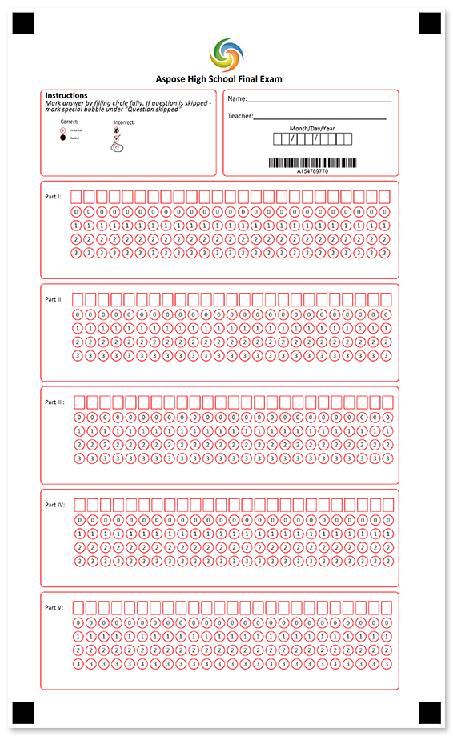
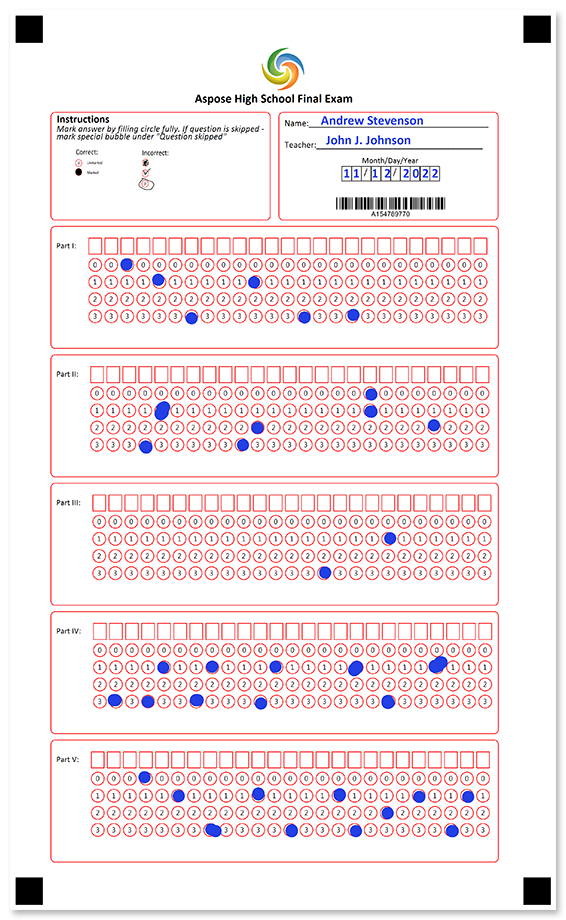

Single-page OMR ready answer sheet for any type of test, exam, quiz, assessment and the like. Ensure the student's identity with a barcode.



## Source code

<details>
<summary>Text markup</summary>

```
?image=logo.jpg
	align=center
	width=200
	height=200
?container=header
	columns_count=1
?block=text
	column=1
?content=Aspose High School Final-exam
	font_style=bold
	font_size=14
	align=center
&block
&container
?container=
	columns_count=2
	block_bottom_margin=0
	block_top_padding=0
?block=
	column=1
	border=rounded
	border_color=Red
?content=Instructions
	font_style=bold
	font_size=12
?content=Mark answer by filling circle fully. If question is skipped - mark special bubble under "Question skipped"
	font_style=italic
	font_size=10
?image=example.png
	width=700
	height=300
	align=left
?empty_line=
	height=365
&block
?block=
	column=2
	border=rounded
	border_color=Red
?empty_line=
	height=25
?content=Name:________________________________________
	font_size=10
?empty_line=
	height=50
?content=Teacher:_____________________________________
	font_size=10
?empty_line=
	height=25
?content=Month/Day/Year
	align=center
?content=  /  /    
	font_size=10
	align=left
	content_type=cells
	align=center
?empty_line=
	height=50
?barcode=test_id
	codetext=true
	value=15478977
	barcode_type=Code32
&block
&container
?empty_line=
	height=50
?container=
	columns_count=1
?block=
	column=1
	border=rounded
	border_color=Red
?empty_line=
	height=50
?grid=Part I
	column=1
	x=190
	header_type=square
	sections_count=25
	options_count=4
	header_border_color=red
?empty_line=
	height=50
&block
?block=
	column=1
	border=rounded
	border_color=Red
?empty_line=
	height=50
?grid=Part II
	column=1
	x=190
	header_type=square
	sections_count=25
	options_count=4
	header_border_color=red
?empty_line=
	height=50
&block
?block=
	column=1
	border=rounded
	border_color=Red
?empty_line=
	height=50
?grid=Part III
	column=1
	x=190
	header_type=square
	sections_count=25
	options_count=4
	header_border_color=red
?empty_line=
	height=50
&block
?block=
	column=1
	border=rounded
	border_color=Red
?empty_line=
	height=50
?grid=Part IV
	column=1
	x=190
	header_type=square
	sections_count=25
	options_count=4
	header_border_color=red
?empty_line=
	height=50
&block
?block=
	column=1
	border=rounded
	border_color=Red
?empty_line=
	height=50
?grid=Part V
	column=1
	x=190
	header_type=square
	sections_count=25
	options_count=4
	header_border_color=red
?empty_line=
	height=50
&block
&container
```

</details>

<details>
<summary>JSON markup</summary>

```json
{
    "children": [{
            "children": [{
                    "align": "Center",
                    "name": "logo.jpg",
                    "height": 200,
                    "width": 200,
                    "element_type": "Image"
                }, {
                    "name": "header",
                    "children": [{
                            "name": "text",
                            "children": [{
                                    "name": "Aspose High School Final-exam",
                                    "font_style": "Bold",
                                    "font_size": 14,
                                    "align": "Center",
                                    "element_type": "Content"
                                }
                            ],
                            "column": 1,
                            "element_type": "Block"
                        }
                    ],
                    "columns_count": 1,
                    "container_type": "Normal",
                    "element_type": "Container"
                }, {
                    "children": [{
                            "children": [{
                                    "name": "Instructions",
                                    "font_style": "Bold",
                                    "font_size": 12,
                                    "align": "Left",
                                    "element_type": "Content"
                                }, {
                                    "name": "Mark answer by filling circle fully. If question is skipped - mark special bubble under \"Question skipped\"",
                                    "font_style": "Italic",
                                    "font_size": 10,
                                    "align": "Left",
                                    "element_type": "Content"
                                }, {
                                    "align": "Left",
                                    "name": "example.png",
                                    "height": 300,
                                    "width": 700,
                                    "element_type": "Image"
                                }, {
                                    "height": 365,
                                    "element_type": "EmptyLine"
                                }
                            ],
                            "column": 1,
                            "border": "Rounded",
                            "border_color": "Red",
                            "element_type": "Block"
                        }, {
                            "children": [{
                                    "height": 25,
                                    "element_type": "EmptyLine"
                                }, {
                                    "name": "Name:________________________________________",
                                    "font_size": 10,
                                    "align": "Left",
                                    "element_type": "Content"
                                }, {
                                    "height": 50,
                                    "element_type": "EmptyLine"
                                }, {
                                    "name": "Teacher:_____________________________________",
                                    "font_size": 10,
                                    "align": "Left",
                                    "element_type": "Content"
                                }, {
                                    "height": 25,
                                    "element_type": "EmptyLine"
                                }, {
                                    "name": "Month/Day/Year",
                                    "align": "Center",
                                    "element_type": "Content"
                                }, {
                                    "name": "  /  /    ",
                                    "font_size": 10,
                                    "content_type": "Cells",
                                    "align": "Center",
                                    "element_type": "Content"
                                }, {
                                    "height": 50,
                                    "element_type": "EmptyLine"
                                }, {
                                    "name": "test_id",
                                    "value": "15478977",
                                    "barcode_type": "code32",
                                    "align": "Center",
                                    "codetext": true,
                                    "element_type": "Barcode"
                                }
                            ],
                            "column": 2,
                            "border": "Rounded",
                            "border_color": "Red",
                            "element_type": "Block"
                        }
                    ],
                    "columns_count": 2,
                    "container_type": "Normal",
                    "block_bottom_margin": 0,
                    "block_top_padding": 0,
                    "element_type": "Container"
                }, {
                    "height": 50,
                    "element_type": "EmptyLine"
                }, {
                    "children": [{
                            "children": [{
                                    "height": 50,
                                    "element_type": "EmptyLine"
                                }, {
                                    "bubble_size": "undefined",
                                    "name": "Part I",
                                    "column": 1,
                                    "sections_count": 25,
                                    "options_count": 4,
                                    "align": "Left",
                                    "header_type": "Square",
                                    "header_border_size": 3,
                                    "header_border_color": "Red",
                                    "orientation": "Horizontal",
                                    "x": 190,
                                    "element_type": "Grid"
                                }, {
                                    "height": 50,
                                    "element_type": "EmptyLine"
                                }
                            ],
                            "column": 1,
                            "border": "Rounded",
                            "border_color": "Red",
                            "element_type": "Block"
                        }, {
                            "children": [{
                                    "height": 50,
                                    "element_type": "EmptyLine"
                                }, {
                                    "bubble_size": "undefined",
                                    "name": "Part II",
                                    "column": 1,
                                    "sections_count": 25,
                                    "options_count": 4,
                                    "align": "Left",
                                    "header_type": "Square",
                                    "header_border_size": 3,
                                    "header_border_color": "Red",
                                    "orientation": "Horizontal",
                                    "x": 190,
                                    "element_type": "Grid"
                                }, {
                                    "height": 50,
                                    "element_type": "EmptyLine"
                                }
                            ],
                            "column": 1,
                            "border": "Rounded",
                            "border_color": "Red",
                            "element_type": "Block"
                        }, {
                            "children": [{
                                    "height": 50,
                                    "element_type": "EmptyLine"
                                }, {
                                    "bubble_size": "undefined",
                                    "name": "Part III",
                                    "column": 1,
                                    "sections_count": 25,
                                    "options_count": 4,
                                    "align": "Left",
                                    "header_type": "Square",
                                    "header_border_size": 3,
                                    "header_border_color": "Red",
                                    "orientation": "Horizontal",
                                    "x": 190,
                                    "element_type": "Grid"
                                }, {
                                    "height": 50,
                                    "element_type": "EmptyLine"
                                }
                            ],
                            "column": 1,
                            "border": "Rounded",
                            "border_color": "Red",
                            "element_type": "Block"
                        }, {
                            "children": [{
                                    "height": 50,
                                    "element_type": "EmptyLine"
                                }, {
                                    "bubble_size": "undefined",
                                    "name": "Part IV",
                                    "column": 1,
                                    "sections_count": 25,
                                    "options_count": 4,
                                    "align": "Left",
                                    "header_type": "Square",
                                    "header_border_size": 3,
                                    "header_border_color": "Red",
                                    "orientation": "Horizontal",
                                    "x": 190,
                                    "element_type": "Grid"
                                }, {
                                    "height": 50,
                                    "element_type": "EmptyLine"
                                }
                            ],
                            "column": 1,
                            "border": "Rounded",
                            "border_color": "Red",
                            "element_type": "Block"
                        }, {
                            "children": [{
                                    "height": 50,
                                    "element_type": "EmptyLine"
                                }, {
                                    "bubble_size": "undefined",
                                    "name": "Part V",
                                    "column": 1,
                                    "sections_count": 25,
                                    "options_count": 4,
                                    "align": "Left",
                                    "header_type": "Square",
                                    "header_border_size": 3,
                                    "header_border_color": "Red",
                                    "orientation": "Horizontal",
                                    "x": 190,
                                    "element_type": "Grid"
                                }, {
                                    "height": 50,
                                    "element_type": "EmptyLine"
                                }
                            ],
                            "column": 1,
                            "border": "Rounded",
                            "border_color": "Red",
                            "element_type": "Block"
                        }
                    ],
                    "columns_count": 1,
                    "container_type": "Normal",
                    "element_type": "Container"
                }
            ],
            "element_type": "Page"
        }
    ],
    "element_type": "Template"
}
```

</details>

## Page settings

This template was generated using the following paper size, orientation, font, and other [layout settings](/omr/net/generate-template/page-setup/):

```csharp
GlobalPageSettings settings = new GlobalPageSettings
{
    PaperSize = PaperSize.Legal,
    Orientation = Orientation.Vertical,
    BubbleColor = Color.Red,
    BubbleSize = BubbleSize.Large,
    FontStyle = FontStyle.Regular,
    FontSize = 9,
    FontFamily = "Calibri",
};
```

## Recognition results



```
Element Name,Value,
Part I,"013133"
Part II,"31320,12"
Part III,"31"
Part IV,"3313131131"
Part V,"01313132131"
test_id,"154789770"
```

## Download

[Click here](https://github.com/aspose-omr/Aspose.OMR-Documentation/blob/master/net/showcases/download/exam-multipart.zip) to download full template sources and related files. 

**Package structure:**

File | Description
---- | -----------
**example.png** | "how to fill" guidelines
**final-exam.csv** | recognition results based on the filled form available in this package
**final-exam.json** | source code in [JSON markup](/omr/net/json-markup/)
**final-exam.omr** | recognition pattern
**final-exam.png** | printable form
**final-exam.txt** | source code in [text markup](/omr/net/txt-markup/)
**final-exam-recognized.png** | filled form
**logo.jpg** | company logo
**settings.txt** | [page settings](/omr/net/generate-template/page-setup/)
