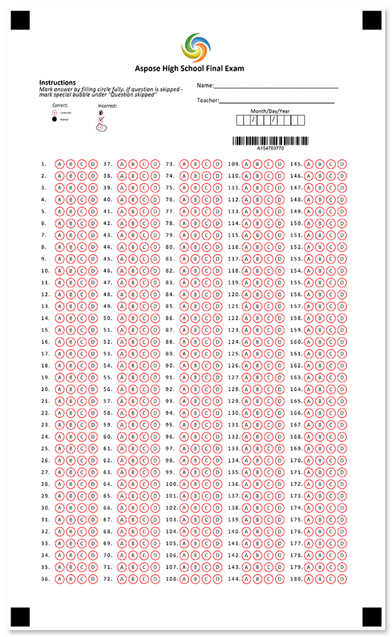
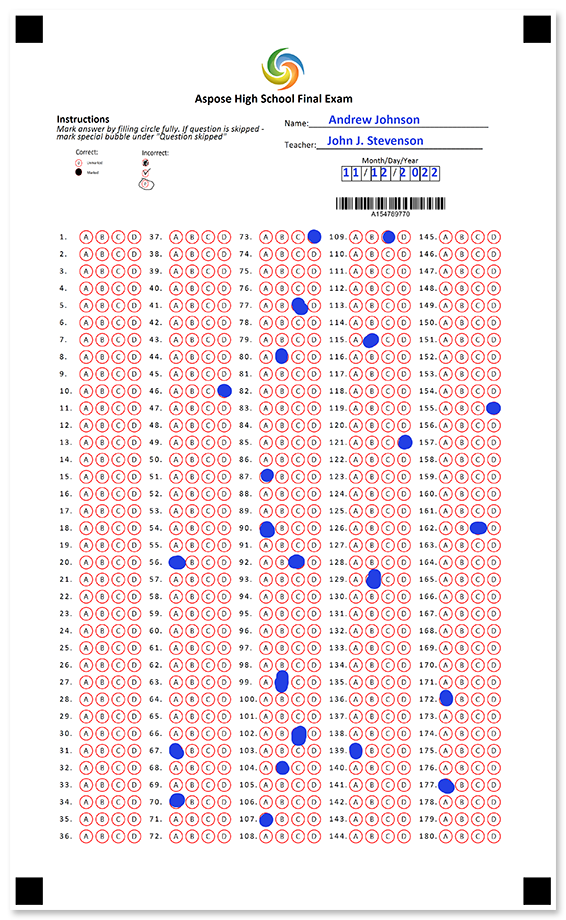

Single-page OMR ready answer sheet for any type of test, exam, quiz, assessment and the like. Ensure the student's identity with a barcode.



## Source code

<details>
<summary>Text markup</summary>

```
?image=logo.jpg
	align=center
	width=200
	height=200
?container=header
	columns_count=1
?block=text
	column=1
?content=Aspose High School Final Exam
	font_style=bold
	font_size=14
	align=center
&block
&container
?container=
	columns_count=2
	block_bottom_margin=0
	block_top_padding=0
?block=
	column=1
?content=Instructions
	font_style=bold
	font_size=12
?content=Mark answer by filling circle fully. If question is skipped - mark special bubble under "Question skipped"
	font_style=italic
	font_size=10
?image=example.png
	width=700
	height=300
	align=left
&block
?block=
	column=2
?empty_line=
	height=25
?content=Name:________________________________________
	font_size=10
?empty_line=
	height=50
?content=Teacher:_____________________________________
	font_size=10
?empty_line=
	height=25
?content=Month/Day/Year
	align=center
?content=  /  /    
	font_size=10
	align=left
	content_type=cells
	align=center
?empty_line=
	height=50
?barcode=test_id
	codetext=true
	value=15478977
	barcode_type=Code32
&block
&container
?empty_line=
	height=50
?answer_sheet=PartI
	elements_count=180
	columns_count=5
```

</details>

<details>
<summary>JSON markup</summary>

```json
{
  "name": null,
  "children": [
    {
      "name": null,
      "children": [
        {
          "align": "Center",
          "name": "logo.jpg",
          "image_path": null,
          "x": -1,
          "y": -1,
          "height": 200,
          "width": 200,
          "element_type": "Image"
        },
        {
          "name": "header",
          "children": [
            {
              "name": "text",
              "children": [
                {
                  "name": "Aspose High School Final Exam",
                  "font_family": "Calibri",
                  "font_style": "Bold",
                  "font_size": 14,
                  "content_type": "Normal",
                  "align": "Center",
                  "element_type": "Content"
                }
              ],
              "column": 1,
              "border": "None",
              "border_size": 3,
              "border_color": "Black",
              "is_clipped": false,
              "element_type": "Block"
            }
          ],
          "columns_count": 1,
          "columns_proportions": null,
          "container_type": "Normal",
          "block_right_margin": 40,
          "block_bottom_margin": 20,
          "block_top_padding": 20,
          "element_type": "Container"
        },
        {
          "name": "",
          "children": [
            {
              "name": "",
              "children": [
                {
                  "name": "Instructions",
                  "font_family": "Calibri",
                  "font_style": "Bold",
                  "font_size": 12,
                  "content_type": "Normal",
                  "align": "Left",
                  "element_type": "Content"
                },
                {
                  "name": "Mark answer by filling circle fully. If question is skipped - mark special bubble under \"Question skipped\"",
                  "font_family": "Calibri",
                  "font_style": "Italic",
                  "font_size": 10,
                  "content_type": "Normal",
                  "align": "Left",
                  "element_type": "Content"
                },
                {
                  "align": "Left",
                  "name": "example.png",
                  "image_path": null,
                  "x": -1,
                  "y": -1,
                  "height": 300,
                  "width": 700,
                  "element_type": "Image"
                }
              ],
              "column": 1,
              "border": "None",
              "border_size": 3,
              "border_color": "Black",
              "is_clipped": false,
              "element_type": "Block"
            },
            {
              "name": "",
              "children": [
                {
                  "name": "",
                  "height": 25,
                  "element_type": "EmptyLine"
                },
                {
                  "name": "Name:________________________________________",
                  "font_family": "Calibri",
                  "font_style": "Regular",
                  "font_size": 10,
                  "content_type": "Normal",
                  "align": "Left",
                  "element_type": "Content"
                },
                {
                  "name": "",
                  "height": 50,
                  "element_type": "EmptyLine"
                },
                {
                  "name": "Teacher:_____________________________________",
                  "font_family": "Calibri",
                  "font_style": "Regular",
                  "font_size": 10,
                  "content_type": "Normal",
                  "align": "Left",
                  "element_type": "Content"
                },
                {
                  "name": "",
                  "height": 25,
                  "element_type": "EmptyLine"
                },
                {
                  "name": "Month/Day/Year",
                  "font_family": "Calibri",
                  "font_style": "Regular",
                  "font_size": 9,
                  "content_type": "Normal",
                  "align": "Center",
                  "element_type": "Content"
                },
                {
                  "name": "  /  /    ",
                  "font_family": "Calibri",
                  "font_style": "Regular",
                  "font_size": 10,
                  "content_type": "Cells",
                  "align": "Center",
                  "element_type": "Content"
                },
                {
                  "name": "",
                  "height": 50,
                  "element_type": "EmptyLine"
                },
                {
                  "name": "test_id",
                  "value": "15478977",
                  "barcode_type": "Code32",
                  "qr_version": "Auto",
                  "align": "Center",
                  "height": -1,
                  "codetext": true,
                  "X": -1,
                  "Y": -1,
                  "element_type": "Barcode"
                }
              ],
              "column": 2,
              "border": "None",
              "border_size": 3,
              "border_color": "Black",
              "is_clipped": false,
              "element_type": "Block"
            }
          ],
          "columns_count": 2,
          "columns_proportions": null,
          "container_type": "Normal",
          "block_right_margin": 40,
          "block_bottom_margin": 0,
          "block_top_padding": 0,
          "element_type": "Container"
        },
        {
          "name": "",
          "height": 50,
          "element_type": "EmptyLine"
        },
        {
          "bubble_size": "Normal",
          "name": "PartI",
          "column": 0,
          "elements_count": 180,
          "columns_count": 5,
          "answers_count": 4,
          "start_id": -1,
          "vertical_margin": 0,
          "bubble_type": "Round",
          "answers_list": null,
          "element_type": "AnswerSheet"
        }
      ],
      "element_type": "Page"
    }
  ],
  "element_type": "Template"
}
```

</details>

## Page settings

This template was generated using the following paper size, orientation, font, and other [layout settings](/omr/net/generate-template/page-setup/):

```csharp
GlobalPageSettings settings = new GlobalPageSettings
{
    PaperSize = PaperSize.Legal,
    Orientation = Orientation.Vertical,
    BubbleColor = Color.Red,
    BubbleSize = BubbleSize.Normal,
    FontStyle = FontStyle.Regular,
    FontSize = 9,
    FontFamily = "Calibri",
};
```

## Recognition results



```
Element Name,Value,
PartI1,""
PartI2,""
PartI3,""
PartI4,""
PartI5,""
PartI6,""
PartI7,""
PartI8,""
PartI9,""
PartI10,""
PartI11,""
PartI12,""
PartI13,""
PartI14,""
PartI15,""
PartI16,""
PartI17,""
PartI18,""
PartI19,""
PartI20,""
PartI21,""
PartI22,""
PartI23,""
PartI24,""
PartI25,""
PartI26,""
PartI27,""
PartI28,""
PartI29,""
PartI30,""
PartI31,""
PartI32,""
PartI33,""
PartI34,""
PartI35,""
PartI36,""
PartI37,""
PartI38,""
PartI39,""
PartI40,""
PartI41,""
PartI42,""
PartI43,""
PartI44,""
PartI45,""
PartI46,"D"
PartI47,""
PartI48,""
PartI49,""
PartI50,""
PartI51,""
PartI52,""
PartI53,""
PartI54,""
PartI55,""
PartI56,"A"
PartI57,""
PartI58,""
PartI59,""
PartI60,""
PartI61,""
PartI62,""
PartI63,""
PartI64,""
PartI65,""
PartI66,""
PartI67,"A"
PartI68,""
PartI69,""
PartI70,"A"
PartI71,""
PartI72,""
PartI73,"D"
PartI74,""
PartI75,""
PartI76,""
PartI77,"C"
PartI78,""
PartI79,""
PartI80,"B"
PartI81,""
PartI82,""
PartI83,""
PartI84,""
PartI85,""
PartI86,""
PartI87,"A"
PartI88,""
PartI89,""
PartI90,"A"
PartI91,""
PartI92,"C"
PartI93,""
PartI94,""
PartI95,""
PartI96,""
PartI97,""
PartI98,""
PartI99,"B"
PartI100,""
PartI101,""
PartI102,"C"
PartI103,""
PartI104,"B"
PartI105,""
PartI106,""
PartI107,"A"
PartI108,""
PartI109,"C"
PartI110,""
PartI111,""
PartI112,""
PartI113,""
PartI114,""
PartI115,"B"
PartI116,""
PartI117,""
PartI118,""
PartI119,""
PartI120,""
PartI121,"D"
PartI122,""
PartI123,""
PartI124,""
PartI125,""
PartI126,""
PartI127,""
PartI128,""
PartI129,"B"
PartI130,""
PartI131,""
PartI132,""
PartI133,""
PartI134,""
PartI135,""
PartI136,""
PartI137,""
PartI138,""
PartI139,"A"
PartI140,""
PartI141,""
PartI142,""
PartI143,""
PartI144,""
PartI145,""
PartI146,""
PartI147,""
PartI148,""
PartI149,""
PartI150,""
PartI151,""
PartI152,""
PartI153,""
PartI154,""
PartI155,"D"
PartI156,""
PartI157,""
PartI158,""
PartI159,""
PartI160,""
PartI161,""
PartI162,"C"
PartI163,""
PartI164,""
PartI165,""
PartI166,""
PartI167,""
PartI168,""
PartI169,""
PartI170,""
PartI171,""
PartI172,"A"
PartI173,""
PartI174,""
PartI175,""
PartI176,""
PartI177,"A"
PartI178,""
PartI179,""
PartI180,""
test_id,"154789770"
```

## Download

[Click here](https://github.com/aspose-omr/Aspose.OMR-Documentation/blob/master/net/showcases/download/exam-plain.zip) to download full template sources and related files. 

**Package structure:**

File | Description
---- | -----------
**example.png** | "how to fill" guidelines
**final-exam.csv** | recognition results based on the filled form available in this package
**final-exam.json** | source code in [JSON markup](/omr/net/json-markup/)
**final-exam.omr** | recognition pattern
**final-exam.png** | printable form
**final-exam.txt** | source code in [text markup](/omr/net/txt-markup/)
**final-exam-recognized.png** | filled form
**logo.jpg** | company logo
**settings.json** | [page settings](/omr/net/generate-template/page-setup/)
