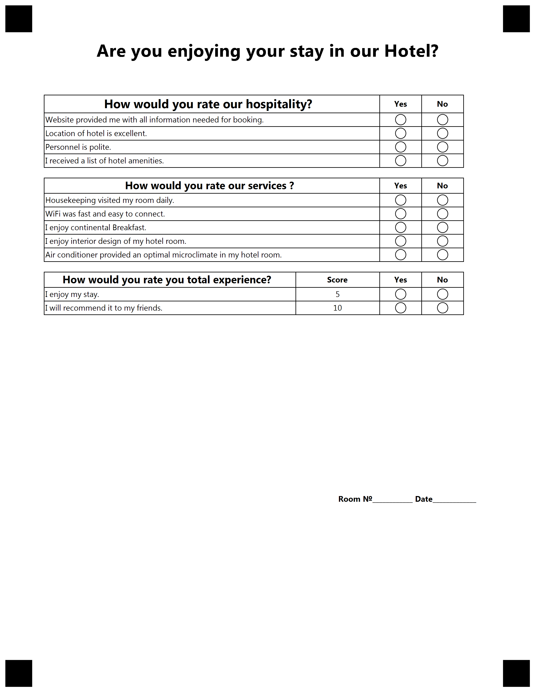

{} 

This example constructed for custom GlobalPageSettings. Please use provided settings from text below for best result.

{}


**Template generation call**

<details>
<summary>C# Code</summary>

````java
var license = new License();
license.SetLicense(@"C:\Users\User\Desktop\Aspose.license");

var engine = new OmrEngine();
var settings = new GlobalPageSettings
{
	PaperSize = PaperSize.Letter,
	Orientation = Orientation.Vertical,
	BubbleColor = Color.Black,
	BubbleSize = BubbleSize.Small,
	FontStyle = FontStyle.Regular,
	FontSize = 9,
	FontFamily = "Segoe UI",
	ImagesPaths = images
};
var configPath = @"C:\Users\User\Desktop\template\template.json";

var result = engine.GenerateJSONTemplate(configPath, settings);
result.Save(@"C:\Users\User\Desktop\template", "generated_template");
````

</details>


**Template JSON markdown**

<details>
<summary>JSON markdown</summary>

```json
{
  "name": null,
  "children": [
    {
      "name": null,
      "children": [
        {
          "name": "Are you enjoying your stay in our Hotel?\r\n",
          "font_family": "Segoe UI",
          "font_style": "Bold",
          "font_size": 20,
          "align": "Center",
          "element_type": "Text"
        },
        {
          "name": null,
          "height": 0,
          "element_type": "EmptyLine"
        },
        {
          "name": null,
          "height": 0,
          "element_type": "EmptyLine"
        },
        {
          "name": "main_container",
          "children": [
            {
              "name": "main_block",
              "children": [
                {
                  "name": "hotel guest survey",
                  "children": [
                    {
                      "font_family": "Segoe UI",
                      "font_style": "Bold",
                      "font_size": 14,
                      "row_proportions": [
                        80,
                        10,
                        10
                      ],
                      "score_display": "DontDisplay",
                      "name": "How would you rate our hospitality?",
                      "children": [
                        {
                          "Score": 0,
                          "name": "Yes",
                          "header_type": "Positive",
                          "element_type": "ScoreHeader",
                          "font_family": "Segoe UI",
                          "font_style": "Bold",
                          "font_size": 9,
                          "content_type": "Normal",
                          "align": "Center"
                        },
                        {
                          "Score": 0,
                          "name": "No",
                          "header_type": "Negative",
                          "element_type": "ScoreHeader",
                          "font_family": "Segoe UI",
                          "font_style": "Bold",
                          "font_size": 9,
                          "content_type": "Normal",
                          "align": "Center"
                        },
                        {
                          "Score": 1,
                          "element_type": "ScoreAnswer",
                          "name": "Website provided me with all information needed for booking.",
                          "font_family": "Segoe UI",
                          "font_style": "Regular",
                          "font_size": 9,
                          "content_type": "Normal",
                          "align": "Left"
                        },
                        {
                          "Score": 1,
                          "element_type": "ScoreAnswer",
                          "name": "Location of hotel is excellent.",
                          "font_family": "Segoe UI",
                          "font_style": "Regular",
                          "font_size": 9,
                          "content_type": "Normal",
                          "align": "Left"
                        },
                        {
                          "Score": 5,
                          "element_type": "ScoreAnswer",
                          "name": "Personnel is polite.",
                          "font_family": "Segoe UI",
                          "font_style": "Regular",
                          "font_size": 9,
                          "content_type": "Normal",
                          "align": "Left"
                        },
                        {
                          "Score": 1,
                          "element_type": "ScoreAnswer",
                          "name": "I received a list of hotel amenities.",
                          "font_family": "Segoe UI",
                          "font_style": "Regular",
                          "font_size": 9,
                          "content_type": "Normal",
                          "align": "Left"
                        }
                      ],
                      "element_type": "ScoreQuestion"
                    },
                    {
                      "font_family": "Segoe UI",
                      "font_style": "Bold",
                      "font_size": 12,
                      "row_proportions": [
                        80,
                        10,
                        10
                      ],
                      "score_display": "DontDisplay",
                      "name": "How would you rate our services ?",
                      "children": [
                        {
                          "Score": 0,
                          "name": "Yes",
                          "header_type": "Positive",
                          "element_type": "ScoreHeader",
                          "font_family": "Segoe UI",
                          "font_style": "Bold",
                          "font_size": 9,
                          "content_type": "Normal",
                          "align": "Center"
                        },
                        {
                          "Score": 0,
                          "name": "No",
                          "header_type": "Negative",
                          "element_type": "ScoreHeader",
                          "font_family": "Segoe UI",
                          "font_style": "Bold",
                          "font_size": 9,
                          "content_type": "Normal",
                          "align": "Center"
                        },
                        {
                          "Score": 2,
                          "element_type": "ScoreAnswer",
                          "name": "Housekeeping visited my room daily.",
                          "font_family": "Segoe UI",
                          "font_style": "Regular",
                          "font_size": 9,
                          "content_type": "Normal",
                          "align": "Left"
                        },
                        {
                          "Score": 2,
                          "element_type": "ScoreAnswer",
                          "name": "WiFi was fast and easy to connect.",
                          "font_family": "Segoe UI",
                          "font_style": "Regular",
                          "font_size": 9,
                          "content_type": "Normal",
                          "align": "Left"
                        },
                        {
                          "Score": 3,
                          "element_type": "ScoreAnswer",
                          "name": "I enjoy continental Breakfast.",
                          "font_family": "Segoe UI",
                          "font_style": "Regular",
                          "font_size": 9,
                          "content_type": "Normal",
                          "align": "Left"
                        },
                        {
                          "Score": 3,
                          "element_type": "ScoreAnswer",
                          "name": "I enjoy interior design of my hotel room.",
                          "font_family": "Segoe UI",
                          "font_style": "Regular",
                          "font_size": 9,
                          "content_type": "Normal",
                          "align": "Left"
                        },
                        {
                          "Score": 3,
                          "element_type": "ScoreAnswer",
                          "name": "Air conditioner provided an optimal microclimate in my hotel room.",
                          "font_family": "Segoe UI",
                          "font_style": "Regular",
                          "font_size": 9,
                          "content_type": "Normal",
                          "align": "Left"
                        }
                      ],
                      "element_type": "ScoreQuestion"
                    },
                    {
                      "font_family": "Segoe UI",
                      "font_style": "Bold",
                      "font_size": 12,
                      "row_proportions": [
                        60,
                        20,
                        10,
                        10
                      ],
                      "score_display": "DisplayAsExtraColumn",
                      "name": "How would you rate you total experience?",
                      "children": [
                        {
                          "Score": 0,
                          "name": "Score",
                          "header_type": "Amount",
                          "element_type": "ScoreHeader",
                          "font_family": "Segoe UI",
                          "font_style": "Bold",
                          "font_size": 9,
                          "content_type": "Normal",
                          "align": "Center"
                        },
                        {
                          "Score": 0,
                          "name": "Yes",
                          "header_type": "Positive",
                          "element_type": "ScoreHeader",
                          "font_family": "Segoe UI",
                          "font_style": "Bold",
                          "font_size": 9,
                          "content_type": "Normal",
                          "align": "Center"
                        },
                        {
                          "Score": 0,
                          "name": "No",
                          "header_type": "Negative",
                          "element_type": "ScoreHeader",
                          "font_family": "Segoe UI",
                          "font_style": "Bold",
                          "font_size": 9,
                          "content_type": "Normal",
                          "align": "Center"
                        },
                        {
                          "Score": 5,
                          "element_type": "ScoreAnswer",
                          "name": "I enjoy my stay.",
                          "font_family": "Segoe UI",
                          "font_style": "Regular",
                          "font_size": 9,
                          "content_type": "Normal",
                          "align": "Left"
                        },
                        {
                          "Score": 10,
                          "element_type": "ScoreAnswer",
                          "name": "I will recommend it to my friends.",
                          "font_family": "Segoe UI",
                          "font_style": "Regular",
                          "font_size": 9,
                          "content_type": "Normal",
                          "align": "Left"
                        }
                      ],
                      "element_type": "ScoreQuestion"
                    }
                  ],
                  "score_group_type": "Table",
                  "element_type": "ScoreGroup"
                },
                {
                  "name": "space",
                  "height": 800,
                  "element_type": "EmptyLine"
                },
                {
                  "name": "Room â„–____________       Date_____________",
                  "font_family": "Segoe UI",
                  "font_style": "Bold",
                  "font_size": 9,
                  "content_type": "Normal",
                  "align": "Right",
                  "element_type": "Content"
                }
              ],
              "column": 1,
              "border": "None",
              "border_size": 3,
              "border_color": "Black",
              "is_clipped": false,
              "element_type": "Block"
            }
          ],
          "columns_count": 1,
          "columns_proportions": null,
          "container_type": "Normal",
          "element_type": "Container"
        },
        {
          "name": null,
          "height": 0,
          "element_type": "EmptyLine"
        }
      ],
      "element_type": "Page"
    }
  ],
  "element_type": "Template"
}
```

</details>

**Template result**

****