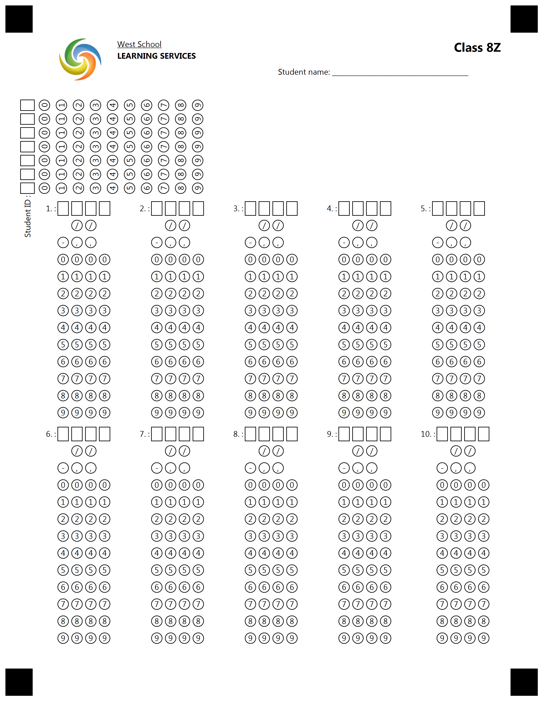

{} 

This example constructed for custom GlobalPageSettings. Please use provided settings from text below for best result.

{}


**Template generation call**

<details>
<summary>C# Code</summary>

````java
var license = new License();
license.SetLicense(@"C:\Users\User\Desktop\Aspose.license");

var engine = new OmrEngine();
var settings = new GlobalPageSettings
{
	PaperSize = PaperSize.Letter,
	Orientation = Orientation.Vertical,
	BubbleColor = Color.Black,
	BubbleSize = BubbleSize.Small,
	FontStyle = FontStyle.Regular,
	FontSize = 9,
	FontFamily = "Segoe UI",
	ImagesPaths = images
};
var configPath = @"C:\Users\User\Desktop\template\template.txt";

var result = engine.GenerateTemplate(configPath, settings);
result.Save(@"C:\Users\User\Desktop\template", "generated_template");
````

</details>

**Template TXT markdown**

<details>
<summary>TXT markdown</summary>

```text
?container=header
	columns_proportions=15%-35%-50%
?block=logo
	column=1
?image=logo.jpg
	width=200
	height=200
&block
?block=logoText
	column=2
?content=West School
	font_style=Underline
?content=LEARNING SERVICES
	font_style=bold
&block
?block=lastname
	column=3
	is_clipped=true
?content=Class 8Z
	font_style=bold
	font_size=14
	align=right
?empty_line=1
?content=Student name: ________________________________________
&block
&container
?empty_line=50
	height=50
?container=identification
	columns_proportions=50%-50%
?block=student_id
	column=1
?composite_grid=Student ID
	columns_count=7
	orientation=horizontal
	header_type=Square
	rotate=-90
	y=370
&block
?block=info
	column=2
?empty_line=200
	height=240
&block
&container
?container=1-5 grids
	columns_proportions=20%-20%-20%-20%-20%
?block=1
	column=1
?composite_grid=1.
	columns_count=4
	extra_row=() (/) (/) ()
	extra_row=(-) (,) (,) ()
	orientation=horizontal
	y=962
	header_type=Square
&block
?block=2
	column=2
?composite_grid=2.
	columns_count=4
	extra_row=() (/) (/) ()
	extra_row=(-) (,) (,) ()
	orientation=horizontal
	y=962
	header_type=Square
&block
?block=3
	column=3
?composite_grid=3.
	columns_count=4
	extra_row=() (/) (/) ()
	extra_row=(-) (,) (,) ()
	orientation=horizontal
	y=962
	header_type=Square
&block
?block=4
	column=4
?composite_grid=4.
	columns_count=4
	extra_row=() (/) (/) ()
	extra_row=(-) (,) (,) ()
	orientation=horizontal
	y=962
	header_type=Square
&block
?block=5
	column=5
?composite_grid=5.
	columns_count=4
	extra_row=() (/) (/) ()
	extra_row=(-) (,) (,) ()
	orientation=horizontal
	y=962
	header_type=Square
&block
&container
?container=6-10 grids
	columns_proportions=20%-20%-20%-20%-20%
?block=6
	column=1
?composite_grid=6.
	columns_count=4
	extra_row=() (/) (/) ()
	extra_row=(-) (,) (,) ()
	orientation=horizontal
	header_type=Square
&block
?block=7
	column=2
?composite_grid=7.
	columns_count=4
	extra_row=() (/) (/) ()
	extra_row=(-) (,) (,) ()
	orientation=horizontal
	header_type=Square
&block
?block=8
	column=3
?composite_grid=8.
	columns_count=4
	extra_row=() (/) (/) ()
	extra_row=(-) (,) (,) ()
	orientation=horizontal
	header_type=Square
&block
?block=9
	column=4
?composite_grid=9.
	columns_count=4
	extra_row=() (/) (/) ()
	extra_row=(-) (,) (,) ()
	orientation=horizontal
	header_type=Square
&block
?block=10
	column=5
?composite_grid=10.
	columns_count=4
	extra_row=() (/) (/) ()
	extra_row=(-) (,) (,) ()
	orientation=horizontal
	header_type=Square
&block
&container
```

</details>

**Template result**

****