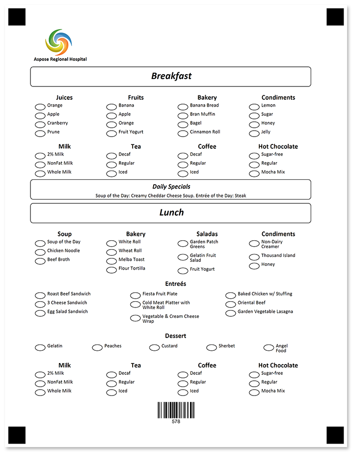
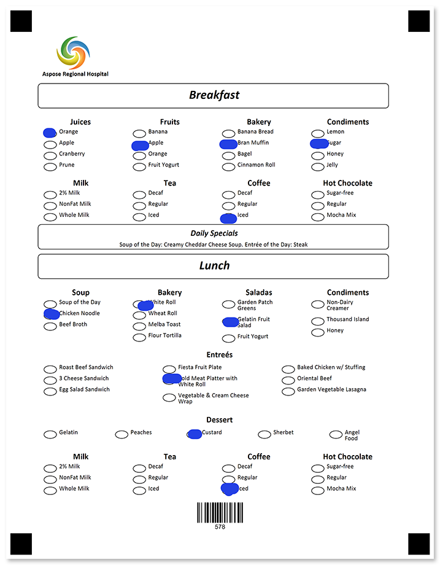

Request dietary restrictions or preferences from your attendees or residents and adjust the menu accordingly.



## Source code

<details>
<summary>Text markup</summary>

```
?image=logo.jpg
	x=300
	y=180
	width=200
	height=200
?text=Aspose Regional Hospital
	align=left
	font_style=bold
?empty_line=
	height=50
?container=breakfast_header
	columns_count=1
?block=main
	border=rounded
?content=Breakfast
	font_style=Italic, Bold
	font_size=18
	align=center
&block	
&container
?container=breakfast_content
	columns_count=4
?block=
	column=1
?content=Juices
	font_style=bold
	font_size=12
	align=center
?vertical_choicebox=Juices
?answer=Orange
?content=Orange
&answer
?answer=Apple
?content=Apple
&answer
?answer=Cranberry
?content=Cranberry
&answer
?answer=Prune
?content=Prune
&answer
&vertical_choicebox
&block
?block=
	column=2
?content=Fruits
	font_style=bold
	font_size=12
	align=center
?vertical_choicebox=Fruits
?answer=Banana
?content=Banana
&answer
?answer=Apple
?content=Apple
&answer
?answer=Orange
?content=Orange
&answer
?answer=Fruit Yogurt
?content=Fruit Yogurt
&answer
&vertical_choicebox
&block
?block=
	column=3
?content=Bakery
	font_style=bold
	font_size=12
	align=center
?vertical_choicebox=Bakery
?answer=Banana Bread
?content=Banana Bread
&answer
?answer=Bran Muffin
?content=Bran Muffin
&answer
?answer=Bagel
?content=Bagel
&answer
?answer=Cinnamon Roll
?content=Cinnamon Roll
&answer
&vertical_choicebox
&block
?block=
	column=4
?content=Condiments
	font_style=bold
	font_size=12
	align=center
?vertical_choicebox=Condiments
?answer=Lemon
?content=Lemon
&answer
?answer=Sugar
?content=Sugar
&answer
?answer=Honey
?content=Honey
&answer
?answer=Jelly
?content=Jelly
&answer
&vertical_choicebox
&block
?block=
	column=1
?content=Milk
	font_style=bold
	font_size=12
	align=center
?vertical_choicebox=Milk
?answer=2% Milk
?content=2% Milk
&answer
?answer=NonFat Milk
?content=NonFat Milk
&answer
?answer=Whole Milk
?content=Whole Milk
&answer
&vertical_choicebox
&block
?block=
	column=2
?content=Tea
	font_style=bold
	font_size=12
	align=center
?vertical_choicebox=Tea
?answer=Decaf
?content=Decaf
&answer
?answer=Regular
?content=Regular
&answer
?answer=Iced
?content=Iced
&answer
&vertical_choicebox
&block
?block=
	column=3
?content=Coffee
	font_style=bold
	font_size=12
	align=center
?vertical_choicebox=Coffee
?answer=Decaf
?content=Decaf
&answer
?answer=Regular
?content=Regular
&answer
?answer=Iced
?content=Iced
&answer
&vertical_choicebox
&block
?block=
	column=4
?content=Hot Chocolate
	font_style=bold
	font_size=12
	align=center
?vertical_choicebox=Hot Chocolate
?answer=Sugar-free
?content=Sugar-free
&answer
?answer=Regular
?content=Regular
&answer
?answer=Mocha Mix
?content=Mocha Mix
&answer
&vertical_choicebox
&block
&container
?container=specials
	columns_count=1
?block=
	column=1
	border=rounded
?content=Daily Specials
	font_style=italic, bold
	font_size=12
	align=center
?empty_line=
	height=25
?content=Soup of the Day: Creamy Cheddar Cheese Soup. Entrée of the Day: Steak
	align=center
&block
&container
?container=lunch_header
	columns_count=1
?block=
	border=rounded
?content=Lunch
	font_style=Italic, Bold
	font_size=18
	align=center
&block
&container
?container=lunch_content
	columns_count=4
?block=
	column=1
?content=Soup
	font_style=bold
	font_size=12
	align=center
?vertical_choicebox=Soup
?answer=Soup of the Day
?content=Soup of the Day
&answer
?answer=Chicken Noodle
?content=Chicken Noodle
&answer
?answer=Beef Broth
?content=Beef Broth
&answer
&vertical_choicebox
&block
?block=
	column=2
?content=Bakery
	font_style=bold
	font_size=12
	align=center
?vertical_choicebox=Bakery
?answer=White Roll
?content=White Roll
&answer
?answer=Wheat Roll
?content=Wheat Roll
&answer
?answer=Melba Toast
?content=Melba Toast
&answer
?answer=Flour Tortilla
?content=Flour Tortilla
&answer
&vertical_choicebox
&block
?block=
	column=3
?content=Salads
	font_style=bold
	font_size=12
	align=center
?vertical_choicebox=Salads
?answer=Garden Patch Greens
?content=Garden Patch Greens
&answer
?answer=Gelatin Fruit Salad
?content=Gelatin Fruit Salad
&answer
?answer=Fruit Yogurt
?content=Fruit Yogurt
&answer
&vertical_choicebox
&block
?block=
	column=4
?content=Condiments
	font_style=bold
	font_size=12
	align=center
?vertical_choicebox=Condiments
?answer=Non-Dairy Creamer
?content=Non-Dairy Creamer
&answer
?answer=Thousand Island
?content=Thousand Island
&answer
?answer=Honey
?content=Honey
&answer
&vertical_choicebox
&block
&container
?text=Entrées
	align=center
	font_style=bold
	font_size=12
?container=Entrées
	columns_count=3
?block=
	column=1
?vertical_choicebox=Entrées
?answer=Roast Beef Sandwich
?content=Roast Beef Sandwich
&answer
?answer=3 Cheese Sandwich
?content=3 Cheese Sandwich
&answer
?answer=Egg Salad Sandwich
?content=Egg Salad Sandwich
&answer
&vertical_choicebox
&block
?block=
	column=2
?vertical_choicebox=Entrées
?answer=Fiesta Fruit Plate
?content=Fiesta Fruit Plate
&answer
?answer=Cold Meat Platter with White Roll
?content=Cold Meat Platter with White Roll
&answer
?answer=Vegetable & Cream Cheese Wrap
?content=Vegetable & Cream Cheese Wrap
&answer
&vertical_choicebox
&block
?block=
	column=3
?vertical_choicebox=Entrées
?answer=Baked Chicken w/ Stuffing
?content=Baked Chicken w/ Stuffing
&answer
?answer=Oriental Beef
?content=Oriental Beef
&answer
?answer=Garden Vegetable Lasagna
?content=Garden Vegetable Lasagna
&answer
&vertical_choicebox
&block
&container
?text=Dessert
	align=center
	font_style=bold
	font_size=12
?container=Deserts
	columns_count=5
?block=
	column=1
?vertical_choicebox=Dessert
?answer=Gelatin
?content=Gelatin
&answer
&vertical_choicebox
&block
?block=
	column=2
?vertical_choicebox=Dessert
?answer=Peaches
?content=Peaches
&answer
&vertical_choicebox
&block
?block=
	column=3
?vertical_choicebox=Dessert
?answer=Custard
?content=Custard
&answer
&vertical_choicebox
&block
?block=
	column=4
?vertical_choicebox=Dessert
?answer=Sherbet
?content=Sherbet
&answer
&vertical_choicebox
&block
?block=
	column=5
?vertical_choicebox=Dessert
?answer=Angel Food
?content=Angel Food
&answer
&vertical_choicebox
&block
&container
?container=drinks
	columns_count=4
?block=
	column=1
?content=Milk
	font_style=bold
	font_size=12
	align=center
?vertical_choicebox=Milk
?answer=2% Milk
?content=2% Milk
&answer
?answer=NonFat Milk
?content=NonFat Milk
&answer
?answer=Whole Milk
?content=Whole Milk
&answer
&vertical_choicebox
&block
?block=
	column=2
?content=Tea
	font_style=bold
	font_size=12
	align=center
?vertical_choicebox=Condiments
?answer=Decaf
?content=Decaf
&answer
?answer=Regular
?content=Regular
&answer
?answer=Iced
?content=Iced
&answer
&vertical_choicebox
&block
?block=
	column=3
?content=Coffee
	font_style=bold
	font_size=12
	align=center
?vertical_choicebox=Condiments
?answer=Decaf
?content=Decaf
&answer
?answer=Regular
?content=Regular
&answer
?answer=Iced
?content=Iced
&answer
&vertical_choicebox
&block
?block=
	column=4
?content=Hot Chocolate
	font_style=bold
	font_size=12
	align=center
?vertical_choicebox=Condiments
?answer=Sugar-free
?content=Sugar-free
&answer
?answer=Regular
?content=Regular
&answer
?answer=Mocha Mix
?content=Mocha Mix
&answer
&vertical_choicebox
&block
&container
?barcode=RoomId
	codetext=true
	barcode_type=Code128
	value=578
```

</details>

<details>
<summary>JSON markup</summary>

```json
{
  "name": null,
  "children": [
    {
      "name": null,
      "children": [
        {
          "align": "Center",
          "name": "logo.jpg",
          "image_path": null,
          "x": 300,
          "y": 180,
          "height": 200,
          "width": 200,
          "element_type": "Image"
        },
        {
          "name": "Aspose Regional Hospital\r\n",
          "font_family": "Calibri",
          "font_style": "Bold",
          "font_size": 9,
          "align": "Left",
          "element_type": "Text"
        },
        {
          "name": "",
          "height": 50,
          "element_type": "EmptyLine"
        },
        {
          "name": "breakfast_header",
          "children": [
            {
              "name": "main",
              "children": [
                {
                  "name": "Breakfast",
                  "font_family": "Calibri",
                  "font_style": [
                    "Bold",
                    "Italic"
                  ],
                  "font_size": 18,
                  "content_type": "Normal",
                  "align": "Center",
                  "element_type": "Content"
                }
              ],
              "column": 1,
              "border": "Rounded",
              "border_size": 3,
              "border_color": "Black",
              "is_clipped": false,
              "element_type": "Block"
            }
          ],
          "columns_count": 1,
          "columns_proportions": null,
          "container_type": "Normal",
          "block_right_margin": 40,
          "block_bottom_margin": 20,
          "block_top_padding": 20,
          "element_type": "Container"
        },
        {
          "name": "breakfast_content",
          "children": [
            {
              "name": "",
              "children": [
                {
                  "name": "Juices",
                  "font_family": "Calibri",
                  "font_style": "Bold",
                  "font_size": 12,
                  "content_type": "Normal",
                  "align": "Center",
                  "element_type": "Content"
                },
                {
                  "name": "Juices",
                  "children": [
                    {
                      "name": "Orange",
                      "children": [
                        {
                          "name": "Orange",
                          "font_family": "Calibri",
                          "font_style": "Regular",
                          "font_size": 9,
                          "content_type": "Normal",
                          "align": "Left",
                          "element_type": "Content"
                        }
                      ],
                      "bubble_type": "Round",
                      "element_type": "Answer"
                    },
                    {
                      "name": "Apple",
                      "children": [
                        {
                          "name": "Apple",
                          "font_family": "Calibri",
                          "font_style": "Regular",
                          "font_size": 9,
                          "content_type": "Normal",
                          "align": "Left",
                          "element_type": "Content"
                        }
                      ],
                      "bubble_type": "Round",
                      "element_type": "Answer"
                    },
                    {
                      "name": "Cranberry",
                      "children": [
                        {
                          "name": "Cranberry",
                          "font_family": "Calibri",
                          "font_style": "Regular",
                          "font_size": 9,
                          "content_type": "Normal",
                          "align": "Left",
                          "element_type": "Content"
                        }
                      ],
                      "bubble_type": "Round",
                      "element_type": "Answer"
                    },
                    {
                      "name": "Prune",
                      "children": [
                        {
                          "name": "Prune",
                          "font_family": "Calibri",
                          "font_style": "Regular",
                          "font_size": 9,
                          "content_type": "Normal",
                          "align": "Left",
                          "element_type": "Content"
                        }
                      ],
                      "bubble_type": "Round",
                      "element_type": "Answer"
                    }
                  ],
                  "element_type": "VerticalChoiceBox",
                  "threshold": 0,
                  "top_padding": 0
                }
              ],
              "column": 1,
              "border": "None",
              "border_size": 3,
              "border_color": "Black",
              "is_clipped": false,
              "element_type": "Block"
            },
            {
              "name": "",
              "children": [
                {
                  "name": "Fruits",
                  "font_family": "Calibri",
                  "font_style": "Bold",
                  "font_size": 12,
                  "content_type": "Normal",
                  "align": "Center",
                  "element_type": "Content"
                },
                {
                  "name": "Fruits",
                  "children": [
                    {
                      "name": "Banana",
                      "children": [
                        {
                          "name": "Banana",
                          "font_family": "Calibri",
                          "font_style": "Regular",
                          "font_size": 9,
                          "content_type": "Normal",
                          "align": "Left",
                          "element_type": "Content"
                        }
                      ],
                      "bubble_type": "Round",
                      "element_type": "Answer"
                    },
                    {
                      "name": "Apple",
                      "children": [
                        {
                          "name": "Apple",
                          "font_family": "Calibri",
                          "font_style": "Regular",
                          "font_size": 9,
                          "content_type": "Normal",
                          "align": "Left",
                          "element_type": "Content"
                        }
                      ],
                      "bubble_type": "Round",
                      "element_type": "Answer"
                    },
                    {
                      "name": "Orange",
                      "children": [
                        {
                          "name": "Orange",
                          "font_family": "Calibri",
                          "font_style": "Regular",
                          "font_size": 9,
                          "content_type": "Normal",
                          "align": "Left",
                          "element_type": "Content"
                        }
                      ],
                      "bubble_type": "Round",
                      "element_type": "Answer"
                    },
                    {
                      "name": "Fruit Yogurt",
                      "children": [
                        {
                          "name": "Fruit Yogurt",
                          "font_family": "Calibri",
                          "font_style": "Regular",
                          "font_size": 9,
                          "content_type": "Normal",
                          "align": "Left",
                          "element_type": "Content"
                        }
                      ],
                      "bubble_type": "Round",
                      "element_type": "Answer"
                    }
                  ],
                  "element_type": "VerticalChoiceBox",
                  "threshold": 0,
                  "top_padding": 0
                }
              ],
              "column": 2,
              "border": "None",
              "border_size": 3,
              "border_color": "Black",
              "is_clipped": false,
              "element_type": "Block"
            },
            {
              "name": "",
              "children": [
                {
                  "name": "Bakery",
                  "font_family": "Calibri",
                  "font_style": "Bold",
                  "font_size": 12,
                  "content_type": "Normal",
                  "align": "Center",
                  "element_type": "Content"
                },
                {
                  "name": "Bakery",
                  "children": [
                    {
                      "name": "Banana Bread",
                      "children": [
                        {
                          "name": "Banana Bread",
                          "font_family": "Calibri",
                          "font_style": "Regular",
                          "font_size": 9,
                          "content_type": "Normal",
                          "align": "Left",
                          "element_type": "Content"
                        }
                      ],
                      "bubble_type": "Round",
                      "element_type": "Answer"
                    },
                    {
                      "name": "Bran Muffin",
                      "children": [
                        {
                          "name": "Bran Muffin",
                          "font_family": "Calibri",
                          "font_style": "Regular",
                          "font_size": 9,
                          "content_type": "Normal",
                          "align": "Left",
                          "element_type": "Content"
                        }
                      ],
                      "bubble_type": "Round",
                      "element_type": "Answer"
                    },
                    {
                      "name": "Bagel",
                      "children": [
                        {
                          "name": "Bagel",
                          "font_family": "Calibri",
                          "font_style": "Regular",
                          "font_size": 9,
                          "content_type": "Normal",
                          "align": "Left",
                          "element_type": "Content"
                        }
                      ],
                      "bubble_type": "Round",
                      "element_type": "Answer"
                    },
                    {
                      "name": "Cinnamon Roll",
                      "children": [
                        {
                          "name": "Cinnamon Roll",
                          "font_family": "Calibri",
                          "font_style": "Regular",
                          "font_size": 9,
                          "content_type": "Normal",
                          "align": "Left",
                          "element_type": "Content"
                        }
                      ],
                      "bubble_type": "Round",
                      "element_type": "Answer"
                    }
                  ],
                  "element_type": "VerticalChoiceBox",
                  "threshold": 0,
                  "top_padding": 0
                }
              ],
              "column": 3,
              "border": "None",
              "border_size": 3,
              "border_color": "Black",
              "is_clipped": false,
              "element_type": "Block"
            },
            {
              "name": "",
              "children": [
                {
                  "name": "Condiments",
                  "font_family": "Calibri",
                  "font_style": "Bold",
                  "font_size": 12,
                  "content_type": "Normal",
                  "align": "Center",
                  "element_type": "Content"
                },
                {
                  "name": "Condiments",
                  "children": [
                    {
                      "name": "Lemon",
                      "children": [
                        {
                          "name": "Lemon",
                          "font_family": "Calibri",
                          "font_style": "Regular",
                          "font_size": 9,
                          "content_type": "Normal",
                          "align": "Left",
                          "element_type": "Content"
                        }
                      ],
                      "bubble_type": "Round",
                      "element_type": "Answer"
                    },
                    {
                      "name": "Sugar",
                      "children": [
                        {
                          "name": "Sugar",
                          "font_family": "Calibri",
                          "font_style": "Regular",
                          "font_size": 9,
                          "content_type": "Normal",
                          "align": "Left",
                          "element_type": "Content"
                        }
                      ],
                      "bubble_type": "Round",
                      "element_type": "Answer"
                    },
                    {
                      "name": "Honey",
                      "children": [
                        {
                          "name": "Honey",
                          "font_family": "Calibri",
                          "font_style": "Regular",
                          "font_size": 9,
                          "content_type": "Normal",
                          "align": "Left",
                          "element_type": "Content"
                        }
                      ],
                      "bubble_type": "Round",
                      "element_type": "Answer"
                    },
                    {
                      "name": "Jelly",
                      "children": [
                        {
                          "name": "Jelly",
                          "font_family": "Calibri",
                          "font_style": "Regular",
                          "font_size": 9,
                          "content_type": "Normal",
                          "align": "Left",
                          "element_type": "Content"
                        }
                      ],
                      "bubble_type": "Round",
                      "element_type": "Answer"
                    }
                  ],
                  "element_type": "VerticalChoiceBox",
                  "threshold": 0,
                  "top_padding": 0
                }
              ],
              "column": 4,
              "border": "None",
              "border_size": 3,
              "border_color": "Black",
              "is_clipped": false,
              "element_type": "Block"
            },
            {
              "name": "",
              "children": [
                {
                  "name": "Milk",
                  "font_family": "Calibri",
                  "font_style": "Bold",
                  "font_size": 12,
                  "content_type": "Normal",
                  "align": "Center",
                  "element_type": "Content"
                },
                {
                  "name": "Milk",
                  "children": [
                    {
                      "name": "2% Milk",
                      "children": [
                        {
                          "name": "2% Milk",
                          "font_family": "Calibri",
                          "font_style": "Regular",
                          "font_size": 9,
                          "content_type": "Normal",
                          "align": "Left",
                          "element_type": "Content"
                        }
                      ],
                      "bubble_type": "Round",
                      "element_type": "Answer"
                    },
                    {
                      "name": "NonFat Milk",
                      "children": [
                        {
                          "name": "NonFat Milk",
                          "font_family": "Calibri",
                          "font_style": "Regular",
                          "font_size": 9,
                          "content_type": "Normal",
                          "align": "Left",
                          "element_type": "Content"
                        }
                      ],
                      "bubble_type": "Round",
                      "element_type": "Answer"
                    },
                    {
                      "name": "Whole Milk",
                      "children": [
                        {
                          "name": "Whole Milk",
                          "font_family": "Calibri",
                          "font_style": "Regular",
                          "font_size": 9,
                          "content_type": "Normal",
                          "align": "Left",
                          "element_type": "Content"
                        }
                      ],
                      "bubble_type": "Round",
                      "element_type": "Answer"
                    }
                  ],
                  "element_type": "VerticalChoiceBox",
                  "threshold": 0,
                  "top_padding": 0
                }
              ],
              "column": 1,
              "border": "None",
              "border_size": 3,
              "border_color": "Black",
              "is_clipped": false,
              "element_type": "Block"
            },
            {
              "name": "",
              "children": [
                {
                  "name": "Tea",
                  "font_family": "Calibri",
                  "font_style": "Bold",
                  "font_size": 12,
                  "content_type": "Normal",
                  "align": "Center",
                  "element_type": "Content"
                },
                {
                  "name": "Tea",
                  "children": [
                    {
                      "name": "Decaf",
                      "children": [
                        {
                          "name": "Decaf",
                          "font_family": "Calibri",
                          "font_style": "Regular",
                          "font_size": 9,
                          "content_type": "Normal",
                          "align": "Left",
                          "element_type": "Content"
                        }
                      ],
                      "bubble_type": "Round",
                      "element_type": "Answer"
                    },
                    {
                      "name": "Regular",
                      "children": [
                        {
                          "name": "Regular",
                          "font_family": "Calibri",
                          "font_style": "Regular",
                          "font_size": 9,
                          "content_type": "Normal",
                          "align": "Left",
                          "element_type": "Content"
                        }
                      ],
                      "bubble_type": "Round",
                      "element_type": "Answer"
                    },
                    {
                      "name": "Iced",
                      "children": [
                        {
                          "name": "Iced",
                          "font_family": "Calibri",
                          "font_style": "Regular",
                          "font_size": 9,
                          "content_type": "Normal",
                          "align": "Left",
                          "element_type": "Content"
                        }
                      ],
                      "bubble_type": "Round",
                      "element_type": "Answer"
                    }
                  ],
                  "element_type": "VerticalChoiceBox",
                  "threshold": 0,
                  "top_padding": 0
                }
              ],
              "column": 2,
              "border": "None",
              "border_size": 3,
              "border_color": "Black",
              "is_clipped": false,
              "element_type": "Block"
            },
            {
              "name": "",
              "children": [
                {
                  "name": "Coffee",
                  "font_family": "Calibri",
                  "font_style": "Bold",
                  "font_size": 12,
                  "content_type": "Normal",
                  "align": "Center",
                  "element_type": "Content"
                },
                {
                  "name": "Coffee",
                  "children": [
                    {
                      "name": "Decaf",
                      "children": [
                        {
                          "name": "Decaf",
                          "font_family": "Calibri",
                          "font_style": "Regular",
                          "font_size": 9,
                          "content_type": "Normal",
                          "align": "Left",
                          "element_type": "Content"
                        }
                      ],
                      "bubble_type": "Round",
                      "element_type": "Answer"
                    },
                    {
                      "name": "Regular",
                      "children": [
                        {
                          "name": "Regular",
                          "font_family": "Calibri",
                          "font_style": "Regular",
                          "font_size": 9,
                          "content_type": "Normal",
                          "align": "Left",
                          "element_type": "Content"
                        }
                      ],
                      "bubble_type": "Round",
                      "element_type": "Answer"
                    },
                    {
                      "name": "Iced",
                      "children": [
                        {
                          "name": "Iced",
                          "font_family": "Calibri",
                          "font_style": "Regular",
                          "font_size": 9,
                          "content_type": "Normal",
                          "align": "Left",
                          "element_type": "Content"
                        }
                      ],
                      "bubble_type": "Round",
                      "element_type": "Answer"
                    }
                  ],
                  "element_type": "VerticalChoiceBox",
                  "threshold": 0,
                  "top_padding": 0
                }
              ],
              "column": 3,
              "border": "None",
              "border_size": 3,
              "border_color": "Black",
              "is_clipped": false,
              "element_type": "Block"
            },
            {
              "name": "",
              "children": [
                {
                  "name": "Hot Chocolate",
                  "font_family": "Calibri",
                  "font_style": "Bold",
                  "font_size": 12,
                  "content_type": "Normal",
                  "align": "Center",
                  "element_type": "Content"
                },
                {
                  "name": "Hot Chocolate",
                  "children": [
                    {
                      "name": "Sugar-free",
                      "children": [
                        {
                          "name": "Sugar-free",
                          "font_family": "Calibri",
                          "font_style": "Regular",
                          "font_size": 9,
                          "content_type": "Normal",
                          "align": "Left",
                          "element_type": "Content"
                        }
                      ],
                      "bubble_type": "Round",
                      "element_type": "Answer"
                    },
                    {
                      "name": "Regular",
                      "children": [
                        {
                          "name": "Regular",
                          "font_family": "Calibri",
                          "font_style": "Regular",
                          "font_size": 9,
                          "content_type": "Normal",
                          "align": "Left",
                          "element_type": "Content"
                        }
                      ],
                      "bubble_type": "Round",
                      "element_type": "Answer"
                    },
                    {
                      "name": "Mocha Mix",
                      "children": [
                        {
                          "name": "Mocha Mix",
                          "font_family": "Calibri",
                          "font_style": "Regular",
                          "font_size": 9,
                          "content_type": "Normal",
                          "align": "Left",
                          "element_type": "Content"
                        }
                      ],
                      "bubble_type": "Round",
                      "element_type": "Answer"
                    }
                  ],
                  "element_type": "VerticalChoiceBox",
                  "threshold": 0,
                  "top_padding": 0
                }
              ],
              "column": 4,
              "border": "None",
              "border_size": 3,
              "border_color": "Black",
              "is_clipped": false,
              "element_type": "Block"
            }
          ],
          "columns_count": 4,
          "columns_proportions": null,
          "container_type": "Normal",
          "block_right_margin": 40,
          "block_bottom_margin": 20,
          "block_top_padding": 20,
          "element_type": "Container"
        },
        {
          "name": "specials",
          "children": [
            {
              "name": "",
              "children": [
                {
                  "name": "Daily Specials",
                  "font_family": "Calibri",
                  "font_style": [
                    "Bold",
                    "Italic"
                  ],
                  "font_size": 12,
                  "content_type": "Normal",
                  "align": "Center",
                  "element_type": "Content"
                },
                {
                  "name": "",
                  "height": 25,
                  "element_type": "EmptyLine"
                },
                {
                  "name": "Soup of the Day: Creamy Cheddar Cheese Soup. Entrée of the Day: Steak",
                  "font_family": "Calibri",
                  "font_style": "Regular",
                  "font_size": 9,
                  "content_type": "Normal",
                  "align": "Center",
                  "element_type": "Content"
                }
              ],
              "column": 1,
              "border": "Rounded",
              "border_size": 3,
              "border_color": "Black",
              "is_clipped": false,
              "element_type": "Block"
            }
          ],
          "columns_count": 1,
          "columns_proportions": null,
          "container_type": "Normal",
          "block_right_margin": 40,
          "block_bottom_margin": 20,
          "block_top_padding": 20,
          "element_type": "Container"
        },
        {
          "name": "lunch_header",
          "children": [
            {
              "name": "",
              "children": [
                {
                  "name": "Lunch",
                  "font_family": "Calibri",
                  "font_style": [
                    "Bold",
                    "Italic"
                  ],
                  "font_size": 18,
                  "content_type": "Normal",
                  "align": "Center",
                  "element_type": "Content"
                }
              ],
              "column": 1,
              "border": "Rounded",
              "border_size": 3,
              "border_color": "Black",
              "is_clipped": false,
              "element_type": "Block"
            }
          ],
          "columns_count": 1,
          "columns_proportions": null,
          "container_type": "Normal",
          "block_right_margin": 40,
          "block_bottom_margin": 20,
          "block_top_padding": 20,
          "element_type": "Container"
        },
        {
          "name": "lunch_content",
          "children": [
            {
              "name": "",
              "children": [
                {
                  "name": "Soup",
                  "font_family": "Calibri",
                  "font_style": "Bold",
                  "font_size": 12,
                  "content_type": "Normal",
                  "align": "Center",
                  "element_type": "Content"
                },
                {
                  "name": "Soup",
                  "children": [
                    {
                      "name": "Soup of the Day",
                      "children": [
                        {
                          "name": "Soup of the Day",
                          "font_family": "Calibri",
                          "font_style": "Regular",
                          "font_size": 9,
                          "content_type": "Normal",
                          "align": "Left",
                          "element_type": "Content"
                        }
                      ],
                      "bubble_type": "Round",
                      "element_type": "Answer"
                    },
                    {
                      "name": "Chicken Noodle",
                      "children": [
                        {
                          "name": "Chicken Noodle",
                          "font_family": "Calibri",
                          "font_style": "Regular",
                          "font_size": 9,
                          "content_type": "Normal",
                          "align": "Left",
                          "element_type": "Content"
                        }
                      ],
                      "bubble_type": "Round",
                      "element_type": "Answer"
                    },
                    {
                      "name": "Beef Broth",
                      "children": [
                        {
                          "name": "Beef Broth",
                          "font_family": "Calibri",
                          "font_style": "Regular",
                          "font_size": 9,
                          "content_type": "Normal",
                          "align": "Left",
                          "element_type": "Content"
                        }
                      ],
                      "bubble_type": "Round",
                      "element_type": "Answer"
                    }
                  ],
                  "element_type": "VerticalChoiceBox",
                  "threshold": 0,
                  "top_padding": 0
                }
              ],
              "column": 1,
              "border": "None",
              "border_size": 3,
              "border_color": "Black",
              "is_clipped": false,
              "element_type": "Block"
            },
            {
              "name": "",
              "children": [
                {
                  "name": "Bakery",
                  "font_family": "Calibri",
                  "font_style": "Bold",
                  "font_size": 12,
                  "content_type": "Normal",
                  "align": "Center",
                  "element_type": "Content"
                },
                {
                  "name": "Bakery",
                  "children": [
                    {
                      "name": "White Roll",
                      "children": [
                        {
                          "name": "White Roll",
                          "font_family": "Calibri",
                          "font_style": "Regular",
                          "font_size": 9,
                          "content_type": "Normal",
                          "align": "Left",
                          "element_type": "Content"
                        }
                      ],
                      "bubble_type": "Round",
                      "element_type": "Answer"
                    },
                    {
                      "name": "Wheat Roll",
                      "children": [
                        {
                          "name": "Wheat Roll",
                          "font_family": "Calibri",
                          "font_style": "Regular",
                          "font_size": 9,
                          "content_type": "Normal",
                          "align": "Left",
                          "element_type": "Content"
                        }
                      ],
                      "bubble_type": "Round",
                      "element_type": "Answer"
                    },
                    {
                      "name": "Melba Toast",
                      "children": [
                        {
                          "name": "Melba Toast",
                          "font_family": "Calibri",
                          "font_style": "Regular",
                          "font_size": 9,
                          "content_type": "Normal",
                          "align": "Left",
                          "element_type": "Content"
                        }
                      ],
                      "bubble_type": "Round",
                      "element_type": "Answer"
                    },
                    {
                      "name": "Flour Tortilla",
                      "children": [
                        {
                          "name": "Flour Tortilla",
                          "font_family": "Calibri",
                          "font_style": "Regular",
                          "font_size": 9,
                          "content_type": "Normal",
                          "align": "Left",
                          "element_type": "Content"
                        }
                      ],
                      "bubble_type": "Round",
                      "element_type": "Answer"
                    }
                  ],
                  "element_type": "VerticalChoiceBox",
                  "threshold": 0,
                  "top_padding": 0
                }
              ],
              "column": 2,
              "border": "None",
              "border_size": 3,
              "border_color": "Black",
              "is_clipped": false,
              "element_type": "Block"
            },
            {
              "name": "",
              "children": [
                {
                  "name": "Salads",
                  "font_family": "Calibri",
                  "font_style": "Bold",
                  "font_size": 12,
                  "content_type": "Normal",
                  "align": "Center",
                  "element_type": "Content"
                },
                {
                  "name": "Salads",
                  "children": [
                    {
                      "name": "Garden Patch Greens",
                      "children": [
                        {
                          "name": "Garden Patch Greens",
                          "font_family": "Calibri",
                          "font_style": "Regular",
                          "font_size": 9,
                          "content_type": "Normal",
                          "align": "Left",
                          "element_type": "Content"
                        }
                      ],
                      "bubble_type": "Round",
                      "element_type": "Answer"
                    },
                    {
                      "name": "Gelatin Fruit Salad",
                      "children": [
                        {
                          "name": "Gelatin Fruit Salad",
                          "font_family": "Calibri",
                          "font_style": "Regular",
                          "font_size": 9,
                          "content_type": "Normal",
                          "align": "Left",
                          "element_type": "Content"
                        }
                      ],
                      "bubble_type": "Round",
                      "element_type": "Answer"
                    },
                    {
                      "name": "Fruit Yogurt",
                      "children": [
                        {
                          "name": "Fruit Yogurt",
                          "font_family": "Calibri",
                          "font_style": "Regular",
                          "font_size": 9,
                          "content_type": "Normal",
                          "align": "Left",
                          "element_type": "Content"
                        }
                      ],
                      "bubble_type": "Round",
                      "element_type": "Answer"
                    }
                  ],
                  "element_type": "VerticalChoiceBox",
                  "threshold": 0,
                  "top_padding": 0
                }
              ],
              "column": 3,
              "border": "None",
              "border_size": 3,
              "border_color": "Black",
              "is_clipped": false,
              "element_type": "Block"
            },
            {
              "name": "",
              "children": [
                {
                  "name": "Condiments",
                  "font_family": "Calibri",
                  "font_style": "Bold",
                  "font_size": 12,
                  "content_type": "Normal",
                  "align": "Center",
                  "element_type": "Content"
                },
                {
                  "name": "Condiments",
                  "children": [
                    {
                      "name": "Non-Dairy Creamer",
                      "children": [
                        {
                          "name": "Non-Dairy Creamer",
                          "font_family": "Calibri",
                          "font_style": "Regular",
                          "font_size": 9,
                          "content_type": "Normal",
                          "align": "Left",
                          "element_type": "Content"
                        }
                      ],
                      "bubble_type": "Round",
                      "element_type": "Answer"
                    },
                    {
                      "name": "Thousand Island",
                      "children": [
                        {
                          "name": "Thousand Island",
                          "font_family": "Calibri",
                          "font_style": "Regular",
                          "font_size": 9,
                          "content_type": "Normal",
                          "align": "Left",
                          "element_type": "Content"
                        }
                      ],
                      "bubble_type": "Round",
                      "element_type": "Answer"
                    },
                    {
                      "name": "Honey",
                      "children": [
                        {
                          "name": "Honey",
                          "font_family": "Calibri",
                          "font_style": "Regular",
                          "font_size": 9,
                          "content_type": "Normal",
                          "align": "Left",
                          "element_type": "Content"
                        }
                      ],
                      "bubble_type": "Round",
                      "element_type": "Answer"
                    }
                  ],
                  "element_type": "VerticalChoiceBox",
                  "threshold": 0,
                  "top_padding": 0
                }
              ],
              "column": 4,
              "border": "None",
              "border_size": 3,
              "border_color": "Black",
              "is_clipped": false,
              "element_type": "Block"
            }
          ],
          "columns_count": 4,
          "columns_proportions": null,
          "container_type": "Normal",
          "block_right_margin": 40,
          "block_bottom_margin": 20,
          "block_top_padding": 20,
          "element_type": "Container"
        },
        {
          "name": "Entrées\r\n",
          "font_family": "Calibri",
          "font_style": "Bold",
          "font_size": 12,
          "align": "Center",
          "element_type": "Text"
        },
        {
          "name": "Entrées",
          "children": [
            {
              "name": "",
              "children": [
                {
                  "name": "Entrées",
                  "children": [
                    {
                      "name": "Roast Beef Sandwich",
                      "children": [
                        {
                          "name": "Roast Beef Sandwich",
                          "font_family": "Calibri",
                          "font_style": "Regular",
                          "font_size": 9,
                          "content_type": "Normal",
                          "align": "Left",
                          "element_type": "Content"
                        }
                      ],
                      "bubble_type": "Round",
                      "element_type": "Answer"
                    },
                    {
                      "name": "3 Cheese Sandwich",
                      "children": [
                        {
                          "name": "3 Cheese Sandwich",
                          "font_family": "Calibri",
                          "font_style": "Regular",
                          "font_size": 9,
                          "content_type": "Normal",
                          "align": "Left",
                          "element_type": "Content"
                        }
                      ],
                      "bubble_type": "Round",
                      "element_type": "Answer"
                    },
                    {
                      "name": "Egg Salad Sandwich",
                      "children": [
                        {
                          "name": "Egg Salad Sandwich",
                          "font_family": "Calibri",
                          "font_style": "Regular",
                          "font_size": 9,
                          "content_type": "Normal",
                          "align": "Left",
                          "element_type": "Content"
                        }
                      ],
                      "bubble_type": "Round",
                      "element_type": "Answer"
                    }
                  ],
                  "element_type": "VerticalChoiceBox",
                  "threshold": 0,
                  "top_padding": 0
                }
              ],
              "column": 1,
              "border": "None",
              "border_size": 3,
              "border_color": "Black",
              "is_clipped": false,
              "element_type": "Block"
            },
            {
              "name": "",
              "children": [
                {
                  "name": "Entrées",
                  "children": [
                    {
                      "name": "Fiesta Fruit Plate",
                      "children": [
                        {
                          "name": "Fiesta Fruit Plate",
                          "font_family": "Calibri",
                          "font_style": "Regular",
                          "font_size": 9,
                          "content_type": "Normal",
                          "align": "Left",
                          "element_type": "Content"
                        }
                      ],
                      "bubble_type": "Round",
                      "element_type": "Answer"
                    },
                    {
                      "name": "Cold Meat Platter with White Roll",
                      "children": [
                        {
                          "name": "Cold Meat Platter with White Roll",
                          "font_family": "Calibri",
                          "font_style": "Regular",
                          "font_size": 9,
                          "content_type": "Normal",
                          "align": "Left",
                          "element_type": "Content"
                        }
                      ],
                      "bubble_type": "Round",
                      "element_type": "Answer"
                    },
                    {
                      "name": "Vegetable & Cream Cheese Wrap",
                      "children": [
                        {
                          "name": "Vegetable & Cream Cheese Wrap",
                          "font_family": "Calibri",
                          "font_style": "Regular",
                          "font_size": 9,
                          "content_type": "Normal",
                          "align": "Left",
                          "element_type": "Content"
                        }
                      ],
                      "bubble_type": "Round",
                      "element_type": "Answer"
                    }
                  ],
                  "element_type": "VerticalChoiceBox",
                  "threshold": 0,
                  "top_padding": 0
                }
              ],
              "column": 2,
              "border": "None",
              "border_size": 3,
              "border_color": "Black",
              "is_clipped": false,
              "element_type": "Block"
            },
            {
              "name": "",
              "children": [
                {
                  "name": "Entrées",
                  "children": [
                    {
                      "name": "Baked Chicken w/ Stuffing",
                      "children": [
                        {
                          "name": "Baked Chicken w/ Stuffing",
                          "font_family": "Calibri",
                          "font_style": "Regular",
                          "font_size": 9,
                          "content_type": "Normal",
                          "align": "Left",
                          "element_type": "Content"
                        }
                      ],
                      "bubble_type": "Round",
                      "element_type": "Answer"
                    },
                    {
                      "name": "Oriental Beef",
                      "children": [
                        {
                          "name": "Oriental Beef",
                          "font_family": "Calibri",
                          "font_style": "Regular",
                          "font_size": 9,
                          "content_type": "Normal",
                          "align": "Left",
                          "element_type": "Content"
                        }
                      ],
                      "bubble_type": "Round",
                      "element_type": "Answer"
                    },
                    {
                      "name": "Garden Vegetable Lasagna",
                      "children": [
                        {
                          "name": "Garden Vegetable Lasagna",
                          "font_family": "Calibri",
                          "font_style": "Regular",
                          "font_size": 9,
                          "content_type": "Normal",
                          "align": "Left",
                          "element_type": "Content"
                        }
                      ],
                      "bubble_type": "Round",
                      "element_type": "Answer"
                    }
                  ],
                  "element_type": "VerticalChoiceBox",
                  "threshold": 0,
                  "top_padding": 0
                }
              ],
              "column": 3,
              "border": "None",
              "border_size": 3,
              "border_color": "Black",
              "is_clipped": false,
              "element_type": "Block"
            }
          ],
          "columns_count": 3,
          "columns_proportions": null,
          "container_type": "Normal",
          "block_right_margin": 40,
          "block_bottom_margin": 20,
          "block_top_padding": 20,
          "element_type": "Container"
        },
        {
          "name": "Dessert\r\n",
          "font_family": "Calibri",
          "font_style": "Bold",
          "font_size": 12,
          "align": "Center",
          "element_type": "Text"
        },
        {
          "name": "Deserts",
          "children": [
            {
              "name": "",
              "children": [
                {
                  "name": "Dessert",
                  "children": [
                    {
                      "name": "Gelatin",
                      "children": [
                        {
                          "name": "Gelatin",
                          "font_family": "Calibri",
                          "font_style": "Regular",
                          "font_size": 9,
                          "content_type": "Normal",
                          "align": "Left",
                          "element_type": "Content"
                        }
                      ],
                      "bubble_type": "Round",
                      "element_type": "Answer"
                    }
                  ],
                  "element_type": "VerticalChoiceBox",
                  "threshold": 0,
                  "top_padding": 0
                }
              ],
              "column": 1,
              "border": "None",
              "border_size": 3,
              "border_color": "Black",
              "is_clipped": false,
              "element_type": "Block"
            },
            {
              "name": "",
              "children": [
                {
                  "name": "Dessert",
                  "children": [
                    {
                      "name": "Peaches",
                      "children": [
                        {
                          "name": "Peaches",
                          "font_family": "Calibri",
                          "font_style": "Regular",
                          "font_size": 9,
                          "content_type": "Normal",
                          "align": "Left",
                          "element_type": "Content"
                        }
                      ],
                      "bubble_type": "Round",
                      "element_type": "Answer"
                    }
                  ],
                  "element_type": "VerticalChoiceBox",
                  "threshold": 0,
                  "top_padding": 0
                }
              ],
              "column": 2,
              "border": "None",
              "border_size": 3,
              "border_color": "Black",
              "is_clipped": false,
              "element_type": "Block"
            },
            {
              "name": "",
              "children": [
                {
                  "name": "Dessert",
                  "children": [
                    {
                      "name": "Custard",
                      "children": [
                        {
                          "name": "Custard",
                          "font_family": "Calibri",
                          "font_style": "Regular",
                          "font_size": 9,
                          "content_type": "Normal",
                          "align": "Left",
                          "element_type": "Content"
                        }
                      ],
                      "bubble_type": "Round",
                      "element_type": "Answer"
                    }
                  ],
                  "element_type": "VerticalChoiceBox",
                  "threshold": 0,
                  "top_padding": 0
                }
              ],
              "column": 3,
              "border": "None",
              "border_size": 3,
              "border_color": "Black",
              "is_clipped": false,
              "element_type": "Block"
            },
            {
              "name": "",
              "children": [
                {
                  "name": "Dessert",
                  "children": [
                    {
                      "name": "Sherbet",
                      "children": [
                        {
                          "name": "Sherbet",
                          "font_family": "Calibri",
                          "font_style": "Regular",
                          "font_size": 9,
                          "content_type": "Normal",
                          "align": "Left",
                          "element_type": "Content"
                        }
                      ],
                      "bubble_type": "Round",
                      "element_type": "Answer"
                    }
                  ],
                  "element_type": "VerticalChoiceBox",
                  "threshold": 0,
                  "top_padding": 0
                }
              ],
              "column": 4,
              "border": "None",
              "border_size": 3,
              "border_color": "Black",
              "is_clipped": false,
              "element_type": "Block"
            },
            {
              "name": "",
              "children": [
                {
                  "name": "Dessert",
                  "children": [
                    {
                      "name": "Angel Food",
                      "children": [
                        {
                          "name": "Angel Food",
                          "font_family": "Calibri",
                          "font_style": "Regular",
                          "font_size": 9,
                          "content_type": "Normal",
                          "align": "Left",
                          "element_type": "Content"
                        }
                      ],
                      "bubble_type": "Round",
                      "element_type": "Answer"
                    }
                  ],
                  "element_type": "VerticalChoiceBox",
                  "threshold": 0,
                  "top_padding": 0
                }
              ],
              "column": 5,
              "border": "None",
              "border_size": 3,
              "border_color": "Black",
              "is_clipped": false,
              "element_type": "Block"
            }
          ],
          "columns_count": 5,
          "columns_proportions": null,
          "container_type": "Normal",
          "block_right_margin": 40,
          "block_bottom_margin": 20,
          "block_top_padding": 20,
          "element_type": "Container"
        },
        {
          "name": "drinks",
          "children": [
            {
              "name": "",
              "children": [
                {
                  "name": "Milk",
                  "font_family": "Calibri",
                  "font_style": "Bold",
                  "font_size": 12,
                  "content_type": "Normal",
                  "align": "Center",
                  "element_type": "Content"
                },
                {
                  "name": "Milk",
                  "children": [
                    {
                      "name": "2% Milk",
                      "children": [
                        {
                          "name": "2% Milk",
                          "font_family": "Calibri",
                          "font_style": "Regular",
                          "font_size": 9,
                          "content_type": "Normal",
                          "align": "Left",
                          "element_type": "Content"
                        }
                      ],
                      "bubble_type": "Round",
                      "element_type": "Answer"
                    },
                    {
                      "name": "NonFat Milk",
                      "children": [
                        {
                          "name": "NonFat Milk",
                          "font_family": "Calibri",
                          "font_style": "Regular",
                          "font_size": 9,
                          "content_type": "Normal",
                          "align": "Left",
                          "element_type": "Content"
                        }
                      ],
                      "bubble_type": "Round",
                      "element_type": "Answer"
                    },
                    {
                      "name": "Whole Milk",
                      "children": [
                        {
                          "name": "Whole Milk",
                          "font_family": "Calibri",
                          "font_style": "Regular",
                          "font_size": 9,
                          "content_type": "Normal",
                          "align": "Left",
                          "element_type": "Content"
                        }
                      ],
                      "bubble_type": "Round",
                      "element_type": "Answer"
                    }
                  ],
                  "element_type": "VerticalChoiceBox",
                  "threshold": 0,
                  "top_padding": 0
                }
              ],
              "column": 1,
              "border": "None",
              "border_size": 3,
              "border_color": "Black",
              "is_clipped": false,
              "element_type": "Block"
            },
            {
              "name": "",
              "children": [
                {
                  "name": "Tea",
                  "font_family": "Calibri",
                  "font_style": "Bold",
                  "font_size": 12,
                  "content_type": "Normal",
                  "align": "Center",
                  "element_type": "Content"
                },
                {
                  "name": "Condiments",
                  "children": [
                    {
                      "name": "Decaf",
                      "children": [
                        {
                          "name": "Decaf",
                          "font_family": "Calibri",
                          "font_style": "Regular",
                          "font_size": 9,
                          "content_type": "Normal",
                          "align": "Left",
                          "element_type": "Content"
                        }
                      ],
                      "bubble_type": "Round",
                      "element_type": "Answer"
                    },
                    {
                      "name": "Regular",
                      "children": [
                        {
                          "name": "Regular",
                          "font_family": "Calibri",
                          "font_style": "Regular",
                          "font_size": 9,
                          "content_type": "Normal",
                          "align": "Left",
                          "element_type": "Content"
                        }
                      ],
                      "bubble_type": "Round",
                      "element_type": "Answer"
                    },
                    {
                      "name": "Iced",
                      "children": [
                        {
                          "name": "Iced",
                          "font_family": "Calibri",
                          "font_style": "Regular",
                          "font_size": 9,
                          "content_type": "Normal",
                          "align": "Left",
                          "element_type": "Content"
                        }
                      ],
                      "bubble_type": "Round",
                      "element_type": "Answer"
                    }
                  ],
                  "element_type": "VerticalChoiceBox",
                  "threshold": 0,
                  "top_padding": 0
                }
              ],
              "column": 2,
              "border": "None",
              "border_size": 3,
              "border_color": "Black",
              "is_clipped": false,
              "element_type": "Block"
            },
            {
              "name": "",
              "children": [
                {
                  "name": "Coffee",
                  "font_family": "Calibri",
                  "font_style": "Bold",
                  "font_size": 12,
                  "content_type": "Normal",
                  "align": "Center",
                  "element_type": "Content"
                },
                {
                  "name": "Condiments",
                  "children": [
                    {
                      "name": "Decaf",
                      "children": [
                        {
                          "name": "Decaf",
                          "font_family": "Calibri",
                          "font_style": "Regular",
                          "font_size": 9,
                          "content_type": "Normal",
                          "align": "Left",
                          "element_type": "Content"
                        }
                      ],
                      "bubble_type": "Round",
                      "element_type": "Answer"
                    },
                    {
                      "name": "Regular",
                      "children": [
                        {
                          "name": "Regular",
                          "font_family": "Calibri",
                          "font_style": "Regular",
                          "font_size": 9,
                          "content_type": "Normal",
                          "align": "Left",
                          "element_type": "Content"
                        }
                      ],
                      "bubble_type": "Round",
                      "element_type": "Answer"
                    },
                    {
                      "name": "Iced",
                      "children": [
                        {
                          "name": "Iced",
                          "font_family": "Calibri",
                          "font_style": "Regular",
                          "font_size": 9,
                          "content_type": "Normal",
                          "align": "Left",
                          "element_type": "Content"
                        }
                      ],
                      "bubble_type": "Round",
                      "element_type": "Answer"
                    }
                  ],
                  "element_type": "VerticalChoiceBox",
                  "threshold": 0,
                  "top_padding": 0
                }
              ],
              "column": 3,
              "border": "None",
              "border_size": 3,
              "border_color": "Black",
              "is_clipped": false,
              "element_type": "Block"
            },
            {
              "name": "",
              "children": [
                {
                  "name": "Hot Chocolate",
                  "font_family": "Calibri",
                  "font_style": "Bold",
                  "font_size": 12,
                  "content_type": "Normal",
                  "align": "Center",
                  "element_type": "Content"
                },
                {
                  "name": "Condiments",
                  "children": [
                    {
                      "name": "Sugar-free",
                      "children": [
                        {
                          "name": "Sugar-free",
                          "font_family": "Calibri",
                          "font_style": "Regular",
                          "font_size": 9,
                          "content_type": "Normal",
                          "align": "Left",
                          "element_type": "Content"
                        }
                      ],
                      "bubble_type": "Round",
                      "element_type": "Answer"
                    },
                    {
                      "name": "Regular",
                      "children": [
                        {
                          "name": "Regular",
                          "font_family": "Calibri",
                          "font_style": "Regular",
                          "font_size": 9,
                          "content_type": "Normal",
                          "align": "Left",
                          "element_type": "Content"
                        }
                      ],
                      "bubble_type": "Round",
                      "element_type": "Answer"
                    },
                    {
                      "name": "Mocha Mix",
                      "children": [
                        {
                          "name": "Mocha Mix",
                          "font_family": "Calibri",
                          "font_style": "Regular",
                          "font_size": 9,
                          "content_type": "Normal",
                          "align": "Left",
                          "element_type": "Content"
                        }
                      ],
                      "bubble_type": "Round",
                      "element_type": "Answer"
                    }
                  ],
                  "element_type": "VerticalChoiceBox",
                  "threshold": 0,
                  "top_padding": 0
                }
              ],
              "column": 4,
              "border": "None",
              "border_size": 3,
              "border_color": "Black",
              "is_clipped": false,
              "element_type": "Block"
            }
          ],
          "columns_count": 4,
          "columns_proportions": null,
          "container_type": "Normal",
          "block_right_margin": 40,
          "block_bottom_margin": 20,
          "block_top_padding": 20,
          "element_type": "Container"
        },
        {
          "name": "RoomId",
          "value": "578",
          "barcode_type": "Code128",
          "qr_version": "Auto",
          "align": "Center",
          "height": -1,
          "codetext": true,
          "X": -1,
          "Y": -1,
          "element_type": "Barcode"
        }
      ],
      "element_type": "Page"
    }
  ],
  "element_type": "Template"
}
```

</details>

## Page settings

This template was generated using the following paper size, orientation, font, and other [layout settings](/omr/net/generate-template/page-setup/):

```csharp
GlobalPageSettings settings = new GlobalPageSettings
{
    PaperSize = PaperSize.Letter,
    Orientation = Orientation.Vertical,
    BubbleColor = Color.Black,
    BubbleSize = BubbleSize.Normal,
    FontStyle = FontStyle.Regular,
    FontSize = 9,
    FontFamily = "Calibri",
};
```

## Recognition results



```
Element Name,Value,
Bakery,"White Roll"
Bakery,"Bran Muffin"
Coffee,"Iced"
Condiments,"Iced"
Condiments,""
Condiments,""
Condiments,"Sugar"
Condiments,""
Dessert,""
Dessert,""
Dessert,""
Dessert,"Custard"
Dessert,""
Entrees,""
Entrees,""
Entrees,"Cold Meat Platter with White Roll"
Fruits,"Apple"
Hot Chocolate,""
Juices,"Orange"
Milk,""
Milk,""
RoomId,"578"
Saladas,"Gelatin Fruit Salad"
Soup,"Chicken Noodle"
Tea,""
```

## Download

[Click here](https://github.com/aspose-omr/Aspose.OMR-Documentation/blob/master/net/showcases/download/meal-bw.zip) to download full template sources and related files. 

**Package structure:**

File | Description
---- | -----------
**hospital-breakfast.csv** | recognition results based on the filled form available in this package
**hospital-breakfast.json** | source code in [JSON markup](/omr/json-markup/)
**hospital-breakfast.omr** | recognition pattern
**hospital-breakfast.png** | printable form
**hospital-breakfast.txt** | source code in [text markup](/omr/txt-markup/)
**hospital-breakfast-recognized.png** | filled form
**logo.jpg** | company logo
**settings.json** | [page settings](/omr/net/generate-template/page-setup/)
