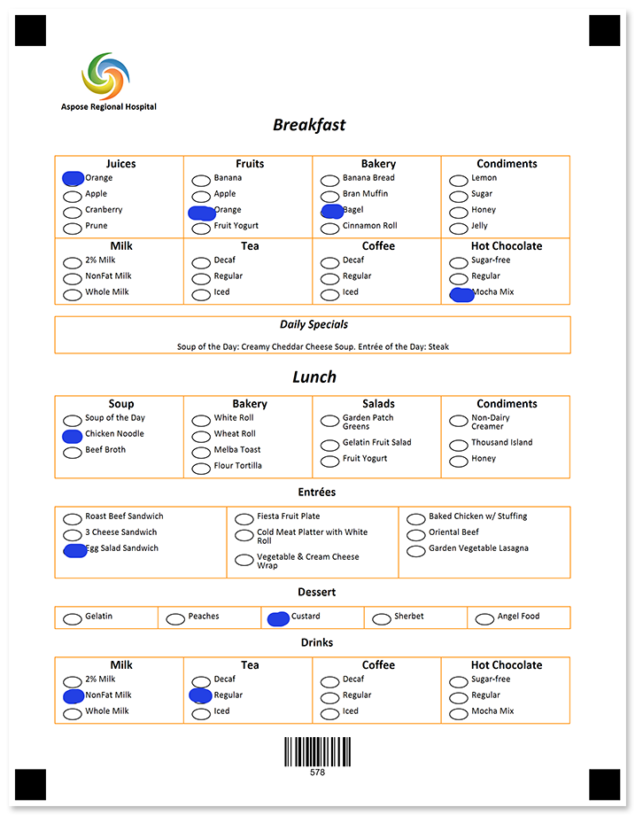

Request dietary restrictions or preferences from your attendees or residents and adjust the menu accordingly.


## Source code

<details>
<summary>Text markup</summary>

```
?image=logo.jpg
	x=300
	y=180
	width=200
	height=200
?text=Aspose Regional Hospital
	align=left
	font_style=bold
?container=breakfast_header
	columns_count=1
?block=main
	border=none
?content=Breakfast
	font_style=Italic, Bold
	font_size=18
	align=center
?empty_line=
	height=75
&block	
&container
?container=breakfast_content
	columns_count=4
	block_bottom_margin=0
	block_top_padding=0
	block_right_margin=0
?block=
	column=1
	border=square
	border_color=darkorange
?content=Juices
	font_style=bold
	font_size=12
	align=center
?vertical_choicebox=Juices
?answer=Orange
?content=Orange
&answer
?answer=Apple
?content=Apple
&answer
?answer=Cranberry
?content=Cranberry
&answer
?answer=Prune
?content=Prune
&answer
&vertical_choicebox
?empty_line=
	height=25
&block
?block=
	column=2
	border=square
	border_color=DarkOrange
?content=Fruits
	font_style=bold
	font_size=12
	align=center
?vertical_choicebox=Fruits
?answer=Banana
?content=Banana
&answer
?answer=Apple
?content=Apple
&answer
?answer=Orange
?content=Orange
&answer
?answer=Fruit Yogurt
?content=Fruit Yogurt
&answer
&vertical_choicebox
?empty_line=
	height=25
&block
?block=
	column=3
	border=square
	border_color=DarkOrange
?content=Bakery
	font_style=bold
	font_size=12
	align=center
?vertical_choicebox=Bakery
?answer=Banana Bread
?content=Banana Bread
&answer
?answer=Bran Muffin
?content=Bran Muffin
&answer
?answer=Bagel
?content=Bagel
&answer
?answer=Cinnamon Roll
?content=Cinnamon Roll
&answer
&vertical_choicebox
?empty_line=
	height=25
&block
?block=
	column=4
	border=square
	border_color=DarkOrange
?content=Condiments
	font_style=bold
	font_size=12
	align=center
?vertical_choicebox=Condiments
?answer=Lemon
?content=Lemon
&answer
?answer=Sugar
?content=Sugar
&answer
?answer=Honey
?content=Honey
&answer
?answer=Jelly
?content=Jelly
&answer
&vertical_choicebox
?empty_line=
	height=25
&block
?block=
	column=1
	border=square
	border_color=DarkOrange
?content=Milk
	font_style=bold
	font_size=12
	align=center
?vertical_choicebox=Milk
?answer=2% Milk
?content=2% Milk
&answer
?answer=NonFat Milk
?content=NonFat Milk
&answer
?answer=Whole Milk
?content=Whole Milk
&answer
&vertical_choicebox
?empty_line=
	height=25
&block
?block=
	column=2
	border=square
	border_color=DarkOrange
?content=Tea
	font_style=bold
	font_size=12
	align=center
?vertical_choicebox=Tea
?answer=Decaf
?content=Decaf
&answer
?answer=Regular
?content=Regular
&answer
?answer=Iced
?content=Iced
&answer
&vertical_choicebox
?empty_line=
	height=25
&block
?block=
	column=3
	border=square
	border_color=DarkOrange
?content=Coffee
	font_style=bold
	font_size=12
	align=center
?vertical_choicebox=Coffee
?answer=Decaf
?content=Decaf
&answer
?answer=Regular
?content=Regular
&answer
?answer=Iced
?content=Iced
&answer
&vertical_choicebox
?empty_line=
	height=25
&block
?block=
	column=4
	border=square
	border_color=DarkOrange
?content=Hot Chocolate
	font_style=bold
	font_size=12
	align=center
?vertical_choicebox=Hot Chocolate
?answer=Sugar-free
?content=Sugar-free
&answer
?answer=Regular
?content=Regular
&answer
?answer=Mocha Mix
?content=Mocha Mix
&answer
&vertical_choicebox
?empty_line=
	height=25
&block
&container
?empty_line=
	height=50
?container=specials
	columns_count=1
	block_bottom_margin=0
	block_top_padding=0
	block_right_margin=0
?block=
	column=1
	border=square
	border_color=DarkOrange
?content=Daily Specials
	font_style=italic, bold
	font_size=12
	align=center
?empty_line=
	height=50
?content=Soup of the Day: Creamy Cheddar Cheese Soup. Entrée of the Day: Steak
	align=center
&block
&container
?empty_line=
	height=50
?container=lunch_header
	columns_count=1
	block_bottom_margin=0
	block_top_padding=0
	block_right_margin=0
?block=
?content=Lunch
	font_style=Italic, Bold
	font_size=18
	align=center
?empty_line=
	height=75
&block
&container
?container=lunch_content
	columns_count=4
	block_bottom_margin=0
	block_top_padding=0
	block_right_margin=0
?block=
	column=1
	border=square
	border_color=DarkOrange
?content=Soup
	font_style=bold
	font_size=12
	align=center
?vertical_choicebox=Soup
?answer=Soup of the Day
?content=Soup of the Day
&answer
?answer=Chicken Noodle
?content=Chicken Noodle
&answer
?answer=Beef Broth
?content=Beef Broth
&answer
&vertical_choicebox
?empty_line=
	height=91
&block
?block=
	column=2
	border=square
	border_color=DarkOrange
?content=Bakery
	font_style=bold
	font_size=12
	align=center
?vertical_choicebox=Bakery
?answer=White Roll
?content=White Roll
&answer
?answer=Wheat Roll
?content=Wheat Roll
&answer
?answer=Melba Toast
?content=Melba Toast
&answer
?answer=Flour Tortilla
?content=Flour Tortilla
&answer
&vertical_choicebox
?empty_line=
	height=25
&block
?block=
	column=3
	border=square
	border_color=DarkOrange
?content=Salads
	font_style=bold
	font_size=12
	align=center
?vertical_choicebox=Salads
?answer=Garden Patch Greens
?content=Garden Patch Greens
&answer
?answer=Gelatin Fruit Salad
?content=Gelatin Fruit Salad
&answer
?answer=Fruit Yogurt
?content=Fruit Yogurt
&answer
&vertical_choicebox
?empty_line=
	height=55
&block
?block=
	column=4
	border=square
	border_color=DarkOrange
?content=Condiments
	font_style=bold
	font_size=12
	align=center
?vertical_choicebox=Condiments
?answer=Non-Dairy Creamer
?content=Non-Dairy Creamer
&answer
?answer=Thousand Island
?content=Thousand Island
&answer
?answer=Honey
?content=Honey
&answer
&vertical_choicebox
?empty_line=
	height=55
&block
&container
?empty_line=
	height=25
?text=Entrées
	align=center
	font_style=bold
	font_size=12
?empty_line=
	height=25
?container=Entrées
	columns_count=3
	block_bottom_margin=0
	block_top_padding=0
	block_right_margin=0
?block=
	column=1
	border=square
	border_color=DarkOrange
?vertical_choicebox=Entrées
?answer=Roast Beef Sandwich
?content=Roast Beef Sandwich
&answer
?answer=3 Cheese Sandwich
?content=3 Cheese Sandwich
&answer
?answer=Egg Salad Sandwich
?content=Egg Salad Sandwich
&answer
&vertical_choicebox
?empty_line=
	height=97
&block
?block=
	column=2
	border=square
	border_color=DarkOrange
?vertical_choicebox=Entrées
?answer=Fiesta Fruit Plate
?content=Fiesta Fruit Plate
&answer
?answer=Cold Meat Platter with White Roll
?content=Cold Meat Platter with White Roll
&answer
?answer=Vegetable & Cream Cheese Wrap
?content=Vegetable & Cream Cheese Wrap
&answer
&vertical_choicebox
?empty_line=
	height=25
&block
?block=
	column=3
	border=square
	border_color=DarkOrange
?vertical_choicebox=Entrées
?answer=Baked Chicken w/ Stuffing
?content=Baked Chicken w/ Stuffing
&answer
?answer=Oriental Beef
?content=Oriental Beef
&answer
?answer=Garden Vegetable Lasagna
?content=Garden Vegetable Lasagna
&answer
&vertical_choicebox
?empty_line=
	height=97
&block
&container
?empty_line=
	height=25
?text=Dessert
	align=center
	font_style=bold
	font_size=12
?empty_line=
	height=25
?container=Deserts
	columns_count=5
	block_bottom_margin=0
	block_top_padding=0
	block_right_margin=0
?block=
	column=1
	border=square
	border_color=DarkOrange
?vertical_choicebox=Dessert
?answer=Gelatin
?content=Gelatin
&answer
&vertical_choicebox
?empty_line=
	height=25
&block
?block=
	column=2
	border=square
	border_color=DarkOrange
?vertical_choicebox=Dessert
?answer=Peaches
?content=Peaches
&answer
&vertical_choicebox
?empty_line=
	height=25
&block
?block=
	column=3
	border=square
	border_color=DarkOrange
?vertical_choicebox=Dessert
?answer=Custard
?content=Custard
&answer
&vertical_choicebox
?empty_line=
	height=25
&block
?block=
	column=4
	border=square
	border_color=DarkOrange
?vertical_choicebox=Dessert
?answer=Sherbet
?content=Sherbet
&answer
&vertical_choicebox
?empty_line=
	height=25
&block
?block=
	column=5
	border=square
	border_color=DarkOrange
?vertical_choicebox=Dessert
?answer=Angel Food
?content=Angel Food
&answer
&vertical_choicebox
?empty_line=
	height=25
&block
&container
?empty_line=
	height=25
?text=Drinks
	align=center
	font_style=bold
	font_size=12
?empty_line=
	height=25
?container=drinks
	columns_count=4
	block_bottom_margin=0
	block_top_padding=0
	block_right_margin=0
?block=
	column=1
	border=square
	border_color=DarkOrange
?content=Milk
	font_style=bold
	font_size=12
	align=center
?vertical_choicebox=Milk
?answer=2% Milk
?content=2% Milk
&answer
?answer=NonFat Milk
?content=NonFat Milk
&answer
?answer=Whole Milk
?content=Whole Milk
&answer
&vertical_choicebox
?empty_line=
	height=25
&block
?block=
	column=2
	border=square
	border_color=DarkOrange
?content=Tea
	font_style=bold
	font_size=12
	align=center
?vertical_choicebox=Tea
?answer=Decaf
?content=Decaf
&answer
?answer=Regular
?content=Regular
&answer
?answer=Iced
?content=Iced
&answer
&vertical_choicebox
?empty_line=
	height=25
&block
?block=
	column=3
	border=square
	border_color=DarkOrange
?content=Coffee
	font_style=bold
	font_size=12
	align=center
?vertical_choicebox=Coffee
?answer=Decaf
?content=Decaf
&answer
?answer=Regular
?content=Regular
&answer
?answer=Iced
?content=Iced
&answer
&vertical_choicebox
?empty_line=
	height=25
&block
?block=
	column=4
	border=square
	border_color=DarkOrange
?content=Hot Chocolate
	font_style=bold
	font_size=12
	align=center
?vertical_choicebox=Hot Chocolate
?answer=Sugar-free
?content=Sugar-free
&answer
?answer=Regular
?content=Regular
&answer
?answer=Mocha Mix
?content=Mocha Mix
&answer
&vertical_choicebox
?empty_line=
	height=25
&block
&container
?empty_line=
	height=50
?barcode=RoomId
	codetext=true
	barcode_type=Code128
	value=578
```

</details>

<details>
<summary>JSON markup</summary>

```json
{
    "children": [{
            "children": [{
                    "align": "Center",
                    "name": "logo.jpg",
                    "x": 300,
                    "y": 180,
                    "height": 200,
                    "width": 200,
                    "element_type": "Image"
                }, {
                    "name": "Aspose Regional Hospital",
                    "font_style": "Bold",
                    "align": "Left",
                    "element_type": "Text"
                }, {
                    "height": 50,
                    "element_type": "EmptyLine"
                }, {
                    "name": "breakfast_header",
                    "children": [{
                            "name": "main",
                            "children": [{
                                    "name": "Breakfast",
                                    "font_style": [
                                        "Bold",
                                        "Italic"
                                    ],
                                    "font_size": 18,
                                    "align": "Center",
                                    "element_type": "Content"
                                }, {
                                    "height": 75,
                                    "element_type": "EmptyLine"
                                }
                            ],
                            "column": 1,
                            "element_type": "Block"
                        }
                    ],
                    "columns_count": 1,
                    "container_type": "Normal",
                    "element_type": "Container"
                }, {
                    "name": "breakfast_content",
                    "children": [{
                            "children": [{
                                    "name": "Juices",
                                    "font_style": "Bold",
                                    "font_size": 12,
                                    "align": "Center",
                                    "element_type": "Content"
                                }, {
                                    "name": "Juices",
                                    "children": [{
                                            "name": "Orange",
                                            "children": [{
                                                    "name": "Orange",
                                                    "align": "Left",
                                                    "element_type": "Content"
                                                }
                                            ],
                                            "bubble_type": "Round",
                                            "element_type": "Answer"
                                        }, {
                                            "name": "Apple",
                                            "children": [{
                                                    "name": "Apple",
                                                    "align": "Left",
                                                    "element_type": "Content"
                                                }
                                            ],
                                            "bubble_type": "Round",
                                            "element_type": "Answer"
                                        }, {
                                            "name": "Cranberry",
                                            "children": [{
                                                    "name": "Cranberry",
                                                    "align": "Left",
                                                    "element_type": "Content"
                                                }
                                            ],
                                            "bubble_type": "Round",
                                            "element_type": "Answer"
                                        }, {
                                            "name": "Prune",
                                            "children": [{
                                                    "name": "Prune",
                                                    "align": "Left",
                                                    "element_type": "Content"
                                                }
                                            ],
                                            "bubble_type": "Round",
                                            "element_type": "Answer"
                                        }
                                    ],
                                    "element_type": "VerticalChoiceBox",
                                    "top_padding": 0
                                }, {
                                    "height": 25,
                                    "element_type": "EmptyLine"
                                }
                            ],
                            "column": 1,
                            "border": "Square",
                            "border_color": "DarkOrange",
                            "element_type": "Block"
                        }, {
                            "children": [{
                                    "name": "Fruits",
                                    "font_style": "Bold",
                                    "font_size": 12,
                                    "align": "Center",
                                    "element_type": "Content"
                                }, {
                                    "name": "Fruits",
                                    "children": [{
                                            "name": "Banana",
                                            "children": [{
                                                    "name": "Banana",
                                                    "align": "Left",
                                                    "element_type": "Content"
                                                }
                                            ],
                                            "bubble_type": "Round",
                                            "element_type": "Answer"
                                        }, {
                                            "name": "Apple",
                                            "children": [{
                                                    "name": "Apple",
                                                    "align": "Left",
                                                    "element_type": "Content"
                                                }
                                            ],
                                            "bubble_type": "Round",
                                            "element_type": "Answer"
                                        }, {
                                            "name": "Orange",
                                            "children": [{
                                                    "name": "Orange",
                                                    "align": "Left",
                                                    "element_type": "Content"
                                                }
                                            ],
                                            "bubble_type": "Round",
                                            "element_type": "Answer"
                                        }, {
                                            "name": "Fruit Yogurt",
                                            "children": [{
                                                    "name": "Fruit Yogurt",
                                                    "align": "Left",
                                                    "element_type": "Content"
                                                }
                                            ],
                                            "bubble_type": "Round",
                                            "element_type": "Answer"
                                        }
                                    ],
                                    "element_type": "VerticalChoiceBox",
                                    "top_padding": 0
                                }, {
                                    "height": 25,
                                    "element_type": "EmptyLine"
                                }
                            ],
                            "column": 2,
                            "border": "Square",
                            "border_color": "DarkOrange",
                            "element_type": "Block"
                        }, {
                            "children": [{
                                    "name": "Bakery",
                                    "font_style": "Bold",
                                    "font_size": 12,
                                    "align": "Center",
                                    "element_type": "Content"
                                }, {
                                    "name": "Bakery",
                                    "children": [{
                                            "name": "Banana Bread",
                                            "children": [{
                                                    "name": "Banana Bread",
                                                    "align": "Left",
                                                    "element_type": "Content"
                                                }
                                            ],
                                            "bubble_type": "Round",
                                            "element_type": "Answer"
                                        }, {
                                            "name": "Bran Muffin",
                                            "children": [{
                                                    "name": "Bran Muffin",
                                                    "align": "Left",
                                                    "element_type": "Content"
                                                }
                                            ],
                                            "bubble_type": "Round",
                                            "element_type": "Answer"
                                        }, {
                                            "name": "Bagel",
                                            "children": [{
                                                    "name": "Bagel",
                                                    "align": "Left",
                                                    "element_type": "Content"
                                                }
                                            ],
                                            "bubble_type": "Round",
                                            "element_type": "Answer"
                                        }, {
                                            "name": "Cinnamon Roll",
                                            "children": [{
                                                    "name": "Cinnamon Roll",
                                                    "align": "Left",
                                                    "element_type": "Content"
                                                }
                                            ],
                                            "bubble_type": "Round",
                                            "element_type": "Answer"
                                        }
                                    ],
                                    "element_type": "VerticalChoiceBox",
                                    "top_padding": 0
                                }, {
                                    "height": 25,
                                    "element_type": "EmptyLine"
                                }
                            ],
                            "column": 3,
                            "border": "Square",
                            "border_color": "DarkOrange",
                            "element_type": "Block"
                        }, {
                            "children": [{
                                    "name": "Condiments",
                                    "font_style": "Bold",
                                    "font_size": 12,
                                    "align": "Center",
                                    "element_type": "Content"
                                }, {
                                    "name": "Condiments",
                                    "children": [{
                                            "name": "Lemon",
                                            "children": [{
                                                    "name": "Lemon",
                                                    "align": "Left",
                                                    "element_type": "Content"
                                                }
                                            ],
                                            "bubble_type": "Round",
                                            "element_type": "Answer"
                                        }, {
                                            "name": "Sugar",
                                            "children": [{
                                                    "name": "Sugar",
                                                    "align": "Left",
                                                    "element_type": "Content"
                                                }
                                            ],
                                            "bubble_type": "Round",
                                            "element_type": "Answer"
                                        }, {
                                            "name": "Honey",
                                            "children": [{
                                                    "name": "Honey",
                                                    "align": "Left",
                                                    "element_type": "Content"
                                                }
                                            ],
                                            "bubble_type": "Round",
                                            "element_type": "Answer"
                                        }, {
                                            "name": "Jelly",
                                            "children": [{
                                                    "name": "Jelly",
                                                    "align": "Left",
                                                    "element_type": "Content"
                                                }
                                            ],
                                            "bubble_type": "Round",
                                            "element_type": "Answer"
                                        }
                                    ],
                                    "element_type": "VerticalChoiceBox",
                                    "top_padding": 0
                                }, {
                                    "height": 25,
                                    "element_type": "EmptyLine"
                                }
                            ],
                            "column": 4,
                            "border": "Square",
                            "border_color": "DarkOrange",
                            "element_type": "Block"
                        }, {
                            "children": [{
                                    "name": "Milk",
                                    "font_style": "Bold",
                                    "font_size": 12,
                                    "align": "Center",
                                    "element_type": "Content"
                                }, {
                                    "name": "Milk",
                                    "children": [{
                                            "name": "2% Milk",
                                            "children": [{
                                                    "name": "2% Milk",
                                                    "align": "Left",
                                                    "element_type": "Content"
                                                }
                                            ],
                                            "bubble_type": "Round",
                                            "element_type": "Answer"
                                        }, {
                                            "name": "NonFat Milk",
                                            "children": [{
                                                    "name": "NonFat Milk",
                                                    "align": "Left",
                                                    "element_type": "Content"
                                                }
                                            ],
                                            "bubble_type": "Round",
                                            "element_type": "Answer"
                                        }, {
                                            "name": "Whole Milk",
                                            "children": [{
                                                    "name": "Whole Milk",
                                                    "align": "Left",
                                                    "element_type": "Content"
                                                }
                                            ],
                                            "bubble_type": "Round",
                                            "element_type": "Answer"
                                        }
                                    ],
                                    "element_type": "VerticalChoiceBox",
                                    "top_padding": 0
                                }, {
                                    "height": 25,
                                    "element_type": "EmptyLine"
                                }
                            ],
                            "column": 1,
                            "border": "Square",
                            "border_color": "DarkOrange",
                            "element_type": "Block"
                        }, {
                            "children": [{
                                    "name": "Tea",
                                    "font_style": "Bold",
                                    "font_size": 12,
                                    "align": "Center",
                                    "element_type": "Content"
                                }, {
                                    "name": "Tea",
                                    "children": [{
                                            "name": "Decaf",
                                            "children": [{
                                                    "name": "Decaf",
                                                    "align": "Left",
                                                    "element_type": "Content"
                                                }
                                            ],
                                            "bubble_type": "Round",
                                            "element_type": "Answer"
                                        }, {
                                            "name": "Regular",
                                            "children": [{
                                                    "name": "Regular",
                                                    "align": "Left",
                                                    "element_type": "Content"
                                                }
                                            ],
                                            "bubble_type": "Round",
                                            "element_type": "Answer"
                                        }, {
                                            "name": "Iced",
                                            "children": [{
                                                    "name": "Iced",
                                                    "align": "Left",
                                                    "element_type": "Content"
                                                }
                                            ],
                                            "bubble_type": "Round",
                                            "element_type": "Answer"
                                        }
                                    ],
                                    "element_type": "VerticalChoiceBox",
                                    "top_padding": 0
                                }, {
                                    "height": 25,
                                    "element_type": "EmptyLine"
                                }
                            ],
                            "column": 2,
                            "border": "Square",
                            "border_color": "DarkOrange",
                            "element_type": "Block"
                        }, {
                            "children": [{
                                    "name": "Coffee",
                                    "font_style": "Bold",
                                    "font_size": 12,
                                    "align": "Center",
                                    "element_type": "Content"
                                }, {
                                    "name": "Coffee",
                                    "children": [{
                                            "name": "Decaf",
                                            "children": [{
                                                    "name": "Decaf",
                                                    "align": "Left",
                                                    "element_type": "Content"
                                                }
                                            ],
                                            "bubble_type": "Round",
                                            "element_type": "Answer"
                                        }, {
                                            "name": "Regular",
                                            "children": [{
                                                    "name": "Regular",
                                                    "align": "Left",
                                                    "element_type": "Content"
                                                }
                                            ],
                                            "bubble_type": "Round",
                                            "element_type": "Answer"
                                        }, {
                                            "name": "Iced",
                                            "children": [{
                                                    "name": "Iced",
                                                    "align": "Left",
                                                    "element_type": "Content"
                                                }
                                            ],
                                            "bubble_type": "Round",
                                            "element_type": "Answer"
                                        }
                                    ],
                                    "element_type": "VerticalChoiceBox",
                                    "top_padding": 0
                                }, {
                                    "height": 25,
                                    "element_type": "EmptyLine"
                                }
                            ],
                            "column": 3,
                            "border": "Square",
                            "border_color": "DarkOrange",
                            "element_type": "Block"
                        }, {
                            "children": [{
                                    "name": "Hot Chocolate",
                                    "font_style": "Bold",
                                    "font_size": 12,
                                    "align": "Center",
                                    "element_type": "Content"
                                }, {
                                    "name": "Hot Chocolate",
                                    "children": [{
                                            "name": "Sugar-free",
                                            "children": [{
                                                    "name": "Sugar-free",
                                                    "align": "Left",
                                                    "element_type": "Content"
                                                }
                                            ],
                                            "bubble_type": "Round",
                                            "element_type": "Answer"
                                        }, {
                                            "name": "Regular",
                                            "children": [{
                                                    "name": "Regular",
                                                    "align": "Left",
                                                    "element_type": "Content"
                                                }
                                            ],
                                            "bubble_type": "Round",
                                            "element_type": "Answer"
                                        }, {
                                            "name": "Mocha Mix",
                                            "children": [{
                                                    "name": "Mocha Mix",
                                                    "align": "Left",
                                                    "element_type": "Content"
                                                }
                                            ],
                                            "bubble_type": "Round",
                                            "element_type": "Answer"
                                        }
                                    ],
                                    "element_type": "VerticalChoiceBox",
                                    "top_padding": 0
                                }, {
                                    "height": 25,
                                    "element_type": "EmptyLine"
                                }
                            ],
                            "column": 4,
                            "border": "Square",
                            "border_color": "DarkOrange",
                            "element_type": "Block"
                        }
                    ],
                    "columns_count": 4,
                    "container_type": "Normal",
                    "block_right_margin": 0,
                    "block_bottom_margin": 0,
                    "block_top_padding": 0,
                    "element_type": "Container"
                }, {
                    "height": 50,
                    "element_type": "EmptyLine"
                }, {
                    "name": "specials",
                    "children": [{
                            "children": [{
                                    "name": "Daily Specials",
                                    "font_style": [
                                        "Bold",
                                        "Italic"
                                    ],
                                    "font_size": 12,
                                    "align": "Center",
                                    "element_type": "Content"
                                }, {
                                    "height": 50,
                                    "element_type": "EmptyLine"
                                }, {
                                    "name": "Soup of the Day: Creamy Cheddar Cheese Soup. Entrée of the Day: Steak",
                                    "align": "Center",
                                    "element_type": "Content"
                                }
                            ],
                            "column": 1,
                            "border": "Square",
                            "border_color": "DarkOrange",
                            "element_type": "Block"
                        }
                    ],
                    "columns_count": 1,
                    "container_type": "Normal",
                    "block_right_margin": 0,
                    "block_bottom_margin": 0,
                    "block_top_padding": 0,
                    "element_type": "Container"
                }, {
                    "height": 50,
                    "element_type": "EmptyLine"
                }, {
                    "name": "lunch_header",
                    "children": [{
                            "children": [{
                                    "name": "Lunch",
                                    "font_style": [
                                        "Bold",
                                        "Italic"
                                    ],
                                    "font_size": 18,
                                    "align": "Center",
                                    "element_type": "Content"
                                }, {
                                    "height": 75,
                                    "element_type": "EmptyLine"
                                }
                            ],
                            "column": 1,
                            "element_type": "Block"
                        }
                    ],
                    "columns_count": 1,
                    "container_type": "Normal",
                    "block_right_margin": 0,
                    "block_bottom_margin": 0,
                    "block_top_padding": 0,
                    "element_type": "Container"
                }, {
                    "name": "lunch_content",
                    "children": [{
                            "children": [{
                                    "name": "Soup",
                                    "font_style": "Bold",
                                    "font_size": 12,
                                    "align": "Center",
                                    "element_type": "Content"
                                }, {
                                    "name": "Soup",
                                    "children": [{
                                            "name": "Soup of the Day",
                                            "children": [{
                                                    "name": "Soup of the Day",
                                                    "align": "Left",
                                                    "element_type": "Content"
                                                }
                                            ],
                                            "bubble_type": "Round",
                                            "element_type": "Answer"
                                        }, {
                                            "name": "Chicken Noodle",
                                            "children": [{
                                                    "name": "Chicken Noodle",
                                                    "align": "Left",
                                                    "element_type": "Content"
                                                }
                                            ],
                                            "bubble_type": "Round",
                                            "element_type": "Answer"
                                        }, {
                                            "name": "Beef Broth",
                                            "children": [{
                                                    "name": "Beef Broth",
                                                    "align": "Left",
                                                    "element_type": "Content"
                                                }
                                            ],
                                            "bubble_type": "Round",
                                            "element_type": "Answer"
                                        }
                                    ],
                                    "element_type": "VerticalChoiceBox",
                                    "top_padding": 0
                                }, {
                                    "height": 91,
                                    "element_type": "EmptyLine"
                                }
                            ],
                            "column": 1,
                            "border": "Square",
                            "border_color": "DarkOrange",
                            "element_type": "Block"
                        }, {
                            "children": [{
                                    "name": "Bakery",
                                    "font_style": "Bold",
                                    "font_size": 12,
                                    "align": "Center",
                                    "element_type": "Content"
                                }, {
                                    "name": "Bakery",
                                    "children": [{
                                            "name": "White Roll",
                                            "children": [{
                                                    "name": "White Roll",
                                                    "align": "Left",
                                                    "element_type": "Content"
                                                }
                                            ],
                                            "bubble_type": "Round",
                                            "element_type": "Answer"
                                        }, {
                                            "name": "Wheat Roll",
                                            "children": [{
                                                    "name": "Wheat Roll",
                                                    "align": "Left",
                                                    "element_type": "Content"
                                                }
                                            ],
                                            "bubble_type": "Round",
                                            "element_type": "Answer"
                                        }, {
                                            "name": "Melba Toast",
                                            "children": [{
                                                    "name": "Melba Toast",
                                                    "align": "Left",
                                                    "element_type": "Content"
                                                }
                                            ],
                                            "bubble_type": "Round",
                                            "element_type": "Answer"
                                        }, {
                                            "name": "Flour Tortilla",
                                            "children": [{
                                                    "name": "Flour Tortilla",
                                                    "align": "Left",
                                                    "element_type": "Content"
                                                }
                                            ],
                                            "bubble_type": "Round",
                                            "element_type": "Answer"
                                        }
                                    ],
                                    "element_type": "VerticalChoiceBox",
                                    "top_padding": 0
                                }, {
                                    "height": 25,
                                    "element_type": "EmptyLine"
                                }
                            ],
                            "column": 2,
                            "border": "Square",
                            "border_color": "DarkOrange",
                            "element_type": "Block"
                        }, {
                            "children": [{
                                    "name": "Salads",
                                    "font_style": "Bold",
                                    "font_size": 12,
                                    "align": "Center",
                                    "element_type": "Content"
                                }, {
                                    "name": "Salads",
                                    "children": [{
                                            "name": "Garden Patch Greens",
                                            "children": [{
                                                    "name": "Garden Patch Greens",
                                                    "align": "Left",
                                                    "element_type": "Content"
                                                }
                                            ],
                                            "bubble_type": "Round",
                                            "element_type": "Answer"
                                        }, {
                                            "name": "Gelatin Fruit Salad",
                                            "children": [{
                                                    "name": "Gelatin Fruit Salad",
                                                    "align": "Left",
                                                    "element_type": "Content"
                                                }
                                            ],
                                            "bubble_type": "Round",
                                            "element_type": "Answer"
                                        }, {
                                            "name": "Fruit Yogurt",
                                            "children": [{
                                                    "name": "Fruit Yogurt",
                                                    "align": "Left",
                                                    "element_type": "Content"
                                                }
                                            ],
                                            "bubble_type": "Round",
                                            "element_type": "Answer"
                                        }
                                    ],
                                    "element_type": "VerticalChoiceBox",
                                    "top_padding": 0
                                }, {
                                    "height": 55,
                                    "element_type": "EmptyLine"
                                }
                            ],
                            "column": 3,
                            "border": "Square",
                            "border_color": "DarkOrange",
                            "element_type": "Block"
                        }, {
                            "children": [{
                                    "name": "Condiments",
                                    "font_style": "Bold",
                                    "font_size": 12,
                                    "align": "Center",
                                    "element_type": "Content"
                                }, {
                                    "name": "Condiments",
                                    "children": [{
                                            "name": "Non-Dairy Creamer",
                                            "children": [{
                                                    "name": "Non-Dairy Creamer",
                                                    "align": "Left",
                                                    "element_type": "Content"
                                                }
                                            ],
                                            "bubble_type": "Round",
                                            "element_type": "Answer"
                                        }, {
                                            "name": "Thousand Island",
                                            "children": [{
                                                    "name": "Thousand Island",
                                                    "align": "Left",
                                                    "element_type": "Content"
                                                }
                                            ],
                                            "bubble_type": "Round",
                                            "element_type": "Answer"
                                        }, {
                                            "name": "Honey",
                                            "children": [{
                                                    "name": "Honey",
                                                    "align": "Left",
                                                    "element_type": "Content"
                                                }
                                            ],
                                            "bubble_type": "Round",
                                            "element_type": "Answer"
                                        }
                                    ],
                                    "element_type": "VerticalChoiceBox",
                                    "top_padding": 0
                                }, {
                                    "height": 55,
                                    "element_type": "EmptyLine"
                                }
                            ],
                            "column": 4,
                            "border": "Square",
                            "border_color": "DarkOrange",
                            "element_type": "Block"
                        }
                    ],
                    "columns_count": 4,
                    "container_type": "Normal",
                    "block_right_margin": 0,
                    "block_bottom_margin": 0,
                    "block_top_padding": 0,
                    "element_type": "Container"
                }, {
                    "height": 25,
                    "element_type": "EmptyLine"
                }, {
                    "name": "Entrées",
                    "font_style": "Bold",
                    "font_size": 12,
                    "align": "Center",
                    "element_type": "Text"
                }, {
                    "height": 25,
                    "element_type": "EmptyLine"
                }, {
                    "name": "Entrées",
                    "children": [{
                            "children": [{
                                    "name": "Entrées",
                                    "children": [{
                                            "name": "Roast Beef Sandwich",
                                            "children": [{
                                                    "name": "Roast Beef Sandwich",
                                                    "align": "Left",
                                                    "element_type": "Content"
                                                }
                                            ],
                                            "bubble_type": "Round",
                                            "element_type": "Answer"
                                        }, {
                                            "name": "3 Cheese Sandwich",
                                            "children": [{
                                                    "name": "3 Cheese Sandwich",
                                                    "align": "Left",
                                                    "element_type": "Content"
                                                }
                                            ],
                                            "bubble_type": "Round",
                                            "element_type": "Answer"
                                        }, {
                                            "name": "Egg Salad Sandwich",
                                            "children": [{
                                                    "name": "Egg Salad Sandwich",
                                                    "align": "Left",
                                                    "element_type": "Content"
                                                }
                                            ],
                                            "bubble_type": "Round",
                                            "element_type": "Answer"
                                        }
                                    ],
                                    "element_type": "VerticalChoiceBox",
                                    "top_padding": 0
                                }, {
                                    "height": 97,
                                    "element_type": "EmptyLine"
                                }
                            ],
                            "column": 1,
                            "border": "Square",
                            "border_color": "DarkOrange",
                            "element_type": "Block"
                        }, {
                            "children": [{
                                    "name": "Entrées",
                                    "children": [{
                                            "name": "Fiesta Fruit Plate",
                                            "children": [{
                                                    "name": "Fiesta Fruit Plate",
                                                    "align": "Left",
                                                    "element_type": "Content"
                                                }
                                            ],
                                            "bubble_type": "Round",
                                            "element_type": "Answer"
                                        }, {
                                            "name": "Cold Meat Platter with White Roll",
                                            "children": [{
                                                    "name": "Cold Meat Platter with White Roll",
                                                    "align": "Left",
                                                    "element_type": "Content"
                                                }
                                            ],
                                            "bubble_type": "Round",
                                            "element_type": "Answer"
                                        }, {
                                            "name": "Vegetable & Cream Cheese Wrap",
                                            "children": [{
                                                    "name": "Vegetable & Cream Cheese Wrap",
                                                    "align": "Left",
                                                    "element_type": "Content"
                                                }
                                            ],
                                            "bubble_type": "Round",
                                            "element_type": "Answer"
                                        }
                                    ],
                                    "element_type": "VerticalChoiceBox",
                                    "top_padding": 0
                                }, {
                                    "height": 25,
                                    "element_type": "EmptyLine"
                                }
                            ],
                            "column": 2,
                            "border": "Square",
                            "border_color": "DarkOrange",
                            "element_type": "Block"
                        }, {
                            "children": [{
                                    "name": "Entrées",
                                    "children": [{
                                            "name": "Baked Chicken w/ Stuffing",
                                            "children": [{
                                                    "name": "Baked Chicken w/ Stuffing",
                                                    "align": "Left",
                                                    "element_type": "Content"
                                                }
                                            ],
                                            "bubble_type": "Round",
                                            "element_type": "Answer"
                                        }, {
                                            "name": "Oriental Beef",
                                            "children": [{
                                                    "name": "Oriental Beef",
                                                    "align": "Left",
                                                    "element_type": "Content"
                                                }
                                            ],
                                            "bubble_type": "Round",
                                            "element_type": "Answer"
                                        }, {
                                            "name": "Garden Vegetable Lasagna",
                                            "children": [{
                                                    "name": "Garden Vegetable Lasagna",
                                                    "align": "Left",
                                                    "element_type": "Content"
                                                }
                                            ],
                                            "bubble_type": "Round",
                                            "element_type": "Answer"
                                        }
                                    ],
                                    "element_type": "VerticalChoiceBox",
                                    "top_padding": 0
                                }, {
                                    "height": 97,
                                    "element_type": "EmptyLine"
                                }
                            ],
                            "column": 3,
                            "border": "Square",
                            "border_color": "DarkOrange",
                            "element_type": "Block"
                        }
                    ],
                    "columns_count": 3,
                    "container_type": "Normal",
                    "block_right_margin": 0,
                    "block_bottom_margin": 0,
                    "block_top_padding": 0,
                    "element_type": "Container"
                }, {
                    "height": 25,
                    "element_type": "EmptyLine"
                }, {
                    "name": "Dessert",
                    "font_style": "Bold",
                    "font_size": 12,
                    "align": "Center",
                    "element_type": "Text"
                }, {
                    "height": 25,
                    "element_type": "EmptyLine"
                }, {
                    "name": "Deserts",
                    "children": [{
                            "children": [{
                                    "name": "Dessert",
                                    "children": [{
                                            "name": "Gelatin",
                                            "children": [{
                                                    "name": "Gelatin",
                                                    "align": "Left",
                                                    "element_type": "Content"
                                                }
                                            ],
                                            "bubble_type": "Round",
                                            "element_type": "Answer"
                                        }
                                    ],
                                    "element_type": "VerticalChoiceBox",
                                    "top_padding": 0
                                }, {
                                    "height": 25,
                                    "element_type": "EmptyLine"
                                }
                            ],
                            "column": 1,
                            "border": "Square",
                            "border_color": "DarkOrange",
                            "element_type": "Block"
                        }, {
                            "children": [{
                                    "name": "Dessert",
                                    "children": [{
                                            "name": "Peaches",
                                            "children": [{
                                                    "name": "Peaches",
                                                    "align": "Left",
                                                    "element_type": "Content"
                                                }
                                            ],
                                            "bubble_type": "Round",
                                            "element_type": "Answer"
                                        }
                                    ],
                                    "element_type": "VerticalChoiceBox",
                                    "top_padding": 0
                                }, {
                                    "height": 25,
                                    "element_type": "EmptyLine"
                                }
                            ],
                            "column": 2,
                            "border": "Square",
                            "border_color": "DarkOrange",
                            "element_type": "Block"
                        }, {
                            "children": [{
                                    "name": "Dessert",
                                    "children": [{
                                            "name": "Custard",
                                            "children": [{
                                                    "name": "Custard",
                                                    "align": "Left",
                                                    "element_type": "Content"
                                                }
                                            ],
                                            "bubble_type": "Round",
                                            "element_type": "Answer"
                                        }
                                    ],
                                    "element_type": "VerticalChoiceBox",
                                    "top_padding": 0
                                }, {
                                    "height": 25,
                                    "element_type": "EmptyLine"
                                }
                            ],
                            "column": 3,
                            "border": "Square",
                            "border_color": "DarkOrange",
                            "element_type": "Block"
                        }, {
                            "children": [{
                                    "name": "Dessert",
                                    "children": [{
                                            "name": "Sherbet",
                                            "children": [{
                                                    "name": "Sherbet",
                                                    "align": "Left",
                                                    "element_type": "Content"
                                                }
                                            ],
                                            "bubble_type": "Round",
                                            "element_type": "Answer"
                                        }
                                    ],
                                    "element_type": "VerticalChoiceBox",
                                    "top_padding": 0
                                }, {
                                    "height": 25,
                                    "element_type": "EmptyLine"
                                }
                            ],
                            "column": 4,
                            "border": "Square",
                            "border_color": "DarkOrange",
                            "element_type": "Block"
                        }, {
                            "children": [{
                                    "name": "Dessert",
                                    "children": [{
                                            "name": "Angel Food",
                                            "children": [{
                                                    "name": "Angel Food",
                                                    "align": "Left",
                                                    "element_type": "Content"
                                                }
                                            ],
                                            "bubble_type": "Round",
                                            "element_type": "Answer"
                                        }
                                    ],
                                    "element_type": "VerticalChoiceBox",
                                    "top_padding": 0
                                }, {
                                    "height": 25,
                                    "element_type": "EmptyLine"
                                }
                            ],
                            "column": 5,
                            "border": "Square",
                            "border_color": "DarkOrange",
                            "element_type": "Block"
                        }
                    ],
                    "columns_count": 5,
                    "container_type": "Normal",
                    "block_right_margin": 0,
                    "block_bottom_margin": 0,
                    "block_top_padding": 0,
                    "element_type": "Container"
                }, {
                    "height": 25,
                    "element_type": "EmptyLine"
                }, {
                    "name": "Drinks",
                    "font_style": "Bold",
                    "font_size": 12,
                    "align": "Center",
                    "element_type": "Text"
                }, {
                    "height": 25,
                    "element_type": "EmptyLine"
                }, {
                    "name": "drinks",
                    "children": [{
                            "children": [{
                                    "name": "Milk",
                                    "font_style": "Bold",
                                    "font_size": 12,
                                    "align": "Center",
                                    "element_type": "Content"
                                }, {
                                    "name": "Milk",
                                    "children": [{
                                            "name": "2% Milk",
                                            "children": [{
                                                    "name": "2% Milk",
                                                    "align": "Left",
                                                    "element_type": "Content"
                                                }
                                            ],
                                            "bubble_type": "Round",
                                            "element_type": "Answer"
                                        }, {
                                            "name": "NonFat Milk",
                                            "children": [{
                                                    "name": "NonFat Milk",
                                                    "align": "Left",
                                                    "element_type": "Content"
                                                }
                                            ],
                                            "bubble_type": "Round",
                                            "element_type": "Answer"
                                        }, {
                                            "name": "Whole Milk",
                                            "children": [{
                                                    "name": "Whole Milk",
                                                    "align": "Left",
                                                    "element_type": "Content"
                                                }
                                            ],
                                            "bubble_type": "Round",
                                            "element_type": "Answer"
                                        }
                                    ],
                                    "element_type": "VerticalChoiceBox",
                                    "top_padding": 0
                                }, {
                                    "height": 25,
                                    "element_type": "EmptyLine"
                                }
                            ],
                            "column": 1,
                            "border": "Square",
                            "border_color": "DarkOrange",
                            "element_type": "Block"
                        }, {
                            "children": [{
                                    "name": "Tea",
                                    "font_style": "Bold",
                                    "font_size": 12,
                                    "align": "Center",
                                    "element_type": "Content"
                                }, {
                                    "name": "Tea",
                                    "children": [{
                                            "name": "Decaf",
                                            "children": [{
                                                    "name": "Decaf",
                                                    "align": "Left",
                                                    "element_type": "Content"
                                                }
                                            ],
                                            "bubble_type": "Round",
                                            "element_type": "Answer"
                                        }, {
                                            "name": "Regular",
                                            "children": [{
                                                    "name": "Regular",
                                                    "align": "Left",
                                                    "element_type": "Content"
                                                }
                                            ],
                                            "bubble_type": "Round",
                                            "element_type": "Answer"
                                        }, {
                                            "name": "Iced",
                                            "children": [{
                                                    "name": "Iced",
                                                    "align": "Left",
                                                    "element_type": "Content"
                                                }
                                            ],
                                            "bubble_type": "Round",
                                            "element_type": "Answer"
                                        }
                                    ],
                                    "element_type": "VerticalChoiceBox",
                                    "top_padding": 0
                                }, {
                                    "height": 25,
                                    "element_type": "EmptyLine"
                                }
                            ],
                            "column": 2,
                            "border": "Square",
                            "border_color": "DarkOrange",
                            "element_type": "Block"
                        }, {
                            "children": [{
                                    "name": "Coffee",
                                    "font_style": "Bold",
                                    "font_size": 12,
                                    "align": "Center",
                                    "element_type": "Content"
                                }, {
                                    "name": "Coffee",
                                    "children": [{
                                            "name": "Decaf",
                                            "children": [{
                                                    "name": "Decaf",
                                                    "align": "Left",
                                                    "element_type": "Content"
                                                }
                                            ],
                                            "bubble_type": "Round",
                                            "element_type": "Answer"
                                        }, {
                                            "name": "Regular",
                                            "children": [{
                                                    "name": "Regular",
                                                    "align": "Left",
                                                    "element_type": "Content"
                                                }
                                            ],
                                            "bubble_type": "Round",
                                            "element_type": "Answer"
                                        }, {
                                            "name": "Iced",
                                            "children": [{
                                                    "name": "Iced",
                                                    "align": "Left",
                                                    "element_type": "Content"
                                                }
                                            ],
                                            "bubble_type": "Round",
                                            "element_type": "Answer"
                                        }
                                    ],
                                    "element_type": "VerticalChoiceBox",
                                    "top_padding": 0
                                }, {
                                    "height": 25,
                                    "element_type": "EmptyLine"
                                }
                            ],
                            "column": 3,
                            "border": "Square",
                            "border_color": "DarkOrange",
                            "element_type": "Block"
                        }, {
                            "children": [{
                                    "name": "Hot Chocolate",
                                    "font_style": "Bold",
                                    "font_size": 12,
                                    "align": "Center",
                                    "element_type": "Content"
                                }, {
                                    "name": "Hot Chocolate",
                                    "children": [{
                                            "name": "Sugar-free",
                                            "children": [{
                                                    "name": "Sugar-free",
                                                    "align": "Left",
                                                    "element_type": "Content"
                                                }
                                            ],
                                            "bubble_type": "Round",
                                            "element_type": "Answer"
                                        }, {
                                            "name": "Regular",
                                            "children": [{
                                                    "name": "Regular",
                                                    "align": "Left",
                                                    "element_type": "Content"
                                                }
                                            ],
                                            "bubble_type": "Round",
                                            "element_type": "Answer"
                                        }, {
                                            "name": "Mocha Mix",
                                            "children": [{
                                                    "name": "Mocha Mix",
                                                    "align": "Left",
                                                    "element_type": "Content"
                                                }
                                            ],
                                            "bubble_type": "Round",
                                            "element_type": "Answer"
                                        }
                                    ],
                                    "element_type": "VerticalChoiceBox",
                                    "top_padding": 0
                                }, {
                                    "height": 25,
                                    "element_type": "EmptyLine"
                                }
                            ],
                            "column": 4,
                            "border": "Square",
                            "border_color": "DarkOrange",
                            "element_type": "Block"
                        }
                    ],
                    "columns_count": 4,
                    "container_type": "Normal",
                    "block_right_margin": 0,
                    "block_bottom_margin": 0,
                    "block_top_padding": 0,
                    "element_type": "Container"
                }, {
                    "height": 25,
                    "element_type": "EmptyLine"
                }, {
                    "name": "RoomId",
                    "value": "578",
                    "barcode_type": "code128",
                    "align": "Center",
                    "codetext": true,
                    "element_type": "Barcode"
                }
            ],
            "element_type": "Page"
        }
    ],
    "element_type": "Template"
}
```

</details>

## Page settings

This template was generated using the following paper size, orientation, font, and other [layout settings](/omr/net/generate-template/page-setup/):

```csharp
GlobalPageSettings settings = new GlobalPageSettings
{
    PaperSize = PaperSize.Letter,
    Orientation = Orientation.Vertical,
    BubbleColor = Color.Black,
    BubbleSize = BubbleSize.Normal,
    FontStyle = FontStyle.Regular,
    FontSize = 9,
    FontFamily = "Calibri",
};
```

## Recognition results



```
Element Name,Value,
Bakery,"Bagel"
Bakery,""
Coffee,""
Coffee,""
Condiments,""
Condiments,""
Dessert,""
Dessert,""
Dessert,"Custard"
Dessert,""
Dessert,""
Entrées,""
Entrées,""
Entrées,"Egg Salad Sandwich"
Fruits,"Orange"
Hot Chocolate,""
Hot Chocolate,"Mocha Mix"
Juices,"Orange"
Milk,"NonFat Milk"
Milk,""
RoomId,"578"
Salads,""
Soup,"Chicken Noodle"
Tea,""
Tea,"Regular"
```

## Download

[Click here](https://github.com/aspose-omr/Aspose.OMR-Documentation/blob/master/net/showcases/download/meal-color.zip) to download full template sources and related files. 

**Package structure:**

File | Description
---- | -----------
**hospital-breakfast.csv** | recognition results based on the filled form available in this package
**hospital-breakfast.json** | source code in [JSON markup](/omr/net/json-markup/)
**hospital-breakfast.omr** | recognition pattern
**hospital-breakfast.png** | printable form
**hospital-breakfast.txt** | source code in [text markup](/omr/net/txt-markup/)
**hospital-breakfast-recognized.png** | filled form
**logo.jpg** | company logo
**settings.txt** | [page settings](/omr/net/generate-template/page-setup/)
