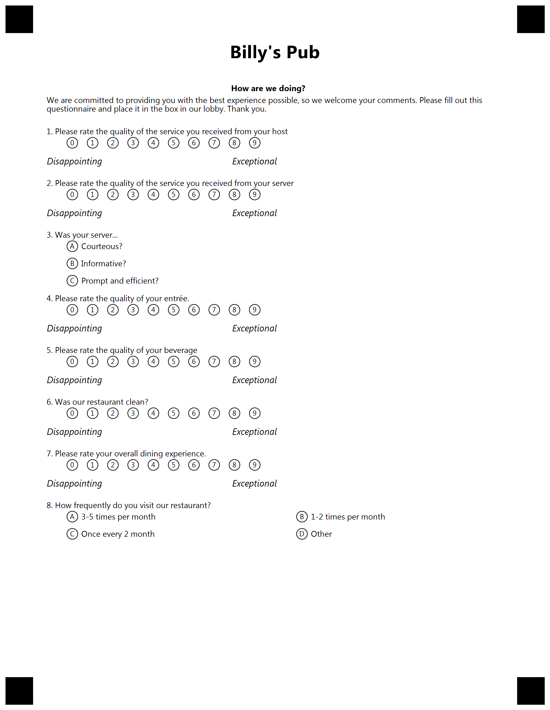

{} 

This example constructed for custom GlobalPageSettings. Please use provided settings from text below for best result.

{}


**Template generation call**

<details>
<summary>C# Code</summary>

````java
var license = new License();
license.SetLicense(@"C:\Users\User\Desktop\Aspose.license");

var engine = new OmrEngine();
var settings = new GlobalPageSettings
{
	PaperSize = PaperSize.Letter,
	Orientation = Orientation.Vertical,
	BubbleColor = Color.Black,
	BubbleSize = BubbleSize.Small,
	FontStyle = FontStyle.Regular,
	FontSize = 9,
	FontFamily = "Segoe UI",
	ImagesPaths = images
};
var configPath = @"C:\Users\User\Desktop\template\template.txt";

var result = engine.GenerateTemplate(configPath, settings);
result.Save(@"C:\Users\User\Desktop\template", "generated_template");
````

</details>

**Template TXT markdown**

<details>
<summary>TXT markdown</summary>

```text
?text=Billy's Pub
	align=center
	font_style=bold
	font_size=20
?empty_line=
	height=80
?container=header
	columns_count=1
?block=header
?content=How are we doing?
	align=center
	font_style=bold
?content=We are committed to providing you with the best experience possible, so we welcome your comments. Please fill out this questionnaire and place it in the box in our lobby. Thank you.
&block
&container
#Please rate the quality of the service you received from your host
	(0) (1) (2) (3) (4) (5) (6) (7) (8) (9)
?container=text
	columns_proportions=40%-60%
?block=left
	column=1
?content=Disappointing
	align=left
	font_style=italic
	font_size=10
&block
?block=right
	column=2
?content=Exceptional
	align=left
	font_style=italic
	font_size=10
&block
&container
#Please rate the quality of the service you received from your server
	(0) (1) (2) (3) (4) (5) (6) (7) (8) (9)
?container=text
	columns_proportions=40%-60%
?block=left
	column=1
?content=Disappointing
	align=left
	font_style=italic
	font_size=10
&block
?block=right
	column=2
?content=Exceptional
	align=left
	font_style=italic
	font_size=10
&block
&container
#Was your server...
	(A) Courteous?
	(B) Informative?
	(C) Prompt and efficient?
#Please rate the quality of your entrée.
	(0) (1) (2) (3) (4) (5) (6) (7) (8) (9)
?container=text
	columns_proportions=40%-60%
?block=left
	column=1
?content=Disappointing
	align=left
	font_style=italic
	font_size=10
&block
?block=right
	column=2
?content=Exceptional
	align=left
	font_style=italic
	font_size=10
&block
&container
#Please rate the quality of your beverage
	(0) (1) (2) (3) (4) (5) (6) (7) (8) (9)
?container=text
	columns_proportions=40%-60%
?block=left
	column=1
?content=Disappointing
	align=left
	font_style=italic
	font_size=10
&block
?block=right
	column=2
?content=Exceptional
	align=left
	font_style=italic
	font_size=10
&block
&container
#Was our restaurant clean?
	(0) (1) (2) (3) (4) (5) (6) (7) (8) (9)
?container=text
	columns_proportions=40%-60%
?block=left
	column=1
?content=Disappointing
	align=left
	font_style=italic
	font_size=10
&block
?block=right
	column=2
?content=Exceptional
	align=left
	font_style=italic
	font_size=10
&block
&container
#Please rate your overall dining experience.
	(0) (1) (2) (3) (4) (5) (6) (7) (8) (9)
?container=text
	columns_proportions=40%-60%
?block=left
	column=1
?content=Disappointing
	align=left
	font_style=italic
	font_size=10
&block
?block=right
	column=2
?content=Exceptional
	align=left
	font_style=italic
	font_size=10
&block
&container
#How frequently do you visit our restaurant?
	(A) 3-5 times per month (B) 1-2 times per month
	(C) Once every 2 month (D) Other
```

</details>

**Template result**

****