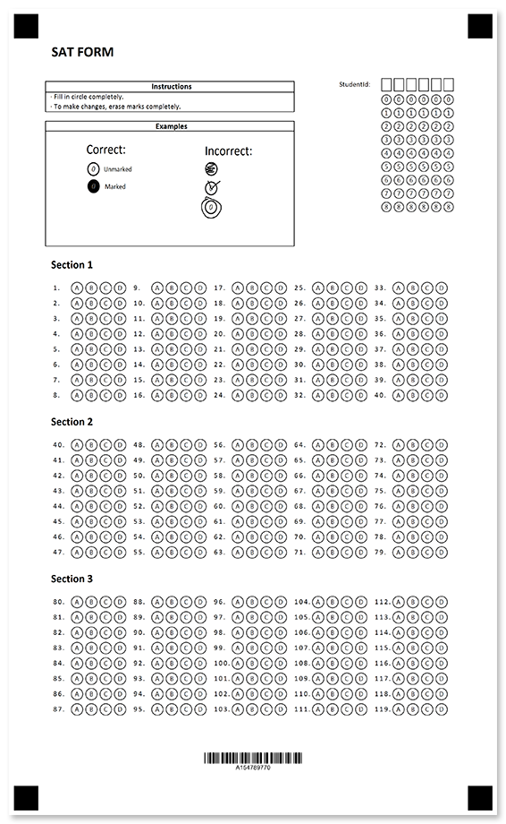

Ready-made answer sheet for SAT Exam - one of the most popular and globally accepted assessment tests for students.



## Source code

<details>
<summary>Text markup</summary>

```
?text=SAT FORM
	font_style=bold
	font_size=18
	align=left
?empty_line=100
	height=100
?container=header
	columns_proportions=60%-10%-30%
	block_top_padding=0
	block_bottom_margin=0
?block=instructions
	column=1
	border=square
?content=Instructions
	font_style=bold
	font_size=10
	align=center
?empty_line=
	height=5
&block
?block=
	column=1
	border=square
?content=· Fill in circle completely. 
?content=· To make changes, erase marks completely.
&block
?block=space
	column=1
?empty_line=
	height=50
&block
?block=examples_header
	column=1
	border=square
?content=Examples
	font_style=bold
	font_size=10
	align=center
&block
?block=example_pic
	column=1
	border=square
?image=example.png
	width=1400
	height=600
	align=left
&block
?block=student_id
	column=2
?grid=StudentId
	column=3
	sections_count=6
	options_count=9
	header_type=square
	align=right
	bubble_size=small
&block
&container
?empty_line=
	height=100
?text=Section 1
	font_style=bold
	font_size=14
	align=left
?empty_line=
	height=50
?answer_sheet=MainQuestions
	elements_count=40
	columns_count=5
	bubble_size=normal	
	
?empty_line=
	height=50
?text=Section 2
	font_style=bold
	font_size=14
	align=left
?empty_line=
	height=50
?answer_sheet=MainQuestions
	elements_count=40
	columns_count=5
	bubble_size=normal
	start_id=40	
	
?empty_line=
	height=50
?text=Section 3
	font_style=bold
	font_size=14
	align=left
?empty_line=
	height=50
?answer_sheet=MainQuestions
	elements_count=40
	columns_count=5
	bubble_size=normal
	start_id=80

?empty_line=50
	height=100
?barcode=test_id
	codetext=true
	value=15478977
	barcode_type=Code32
```

</details>

<details>
<summary>JSON markup</summary>

```json
{
  "name": null,
  "children": [
    {
      "name": null,
      "children": [
        {
          "name": "SAT FORM\r\n",
          "font_family": "Calibri",
          "font_style": "Bold",
          "font_size": 18,
          "align": "Left",
          "element_type": "Text"
        },
        {
          "name": "100",
          "height": 100,
          "element_type": "EmptyLine"
        },
        {
          "name": "header",
          "children": [
            {
              "name": "instructions",
              "children": [
                {
                  "name": "Instructions",
                  "font_family": "Calibri",
                  "font_style": "Bold",
                  "font_size": 10,
                  "content_type": "Normal",
                  "align": "Center",
                  "element_type": "Content"
                },
                {
                  "name": "",
                  "height": 5,
                  "element_type": "EmptyLine"
                }
              ],
              "column": 1,
              "border": "Square",
              "border_size": 3,
              "border_color": "Black",
              "is_clipped": false,
              "element_type": "Block"
            },
            {
              "name": "",
              "children": [
                {
                  "name": "· Fill in circle completely. ",
                  "font_family": "Calibri",
                  "font_style": "Regular",
                  "font_size": 9,
                  "content_type": "Normal",
                  "align": "Left",
                  "element_type": "Content"
                },
                {
                  "name": "· To make changes, erase marks completely.",
                  "font_family": "Calibri",
                  "font_style": "Regular",
                  "font_size": 9,
                  "content_type": "Normal",
                  "align": "Left",
                  "element_type": "Content"
                }
              ],
              "column": 1,
              "border": "Square",
              "border_size": 3,
              "border_color": "Black",
              "is_clipped": false,
              "element_type": "Block"
            },
            {
              "name": "space",
              "children": [
                {
                  "name": "",
                  "height": 50,
                  "element_type": "EmptyLine"
                }
              ],
              "column": 1,
              "border": "None",
              "border_size": 3,
              "border_color": "Black",
              "is_clipped": false,
              "element_type": "Block"
            },
            {
              "name": "examples_header",
              "children": [
                {
                  "name": "Examples",
                  "font_family": "Calibri",
                  "font_style": "Bold",
                  "font_size": 10,
                  "content_type": "Normal",
                  "align": "Center",
                  "element_type": "Content"
                }
              ],
              "column": 1,
              "border": "Square",
              "border_size": 3,
              "border_color": "Black",
              "is_clipped": false,
              "element_type": "Block"
            },
            {
              "name": "example_pic",
              "children": [
                {
                  "align": "Left",
                  "name": "example.png",
                  "image_path": null,
                  "x": -1,
                  "y": -1,
                  "height": 600,
                  "width": 1400,
                  "element_type": "Image"
                }
              ],
              "column": 1,
              "border": "Square",
              "border_size": 3,
              "border_color": "Black",
              "is_clipped": false,
              "element_type": "Block"
            },
            {
              "name": "student_id",
              "children": [
                {
                  "name": "StudentId",
                  "column": 3,
                  "sections_count": 6,
                  "options_count": 9,
                  "align": "Right",
                  "header_type": "Square",
                  "header_border_size": 3,
                  "header_border_color": "Black",
                  "orientation": "Horizontal",
                  "vertical_margin": 0,
                  "bubble_size": "Small",
                  "bubble_type": "Round",
                  "x": -1,
                  "y": -1,
                  "element_type": "Grid"
                }
              ],
              "column": 2,
              "border": "None",
              "border_size": 3,
              "border_color": "Black",
              "is_clipped": false,
              "element_type": "Block"
            }
          ],
          "columns_count": 0,
          "columns_proportions": [
            60,
            10,
            30
          ],
          "container_type": "Normal",
          "block_right_margin": 40,
          "block_bottom_margin": 0,
          "block_top_padding": 0,
          "element_type": "Container"
        },
        {
          "name": "",
          "height": 100,
          "element_type": "EmptyLine"
        },
        {
          "name": "Section 1\r\n",
          "font_family": "Calibri",
          "font_style": "Bold",
          "font_size": 14,
          "align": "Left",
          "element_type": "Text"
        },
        {
          "name": "",
          "height": 50,
          "element_type": "EmptyLine"
        },
        {
          "bubble_size": "Normal",
          "name": "MainQuestions",
          "column": 0,
          "elements_count": 40,
          "columns_count": 5,
          "answers_count": 4,
          "start_id": -1,
          "vertical_margin": 0,
          "bubble_type": "Round",
          "answers_list": null,
          "element_type": "AnswerSheet"
        },
        {
          "name": "",
          "height": 50,
          "element_type": "EmptyLine"
        },
        {
          "name": "Section 2\r\n",
          "font_family": "Calibri",
          "font_style": "Bold",
          "font_size": 14,
          "align": "Left",
          "element_type": "Text"
        },
        {
          "name": "",
          "height": 50,
          "element_type": "EmptyLine"
        },
        {
          "bubble_size": "Normal",
          "name": "MainQuestions",
          "column": 0,
          "elements_count": 40,
          "columns_count": 5,
          "answers_count": 4,
          "start_id": 40,
          "vertical_margin": 0,
          "bubble_type": "Round",
          "answers_list": null,
          "element_type": "AnswerSheet"
        },
        {
          "name": "",
          "height": 50,
          "element_type": "EmptyLine"
        },
        {
          "name": "Section 3\r\n",
          "font_family": "Calibri",
          "font_style": "Bold",
          "font_size": 14,
          "align": "Left",
          "element_type": "Text"
        },
        {
          "name": "",
          "height": 50,
          "element_type": "EmptyLine"
        },
        {
          "bubble_size": "Normal",
          "name": "MainQuestions",
          "column": 0,
          "elements_count": 40,
          "columns_count": 5,
          "answers_count": 4,
          "start_id": 80,
          "vertical_margin": 0,
          "bubble_type": "Round",
          "answers_list": null,
          "element_type": "AnswerSheet"
        },
        {
          "name": null,
          "height": 0,
          "element_type": "EmptyLine"
        },
        {
          "name": "50",
          "height": 100,
          "element_type": "EmptyLine"
        },
        {
          "name": "test_id",
          "value": "15478977",
          "barcode_type": "Code32",
          "qr_version": "Auto",
          "align": "Center",
          "height": -1,
          "codetext": true,
          "X": -1,
          "Y": -1,
          "element_type": "Barcode"
        }
      ],
      "element_type": "Page"
    }
  ],
  "element_type": "Template"
}
```

</details>

## Page settings

This template was generated using the following paper size, orientation, font, and other [layout settings](/omr/net/generate-template/page-setup/):

```csharp
GlobalPageSettings settings = new GlobalPageSettings
{
    PaperSize = PaperSize.Legal,
    Orientation = Orientation.Vertical,
    BubbleColor = Color.Black,
    BubbleSize = BubbleSize.Normal,
    FontStyle = FontStyle.Regular,
    FontSize = 9,
    FontFamily = "Calibri",
};
```

## Recognition results


```
Element Name,Value,
MainQuestions1,"A"
MainQuestions2,"B"
MainQuestions3,""
MainQuestions4,""
MainQuestions5,"C"
MainQuestions6,""
MainQuestions7,""
MainQuestions8,""
MainQuestions9,""
MainQuestions10,"D"
MainQuestions11,"C"
MainQuestions12,""
MainQuestions13,"B"
MainQuestions14,""
MainQuestions15,""
MainQuestions16,""
MainQuestions17,""
MainQuestions18,"D"
MainQuestions19,""
MainQuestions20,""
MainQuestions21,"B"
MainQuestions22,""
MainQuestions23,""
MainQuestions24,""
MainQuestions25,""
MainQuestions26,""
MainQuestions27,""
MainQuestions28,"D"
MainQuestions29,""
MainQuestions30,""
MainQuestions31,""
MainQuestions32,""
MainQuestions33,""
MainQuestions34,""
MainQuestions35,""
MainQuestions36,"D"
MainQuestions37,""
MainQuestions38,""
MainQuestions39,""
MainQuestions40,""
MainQuestions40,"A"
MainQuestions41,""
MainQuestions42,"C"
MainQuestions43,""
MainQuestions44,""
MainQuestions45,""
MainQuestions46,""
MainQuestions47,""
MainQuestions48,""
MainQuestions49,""
MainQuestions50,""
MainQuestions51,""
MainQuestions52,"A"
MainQuestions53,""
MainQuestions54,""
MainQuestions55,""
MainQuestions56,""
MainQuestions57,""
MainQuestions58,""
MainQuestions59,"B"
MainQuestions60,"D"
MainQuestions61,""
MainQuestions62,""
MainQuestions63,""
MainQuestions64,""
MainQuestions65,""
MainQuestions66,"C"
MainQuestions67,""
MainQuestions68,""
MainQuestions69,""
MainQuestions70,""
MainQuestions71,""
MainQuestions72,"D"
MainQuestions73,""
MainQuestions74,""
MainQuestions75,""
MainQuestions76,""
MainQuestions77,""
MainQuestions78,""
MainQuestions79,""
MainQuestions80,"B"
MainQuestions81,""
MainQuestions82,""
MainQuestions83,""
MainQuestions84,""
MainQuestions85,""
MainQuestions86,""
MainQuestions87,""
MainQuestions88,""
MainQuestions89,""
MainQuestions90,"A"
MainQuestions91,""
MainQuestions92,""
MainQuestions93,""
MainQuestions94,""
MainQuestions95,""
MainQuestions96,"B"
MainQuestions97,""
MainQuestions98,""
MainQuestions99,""
MainQuestions100,""
MainQuestions101,""
MainQuestions102,""
MainQuestions103,"B"
MainQuestions104,"C"
MainQuestions105,""
MainQuestions106,""
MainQuestions107,""
MainQuestions108,""
MainQuestions109,""
MainQuestions110,""
MainQuestions111,""
MainQuestions112,"D"
MainQuestions113,""
MainQuestions114,""
MainQuestions115,""
MainQuestions116,""
MainQuestions117,""
MainQuestions118,""
MainQuestions119,""
StudentId,"455432"
test_id,"154789770"
```

## Download

[Click here](https://github.com/aspose-omr/Aspose.OMR-Documentation/blob/master/net/showcases/download/sat-bw.zip) to download full template sources and related files. 

**Package structure:**

File | Description
---- | -----------
**example.png** | "how to fill" guidelines
**logo.jpg** | company logo
**sat.csv** | recognition results based on the filled form available in this package
**sat.json** | source code in [JSON markup](/omr/net/json-markup/)
**sat.omr** | recognition pattern
**sat.png** | printable form
**sat.txt** | source code in [text markup](/omr/net/txt-markup/)
**sat-recognized.png** | filled form
**settings.json** | [page settings](/omr/net/generate-template/page-setup/)
