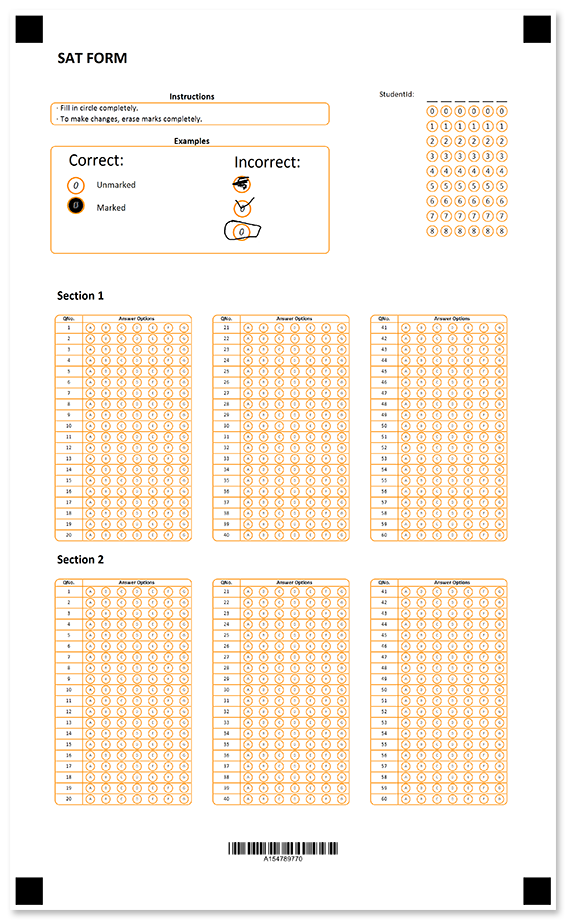
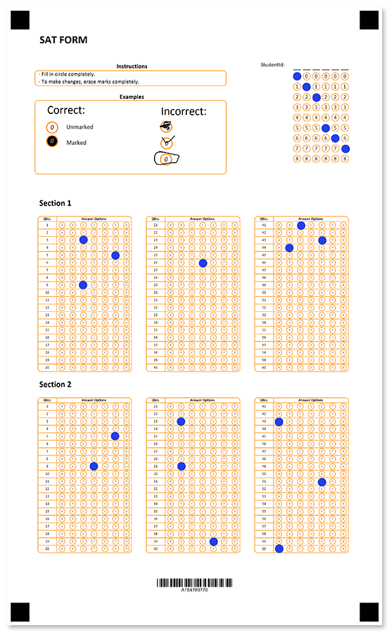

Ready-made answer sheet for SAT Exam - one of the most popular and globally accepted assessment tests for students.



## Source code

<details>
<summary>Text markup</summary>

```
?text=SAT FORM
	font_style=bold
	font_size=18
	align=left
?empty_line=100
	height=100
?container=header
	columns_proportions=60%-10%-30%
	block_top_padding=0
	block_bottom_margin=0
?block=instructions
	column=1
?content=Instructions
	font_style=bold
	font_size=10
	align=center
?empty_line=
	height=5
&block
?block=
	column=1
	border=rounded
	border_color=DarkOrange
?content=· Fill in circle completely. 
?content=· To make changes, erase marks completely.
&block
?block=space
	column=1
?empty_line=
	height=50
&block
?block=examples_header
	column=1
?content=Examples
	font_style=bold
	font_size=10
	align=center
&block
?block=example_pic
	column=1
	border=rounded
	border_color=DarkOrange
?image=example.png
	width=1200
	height=500
	align=left
&block
?block=student_id
	column=2
?grid=StudentId
	column=3
	sections_count=6
	options_count=9
	header_type=underline
	align=center
	bubble_size=small
&block
&container
?empty_line=
	height=100
?text=Section 1
	font_style=bold
	font_size=14
	align=left
?empty_line=
	height=50
?custom_answer_sheet=Section 1
	border=rounded
	amount=60
	columns_count=3
	row_proportions=20%-80%
	border_color=DarkOrange
?header=123
?column=QNo.
	font_size=6
	font_style=bold
	align=center
?column=Answer Options
	font_size=6
	font_style=bold
	align=center
&header
?custom_row=row_%index%
?content=%index%
	font_size=6
	align=center
?bubble_array=b_%index%
	answers_list=(A)(B)(C)(D)(E)(F)(G)
	bubble_size=extrasmall
	font_size=4
&custom_row
&custom_answer_sheet
	
?empty_line=
	height=50
?text=Section 2
	font_style=bold
	font_size=14
	align=left
?empty_line=
	height=50
?custom_answer_sheet=Section 2
	border=rounded
	amount=60
	columns_count=3
	row_proportions=20%-80%
	border_color=DarkOrange
?header=123
?column=QNo.
	font_size=6
	font_style=bold
	align=center
?column=Answer Options
	font_size=6
	font_style=bold
	align=center
&header
?custom_row=row_%index%
?content=%index%
	font_size=6
	align=center
?bubble_array=b_%index%
	answers_list=(A)(B)(C)(D)(E)(F)(G)
	bubble_size=extrasmall
	font_size=4
&custom_row
&custom_answer_sheet
	

?empty_line=50
	height=100
?barcode=test_id
	codetext=true
	value=15478977
	barcode_type=Code32
```

</details>

<details>
<summary>JSON markup</summary>

```json
{
    "children": [{
            "children": [{
                    "name": "SAT FORM",
                    "font_style": "Bold",
                    "font_size": 18,
                    "align": "Left",
                    "element_type": "Text"
                }, {
                    "name": "100",
                    "height": 100,
                    "element_type": "EmptyLine"
                }, {
                    "name": "header",
                    "children": [{
                            "name": "instructions",
                            "children": [{
                                    "name": "Instructions",
                                    "font_style": "Bold",
                                    "font_size": 10,
                                    "align": "Center",
                                    "element_type": "Content"
                                }, {
                                    "height": 5,
                                    "element_type": "EmptyLine"
                                }
                            ],
                            "column": 1,
                            "element_type": "Block"
                        }, {
                            "children": [{
                                    "name": "· Fill in circle completely. ",
                                    "align": "Left",
                                    "element_type": "Content"
                                }, {
                                    "name": "· To make changes, erase marks completely.",
                                    "align": "Left",
                                    "element_type": "Content"
                                }
                            ],
                            "column": 1,
                            "border": "Rounded",
                            "border_color": "DarkOrange",
                            "element_type": "Block"
                        }, {
                            "name": "space",
                            "children": [{
                                    "height": 50,
                                    "element_type": "EmptyLine"
                                }
                            ],
                            "column": 1,
                            "element_type": "Block"
                        }, {
                            "name": "examples_header",
                            "children": [{
                                    "name": "Examples",
                                    "font_style": "Bold",
                                    "font_size": 10,
                                    "align": "Center",
                                    "element_type": "Content"
                                }
                            ],
                            "column": 1,
                            "element_type": "Block"
                        }, {
                            "name": "example_pic",
                            "children": [{
                                    "align": "Left",
                                    "name": "example.png",
                                    "height": 500,
                                    "width": 1200,
                                    "element_type": "Image"
                                }
                            ],
                            "column": 1,
                            "border": "Rounded",
                            "border_color": "DarkOrange",
                            "element_type": "Block"
                        }, {
                            "name": "student_id",
                            "children": [{
                                    "bubble_size": "Small",
                                    "name": "StudentId",
                                    "column": 3,
                                    "sections_count": 6,
                                    "options_count": 9,
                                    "align": "Center",
                                    "header_type": "Underline",
                                    "header_border_size": 3,
                                    "header_border_color": "Black",
                                    "orientation": "Horizontal",
                                    "element_type": "Grid"
                                }
                            ],
                            "column": 2,
                            "element_type": "Block"
                        }
                    ],
                    "columns_proportions": [
                        60,
                        10,
                        30
                    ],
                    "container_type": "Normal",
                    "block_bottom_margin": 0,
                    "block_top_padding": 0,
                    "element_type": "Container"
                }, {
                    "height": 100,
                    "element_type": "EmptyLine"
                }, {
                    "name": "Section 1",
                    "font_style": "Bold",
                    "font_size": 14,
                    "align": "Left",
                    "element_type": "Text"
                }, {
                    "height": 50,
                    "element_type": "EmptyLine"
                }, {
                    "columns_count": 3,
                    "amount": 60,
                    "name": "Section 1",
                    "border": "Rounded",
                    "border_color": "DarkOrange",
                    "children": [{
                            "name": "123",
                            "children": [{
                                    "name": "QNo.",
                                    "font_style": "Bold",
                                    "font_size": 6,
                                    "align": "Center",
                                    "element_type": "Content"
                                }, {
                                    "name": "Answer Options",
                                    "font_style": "Bold",
                                    "font_size": 6,
                                    "align": "Center",
                                    "element_type": "Content"
                                }
                            ],
                            "element_type": "TableHeader"
                        }, {
                            "name": "row_%index%",
                            "children": [{
                                    "name": "%index%",
                                    "font_size": 6,
                                    "align": "Center",
                                    "element_type": "Content"
                                }, {
                                    "name": "b_%index%",
                                    "answers_list": [
                                        "A",
                                        "B",
                                        "C",
                                        "D",
                                        "E",
                                        "F",
                                        "G"
                                    ],
                                    "font_size": 4,
                                    "bubble_size": "Extrasmall",
                                    "element_type": "BubbleArray"
                                }
                            ],
                            "element_type": "CustomRow"
                        }
                    ],
                    "element_type": "CustomAnswerSheet",
                    "row_proportions": [
                        20,
                        80
                    ]
                }, {
                    "height": 50,
                    "element_type": "EmptyLine"
                }, {
                    "name": "Section 2",
                    "font_style": "Bold",
                    "font_size": 14,
                    "align": "Left",
                    "element_type": "Text"
                }, {
                    "height": 50,
                    "element_type": "EmptyLine"
                }, {
                    "columns_count": 3,
                    "amount": 60,
                    "name": "Section 2",
                    "border": "Rounded",
                    "border_color": "DarkOrange",
                    "children": [{
                            "name": "123",
                            "children": [{
                                    "name": "QNo.",
                                    "font_style": "Bold",
                                    "font_size": 6,
                                    "align": "Center",
                                    "element_type": "Content"
                                }, {
                                    "name": "Answer Options",
                                    "font_style": "Bold",
                                    "font_size": 6,
                                    "align": "Center",
                                    "element_type": "Content"
                                }
                            ],
                            "element_type": "TableHeader"
                        }, {
                            "name": "row_%index%",
                            "children": [{
                                    "name": "%index%",
                                    "font_size": 6,
                                    "align": "Center",
                                    "element_type": "Content"
                                }, {
                                    "name": "b_%index%",
                                    "answers_list": [
                                        "A",
                                        "B",
                                        "C",
                                        "D",
                                        "E",
                                        "F",
                                        "G"
                                    ],
                                    "font_size": 4,
                                    "bubble_size": "Extrasmall",
                                    "element_type": "BubbleArray"
                                }
                            ],
                            "element_type": "CustomRow"
                        }
                    ],
                    "element_type": "CustomAnswerSheet",
                    "row_proportions": [
                        20,
                        80
                    ]
                }, {
                    "element_type": "EmptyLine"
                }, {
                    "name": "50",
                    "height": 100,
                    "element_type": "EmptyLine"
                }, {
                    "name": "test_id",
                    "value": "15478977",
                    "barcode_type": "code32",
                    "align": "Center",
                    "codetext": true,
                    "element_type": "Barcode"
                }
            ],
            "element_type": "Page"
        }
    ],
    "element_type": "Template"
}
```

</details>

## Page settings

This template was generated using the following paper size, orientation, font, and other [layout settings](/omr/net/generate-template/page-setup/):

```csharp
GlobalPageSettings settings = new GlobalPageSettings
{
    PaperSize = PaperSize.Legal,
    Orientation = Orientation.Vertical,
    BubbleColor = Color.DarkOrange,
    BubbleSize = BubbleSize.Normal,
    FontStyle = FontStyle.Regular,
    FontSize = 9,
    FontFamily = "Calibri",
};
```

## Recognition results



```
Element Name,Value,
Section 1_1,""
Section 1_2,""
Section 1_3,"C"
Section 1_4,""
Section 1_5,"F"
Section 1_6,""
Section 1_7,""
Section 1_8,""
Section 1_9,"C"
Section 1_10,""
Section 1_11,""
Section 1_12,""
Section 1_13,""
Section 1_14,""
Section 1_15,""
Section 1_16,""
Section 1_17,""
Section 1_18,""
Section 1_19,""
Section 1_20,""
Section 1_21,""
Section 1_22,""
Section 1_23,""
Section 1_24,""
Section 1_25,""
Section 1_26,"D"
Section 1_27,""
Section 1_28,""
Section 1_29,""
Section 1_30,""
Section 1_31,""
Section 1_32,""
Section 1_33,""
Section 1_34,""
Section 1_35,""
Section 1_36,""
Section 1_37,""
Section 1_38,""
Section 1_39,""
Section 1_40,""
Section 1_41,"C"
Section 1_42,""
Section 1_43,"E"
Section 1_44,"B"
Section 1_45,""
Section 1_46,""
Section 1_47,""
Section 1_48,""
Section 1_49,""
Section 1_50,""
Section 1_51,""
Section 1_52,""
Section 1_53,""
Section 1_54,""
Section 1_55,""
Section 1_56,""
Section 1_57,""
Section 1_58,""
Section 1_59,""
Section 1_60,""
Section 2_1,""
Section 2_2,""
Section 2_3,""
Section 2_4,""
Section 2_5,"F"
Section 2_6,""
Section 2_7,""
Section 2_8,""
Section 2_9,"D"
Section 2_10,""
Section 2_11,""
Section 2_12,""
Section 2_13,""
Section 2_14,""
Section 2_15,""
Section 2_16,""
Section 2_17,""
Section 2_18,""
Section 2_19,""
Section 2_20,""
Section 2_21,""
Section 2_22,""
Section 2_23,"B"
Section 2_24,""
Section 2_25,""
Section 2_26,""
Section 2_27,""
Section 2_28,""
Section 2_29,"B"
Section 2_30,""
Section 2_31,""
Section 2_32,""
Section 2_33,""
Section 2_34,""
Section 2_35,""
Section 2_36,""
Section 2_37,""
Section 2_38,""
Section 2_39,"E"
Section 2_40,""
Section 2_41,""
Section 2_42,""
Section 2_43,"A"
Section 2_44,""
Section 2_45,""
Section 2_46,""
Section 2_47,""
Section 2_48,""
Section 2_49,""
Section 2_50,""
Section 2_51,"E"
Section 2_52,""
Section 2_53,""
Section 2_54,""
Section 2_55,""
Section 2_56,""
Section 2_57,""
Section 2_58,""
Section 2_59,""
Section 2_60,"A"
StudentId,"012567"
test_id,"154789770"
```

## Download

[Click here](https://github.com/aspose-omr/Aspose.OMR-Documentation/blob/master/net/showcases/download/sat-group.zip) to download full template sources and related files. 

**Package structure:**

File | Description
---- | -----------
**example.png** | "how to fill" guidelines
**logo.jpg** | company logo
**sat.csv** | recognition results based on the filled form available in this package
**sat.json** | source code in [JSON markup](/omr/net/json-markup/)
**sat.omr** | recognition pattern
**sat.png** | printable form
**sat.txt** | source code in [text markup](/omr/net/txt-markup/)
**sat-recognized.png** | filled form
**settings.txt** | [page settings](/omr/net/generate-template/page-setup/)
