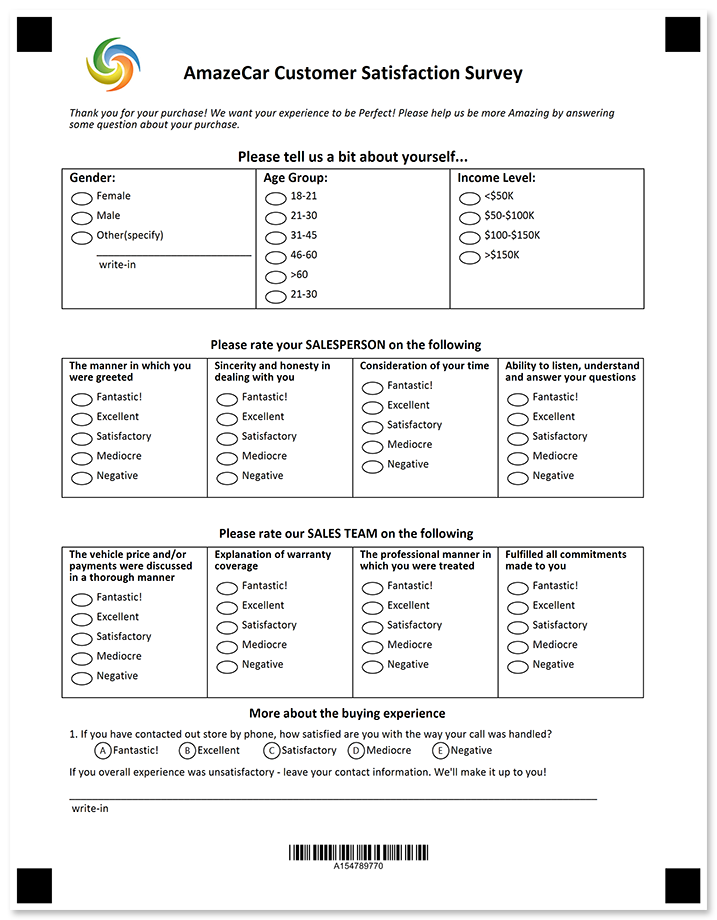
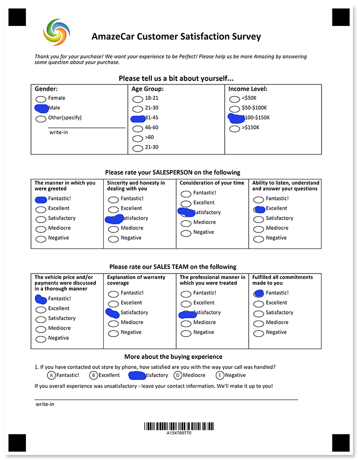

Understand how your clients are satisfied with your services, capabilities and their customer journey.



## Source code

<details>
<summary>Text markup</summary>

```
?text=AmazeCar Customer Satisfaction Survey
	font_style=bold
	font_size=18
	align=center
?image=logo.jpg
	width=200
	height=200
	align=left
	y=100
	x=278
?container=description
	columns_count=1
?block=
	column=1
?content=Thank you for your purchase! We want your experience to be Perfect! Please help us be more Amazing by answering some question about your purchase.
	font_style=Italic
&block
&container
?container=about yourself_header
	columns_proportions=100%
	block_bottom_margin=0
	block_top_padding=0
?block=
	column=1
	border=none
?content=Please tell us a bit about yourself...
	font_style=bold
	font_size=14
	align=center
&block
&container
?container=about yourself_content
	columns_count=3
	block_bottom_margin=0
	block_top_padding=0
	block_right_margin=0
?block=
	column=1
	border=square
?content=Gender:
	font_style=bold
	font_size=12
?vertical_choicebox=Gender
?answer=Female
?content=Female
&answer
?answer=Male
?content=Male
&answer
?answer=Other(specify)
?content=Other(specify)
?write_in=Gender
&answer
&vertical_choicebox
?empty_line=
	height=21
&block
?block=
	column=2
	border=square
?content=Age Group:
	font_style=bold
	font_size=12
?vertical_choicebox=Age Group
?answer=18-21
?content=18-21
&answer
?answer=21-30
?content=21-30
&answer
?answer=31-45
?content=31-45
&answer
?answer=46-60
?content=46-60
&answer
?answer=>60
?content=>60
&answer
?answer=21-30
?content=21-30
&answer
&vertical_choicebox
?empty_line=
	height=23
&block
?block=
	column=3
	border=square
?content=Income Level:
	font_style=bold
	font_size=12
?vertical_choicebox=Gender
?answer=<$50K
?content=<$50K
&answer
?answer=$50-$100K
?content=$50-$100K
&answer
?answer=$100-$150K
?content=$100-$150K
&answer
?answer=>$150K
?content=>$150K
&answer
&vertical_choicebox
?empty_line=
	height=177
&block
&container
?container=salesperson_header
	columns_count=1
	block_bottom_margin=0
	block_top_padding=0
?block=
	column=1
	border=none
?content=Please rate your SALESPERSON on the following
	font_style=bold
	font_size=12
	align=center
&block
&container
?container=salesperson_content
	columns_count=4
	block_bottom_margin=0
	block_top_padding=0
	block_right_margin=0
?block=
	column=1
	border=square
?content=The manner in which you were greeted
	font_style=bold
	font_size=10
?vertical_choicebox=The manner in which you were greeted
?answer=Fantastic!
?content=Fantastic!
&answer
?answer=Excellent
?content=Excellent
&answer
?answer=Satisfactory
?content=Satisfactory
&answer
?answer=Mediocre
?content=Mediocre
&answer
?answer=Negative
?content=Negative
&answer
&vertical_choicebox
?empty_line=
	height=57
&block
?block=
	column=2
	border=square
?content=Sincerity and honesty in dealing with you
	font_style=bold
	font_size=10
?vertical_choicebox=Sincerity and honesty in dealing with you
?answer=Fantastic!
?content=Fantastic!
&answer
?answer=Excellent
?content=Excellent
&answer
?answer=Satisfactory
?content=Satisfactory
&answer
?answer=Mediocre
?content=Mediocre
&answer
?answer=Negative
?content=Negative
&answer
&vertical_choicebox
?empty_line=
	height=57
&block
?block=
	column=3
	border=square
?content=Consideration of your time
	font_style=bold
	font_size=10
?vertical_choicebox=Consideration of your time
?answer=Fantastic!
?content=Fantastic!
&answer
?answer=Excellent
?content=Excellent
&answer
?answer=Satisfactory
?content=Satisfactory
&answer
?answer=Mediocre
?content=Mediocre
&answer
?answer=Negative
?content=Negative
&answer
&vertical_choicebox
?empty_line=
	height=57
&block
?block=
	column=4
	border=square
?content=Ability to listen, understand and answer your questions
	font_style=bold
	font_size=10
?vertical_choicebox=Ability to listen, understand and answer your questions
?answer=Fantastic!
?content=Fantastic!
&answer
?answer=Excellent
?content=Excellent
&answer
?answer=Satisfactory
?content=Satisfactory
&answer
?answer=Mediocre
?content=Mediocre
&answer
?answer=Negative
?content=Negative
&answer
&vertical_choicebox
&block
&container
?container=salesteam_header
	columns_count=1
	block_bottom_margin=0
	block_top_padding=0
?block=
	column=1
	border=none
?content=Please rate our SALES TEAM on the following
	font_style=bold
	font_size=12
	align=center
&block
&container
?container=salesteam_content
	columns_count=4
	block_bottom_margin=0
	block_top_padding=0
	block_right_margin=0
?block=
	column=1
	border=square
?content=The vehicle price and/or payments were discussed in a thorough manner
	font_style=bold
	font_size=10
?vertical_choicebox=The vehicle price and/or payments were discussed in a thorough manner
?answer=Fantastic!
?content=Fantastic!
&answer
?answer=Excellent
?content=Excellent
&answer
?answer=Satisfactory
?content=Satisfactory
&answer
?answer=Mediocre
?content=Mediocre
&answer
?answer=Negative
?content=Negative
&answer
&vertical_choicebox
&block
?block=
	column=2
	border=square
?content=Explanation of warranty coverage
	font_style=bold
	font_size=10
?vertical_choicebox=Explanation of warranty coverage
?answer=Fantastic!
?content=Fantastic!
&answer
?answer=Excellent
?content=Excellent
&answer
?answer=Satisfactory
?content=Satisfactory
&answer
?answer=Mediocre
?content=Mediocre
&answer
?answer=Negative
?content=Negative
&answer
&vertical_choicebox
?empty_line=
	height=57
&block
?block=
	column=3
	border=square
?content=The professional manner in which you were treated
	font_style=bold
	font_size=10
?vertical_choicebox=The professional manner in which you were treated
?answer=Fantastic!
?content=Fantastic!
&answer
?answer=Excellent
?content=Excellent
&answer
?answer=Satisfactory
?content=Satisfactory
&answer
?answer=Mediocre
?content=Mediocre
&answer
?answer=Negative
?content=Negative
&answer
&vertical_choicebox
?empty_line=
	height=57
&block
?block=
	column=4
	border=square
?content=Fulfilled all commitments made to you
	font_style=bold
	font_size=10
?vertical_choicebox=Fulfilled all commitments made to you
?answer=Fantastic!
?content=Fantastic!
&answer
?answer=Excellent
?content=Excellent
&answer
?answer=Satisfactory
?content=Satisfactory
&answer
?answer=Mediocre
?content=Mediocre
&answer
?answer=Negative
?content=Negative
&answer
&vertical_choicebox
?empty_line=
	height=57
&block
&container
?container=other_header
	columns_count=1
	block_bottom_margin=0
	block_top_padding=0
?block=
	column=1
	border=none
?content=More about the buying experience
	font_style=bold
	font_size=12
	align=center
&block
&container
#If you have contacted out store by phone, how satisfied are you with the way your call was handled?
	()Fantastic! ()Excellent ()Satisfactory ()Mediocre ()Negative
?container=
	columns_count=1
?block=
	column=1	
?content=If you overall experience was unsatisfactory - leave your contact information. We'll make it up to you!
?write_in=contact_information
&block
&container
?barcode=test_id
	codetext=true
	value=15478977
	barcode_type=Code32
```

</details>

<details>
<summary>JSON markup</summary>

```json
{
  "name": null,
  "children": [
    {
      "name": null,
      "children": [
        {
          "name": "AmazeCar Customer Satisfaction Survey\r\n",
          "font_family": "Calibri",
          "font_style": "Bold",
          "font_size": 18,
          "align": "Center",
          "element_type": "Text"
        },
        {
          "align": "Left",
          "name": "logo.jpg",
          "image_path": null,
          "x": 278,
          "y": 100,
          "height": 200,
          "width": 200,
          "element_type": "Image"
        },
        {
          "name": "description",
          "children": [
            {
              "name": "",
              "children": [
                {
                  "name": "Thank you for your purchase! We want your experience to be Perfect! Please help us be more Amazing by answering some question about your purchase.",
                  "font_family": "Calibri",
                  "font_style": "Italic",
                  "font_size": 10,
                  "content_type": "Normal",
                  "align": "Left",
                  "element_type": "Content"
                }
              ],
              "column": 1,
              "border": "None",
              "border_size": 3,
              "border_color": "Black",
              "is_clipped": false,
              "element_type": "Block"
            }
          ],
          "columns_count": 1,
          "columns_proportions": null,
          "container_type": "Normal",
          "block_right_margin": 40,
          "block_bottom_margin": 20,
          "block_top_padding": 20,
          "element_type": "Container"
        },
        {
          "name": "about yourself_header",
          "children": [
            {
              "name": "",
              "children": [
                {
                  "name": "Please tell us a bit about yourself...",
                  "font_family": "Calibri",
                  "font_style": "Bold",
                  "font_size": 14,
                  "content_type": "Normal",
                  "align": "Center",
                  "element_type": "Content"
                }
              ],
              "column": 1,
              "border": "None",
              "border_size": 3,
              "border_color": "Black",
              "is_clipped": false,
              "element_type": "Block"
            }
          ],
          "columns_count": 0,
          "columns_proportions": [
            100
          ],
          "container_type": "Normal",
          "block_right_margin": 40,
          "block_bottom_margin": 0,
          "block_top_padding": 0,
          "element_type": "Container"
        },
        {
          "name": "about yourself_content",
          "children": [
            {
              "name": "",
              "children": [
                {
                  "name": "Gender:",
                  "font_family": "Calibri",
                  "font_style": "Bold",
                  "font_size": 12,
                  "content_type": "Normal",
                  "align": "Left",
                  "element_type": "Content"
                },
                {
                  "name": "Gender",
                  "children": [
                    {
                      "name": "Female",
                      "children": [
                        {
                          "name": "Female",
                          "font_family": "Calibri",
                          "font_style": "Regular",
                          "font_size": 10,
                          "content_type": "Normal",
                          "align": "Left",
                          "element_type": "Content"
                        }
                      ],
                      "bubble_type": "Round",
                      "element_type": "Answer"
                    },
                    {
                      "name": "Male",
                      "children": [
                        {
                          "name": "Male",
                          "font_family": "Calibri",
                          "font_style": "Regular",
                          "font_size": 10,
                          "content_type": "Normal",
                          "align": "Left",
                          "element_type": "Content"
                        }
                      ],
                      "bubble_type": "Round",
                      "element_type": "Answer"
                    },
                    {
                      "name": "Other(specify)",
                      "children": [
                        {
                          "name": "Other(specify)",
                          "font_family": "Calibri",
                          "font_style": "Regular",
                          "font_size": 10,
                          "content_type": "Normal",
                          "align": "Left",
                          "element_type": "Content"
                        },
                        {
                          "name": "Gender",
                          "required": false,
                          "element_type": "WriteIn"
                        }
                      ],
                      "bubble_type": "Round",
                      "element_type": "Answer"
                    }
                  ],
                  "element_type": "VerticalChoiceBox",
                  "threshold": 0,
                  "top_padding": 0
                },
                {
                  "name": "",
                  "height": 21,
                  "element_type": "EmptyLine"
                }
              ],
              "column": 1,
              "border": "Square",
              "border_size": 3,
              "border_color": "Black",
              "is_clipped": false,
              "element_type": "Block"
            },
            {
              "name": "",
              "children": [
                {
                  "name": "Age Group:",
                  "font_family": "Calibri",
                  "font_style": "Bold",
                  "font_size": 12,
                  "content_type": "Normal",
                  "align": "Left",
                  "element_type": "Content"
                },
                {
                  "name": "Age Group",
                  "children": [
                    {
                      "name": "18-21",
                      "children": [
                        {
                          "name": "18-21",
                          "font_family": "Calibri",
                          "font_style": "Regular",
                          "font_size": 10,
                          "content_type": "Normal",
                          "align": "Left",
                          "element_type": "Content"
                        }
                      ],
                      "bubble_type": "Round",
                      "element_type": "Answer"
                    },
                    {
                      "name": "21-30",
                      "children": [
                        {
                          "name": "21-30",
                          "font_family": "Calibri",
                          "font_style": "Regular",
                          "font_size": 10,
                          "content_type": "Normal",
                          "align": "Left",
                          "element_type": "Content"
                        }
                      ],
                      "bubble_type": "Round",
                      "element_type": "Answer"
                    },
                    {
                      "name": "31-45",
                      "children": [
                        {
                          "name": "31-45",
                          "font_family": "Calibri",
                          "font_style": "Regular",
                          "font_size": 10,
                          "content_type": "Normal",
                          "align": "Left",
                          "element_type": "Content"
                        }
                      ],
                      "bubble_type": "Round",
                      "element_type": "Answer"
                    },
                    {
                      "name": "46-60",
                      "children": [
                        {
                          "name": "46-60",
                          "font_family": "Calibri",
                          "font_style": "Regular",
                          "font_size": 10,
                          "content_type": "Normal",
                          "align": "Left",
                          "element_type": "Content"
                        }
                      ],
                      "bubble_type": "Round",
                      "element_type": "Answer"
                    },
                    {
                      "name": ">60",
                      "children": [
                        {
                          "name": ">60",
                          "font_family": "Calibri",
                          "font_style": "Regular",
                          "font_size": 10,
                          "content_type": "Normal",
                          "align": "Left",
                          "element_type": "Content"
                        }
                      ],
                      "bubble_type": "Round",
                      "element_type": "Answer"
                    },
                    {
                      "name": "21-30",
                      "children": [
                        {
                          "name": "21-30",
                          "font_family": "Calibri",
                          "font_style": "Regular",
                          "font_size": 10,
                          "content_type": "Normal",
                          "align": "Left",
                          "element_type": "Content"
                        }
                      ],
                      "bubble_type": "Round",
                      "element_type": "Answer"
                    }
                  ],
                  "element_type": "VerticalChoiceBox",
                  "threshold": 0,
                  "top_padding": 0
                },
                {
                  "name": "",
                  "height": 23,
                  "element_type": "EmptyLine"
                }
              ],
              "column": 2,
              "border": "Square",
              "border_size": 3,
              "border_color": "Black",
              "is_clipped": false,
              "element_type": "Block"
            },
            {
              "name": "",
              "children": [
                {
                  "name": "Income Level:",
                  "font_family": "Calibri",
                  "font_style": "Bold",
                  "font_size": 12,
                  "content_type": "Normal",
                  "align": "Left",
                  "element_type": "Content"
                },
                {
                  "name": "Gender",
                  "children": [
                    {
                      "name": "<$50K",
                      "children": [
                        {
                          "name": "<$50K",
                          "font_family": "Calibri",
                          "font_style": "Regular",
                          "font_size": 10,
                          "content_type": "Normal",
                          "align": "Left",
                          "element_type": "Content"
                        }
                      ],
                      "bubble_type": "Round",
                      "element_type": "Answer"
                    },
                    {
                      "name": "$50-$100K",
                      "children": [
                        {
                          "name": "$50-$100K",
                          "font_family": "Calibri",
                          "font_style": "Regular",
                          "font_size": 10,
                          "content_type": "Normal",
                          "align": "Left",
                          "element_type": "Content"
                        }
                      ],
                      "bubble_type": "Round",
                      "element_type": "Answer"
                    },
                    {
                      "name": "$100-$150K",
                      "children": [
                        {
                          "name": "$100-$150K",
                          "font_family": "Calibri",
                          "font_style": "Regular",
                          "font_size": 10,
                          "content_type": "Normal",
                          "align": "Left",
                          "element_type": "Content"
                        }
                      ],
                      "bubble_type": "Round",
                      "element_type": "Answer"
                    },
                    {
                      "name": ">$150K",
                      "children": [
                        {
                          "name": ">$150K",
                          "font_family": "Calibri",
                          "font_style": "Regular",
                          "font_size": 10,
                          "content_type": "Normal",
                          "align": "Left",
                          "element_type": "Content"
                        }
                      ],
                      "bubble_type": "Round",
                      "element_type": "Answer"
                    }
                  ],
                  "element_type": "VerticalChoiceBox",
                  "threshold": 0,
                  "top_padding": 0
                },
                {
                  "name": "",
                  "height": 177,
                  "element_type": "EmptyLine"
                }
              ],
              "column": 3,
              "border": "Square",
              "border_size": 3,
              "border_color": "Black",
              "is_clipped": false,
              "element_type": "Block"
            }
          ],
          "columns_count": 3,
          "columns_proportions": null,
          "container_type": "Normal",
          "block_right_margin": 0,
          "block_bottom_margin": 0,
          "block_top_padding": 0,
          "element_type": "Container"
        },
        {
          "name": "salesperson_header",
          "children": [
            {
              "name": "",
              "children": [
                {
                  "name": "Please rate your SALESPERSON on the following",
                  "font_family": "Calibri",
                  "font_style": "Bold",
                  "font_size": 12,
                  "content_type": "Normal",
                  "align": "Center",
                  "element_type": "Content"
                }
              ],
              "column": 1,
              "border": "None",
              "border_size": 3,
              "border_color": "Black",
              "is_clipped": false,
              "element_type": "Block"
            }
          ],
          "columns_count": 1,
          "columns_proportions": null,
          "container_type": "Normal",
          "block_right_margin": 40,
          "block_bottom_margin": 0,
          "block_top_padding": 0,
          "element_type": "Container"
        },
        {
          "name": "salesperson_content",
          "children": [
            {
              "name": "",
              "children": [
                {
                  "name": "The manner in which you were greeted",
                  "font_family": "Calibri",
                  "font_style": "Bold",
                  "font_size": 10,
                  "content_type": "Normal",
                  "align": "Left",
                  "element_type": "Content"
                },
                {
                  "name": "The manner in which you were greeted",
                  "children": [
                    {
                      "name": "Fantastic!",
                      "children": [
                        {
                          "name": "Fantastic!",
                          "font_family": "Calibri",
                          "font_style": "Regular",
                          "font_size": 10,
                          "content_type": "Normal",
                          "align": "Left",
                          "element_type": "Content"
                        }
                      ],
                      "bubble_type": "Round",
                      "element_type": "Answer"
                    },
                    {
                      "name": "Excellent",
                      "children": [
                        {
                          "name": "Excellent",
                          "font_family": "Calibri",
                          "font_style": "Regular",
                          "font_size": 10,
                          "content_type": "Normal",
                          "align": "Left",
                          "element_type": "Content"
                        }
                      ],
                      "bubble_type": "Round",
                      "element_type": "Answer"
                    },
                    {
                      "name": "Satisfactory",
                      "children": [
                        {
                          "name": "Satisfactory",
                          "font_family": "Calibri",
                          "font_style": "Regular",
                          "font_size": 10,
                          "content_type": "Normal",
                          "align": "Left",
                          "element_type": "Content"
                        }
                      ],
                      "bubble_type": "Round",
                      "element_type": "Answer"
                    },
                    {
                      "name": "Mediocre",
                      "children": [
                        {
                          "name": "Mediocre",
                          "font_family": "Calibri",
                          "font_style": "Regular",
                          "font_size": 10,
                          "content_type": "Normal",
                          "align": "Left",
                          "element_type": "Content"
                        }
                      ],
                      "bubble_type": "Round",
                      "element_type": "Answer"
                    },
                    {
                      "name": "Negative",
                      "children": [
                        {
                          "name": "Negative",
                          "font_family": "Calibri",
                          "font_style": "Regular",
                          "font_size": 10,
                          "content_type": "Normal",
                          "align": "Left",
                          "element_type": "Content"
                        }
                      ],
                      "bubble_type": "Round",
                      "element_type": "Answer"
                    }
                  ],
                  "element_type": "VerticalChoiceBox",
                  "threshold": 0,
                  "top_padding": 0
                },
                {
                  "name": "",
                  "height": 57,
                  "element_type": "EmptyLine"
                }
              ],
              "column": 1,
              "border": "Square",
              "border_size": 3,
              "border_color": "Black",
              "is_clipped": false,
              "element_type": "Block"
            },
            {
              "name": "",
              "children": [
                {
                  "name": "Sincerity and honesty in dealing with you",
                  "font_family": "Calibri",
                  "font_style": "Bold",
                  "font_size": 10,
                  "content_type": "Normal",
                  "align": "Left",
                  "element_type": "Content"
                },
                {
                  "name": "Sincerity and honesty in dealing with you",
                  "children": [
                    {
                      "name": "Fantastic!",
                      "children": [
                        {
                          "name": "Fantastic!",
                          "font_family": "Calibri",
                          "font_style": "Regular",
                          "font_size": 10,
                          "content_type": "Normal",
                          "align": "Left",
                          "element_type": "Content"
                        }
                      ],
                      "bubble_type": "Round",
                      "element_type": "Answer"
                    },
                    {
                      "name": "Excellent",
                      "children": [
                        {
                          "name": "Excellent",
                          "font_family": "Calibri",
                          "font_style": "Regular",
                          "font_size": 10,
                          "content_type": "Normal",
                          "align": "Left",
                          "element_type": "Content"
                        }
                      ],
                      "bubble_type": "Round",
                      "element_type": "Answer"
                    },
                    {
                      "name": "Satisfactory",
                      "children": [
                        {
                          "name": "Satisfactory",
                          "font_family": "Calibri",
                          "font_style": "Regular",
                          "font_size": 10,
                          "content_type": "Normal",
                          "align": "Left",
                          "element_type": "Content"
                        }
                      ],
                      "bubble_type": "Round",
                      "element_type": "Answer"
                    },
                    {
                      "name": "Mediocre",
                      "children": [
                        {
                          "name": "Mediocre",
                          "font_family": "Calibri",
                          "font_style": "Regular",
                          "font_size": 10,
                          "content_type": "Normal",
                          "align": "Left",
                          "element_type": "Content"
                        }
                      ],
                      "bubble_type": "Round",
                      "element_type": "Answer"
                    },
                    {
                      "name": "Negative",
                      "children": [
                        {
                          "name": "Negative",
                          "font_family": "Calibri",
                          "font_style": "Regular",
                          "font_size": 10,
                          "content_type": "Normal",
                          "align": "Left",
                          "element_type": "Content"
                        }
                      ],
                      "bubble_type": "Round",
                      "element_type": "Answer"
                    }
                  ],
                  "element_type": "VerticalChoiceBox",
                  "threshold": 0,
                  "top_padding": 0
                },
                {
                  "name": "",
                  "height": 57,
                  "element_type": "EmptyLine"
                }
              ],
              "column": 2,
              "border": "Square",
              "border_size": 3,
              "border_color": "Black",
              "is_clipped": false,
              "element_type": "Block"
            },
            {
              "name": "",
              "children": [
                {
                  "name": "Consideration of your time",
                  "font_family": "Calibri",
                  "font_style": "Bold",
                  "font_size": 10,
                  "content_type": "Normal",
                  "align": "Left",
                  "element_type": "Content"
                },
                {
                  "name": "Consideration of your time",
                  "children": [
                    {
                      "name": "Fantastic!",
                      "children": [
                        {
                          "name": "Fantastic!",
                          "font_family": "Calibri",
                          "font_style": "Regular",
                          "font_size": 10,
                          "content_type": "Normal",
                          "align": "Left",
                          "element_type": "Content"
                        }
                      ],
                      "bubble_type": "Round",
                      "element_type": "Answer"
                    },
                    {
                      "name": "Excellent",
                      "children": [
                        {
                          "name": "Excellent",
                          "font_family": "Calibri",
                          "font_style": "Regular",
                          "font_size": 10,
                          "content_type": "Normal",
                          "align": "Left",
                          "element_type": "Content"
                        }
                      ],
                      "bubble_type": "Round",
                      "element_type": "Answer"
                    },
                    {
                      "name": "Satisfactory",
                      "children": [
                        {
                          "name": "Satisfactory",
                          "font_family": "Calibri",
                          "font_style": "Regular",
                          "font_size": 10,
                          "content_type": "Normal",
                          "align": "Left",
                          "element_type": "Content"
                        }
                      ],
                      "bubble_type": "Round",
                      "element_type": "Answer"
                    },
                    {
                      "name": "Mediocre",
                      "children": [
                        {
                          "name": "Mediocre",
                          "font_family": "Calibri",
                          "font_style": "Regular",
                          "font_size": 10,
                          "content_type": "Normal",
                          "align": "Left",
                          "element_type": "Content"
                        }
                      ],
                      "bubble_type": "Round",
                      "element_type": "Answer"
                    },
                    {
                      "name": "Negative",
                      "children": [
                        {
                          "name": "Negative",
                          "font_family": "Calibri",
                          "font_style": "Regular",
                          "font_size": 10,
                          "content_type": "Normal",
                          "align": "Left",
                          "element_type": "Content"
                        }
                      ],
                      "bubble_type": "Round",
                      "element_type": "Answer"
                    }
                  ],
                  "element_type": "VerticalChoiceBox",
                  "threshold": 0,
                  "top_padding": 0
                },
                {
                  "name": "",
                  "height": 57,
                  "element_type": "EmptyLine"
                }
              ],
              "column": 3,
              "border": "Square",
              "border_size": 3,
              "border_color": "Black",
              "is_clipped": false,
              "element_type": "Block"
            },
            {
              "name": "",
              "children": [
                {
                  "name": "Ability to listen, understand and answer your questions",
                  "font_family": "Calibri",
                  "font_style": "Bold",
                  "font_size": 10,
                  "content_type": "Normal",
                  "align": "Left",
                  "element_type": "Content"
                },
                {
                  "name": "Ability to listen, understand and answer your questions",
                  "children": [
                    {
                      "name": "Fantastic!",
                      "children": [
                        {
                          "name": "Fantastic!",
                          "font_family": "Calibri",
                          "font_style": "Regular",
                          "font_size": 10,
                          "content_type": "Normal",
                          "align": "Left",
                          "element_type": "Content"
                        }
                      ],
                      "bubble_type": "Round",
                      "element_type": "Answer"
                    },
                    {
                      "name": "Excellent",
                      "children": [
                        {
                          "name": "Excellent",
                          "font_family": "Calibri",
                          "font_style": "Regular",
                          "font_size": 10,
                          "content_type": "Normal",
                          "align": "Left",
                          "element_type": "Content"
                        }
                      ],
                      "bubble_type": "Round",
                      "element_type": "Answer"
                    },
                    {
                      "name": "Satisfactory",
                      "children": [
                        {
                          "name": "Satisfactory",
                          "font_family": "Calibri",
                          "font_style": "Regular",
                          "font_size": 10,
                          "content_type": "Normal",
                          "align": "Left",
                          "element_type": "Content"
                        }
                      ],
                      "bubble_type": "Round",
                      "element_type": "Answer"
                    },
                    {
                      "name": "Mediocre",
                      "children": [
                        {
                          "name": "Mediocre",
                          "font_family": "Calibri",
                          "font_style": "Regular",
                          "font_size": 10,
                          "content_type": "Normal",
                          "align": "Left",
                          "element_type": "Content"
                        }
                      ],
                      "bubble_type": "Round",
                      "element_type": "Answer"
                    },
                    {
                      "name": "Negative",
                      "children": [
                        {
                          "name": "Negative",
                          "font_family": "Calibri",
                          "font_style": "Regular",
                          "font_size": 10,
                          "content_type": "Normal",
                          "align": "Left",
                          "element_type": "Content"
                        }
                      ],
                      "bubble_type": "Round",
                      "element_type": "Answer"
                    }
                  ],
                  "element_type": "VerticalChoiceBox",
                  "threshold": 0,
                  "top_padding": 0
                }
              ],
              "column": 4,
              "border": "Square",
              "border_size": 3,
              "border_color": "Black",
              "is_clipped": false,
              "element_type": "Block"
            }
          ],
          "columns_count": 4,
          "columns_proportions": null,
          "container_type": "Normal",
          "block_right_margin": 0,
          "block_bottom_margin": 0,
          "block_top_padding": 0,
          "element_type": "Container"
        },
        {
          "name": "salesteam_header",
          "children": [
            {
              "name": "",
              "children": [
                {
                  "name": "Please rate our SALES TEAM on the following",
                  "font_family": "Calibri",
                  "font_style": "Bold",
                  "font_size": 12,
                  "content_type": "Normal",
                  "align": "Center",
                  "element_type": "Content"
                }
              ],
              "column": 1,
              "border": "None",
              "border_size": 3,
              "border_color": "Black",
              "is_clipped": false,
              "element_type": "Block"
            }
          ],
          "columns_count": 1,
          "columns_proportions": null,
          "container_type": "Normal",
          "block_right_margin": 40,
          "block_bottom_margin": 0,
          "block_top_padding": 0,
          "element_type": "Container"
        },
        {
          "name": "salesteam_content",
          "children": [
            {
              "name": "",
              "children": [
                {
                  "name": "The vehicle price and/or payments were discussed in a thorough manner",
                  "font_family": "Calibri",
                  "font_style": "Bold",
                  "font_size": 10,
                  "content_type": "Normal",
                  "align": "Left",
                  "element_type": "Content"
                },
                {
                  "name": "The vehicle price and/or payments were discussed in a thorough manner",
                  "children": [
                    {
                      "name": "Fantastic!",
                      "children": [
                        {
                          "name": "Fantastic!",
                          "font_family": "Calibri",
                          "font_style": "Regular",
                          "font_size": 10,
                          "content_type": "Normal",
                          "align": "Left",
                          "element_type": "Content"
                        }
                      ],
                      "bubble_type": "Round",
                      "element_type": "Answer"
                    },
                    {
                      "name": "Excellent",
                      "children": [
                        {
                          "name": "Excellent",
                          "font_family": "Calibri",
                          "font_style": "Regular",
                          "font_size": 10,
                          "content_type": "Normal",
                          "align": "Left",
                          "element_type": "Content"
                        }
                      ],
                      "bubble_type": "Round",
                      "element_type": "Answer"
                    },
                    {
                      "name": "Satisfactory",
                      "children": [
                        {
                          "name": "Satisfactory",
                          "font_family": "Calibri",
                          "font_style": "Regular",
                          "font_size": 10,
                          "content_type": "Normal",
                          "align": "Left",
                          "element_type": "Content"
                        }
                      ],
                      "bubble_type": "Round",
                      "element_type": "Answer"
                    },
                    {
                      "name": "Mediocre",
                      "children": [
                        {
                          "name": "Mediocre",
                          "font_family": "Calibri",
                          "font_style": "Regular",
                          "font_size": 10,
                          "content_type": "Normal",
                          "align": "Left",
                          "element_type": "Content"
                        }
                      ],
                      "bubble_type": "Round",
                      "element_type": "Answer"
                    },
                    {
                      "name": "Negative",
                      "children": [
                        {
                          "name": "Negative",
                          "font_family": "Calibri",
                          "font_style": "Regular",
                          "font_size": 10,
                          "content_type": "Normal",
                          "align": "Left",
                          "element_type": "Content"
                        }
                      ],
                      "bubble_type": "Round",
                      "element_type": "Answer"
                    }
                  ],
                  "element_type": "VerticalChoiceBox",
                  "threshold": 0,
                  "top_padding": 0
                }
              ],
              "column": 1,
              "border": "Square",
              "border_size": 3,
              "border_color": "Black",
              "is_clipped": false,
              "element_type": "Block"
            },
            {
              "name": "",
              "children": [
                {
                  "name": "Explanation of warranty coverage",
                  "font_family": "Calibri",
                  "font_style": "Bold",
                  "font_size": 10,
                  "content_type": "Normal",
                  "align": "Left",
                  "element_type": "Content"
                },
                {
                  "name": "Explanation of warranty coverage",
                  "children": [
                    {
                      "name": "Fantastic!",
                      "children": [
                        {
                          "name": "Fantastic!",
                          "font_family": "Calibri",
                          "font_style": "Regular",
                          "font_size": 10,
                          "content_type": "Normal",
                          "align": "Left",
                          "element_type": "Content"
                        }
                      ],
                      "bubble_type": "Round",
                      "element_type": "Answer"
                    },
                    {
                      "name": "Excellent",
                      "children": [
                        {
                          "name": "Excellent",
                          "font_family": "Calibri",
                          "font_style": "Regular",
                          "font_size": 10,
                          "content_type": "Normal",
                          "align": "Left",
                          "element_type": "Content"
                        }
                      ],
                      "bubble_type": "Round",
                      "element_type": "Answer"
                    },
                    {
                      "name": "Satisfactory",
                      "children": [
                        {
                          "name": "Satisfactory",
                          "font_family": "Calibri",
                          "font_style": "Regular",
                          "font_size": 10,
                          "content_type": "Normal",
                          "align": "Left",
                          "element_type": "Content"
                        }
                      ],
                      "bubble_type": "Round",
                      "element_type": "Answer"
                    },
                    {
                      "name": "Mediocre",
                      "children": [
                        {
                          "name": "Mediocre",
                          "font_family": "Calibri",
                          "font_style": "Regular",
                          "font_size": 10,
                          "content_type": "Normal",
                          "align": "Left",
                          "element_type": "Content"
                        }
                      ],
                      "bubble_type": "Round",
                      "element_type": "Answer"
                    },
                    {
                      "name": "Negative",
                      "children": [
                        {
                          "name": "Negative",
                          "font_family": "Calibri",
                          "font_style": "Regular",
                          "font_size": 10,
                          "content_type": "Normal",
                          "align": "Left",
                          "element_type": "Content"
                        }
                      ],
                      "bubble_type": "Round",
                      "element_type": "Answer"
                    }
                  ],
                  "element_type": "VerticalChoiceBox",
                  "threshold": 0,
                  "top_padding": 0
                },
                {
                  "name": "",
                  "height": 57,
                  "element_type": "EmptyLine"
                }
              ],
              "column": 2,
              "border": "Square",
              "border_size": 3,
              "border_color": "Black",
              "is_clipped": false,
              "element_type": "Block"
            },
            {
              "name": "",
              "children": [
                {
                  "name": "The professional manner in which you were treated",
                  "font_family": "Calibri",
                  "font_style": "Bold",
                  "font_size": 10,
                  "content_type": "Normal",
                  "align": "Left",
                  "element_type": "Content"
                },
                {
                  "name": "The professional manner in which you were treated",
                  "children": [
                    {
                      "name": "Fantastic!",
                      "children": [
                        {
                          "name": "Fantastic!",
                          "font_family": "Calibri",
                          "font_style": "Regular",
                          "font_size": 10,
                          "content_type": "Normal",
                          "align": "Left",
                          "element_type": "Content"
                        }
                      ],
                      "bubble_type": "Round",
                      "element_type": "Answer"
                    },
                    {
                      "name": "Excellent",
                      "children": [
                        {
                          "name": "Excellent",
                          "font_family": "Calibri",
                          "font_style": "Regular",
                          "font_size": 10,
                          "content_type": "Normal",
                          "align": "Left",
                          "element_type": "Content"
                        }
                      ],
                      "bubble_type": "Round",
                      "element_type": "Answer"
                    },
                    {
                      "name": "Satisfactory",
                      "children": [
                        {
                          "name": "Satisfactory",
                          "font_family": "Calibri",
                          "font_style": "Regular",
                          "font_size": 10,
                          "content_type": "Normal",
                          "align": "Left",
                          "element_type": "Content"
                        }
                      ],
                      "bubble_type": "Round",
                      "element_type": "Answer"
                    },
                    {
                      "name": "Mediocre",
                      "children": [
                        {
                          "name": "Mediocre",
                          "font_family": "Calibri",
                          "font_style": "Regular",
                          "font_size": 10,
                          "content_type": "Normal",
                          "align": "Left",
                          "element_type": "Content"
                        }
                      ],
                      "bubble_type": "Round",
                      "element_type": "Answer"
                    },
                    {
                      "name": "Negative",
                      "children": [
                        {
                          "name": "Negative",
                          "font_family": "Calibri",
                          "font_style": "Regular",
                          "font_size": 10,
                          "content_type": "Normal",
                          "align": "Left",
                          "element_type": "Content"
                        }
                      ],
                      "bubble_type": "Round",
                      "element_type": "Answer"
                    }
                  ],
                  "element_type": "VerticalChoiceBox",
                  "threshold": 0,
                  "top_padding": 0
                },
                {
                  "name": "",
                  "height": 57,
                  "element_type": "EmptyLine"
                }
              ],
              "column": 3,
              "border": "Square",
              "border_size": 3,
              "border_color": "Black",
              "is_clipped": false,
              "element_type": "Block"
            },
            {
              "name": "",
              "children": [
                {
                  "name": "Fulfilled all commitments made to you",
                  "font_family": "Calibri",
                  "font_style": "Bold",
                  "font_size": 10,
                  "content_type": "Normal",
                  "align": "Left",
                  "element_type": "Content"
                },
                {
                  "name": "Fulfilled all commitments made to you",
                  "children": [
                    {
                      "name": "Fantastic!",
                      "children": [
                        {
                          "name": "Fantastic!",
                          "font_family": "Calibri",
                          "font_style": "Regular",
                          "font_size": 10,
                          "content_type": "Normal",
                          "align": "Left",
                          "element_type": "Content"
                        }
                      ],
                      "bubble_type": "Round",
                      "element_type": "Answer"
                    },
                    {
                      "name": "Excellent",
                      "children": [
                        {
                          "name": "Excellent",
                          "font_family": "Calibri",
                          "font_style": "Regular",
                          "font_size": 10,
                          "content_type": "Normal",
                          "align": "Left",
                          "element_type": "Content"
                        }
                      ],
                      "bubble_type": "Round",
                      "element_type": "Answer"
                    },
                    {
                      "name": "Satisfactory",
                      "children": [
                        {
                          "name": "Satisfactory",
                          "font_family": "Calibri",
                          "font_style": "Regular",
                          "font_size": 10,
                          "content_type": "Normal",
                          "align": "Left",
                          "element_type": "Content"
                        }
                      ],
                      "bubble_type": "Round",
                      "element_type": "Answer"
                    },
                    {
                      "name": "Mediocre",
                      "children": [
                        {
                          "name": "Mediocre",
                          "font_family": "Calibri",
                          "font_style": "Regular",
                          "font_size": 10,
                          "content_type": "Normal",
                          "align": "Left",
                          "element_type": "Content"
                        }
                      ],
                      "bubble_type": "Round",
                      "element_type": "Answer"
                    },
                    {
                      "name": "Negative",
                      "children": [
                        {
                          "name": "Negative",
                          "font_family": "Calibri",
                          "font_style": "Regular",
                          "font_size": 10,
                          "content_type": "Normal",
                          "align": "Left",
                          "element_type": "Content"
                        }
                      ],
                      "bubble_type": "Round",
                      "element_type": "Answer"
                    }
                  ],
                  "element_type": "VerticalChoiceBox",
                  "threshold": 0,
                  "top_padding": 0
                },
                {
                  "name": "",
                  "height": 57,
                  "element_type": "EmptyLine"
                }
              ],
              "column": 4,
              "border": "Square",
              "border_size": 3,
              "border_color": "Black",
              "is_clipped": false,
              "element_type": "Block"
            }
          ],
          "columns_count": 4,
          "columns_proportions": null,
          "container_type": "Normal",
          "block_right_margin": 0,
          "block_bottom_margin": 0,
          "block_top_padding": 0,
          "element_type": "Container"
        },
        {
          "name": "other_header",
          "children": [
            {
              "name": "",
              "children": [
                {
                  "name": "More about the buying experience",
                  "font_family": "Calibri",
                  "font_style": "Bold",
                  "font_size": 12,
                  "content_type": "Normal",
                  "align": "Center",
                  "element_type": "Content"
                }
              ],
              "column": 1,
              "border": "None",
              "border_size": 3,
              "border_color": "Black",
              "is_clipped": false,
              "element_type": "Block"
            }
          ],
          "columns_count": 1,
          "columns_proportions": null,
          "container_type": "Normal",
          "block_right_margin": 40,
          "block_bottom_margin": 0,
          "block_top_padding": 0,
          "element_type": "Container"
        },
        {
          "name": null,
          "font_family": "Calibri",
          "font_style": "Regular",
          "font_size": 10,
          "align": "Left",
          "answers_string": "\t()Fantastic! ()Excellent ()Satisfactory ()Mediocre ()Negative\r\n",
          "question_text": "If you have contacted out store by phone, how satisfied are you with the way your call was handled?\r\n",
          "element_type": "ChoiceBox"
        },
        {
          "name": "",
          "children": [
            {
              "name": "",
              "children": [
                {
                  "name": "If you overall experience was unsatisfactory - leave your contact information. We'll make it up to you!",
                  "font_family": "Calibri",
                  "font_style": "Regular",
                  "font_size": 10,
                  "content_type": "Normal",
                  "align": "Left",
                  "element_type": "Content"
                },
                {
                  "name": "contact_information",
                  "required": false,
                  "element_type": "WriteIn"
                }
              ],
              "column": 1,
              "border": "None",
              "border_size": 3,
              "border_color": "Black",
              "is_clipped": false,
              "element_type": "Block"
            }
          ],
          "columns_count": 1,
          "columns_proportions": null,
          "container_type": "Normal",
          "block_right_margin": 40,
          "block_bottom_margin": 20,
          "block_top_padding": 20,
          "element_type": "Container"
        },
        {
          "name": "test_id",
          "value": "15478977",
          "barcode_type": "Code32",
          "qr_version": "Auto",
          "align": "Center",
          "height": -1,
          "codetext": true,
          "X": -1,
          "Y": -1,
          "element_type": "Barcode"
        }
      ],
      "element_type": "Page"
    }
  ],
  "element_type": "Template"
}
```

</details>

## Page settings

This template was generated using the following paper size, orientation, font, and other [layout settings](/omr/net/generate-template/page-setup/):

```csharp
GlobalPageSettings settings = new GlobalPageSettings
{
    PaperSize = PaperSize.Letter,
    Orientation = Orientation.Vertical,
    BubbleColor = Color.Black,
    BubbleSize = BubbleSize.Normal,
    FontStyle = FontStyle.Regular,
    FontSize = 10,
    FontFamily = "Calibri",
};
```

## Recognition results



```
Element Name,Value,
Ability to listen, understand and answer your questions,"Excellent"
Age Group,"31-45"
Consideration of your time,"Satisfactory"
Explanation of warranty coverage,"Satisfactory"
Fulfilled all commitments made to you,"Fantastic!"
Gender,"Male"
Gender,"$100-$150K"
Question1,"C"
Sincerity and honesty in dealing with you,"Satisfactory"
test_id,"154789770"
The manner in which you were greeted,"Fantastic!"
The professional manner in which you were treated,"Satisfactory"
The vehicle price and/or payments were discussed in a thorough manner,"Fantastic!"
```

## Download

[Click here](https://github.com/aspose-omr/Aspose.OMR-Documentation/blob/master/net/showcases/download/satisfaction-grouped.zip) to download full template sources and related files. 

**Package structure:**

File | Description
---- | -----------
**car-dealership.csv** | recognition results based on the filled form available in this package
**car-dealership.json** | source code in [JSON markup](/omr/json-markup/)
**car-dealership.omr** | recognition pattern
**car-dealership.png** | printable form
**car-dealership.txt** | source code in [text markup](/omr/txt-markup/)
**car-dealership-recognized.png** | filled form
**logo.jpg** | company logo
**settings.json** | [page settings](/omr/net/generate-template/page-setup/)
