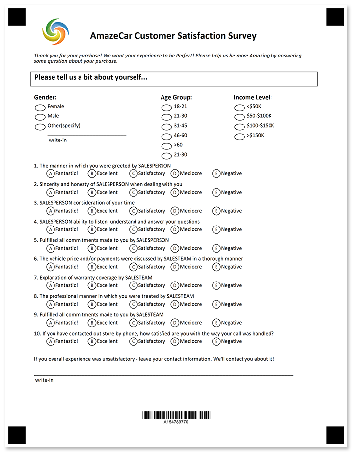
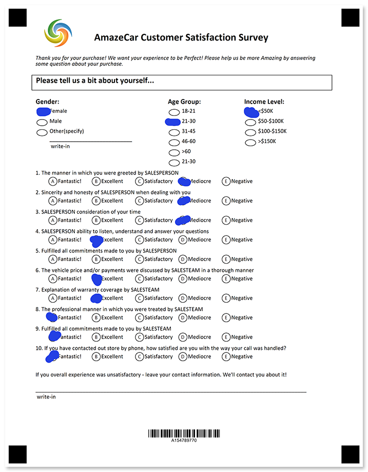

Understand how your clients are satisfied with your services, capabilities and their customer journey.



## Source code

<details>
<summary>Text markup</summary>

```
?text=AmazeCar Customer Satisfaction Survey
	font_style=bold
	font_size=18
	align=center
?image=logo.jpg
	width=200
	height=200
	align=left
	y=100
	x=278
?container=description
	columns_count=1
?block=
	column=1
?empty_line=
	height=50
?content=Thank you for your purchase! We want your experience to be Perfect! Please help us be more Amazing by answering some question about your purchase.
	font_style=Italic
&block
&container
?container=about yourself_header
	columns_proportions=100%
	block_bottom_margin=0
	block_top_padding=0
?block=
	column=1
	border=square
?content=Please tell us a bit about yourself...
	font_style=bold
	font_size=14
?empty_line=
	height=50
&block
&container
?empty_line=
	height=50
?container=about yourself_content
	columns_proportions=33%-10%-22%-2%-33%
	block_bottom_margin=0
	block_top_padding=0
?block=
	column=1
?content=Gender:
	font_style=bold
	font_size=12
?vertical_choicebox=Gender
?answer=Female
?content=Female
&answer
?answer=Male
?content=Male
&answer
?answer=Other(specify)
?content=Other(specify)
?write_in=Gender
&answer
&vertical_choicebox
&block
?block=
	column=3
?content=Age Group:
	font_style=bold
	font_size=12
?vertical_choicebox=Age Group
?answer=18-21
?content=18-21
&answer
?answer=21-30
?content=21-30
&answer
?answer=31-45
?content=31-45
&answer
?answer=46-60
?content=46-60
&answer
?answer=>60
?content=>60
&answer
?answer=21-30
?content=21-30
&answer
&vertical_choicebox
&block
?block=
	column=5
?content=Income Level:
	font_style=bold
	font_size=12
?vertical_choicebox=Gender
?answer=<$50K
?content=<$50K
&answer
?answer=$50-$100K
?content=$50-$100K
&answer
?answer=$100-$150K
?content=$100-$150K
&answer
?answer=>$150K
?content=>$150K
&answer
&vertical_choicebox
&block
&container
?empty_line=
	height=25
#The manner in which you were greeted by SALESPERSON
	()Fantastic! ()Excellent ()Satisfactory ()Mediocre ()Negative	
#Sincerity and honesty of SALESPERSON when dealing with you 
	()Fantastic! ()Excellent ()Satisfactory ()Mediocre ()Negative
#SALESPERSON consideration of your time
	()Fantastic! ()Excellent ()Satisfactory ()Mediocre ()Negative
#SALESPERSON ability to listen, understand and answer your questions
	()Fantastic! ()Excellent ()Satisfactory ()Mediocre ()Negative
#Fulfilled all commitments made to you by SALESPERSON
	()Fantastic! ()Excellent ()Satisfactory ()Mediocre ()Negative
#The vehicle price and/or payments were discussed by SALESTEAM in a thorough manner
	()Fantastic! ()Excellent ()Satisfactory ()Mediocre ()Negative
#Explanation of warranty coverage by SALESTEAM
	()Fantastic! ()Excellent ()Satisfactory ()Mediocre ()Negative
#The professional manner in which you were treated by SALESTEAM
	()Fantastic! ()Excellent ()Satisfactory ()Mediocre ()Negative
#Fulfilled all commitments made to you by SALESTEAM
	()Fantastic! ()Excellent ()Satisfactory ()Mediocre ()Negative
#If you have contacted out store by phone, how satisfied are you with the way your call was handled?
	()Fantastic! ()Excellent ()Satisfactory ()Mediocre ()Negative
?empty_line=
	height=50	
?container=
	columns_count=1
?block=
	column=1	
?content=If you overall experience was unsatisfactory - leave your contact information. We'll contact you about it!
?empty_line=
	height=50
?write_in=contact_information
&block
&container
?empty_line=150
	height=100
?barcode=test_id
	codetext=true
	value=15478977
	barcode_type=Code32
```

</details>

<details>
<summary>JSON markup</summary>

```json
{
    "children": [{
            "children": [{
                    "name": "AmazeCar Customer Satisfaction Survey",
                    "font_style": "Bold",
                    "font_size": 18,
                    "align": "Center",
                    "element_type": "Text"
                }, {
                    "align": "Left",
                    "name": "logo.jpg",
                    "x": 278,
                    "y": 100,
                    "height": 200,
                    "width": 200,
                    "element_type": "Image"
                }, {
                    "name": "description",
                    "children": [{
                            "children": [{
                                    "height": 50,
                                    "element_type": "EmptyLine"
                                }, {
                                    "name": "Thank you for your purchase! We want your experience to be Perfect! Please help us be more Amazing by answering some question about your purchase.",
                                    "font_style": "Italic",
                                    "align": "Left",
                                    "element_type": "Content"
                                }
                            ],
                            "column": 1,
                            "element_type": "Block"
                        }
                    ],
                    "columns_count": 1,
                    "container_type": "Normal",
                    "element_type": "Container"
                }, {
                    "name": "about yourself_header",
                    "children": [{
                            "children": [{
                                    "name": "Please tell us a bit about yourself...",
                                    "font_style": "Bold",
                                    "font_size": 14,
                                    "align": "Left",
                                    "element_type": "Content"
                                }, {
                                    "height": 50,
                                    "element_type": "EmptyLine"
                                }
                            ],
                            "column": 1,
                            "border": "Square",
                            "element_type": "Block"
                        }
                    ],
                    "columns_proportions": [
                        100
                    ],
                    "container_type": "Normal",
                    "block_bottom_margin": 0,
                    "block_top_padding": 0,
                    "element_type": "Container"
                }, {
                    "height": 50,
                    "element_type": "EmptyLine"
                }, {
                    "name": "about yourself_content",
                    "children": [{
                            "children": [{
                                    "name": "Gender:",
                                    "font_style": "Bold",
                                    "font_size": 12,
                                    "align": "Left",
                                    "element_type": "Content"
                                }, {
                                    "name": "Gender",
                                    "children": [{
                                            "name": "Female",
                                            "children": [{
                                                    "name": "Female",
                                                    "align": "Left",
                                                    "element_type": "Content"
                                                }
                                            ],
                                            "bubble_type": "Round",
                                            "element_type": "Answer"
                                        }, {
                                            "name": "Male",
                                            "children": [{
                                                    "name": "Male",
                                                    "align": "Left",
                                                    "element_type": "Content"
                                                }
                                            ],
                                            "bubble_type": "Round",
                                            "element_type": "Answer"
                                        }, {
                                            "name": "Other(specify)",
                                            "children": [{
                                                    "name": "Other(specify)",
                                                    "align": "Left",
                                                    "element_type": "Content"
                                                }, {
                                                    "name": "Gender",
                                                    "element_type": "WriteIn"
                                                }
                                            ],
                                            "bubble_type": "Round",
                                            "element_type": "Answer"
                                        }
                                    ],
                                    "element_type": "VerticalChoiceBox",
                                    "top_padding": 0
                                }
                            ],
                            "column": 1,
                            "element_type": "Block"
                        }, {
                            "children": [{
                                    "name": "Age Group:",
                                    "font_style": "Bold",
                                    "font_size": 12,
                                    "align": "Left",
                                    "element_type": "Content"
                                }, {
                                    "name": "Age Group",
                                    "children": [{
                                            "name": "18-21",
                                            "children": [{
                                                    "name": "18-21",
                                                    "align": "Left",
                                                    "element_type": "Content"
                                                }
                                            ],
                                            "bubble_type": "Round",
                                            "element_type": "Answer"
                                        }, {
                                            "name": "21-30",
                                            "children": [{
                                                    "name": "21-30",
                                                    "align": "Left",
                                                    "element_type": "Content"
                                                }
                                            ],
                                            "bubble_type": "Round",
                                            "element_type": "Answer"
                                        }, {
                                            "name": "31-45",
                                            "children": [{
                                                    "name": "31-45",
                                                    "align": "Left",
                                                    "element_type": "Content"
                                                }
                                            ],
                                            "bubble_type": "Round",
                                            "element_type": "Answer"
                                        }, {
                                            "name": "46-60",
                                            "children": [{
                                                    "name": "46-60",
                                                    "align": "Left",
                                                    "element_type": "Content"
                                                }
                                            ],
                                            "bubble_type": "Round",
                                            "element_type": "Answer"
                                        }, {
                                            "name": ">60",
                                            "children": [{
                                                    "name": ">60",
                                                    "align": "Left",
                                                    "element_type": "Content"
                                                }
                                            ],
                                            "bubble_type": "Round",
                                            "element_type": "Answer"
                                        }, {
                                            "name": "21-30",
                                            "children": [{
                                                    "name": "21-30",
                                                    "align": "Left",
                                                    "element_type": "Content"
                                                }
                                            ],
                                            "bubble_type": "Round",
                                            "element_type": "Answer"
                                        }
                                    ],
                                    "element_type": "VerticalChoiceBox",
                                    "top_padding": 0
                                }
                            ],
                            "column": 3,
                            "element_type": "Block"
                        }, {
                            "children": [{
                                    "name": "Income Level:",
                                    "font_style": "Bold",
                                    "font_size": 12,
                                    "align": "Left",
                                    "element_type": "Content"
                                }, {
                                    "name": "Gender",
                                    "children": [{
                                            "name": "<$50K",
                                            "children": [{
                                                    "name": "<$50K",
                                                    "align": "Left",
                                                    "element_type": "Content"
                                                }
                                            ],
                                            "bubble_type": "Round",
                                            "element_type": "Answer"
                                        }, {
                                            "name": "$50-$100K",
                                            "children": [{
                                                    "name": "$50-$100K",
                                                    "align": "Left",
                                                    "element_type": "Content"
                                                }
                                            ],
                                            "bubble_type": "Round",
                                            "element_type": "Answer"
                                        }, {
                                            "name": "$100-$150K",
                                            "children": [{
                                                    "name": "$100-$150K",
                                                    "align": "Left",
                                                    "element_type": "Content"
                                                }
                                            ],
                                            "bubble_type": "Round",
                                            "element_type": "Answer"
                                        }, {
                                            "name": ">$150K",
                                            "children": [{
                                                    "name": ">$150K",
                                                    "align": "Left",
                                                    "element_type": "Content"
                                                }
                                            ],
                                            "bubble_type": "Round",
                                            "element_type": "Answer"
                                        }
                                    ],
                                    "element_type": "VerticalChoiceBox",
                                    "top_padding": 0
                                }
                            ],
                            "column": 5,
                            "element_type": "Block"
                        }
                    ],
                    "columns_proportions": [
                        33,
                        10,
                        22,
                        2,
                        33
                    ],
                    "container_type": "Normal",
                    "block_bottom_margin": 0,
                    "block_top_padding": 0,
                    "element_type": "Container"
                }, {
                    "height": 25,
                    "element_type": "EmptyLine"
                }, {
                    "align": "Left",
                    "answers_string": "\t()Fantastic! ()Excellent ()Satisfactory ()Mediocre ()Negative\t",
                    "question_text": "The manner in which you were greeted by SALESPERSON",
                    "element_type": "ChoiceBox"
                }, {
                    "align": "Left",
                    "answers_string": "\t()Fantastic! ()Excellent ()Satisfactory ()Mediocre ()Negative",
                    "question_text": "Sincerity and honesty of SALESPERSON when dealing with you ",
                    "element_type": "ChoiceBox"
                }, {
                    "align": "Left",
                    "answers_string": "\t()Fantastic! ()Excellent ()Satisfactory ()Mediocre ()Negative",
                    "question_text": "SALESPERSON consideration of your time",
                    "element_type": "ChoiceBox"
                }, {
                    "align": "Left",
                    "answers_string": "\t()Fantastic! ()Excellent ()Satisfactory ()Mediocre ()Negative",
                    "question_text": "SALESPERSON ability to listen, understand and answer your questions",
                    "element_type": "ChoiceBox"
                }, {
                    "align": "Left",
                    "answers_string": "\t()Fantastic! ()Excellent ()Satisfactory ()Mediocre ()Negative",
                    "question_text": "Fulfilled all commitments made to you by SALESPERSON",
                    "element_type": "ChoiceBox"
                }, {
                    "align": "Left",
                    "answers_string": "\t()Fantastic! ()Excellent ()Satisfactory ()Mediocre ()Negative",
                    "question_text": "The vehicle price and/or payments were discussed by SALESTEAM in a thorough manner",
                    "element_type": "ChoiceBox"
                }, {
                    "align": "Left",
                    "answers_string": "\t()Fantastic! ()Excellent ()Satisfactory ()Mediocre ()Negative",
                    "question_text": "Explanation of warranty coverage by SALESTEAM",
                    "element_type": "ChoiceBox"
                }, {
                    "align": "Left",
                    "answers_string": "\t()Fantastic! ()Excellent ()Satisfactory ()Mediocre ()Negative",
                    "question_text": "The professional manner in which you were treated by SALESTEAM",
                    "element_type": "ChoiceBox"
                }, {
                    "align": "Left",
                    "answers_string": "\t()Fantastic! ()Excellent ()Satisfactory ()Mediocre ()Negative",
                    "question_text": "Fulfilled all commitments made to you by SALESTEAM",
                    "element_type": "ChoiceBox"
                }, {
                    "align": "Left",
                    "answers_string": "\t()Fantastic! ()Excellent ()Satisfactory ()Mediocre ()Negative",
                    "question_text": "If you have contacted out store by phone, how satisfied are you with the way your call was handled?",
                    "element_type": "ChoiceBox"
                }, {
                    "height": 50,
                    "element_type": "EmptyLine"
                }, {
                    "children": [{
                            "children": [{
                                    "name": "If you overall experience was unsatisfactory - leave your contact information. We'll contact you about it!",
                                    "align": "Left",
                                    "element_type": "Content"
                                }, {
                                    "height": 50,
                                    "element_type": "EmptyLine"
                                }, {
                                    "name": "contact_information",
                                    "element_type": "WriteIn"
                                }
                            ],
                            "column": 1,
                            "element_type": "Block"
                        }
                    ],
                    "columns_count": 1,
                    "container_type": "Normal",
                    "element_type": "Container"
                }, {
                    "name": "150",
                    "height": 100,
                    "element_type": "EmptyLine"
                }, {
                    "name": "test_id",
                    "value": "15478977",
                    "barcode_type": "code32",
                    "align": "Center",
                    "codetext": true,
                    "element_type": "Barcode"
                }
            ],
            "element_type": "Page"
        }
    ],
    "element_type": "Template"
}
```

</details>

## Page settings

This template was generated using the following paper size, orientation, font, and other [layout settings](/omr/net/generate-template/page-setup/):

```csharp
GlobalPageSettings settings = new GlobalPageSettings
{
    PaperSize = PaperSize.Letter,
    Orientation = Orientation.Vertical,
    BubbleColor = Color.Black,
    BubbleSize = BubbleSize.Normal,
    FontStyle = FontStyle.Regular,
    FontSize = 10,
    FontFamily = "Calibri",
};
```

## Recognition results



```
Element Name,Value,
Age Group,"21-30"
Gender,"<$50K"
Gender,"Female"
Question1,"D"
Question2,"D"
Question3,"D"
Question4,"B"
Question5,""
Question6,"B"
Question7,"B"
Question8,"A"
Question9,"A"
Question10,"A"
test_id,"154789770"
```

## Download

[Click here](https://github.com/aspose-omr/Aspose.OMR-Documentation/blob/master/net/showcases/download/satisfaction-simple.zip) to download full template sources and related files. 

**Package structure:**

File | Description
---- | -----------
**car-dealership.csv** | recognition results based on the filled form available in this package
**car-dealership.json** | source code in [JSON markup](/omr/net/json-markup/)
**car-dealership.omr** | recognition pattern
**car-dealership.png** | printable form
**car-dealership.txt** | source code in [text markup](/omr/net/txt-markup/)
**car-dealership-recognized.png** | filled form
**logo.jpg** | company logo
**settings.txt** | [page settings](/omr/net/generate-template/page-setup/)
