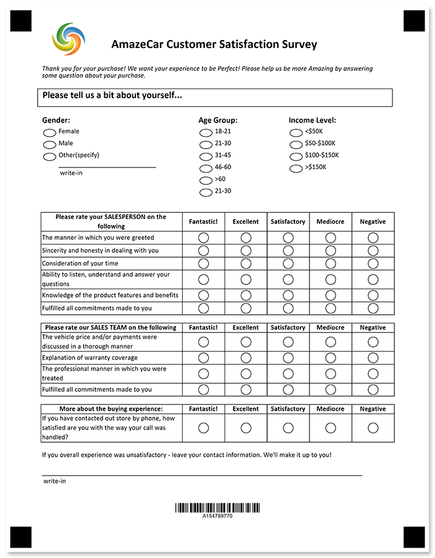
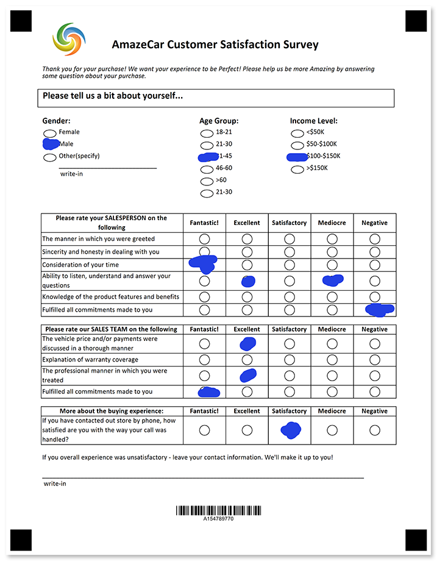

Understand how your clients are satisfied with your services, capabilities and their customer journey.



## Source code

<details>
<summary>Text markup</summary>

```
?text=AmazeCar Customer Satisfaction Survey
	font_style=bold
	font_size=18
	align=center
?image=logo.jpg
	width=200
	height=200
	align=left
	y=100
	x=278
?container=description
	columns_count=1
?block=
	column=1
?empty_line=
	height=50
?content=Thank you for your purchase! We want your experience to be Perfect! Please help us be more Amazing by answering some question about your purchase.
	font_style=Italic
&block
&container
?container=about yourself_header
	columns_proportions=100%
	block_bottom_margin=0
	block_top_padding=0
?block=
	column=1
	border=square
?content=Please tell us a bit about yourself...
	font_style=bold
	font_size=14
?empty_line=
	height=50
&block
&container
?empty_line=
	height=50
?container=about yourself_content
	columns_proportions=33%-10%-22%-2%-33%
	block_bottom_margin=0
	block_top_padding=0
?block=
	column=1
?content=Gender:
	font_style=bold
	font_size=12
?vertical_choicebox=Gender
?answer=Female
?content=Female
&answer
?answer=Male
?content=Male
&answer
?answer=Other(specify)
?content=Other(specify)
?write_in=Gender
&answer
&vertical_choicebox
&block
?block=
	column=3
?content=Age Group:
	font_style=bold
	font_size=12
?vertical_choicebox=Age Group
?answer=18-21
?content=18-21
&answer
?answer=21-30
?content=21-30
&answer
?answer=31-45
?content=31-45
&answer
?answer=46-60
?content=46-60
&answer
?answer=>60
?content=>60
&answer
?answer=21-30
?content=21-30
&answer
&vertical_choicebox
&block
?block=
	column=5
?content=Income Level:
	font_style=bold
	font_size=12
?vertical_choicebox=Gender
?answer=<$50K
?content=<$50K
&answer
?answer=$50-$100K
?content=$50-$100K
&answer
?answer=$100-$150K
?content=$100-$150K
&answer
?answer=>$150K
?content=>$150K
&answer
&vertical_choicebox
&block
&container
?empty_line=
	height=100
?container=salesperson
	columns_proportions=100%
	block_bottom_margin=0
	block_top_padding=0
?score_group=COVID-19 Survey
	score_type_table=table	
?score_question=Please rate your SALESPERSON on the following
	font_size=10
	font_style=bold	
	row_proportions=40%-12%-12%-12%-12%-12%
	score_display=DontDisplay
?score_header=Fantastic!
	align=center
	font_style=bold
	header_type=positive
	score=9
?score_header=Excellent
	align=center
	font_style=bold
	header_type=positive
	score=7
?score_header=Satisfactory
	align=center
	font_style=bold
	header_type=positive
	score=5
?score_header=Mediocre
	align=center
	font_style=bold
	header_type=positive
	score=3
?score_header=Negative
	align=center
	font_style=bold
	header_type=negative
?score_answer=The manner in which you were greeted
	score=2
	align=left
?score_answer=Sincerity and honesty in dealing with you
	score=1
	align=left
?score_answer=Consideration of your time
	score=1
	align=left
?score_answer=Ability to listen, understand and answer your questions
	score=1
	align=left
?score_answer=Knowledge of the product features and benefits
	score=2
	align=left
?score_answer=Fulfilled all commitments made to you
	score=3
	align=left
&score_question	
?score_question=Please rate our SALES TEAM on the following
	font_size=10
	font_style=bold	
	row_proportions=40%-12%-12%-12%-12%-12%
	score_display=DontDisplay
?score_header=Fantastic!
	align=center
	font_style=bold
	header_type=positive
	score=9
?score_header=Excellent
	align=center
	font_style=bold
	header_type=positive
	score=7
?score_header=Satisfactory
	align=center
	font_style=bold
	header_type=positive
	score=5
?score_header=Mediocre
	align=center
	font_style=bold
	header_type=positive
	score=3
?score_header=Negative
	align=center
	font_style=bold
	header_type=negative
?score_answer=The vehicle price and/or payments were discussed in a thorough manner
	score=2
	align=left
?score_answer=Explanation of warranty coverage
	score=1
	align=left
?score_answer=The professional manner in which you were treated
	score=2
	align=left
?score_answer=Fulfilled all commitments made to you
	score=3
	align=left
&score_question
?score_question=More about the buying experience:
	font_size=10
	font_style=bold	
	row_proportions=40%-12%-12%-12%-12%-12%
	score_display=DontDisplay
?score_header=Fantastic!
	align=center
	font_style=bold
	header_type=positive
	score=9
?score_header=Excellent
	align=center
	font_style=bold
	header_type=positive
	score=7
?score_header=Satisfactory
	align=center
	font_style=bold
	header_type=positive
	score=5
?score_header=Mediocre
	align=center
	font_style=bold
	header_type=positive
	score=3
?score_header=Negative
	align=center
	font_style=bold
	header_type=negative
?score_answer=If you have contacted out store by phone, how satisfied are you with the way your call was handled?
	score=2
	align=left
&score_question	
&score_group
&container
?container=
	columns_count=1
?block=
	column=1	
?content=If you overall experience was unsatisfactory - leave your contact information. We'll make it up to you!
?write_in=contact_information
&block
&container
?barcode=test_id
	codetext=true
	value=15478977
	barcode_type=Code32
```

</details>

<details>
<summary>JSON markup</summary>

```json
{
  "name": null,
  "children": [
    {
      "name": null,
      "children": [
        {
          "name": "AmazeCar Customer Satisfaction Survey\r\n",
          "font_family": "Calibri",
          "font_style": "Bold",
          "font_size": 18,
          "align": "Center",
          "element_type": "Text"
        },
        {
          "align": "Left",
          "name": "logo.jpg",
          "image_path": null,
          "x": 278,
          "y": 100,
          "height": 200,
          "width": 200,
          "element_type": "Image"
        },
        {
          "name": "description",
          "children": [
            {
              "name": "",
              "children": [
                {
                  "name": "",
                  "height": 50,
                  "element_type": "EmptyLine"
                },
                {
                  "name": "Thank you for your purchase! We want your experience to be Perfect! Please help us be more Amazing by answering some question about your purchase.",
                  "font_family": "Calibri",
                  "font_style": "Italic",
                  "font_size": 10,
                  "content_type": "Normal",
                  "align": "Left",
                  "element_type": "Content"
                }
              ],
              "column": 1,
              "border": "None",
              "border_size": 3,
              "border_color": "Black",
              "is_clipped": false,
              "element_type": "Block"
            }
          ],
          "columns_count": 1,
          "columns_proportions": null,
          "container_type": "Normal",
          "block_right_margin": 40,
          "block_bottom_margin": 20,
          "block_top_padding": 20,
          "element_type": "Container"
        },
        {
          "name": "about yourself_header",
          "children": [
            {
              "name": "",
              "children": [
                {
                  "name": "Please tell us a bit about yourself...",
                  "font_family": "Calibri",
                  "font_style": "Bold",
                  "font_size": 14,
                  "content_type": "Normal",
                  "align": "Left",
                  "element_type": "Content"
                },
                {
                  "name": "",
                  "height": 50,
                  "element_type": "EmptyLine"
                }
              ],
              "column": 1,
              "border": "Square",
              "border_size": 3,
              "border_color": "Black",
              "is_clipped": false,
              "element_type": "Block"
            }
          ],
          "columns_count": 0,
          "columns_proportions": [
            100
          ],
          "container_type": "Normal",
          "block_right_margin": 40,
          "block_bottom_margin": 0,
          "block_top_padding": 0,
          "element_type": "Container"
        },
        {
          "name": "",
          "height": 50,
          "element_type": "EmptyLine"
        },
        {
          "name": "about yourself_content",
          "children": [
            {
              "name": "",
              "children": [
                {
                  "name": "Gender:",
                  "font_family": "Calibri",
                  "font_style": "Bold",
                  "font_size": 12,
                  "content_type": "Normal",
                  "align": "Left",
                  "element_type": "Content"
                },
                {
                  "name": "Gender",
                  "children": [
                    {
                      "name": "Female",
                      "children": [
                        {
                          "name": "Female",
                          "font_family": "Calibri",
                          "font_style": "Regular",
                          "font_size": 10,
                          "content_type": "Normal",
                          "align": "Left",
                          "element_type": "Content"
                        }
                      ],
                      "bubble_type": "Round",
                      "element_type": "Answer"
                    },
                    {
                      "name": "Male",
                      "children": [
                        {
                          "name": "Male",
                          "font_family": "Calibri",
                          "font_style": "Regular",
                          "font_size": 10,
                          "content_type": "Normal",
                          "align": "Left",
                          "element_type": "Content"
                        }
                      ],
                      "bubble_type": "Round",
                      "element_type": "Answer"
                    },
                    {
                      "name": "Other(specify)",
                      "children": [
                        {
                          "name": "Other(specify)",
                          "font_family": "Calibri",
                          "font_style": "Regular",
                          "font_size": 10,
                          "content_type": "Normal",
                          "align": "Left",
                          "element_type": "Content"
                        },
                        {
                          "name": "Gender",
                          "required": false,
                          "element_type": "WriteIn"
                        }
                      ],
                      "bubble_type": "Round",
                      "element_type": "Answer"
                    }
                  ],
                  "element_type": "VerticalChoiceBox",
                  "threshold": 0,
                  "top_padding": 0
                }
              ],
              "column": 1,
              "border": "None",
              "border_size": 3,
              "border_color": "Black",
              "is_clipped": false,
              "element_type": "Block"
            },
            {
              "name": "",
              "children": [
                {
                  "name": "Age Group:",
                  "font_family": "Calibri",
                  "font_style": "Bold",
                  "font_size": 12,
                  "content_type": "Normal",
                  "align": "Left",
                  "element_type": "Content"
                },
                {
                  "name": "Age Group",
                  "children": [
                    {
                      "name": "18-21",
                      "children": [
                        {
                          "name": "18-21",
                          "font_family": "Calibri",
                          "font_style": "Regular",
                          "font_size": 10,
                          "content_type": "Normal",
                          "align": "Left",
                          "element_type": "Content"
                        }
                      ],
                      "bubble_type": "Round",
                      "element_type": "Answer"
                    },
                    {
                      "name": "21-30",
                      "children": [
                        {
                          "name": "21-30",
                          "font_family": "Calibri",
                          "font_style": "Regular",
                          "font_size": 10,
                          "content_type": "Normal",
                          "align": "Left",
                          "element_type": "Content"
                        }
                      ],
                      "bubble_type": "Round",
                      "element_type": "Answer"
                    },
                    {
                      "name": "31-45",
                      "children": [
                        {
                          "name": "31-45",
                          "font_family": "Calibri",
                          "font_style": "Regular",
                          "font_size": 10,
                          "content_type": "Normal",
                          "align": "Left",
                          "element_type": "Content"
                        }
                      ],
                      "bubble_type": "Round",
                      "element_type": "Answer"
                    },
                    {
                      "name": "46-60",
                      "children": [
                        {
                          "name": "46-60",
                          "font_family": "Calibri",
                          "font_style": "Regular",
                          "font_size": 10,
                          "content_type": "Normal",
                          "align": "Left",
                          "element_type": "Content"
                        }
                      ],
                      "bubble_type": "Round",
                      "element_type": "Answer"
                    },
                    {
                      "name": ">60",
                      "children": [
                        {
                          "name": ">60",
                          "font_family": "Calibri",
                          "font_style": "Regular",
                          "font_size": 10,
                          "content_type": "Normal",
                          "align": "Left",
                          "element_type": "Content"
                        }
                      ],
                      "bubble_type": "Round",
                      "element_type": "Answer"
                    },
                    {
                      "name": "21-30",
                      "children": [
                        {
                          "name": "21-30",
                          "font_family": "Calibri",
                          "font_style": "Regular",
                          "font_size": 10,
                          "content_type": "Normal",
                          "align": "Left",
                          "element_type": "Content"
                        }
                      ],
                      "bubble_type": "Round",
                      "element_type": "Answer"
                    }
                  ],
                  "element_type": "VerticalChoiceBox",
                  "threshold": 0,
                  "top_padding": 0
                }
              ],
              "column": 3,
              "border": "None",
              "border_size": 3,
              "border_color": "Black",
              "is_clipped": false,
              "element_type": "Block"
            },
            {
              "name": "",
              "children": [
                {
                  "name": "Income Level:",
                  "font_family": "Calibri",
                  "font_style": "Bold",
                  "font_size": 12,
                  "content_type": "Normal",
                  "align": "Left",
                  "element_type": "Content"
                },
                {
                  "name": "Gender",
                  "children": [
                    {
                      "name": "<$50K",
                      "children": [
                        {
                          "name": "<$50K",
                          "font_family": "Calibri",
                          "font_style": "Regular",
                          "font_size": 10,
                          "content_type": "Normal",
                          "align": "Left",
                          "element_type": "Content"
                        }
                      ],
                      "bubble_type": "Round",
                      "element_type": "Answer"
                    },
                    {
                      "name": "$50-$100K",
                      "children": [
                        {
                          "name": "$50-$100K",
                          "font_family": "Calibri",
                          "font_style": "Regular",
                          "font_size": 10,
                          "content_type": "Normal",
                          "align": "Left",
                          "element_type": "Content"
                        }
                      ],
                      "bubble_type": "Round",
                      "element_type": "Answer"
                    },
                    {
                      "name": "$100-$150K",
                      "children": [
                        {
                          "name": "$100-$150K",
                          "font_family": "Calibri",
                          "font_style": "Regular",
                          "font_size": 10,
                          "content_type": "Normal",
                          "align": "Left",
                          "element_type": "Content"
                        }
                      ],
                      "bubble_type": "Round",
                      "element_type": "Answer"
                    },
                    {
                      "name": ">$150K",
                      "children": [
                        {
                          "name": ">$150K",
                          "font_family": "Calibri",
                          "font_style": "Regular",
                          "font_size": 10,
                          "content_type": "Normal",
                          "align": "Left",
                          "element_type": "Content"
                        }
                      ],
                      "bubble_type": "Round",
                      "element_type": "Answer"
                    }
                  ],
                  "element_type": "VerticalChoiceBox",
                  "threshold": 0,
                  "top_padding": 0
                }
              ],
              "column": 5,
              "border": "None",
              "border_size": 3,
              "border_color": "Black",
              "is_clipped": false,
              "element_type": "Block"
            }
          ],
          "columns_count": 0,
          "columns_proportions": [
            33,
            10,
            22,
            2,
            33
          ],
          "container_type": "Normal",
          "block_right_margin": 40,
          "block_bottom_margin": 0,
          "block_top_padding": 0,
          "element_type": "Container"
        },
        {
          "name": "",
          "height": 100,
          "element_type": "EmptyLine"
        },
        {
          "name": "salesperson",
          "children": [
            {
              "name": "COVID-19 Survey",
              "children": [
                {
                  "font_family": "Calibri",
                  "font_style": "Bold",
                  "font_size": 10,
                  "row_proportions": [
                    40,
                    12,
                    12,
                    12,
                    12,
                    12
                  ],
                  "score_display": "DontDisplay",
                  "name": "Please rate your SALESPERSON on the following",
                  "children": [
                    {
                      "Score": 9,
                      "name": "Fantastic!",
                      "header_type": "Positive",
                      "element_type": "ScoreHeader",
                      "font_family": "Calibri",
                      "font_style": "Bold",
                      "font_size": 10,
                      "content_type": "Normal",
                      "align": "Center"
                    },
                    {
                      "Score": 7,
                      "name": "Excellent",
                      "header_type": "Positive",
                      "element_type": "ScoreHeader",
                      "font_family": "Calibri",
                      "font_style": "Bold",
                      "font_size": 10,
                      "content_type": "Normal",
                      "align": "Center"
                    },
                    {
                      "Score": 5,
                      "name": "Satisfactory",
                      "header_type": "Positive",
                      "element_type": "ScoreHeader",
                      "font_family": "Calibri",
                      "font_style": "Bold",
                      "font_size": 10,
                      "content_type": "Normal",
                      "align": "Center"
                    },
                    {
                      "Score": 3,
                      "name": "Mediocre",
                      "header_type": "Positive",
                      "element_type": "ScoreHeader",
                      "font_family": "Calibri",
                      "font_style": "Bold",
                      "font_size": 10,
                      "content_type": "Normal",
                      "align": "Center"
                    },
                    {
                      "Score": 0,
                      "name": "Negative",
                      "header_type": "Negative",
                      "element_type": "ScoreHeader",
                      "font_family": "Calibri",
                      "font_style": "Bold",
                      "font_size": 10,
                      "content_type": "Normal",
                      "align": "Center"
                    },
                    {
                      "Score": 2,
                      "element_type": "ScoreAnswer",
                      "name": "The manner in which you were greeted",
                      "font_family": "Calibri",
                      "font_style": "Regular",
                      "font_size": 10,
                      "content_type": "Normal",
                      "align": "Left"
                    },
                    {
                      "Score": 1,
                      "element_type": "ScoreAnswer",
                      "name": "Sincerity and honesty in dealing with you",
                      "font_family": "Calibri",
                      "font_style": "Regular",
                      "font_size": 10,
                      "content_type": "Normal",
                      "align": "Left"
                    },
                    {
                      "Score": 1,
                      "element_type": "ScoreAnswer",
                      "name": "Consideration of your time",
                      "font_family": "Calibri",
                      "font_style": "Regular",
                      "font_size": 10,
                      "content_type": "Normal",
                      "align": "Left"
                    },
                    {
                      "Score": 1,
                      "element_type": "ScoreAnswer",
                      "name": "Ability to listen, understand and answer your questions",
                      "font_family": "Calibri",
                      "font_style": "Regular",
                      "font_size": 10,
                      "content_type": "Normal",
                      "align": "Left"
                    },
                    {
                      "Score": 2,
                      "element_type": "ScoreAnswer",
                      "name": "Knowledge of the product features and benefits",
                      "font_family": "Calibri",
                      "font_style": "Regular",
                      "font_size": 10,
                      "content_type": "Normal",
                      "align": "Left"
                    },
                    {
                      "Score": 3,
                      "element_type": "ScoreAnswer",
                      "name": "Fulfilled all commitments made to you",
                      "font_family": "Calibri",
                      "font_style": "Regular",
                      "font_size": 10,
                      "content_type": "Normal",
                      "align": "Left"
                    }
                  ],
                  "element_type": "ScoreQuestion"
                },
                {
                  "font_family": "Calibri",
                  "font_style": "Bold",
                  "font_size": 10,
                  "row_proportions": [
                    40,
                    12,
                    12,
                    12,
                    12,
                    12
                  ],
                  "score_display": "DontDisplay",
                  "name": "Please rate our SALES TEAM on the following",
                  "children": [
                    {
                      "Score": 9,
                      "name": "Fantastic!",
                      "header_type": "Positive",
                      "element_type": "ScoreHeader",
                      "font_family": "Calibri",
                      "font_style": "Bold",
                      "font_size": 10,
                      "content_type": "Normal",
                      "align": "Center"
                    },
                    {
                      "Score": 7,
                      "name": "Excellent",
                      "header_type": "Positive",
                      "element_type": "ScoreHeader",
                      "font_family": "Calibri",
                      "font_style": "Bold",
                      "font_size": 10,
                      "content_type": "Normal",
                      "align": "Center"
                    },
                    {
                      "Score": 5,
                      "name": "Satisfactory",
                      "header_type": "Positive",
                      "element_type": "ScoreHeader",
                      "font_family": "Calibri",
                      "font_style": "Bold",
                      "font_size": 10,
                      "content_type": "Normal",
                      "align": "Center"
                    },
                    {
                      "Score": 3,
                      "name": "Mediocre",
                      "header_type": "Positive",
                      "element_type": "ScoreHeader",
                      "font_family": "Calibri",
                      "font_style": "Bold",
                      "font_size": 10,
                      "content_type": "Normal",
                      "align": "Center"
                    },
                    {
                      "Score": 0,
                      "name": "Negative",
                      "header_type": "Negative",
                      "element_type": "ScoreHeader",
                      "font_family": "Calibri",
                      "font_style": "Bold",
                      "font_size": 10,
                      "content_type": "Normal",
                      "align": "Center"
                    },
                    {
                      "Score": 2,
                      "element_type": "ScoreAnswer",
                      "name": "The vehicle price and/or payments were discussed in a thorough manner",
                      "font_family": "Calibri",
                      "font_style": "Regular",
                      "font_size": 10,
                      "content_type": "Normal",
                      "align": "Left"
                    },
                    {
                      "Score": 1,
                      "element_type": "ScoreAnswer",
                      "name": "Explanation of warranty coverage",
                      "font_family": "Calibri",
                      "font_style": "Regular",
                      "font_size": 10,
                      "content_type": "Normal",
                      "align": "Left"
                    },
                    {
                      "Score": 2,
                      "element_type": "ScoreAnswer",
                      "name": "The professional manner in which you were treated",
                      "font_family": "Calibri",
                      "font_style": "Regular",
                      "font_size": 10,
                      "content_type": "Normal",
                      "align": "Left"
                    },
                    {
                      "Score": 3,
                      "element_type": "ScoreAnswer",
                      "name": "Fulfilled all commitments made to you",
                      "font_family": "Calibri",
                      "font_style": "Regular",
                      "font_size": 10,
                      "content_type": "Normal",
                      "align": "Left"
                    }
                  ],
                  "element_type": "ScoreQuestion"
                },
                {
                  "font_family": "Calibri",
                  "font_style": "Bold",
                  "font_size": 10,
                  "row_proportions": [
                    40,
                    12,
                    12,
                    12,
                    12,
                    12
                  ],
                  "score_display": "DontDisplay",
                  "name": "More about the buying experience:",
                  "children": [
                    {
                      "Score": 9,
                      "name": "Fantastic!",
                      "header_type": "Positive",
                      "element_type": "ScoreHeader",
                      "font_family": "Calibri",
                      "font_style": "Bold",
                      "font_size": 10,
                      "content_type": "Normal",
                      "align": "Center"
                    },
                    {
                      "Score": 7,
                      "name": "Excellent",
                      "header_type": "Positive",
                      "element_type": "ScoreHeader",
                      "font_family": "Calibri",
                      "font_style": "Bold",
                      "font_size": 10,
                      "content_type": "Normal",
                      "align": "Center"
                    },
                    {
                      "Score": 5,
                      "name": "Satisfactory",
                      "header_type": "Positive",
                      "element_type": "ScoreHeader",
                      "font_family": "Calibri",
                      "font_style": "Bold",
                      "font_size": 10,
                      "content_type": "Normal",
                      "align": "Center"
                    },
                    {
                      "Score": 3,
                      "name": "Mediocre",
                      "header_type": "Positive",
                      "element_type": "ScoreHeader",
                      "font_family": "Calibri",
                      "font_style": "Bold",
                      "font_size": 10,
                      "content_type": "Normal",
                      "align": "Center"
                    },
                    {
                      "Score": 0,
                      "name": "Negative",
                      "header_type": "Negative",
                      "element_type": "ScoreHeader",
                      "font_family": "Calibri",
                      "font_style": "Bold",
                      "font_size": 10,
                      "content_type": "Normal",
                      "align": "Center"
                    },
                    {
                      "Score": 2,
                      "element_type": "ScoreAnswer",
                      "name": "If you have contacted out store by phone, how satisfied are you with the way your call was handled?",
                      "font_family": "Calibri",
                      "font_style": "Regular",
                      "font_size": 10,
                      "content_type": "Normal",
                      "align": "Left"
                    }
                  ],
                  "element_type": "ScoreQuestion"
                }
              ],
              "score_group_type": "Table",
              "element_type": "ScoreGroup"
            }
          ],
          "columns_count": 0,
          "columns_proportions": [
            100
          ],
          "container_type": "Normal",
          "block_right_margin": 40,
          "block_bottom_margin": 0,
          "block_top_padding": 0,
          "element_type": "Container"
        },
        {
          "name": "",
          "children": [
            {
              "name": "",
              "children": [
                {
                  "name": "If you overall experience was unsatisfactory - leave your contact information. We'll make it up to you!",
                  "font_family": "Calibri",
                  "font_style": "Regular",
                  "font_size": 10,
                  "content_type": "Normal",
                  "align": "Left",
                  "element_type": "Content"
                },
                {
                  "name": "contact_information",
                  "required": false,
                  "element_type": "WriteIn"
                }
              ],
              "column": 1,
              "border": "None",
              "border_size": 3,
              "border_color": "Black",
              "is_clipped": false,
              "element_type": "Block"
            }
          ],
          "columns_count": 1,
          "columns_proportions": null,
          "container_type": "Normal",
          "block_right_margin": 40,
          "block_bottom_margin": 20,
          "block_top_padding": 20,
          "element_type": "Container"
        },
        {
          "name": "test_id",
          "value": "15478977",
          "barcode_type": "Code32",
          "qr_version": "Auto",
          "align": "Center",
          "height": -1,
          "codetext": true,
          "X": -1,
          "Y": -1,
          "element_type": "Barcode"
        }
      ],
      "element_type": "Page"
    }
  ],
  "element_type": "Template"
}
```

</details>

## Page settings

This template was generated using the following paper size, orientation, font, and other [layout settings](/omr/net/generate-template/page-setup/):

```csharp
GlobalPageSettings settings = new GlobalPageSettings
{
    PaperSize = PaperSize.Letter,
    Orientation = Orientation.Vertical,
    BubbleColor = Color.Black,
    BubbleSize = BubbleSize.Normal,
    FontStyle = FontStyle.Regular,
    FontSize = 10,
    FontFamily = "Calibri",
};
```

## Recognition results



```
Element Name,Value,
Age Group,"31-45"
Gender,"$100-$150K"
Gender,"Male"
More about the buying experience:,"If you have contacted out store by phone, how satisfied are you with the way your call was handled?"
More about the buying experience:_total,"10"
Please rate our SALES TEAM on the following,"The vehicle price and/or payments were discussed in a thorough manner,The professional manner in which you were treated,Fulfilled all commitments made to you"
Please rate our SALES TEAM on the following_total,"55"
Please rate your SALESPERSON on the following,"Consideration of your time,Ability to listen, understand and answer your questions,Ability to listen, understand and answer your questions"
Please rate your SALESPERSON on the following_total,"19"
test_id,"154789770"
COVID-19 Survey_total,"84"
```

## Download

[Click here](https://github.com/aspose-omr/Aspose.OMR-Documentation/blob/master/net/showcases/download/satisfaction-table.zip) to download full template sources and related files. 

**Package structure:**

File | Description
---- | -----------
**car-dealership.csv** | recognition results based on the filled form available in this package
**car-dealership.json** | source code in [JSON markup](/omr/json-markup/)
**car-dealership.omr** | recognition pattern
**car-dealership.png** | printable form
**car-dealership.txt** | source code in [text markup](/omr/txt-markup/)
**car-dealership-recognized.png** | filled form
**logo.jpg** | company logo
**settings.json** | [page settings](/omr/net/generate-template/page-setup/)
