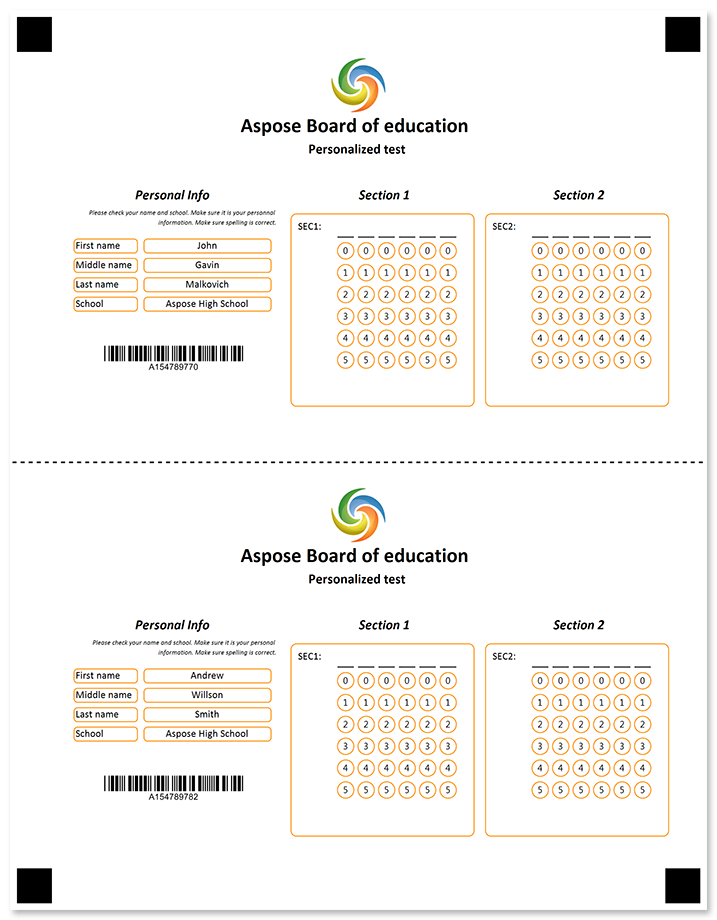
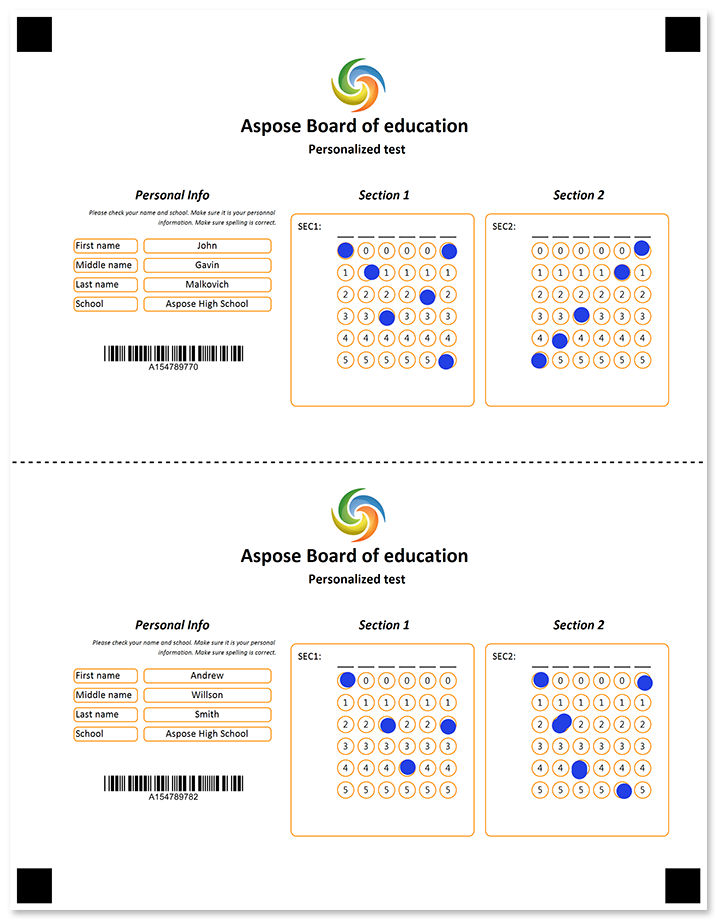

Two identical forms on one sheet separated with a vertical or horizontal tear line. Both parts are filled identically; one part remains with the respondent.



## Source code

<details>
<summary>Text markup</summary>

```
?image=logo.jpg
	height=200
	width=200
	align=center
?text=Aspose Board of education
	font_style=bold
	font_size=18
	align=center
?text=Personalized test
	font_style=bold
	font_size=12
	align=center
?empty_line=100
	height=100
?container=first
	columns_proportions=36%-2%-30%-2%-30%
	block_bottom_margin=0
	block_top_padding=0
	block_right_margin=0
?block=left-header
	column=1
	border=none
?content=Personal Info
	font_size=12
	align=center
	font_style=bold, italic
?empty_line=30
	height=30
&block
?block=left-header
	column=1
	border=none
?content=Please check your name and school. Make sure it is your personnal information. Make sure spelling is correct.
	font_size=6
	align=right
	font_style=italic
&block
?block=left-content
	column=1
?empty_line=50
	height=25
?input_group=first_name
	input_border=rounded
	label_border=rounded
	border_color=DarkOrange
	border_color=DarkOrange
?content=First name
?content=John
	align=center
&input_group
?input_group=middle_name
	input_border=rounded
	label_border=rounded
	border_color=DarkOrange
?content=Middle name
?content=Gavin
	align=center
&input_group
?input_group=last_name
	input_border=rounded
	label_border=rounded
	border_color=DarkOrange
?content=Last name
?content=Malkovich 
	align=center
&input_group
?input_group=school
	input_border=rounded
	label_border=rounded
	border_color=DarkOrange
?content=School
?content=Aspose High School
	align=center
&input_group
&block
?block=left_footer
	column=1
?empty_line=50
	height=100
?barcode=test_id
	codetext=true
	value=15478977
	barcode_type=Code32
&block
?block=middle_header
	column=3
?content=Section 1
	font_size=12
	align=center
	font_style=bold, italic
?empty_line=50
	height=50
&block
?block=middle_content
	column=3
	border=rounded
	border_color=DarkOrange
?empty_line=25
	height=25
?grid=SEC1
	column=3
	sections_count=6
	options_count=6
	align=center
&block
?block=right_header
	column=5
?content=Section 2
	font_size=12
	align=center
	font_style=bold, italic
?empty_line=50
	height=50
&block
?block=right_content
	column=5
	border=rounded
	border_color=DarkOrange
?empty_line=25
	height=25
?grid=SEC2
	column=5
	sections_count=6
	options_count=6
	align=center
&block
&container
?image=tear-line-small.png
	x=0
	y=1550
	height=200
	width=2551
?image=logo.jpg
	height=200
	width=200
	align=center
?text=Aspose Board of education
	font_style=bold
	font_size=18
	align=center
?text=Personalized test
	font_style=bold
	font_size=12
	align=center
?empty_line=100
	height=100
?container=second
	columns_proportions=36%-2%-30%-2%-30%
	block_bottom_margin=0
	block_top_padding=0
	block_right_margin=0
?block=left-header
	column=1
?content=Personal Info
	font_size=12
	align=center
	font_style=bold, italic
?empty_line=50
	height=30
&block
?block=left-header
	column=1
?content=Please check your name and school. Make sure it is your personal information. Make sure spelling is correct.
	font_size=6
	align=right
	font_style=italic
&block
?block=left-content
	column=1
?empty_line=50
	height=25
?input_group=first_name
	input_border=rounded
	label_border=rounded
	border_color=DarkOrange
?content=First name
?content=Andrew
	align=center
&input_group
?input_group=middle_name
	input_border=rounded
	label_border=rounded
	border_color=DarkOrange
?content=Middle name
?content=Willson
	align=center
&input_group
?input_group=last_name
	input_border=rounded
	label_border=rounded
	border_color=DarkOrange
?content=Last name
?content=Smith 
	align=center
&input_group
?input_group=school
	input_border=rounded
	label_border=rounded
	border_color=DarkOrange
?content=School
?content=Aspose High School
	align=center
&input_group
&block
?block=left_footer
	column=1
?empty_line=50
	height=100
?barcode=test_id
	codetext=true
	value=15478978
	barcode_type=Code32
&block
?block=middle_header
	column=3
?content=Section 1
	font_size=12
	align=center
	font_style=bold, italic
?empty_line=50
	height=50
&block
?block=middle_content
	column=3
	border=rounded
	border_color=DarkOrange
?empty_line=25
	height=25
?grid=SEC1
	column=3
	sections_count=6
	options_count=6
	align=center
&block
?block=right_header
	column=5
?content=Section 2
	font_size=12
	align=center
	font_style=bold, italic
?empty_line=50
	height=50
&block
?block=right_content
	column=5
	border=rounded
	border_color=DarkOrange
?empty_line=25
	height=25
?grid=SEC2
	column=5
	sections_count=6
	options_count=6
	align=center
&block
&container
```

</details>

<details>
<summary>JSON markup</summary>

```json
{
  "name": null,
  "children": [
    {
      "name": null,
      "children": [
        {
          "align": "Center",
          "name": "logo.jpg",
          "image_path": null,
          "x": -1,
          "y": -1,
          "height": 200,
          "width": 200,
          "element_type": "Image"
        },
        {
          "name": "Aspose Board of education\r\n",
          "font_family": "Calibri",
          "font_style": "Bold",
          "font_size": 18,
          "align": "Center",
          "element_type": "Text"
        },
        {
          "name": "Personalized test\r\n",
          "font_family": "Calibri",
          "font_style": "Bold",
          "font_size": 12,
          "align": "Center",
          "element_type": "Text"
        },
        {
          "name": "100",
          "height": 100,
          "element_type": "EmptyLine"
        },
        {
          "name": "first",
          "children": [
            {
              "name": "left-header",
              "children": [
                {
                  "name": "Personal Info",
                  "font_family": "Calibri",
                  "font_style": [
                    "Bold",
                    "Italic"
                  ],
                  "font_size": 12,
                  "content_type": "Normal",
                  "align": "Center",
                  "element_type": "Content"
                },
                {
                  "name": "30",
                  "height": 30,
                  "element_type": "EmptyLine"
                }
              ],
              "column": 1,
              "border": "None",
              "border_size": 3,
              "border_color": "Black",
              "is_clipped": false,
              "element_type": "Block"
            },
            {
              "name": "left-header",
              "children": [
                {
                  "name": "Please check your name and school. Make sure it is your personnal information. Make sure spelling is correct.",
                  "font_family": "Calibri",
                  "font_style": "Italic",
                  "font_size": 6,
                  "content_type": "Normal",
                  "align": "Right",
                  "element_type": "Content"
                }
              ],
              "column": 1,
              "border": "None",
              "border_size": 3,
              "border_color": "Black",
              "is_clipped": false,
              "element_type": "Block"
            },
            {
              "name": "left-content",
              "children": [
                {
                  "name": "50",
                  "height": 25,
                  "element_type": "EmptyLine"
                },
                {
                  "name": "first_name",
                  "element_type": "InputGroup",
                  "children": [
                    {
                      "name": "First name",
                      "font_family": "Calibri",
                      "font_style": "Regular",
                      "font_size": 9,
                      "content_type": "Normal",
                      "align": "Left",
                      "element_type": "Content"
                    },
                    {
                      "name": "John",
                      "font_family": "Calibri",
                      "font_style": "Regular",
                      "font_size": 9,
                      "content_type": "Normal",
                      "align": "Center",
                      "element_type": "Content"
                    }
                  ],
                  "label_border": "Rounded",
                  "input_border": "Rounded",
                  "border_size": 3,
                  "border_color": "DarkOrange"
                },
                {
                  "name": "middle_name",
                  "element_type": "InputGroup",
                  "children": [
                    {
                      "name": "Middle name",
                      "font_family": "Calibri",
                      "font_style": "Regular",
                      "font_size": 9,
                      "content_type": "Normal",
                      "align": "Left",
                      "element_type": "Content"
                    },
                    {
                      "name": "Gavin",
                      "font_family": "Calibri",
                      "font_style": "Regular",
                      "font_size": 9,
                      "content_type": "Normal",
                      "align": "Center",
                      "element_type": "Content"
                    }
                  ],
                  "label_border": "Rounded",
                  "input_border": "Rounded",
                  "border_size": 3,
                  "border_color": "DarkOrange"
                },
                {
                  "name": "last_name",
                  "element_type": "InputGroup",
                  "children": [
                    {
                      "name": "Last name",
                      "font_family": "Calibri",
                      "font_style": "Regular",
                      "font_size": 9,
                      "content_type": "Normal",
                      "align": "Left",
                      "element_type": "Content"
                    },
                    {
                      "name": "Malkovich ",
                      "font_family": "Calibri",
                      "font_style": "Regular",
                      "font_size": 9,
                      "content_type": "Normal",
                      "align": "Center",
                      "element_type": "Content"
                    }
                  ],
                  "label_border": "Rounded",
                  "input_border": "Rounded",
                  "border_size": 3,
                  "border_color": "DarkOrange"
                },
                {
                  "name": "school",
                  "element_type": "InputGroup",
                  "children": [
                    {
                      "name": "School",
                      "font_family": "Calibri",
                      "font_style": "Regular",
                      "font_size": 9,
                      "content_type": "Normal",
                      "align": "Left",
                      "element_type": "Content"
                    },
                    {
                      "name": "Aspose High School",
                      "font_family": "Calibri",
                      "font_style": "Regular",
                      "font_size": 9,
                      "content_type": "Normal",
                      "align": "Center",
                      "element_type": "Content"
                    }
                  ],
                  "label_border": "Rounded",
                  "input_border": "Rounded",
                  "border_size": 3,
                  "border_color": "DarkOrange"
                }
              ],
              "column": 1,
              "border": "None",
              "border_size": 3,
              "border_color": "Black",
              "is_clipped": false,
              "element_type": "Block"
            },
            {
              "name": "left_footer",
              "children": [
                {
                  "name": "50",
                  "height": 100,
                  "element_type": "EmptyLine"
                },
                {
                  "name": "test_id",
                  "value": "15478977",
                  "barcode_type": "Code32",
                  "qr_version": "Auto",
                  "align": "Center",
                  "height": -1,
                  "codetext": true,
                  "X": -1,
                  "Y": -1,
                  "element_type": "Barcode"
                }
              ],
              "column": 1,
              "border": "None",
              "border_size": 3,
              "border_color": "Black",
              "is_clipped": false,
              "element_type": "Block"
            },
            {
              "name": "middle_header",
              "children": [
                {
                  "name": "Section 1",
                  "font_family": "Calibri",
                  "font_style": [
                    "Bold",
                    "Italic"
                  ],
                  "font_size": 12,
                  "content_type": "Normal",
                  "align": "Center",
                  "element_type": "Content"
                },
                {
                  "name": "50",
                  "height": 50,
                  "element_type": "EmptyLine"
                }
              ],
              "column": 3,
              "border": "None",
              "border_size": 3,
              "border_color": "Black",
              "is_clipped": false,
              "element_type": "Block"
            },
            {
              "name": "middle_content",
              "children": [
                {
                  "name": "25",
                  "height": 25,
                  "element_type": "EmptyLine"
                },
                {
                  "name": "SEC1",
                  "column": 3,
                  "sections_count": 6,
                  "options_count": 6,
                  "align": "Center",
                  "header_type": "Underline",
                  "header_border_size": 3,
                  "header_border_color": "Black",
                  "orientation": "Horizontal",
                  "vertical_margin": 0,
                  "bubble_size": "Normal",
                  "bubble_type": "Round",
                  "x": -1,
                  "y": -1,
                  "element_type": "Grid"
                }
              ],
              "column": 3,
              "border": "Rounded",
              "border_size": 3,
              "border_color": "DarkOrange",
              "is_clipped": false,
              "element_type": "Block"
            },
            {
              "name": "right_header",
              "children": [
                {
                  "name": "Section 2",
                  "font_family": "Calibri",
                  "font_style": [
                    "Bold",
                    "Italic"
                  ],
                  "font_size": 12,
                  "content_type": "Normal",
                  "align": "Center",
                  "element_type": "Content"
                },
                {
                  "name": "50",
                  "height": 50,
                  "element_type": "EmptyLine"
                }
              ],
              "column": 5,
              "border": "None",
              "border_size": 3,
              "border_color": "Black",
              "is_clipped": false,
              "element_type": "Block"
            },
            {
              "name": "right_content",
              "children": [
                {
                  "name": "25",
                  "height": 25,
                  "element_type": "EmptyLine"
                },
                {
                  "name": "SEC2",
                  "column": 5,
                  "sections_count": 6,
                  "options_count": 6,
                  "align": "Center",
                  "header_type": "Underline",
                  "header_border_size": 3,
                  "header_border_color": "Black",
                  "orientation": "Horizontal",
                  "vertical_margin": 0,
                  "bubble_size": "Normal",
                  "bubble_type": "Round",
                  "x": -1,
                  "y": -1,
                  "element_type": "Grid"
                }
              ],
              "column": 5,
              "border": "Rounded",
              "border_size": 3,
              "border_color": "DarkOrange",
              "is_clipped": false,
              "element_type": "Block"
            }
          ],
          "columns_count": 0,
          "columns_proportions": [
            36,
            2,
            30,
            2,
            30
          ],
          "container_type": "Normal",
          "block_right_margin": 0,
          "block_bottom_margin": 0,
          "block_top_padding": 0,
          "element_type": "Container"
        },
        {
          "align": "Center",
          "name": "tear-line-small.png",
          "image_path": null,
          "x": 0,
          "y": 1550,
          "height": 200,
          "width": 2551,
          "element_type": "Image"
        },
        {
          "align": "Center",
          "name": "logo.jpg",
          "image_path": null,
          "x": -1,
          "y": -1,
          "height": 200,
          "width": 200,
          "element_type": "Image"
        },
        {
          "name": "Aspose Board of education\r\n",
          "font_family": "Calibri",
          "font_style": "Bold",
          "font_size": 18,
          "align": "Center",
          "element_type": "Text"
        },
        {
          "name": "Personalized test\r\n",
          "font_family": "Calibri",
          "font_style": "Bold",
          "font_size": 12,
          "align": "Center",
          "element_type": "Text"
        },
        {
          "name": "100",
          "height": 100,
          "element_type": "EmptyLine"
        },
        {
          "name": "second",
          "children": [
            {
              "name": "left-header",
              "children": [
                {
                  "name": "Personal Info",
                  "font_family": "Calibri",
                  "font_style": [
                    "Bold",
                    "Italic"
                  ],
                  "font_size": 12,
                  "content_type": "Normal",
                  "align": "Center",
                  "element_type": "Content"
                },
                {
                  "name": "50",
                  "height": 30,
                  "element_type": "EmptyLine"
                }
              ],
              "column": 1,
              "border": "None",
              "border_size": 3,
              "border_color": "Black",
              "is_clipped": false,
              "element_type": "Block"
            },
            {
              "name": "left-header",
              "children": [
                {
                  "name": "Please check your name and school. Make sure it is your personal information. Make sure spelling is correct.",
                  "font_family": "Calibri",
                  "font_style": "Italic",
                  "font_size": 6,
                  "content_type": "Normal",
                  "align": "Right",
                  "element_type": "Content"
                }
              ],
              "column": 1,
              "border": "None",
              "border_size": 3,
              "border_color": "Black",
              "is_clipped": false,
              "element_type": "Block"
            },
            {
              "name": "left-content",
              "children": [
                {
                  "name": "50",
                  "height": 25,
                  "element_type": "EmptyLine"
                },
                {
                  "name": "first_name",
                  "element_type": "InputGroup",
                  "children": [
                    {
                      "name": "First name",
                      "font_family": "Calibri",
                      "font_style": "Regular",
                      "font_size": 9,
                      "content_type": "Normal",
                      "align": "Left",
                      "element_type": "Content"
                    },
                    {
                      "name": "Andrew",
                      "font_family": "Calibri",
                      "font_style": "Regular",
                      "font_size": 9,
                      "content_type": "Normal",
                      "align": "Center",
                      "element_type": "Content"
                    }
                  ],
                  "label_border": "Rounded",
                  "input_border": "Rounded",
                  "border_size": 3,
                  "border_color": "DarkOrange"
                },
                {
                  "name": "middle_name",
                  "element_type": "InputGroup",
                  "children": [
                    {
                      "name": "Middle name",
                      "font_family": "Calibri",
                      "font_style": "Regular",
                      "font_size": 9,
                      "content_type": "Normal",
                      "align": "Left",
                      "element_type": "Content"
                    },
                    {
                      "name": "Willson",
                      "font_family": "Calibri",
                      "font_style": "Regular",
                      "font_size": 9,
                      "content_type": "Normal",
                      "align": "Center",
                      "element_type": "Content"
                    }
                  ],
                  "label_border": "Rounded",
                  "input_border": "Rounded",
                  "border_size": 3,
                  "border_color": "DarkOrange"
                },
                {
                  "name": "last_name",
                  "element_type": "InputGroup",
                  "children": [
                    {
                      "name": "Last name",
                      "font_family": "Calibri",
                      "font_style": "Regular",
                      "font_size": 9,
                      "content_type": "Normal",
                      "align": "Left",
                      "element_type": "Content"
                    },
                    {
                      "name": "Smith ",
                      "font_family": "Calibri",
                      "font_style": "Regular",
                      "font_size": 9,
                      "content_type": "Normal",
                      "align": "Center",
                      "element_type": "Content"
                    }
                  ],
                  "label_border": "Rounded",
                  "input_border": "Rounded",
                  "border_size": 3,
                  "border_color": "DarkOrange"
                },
                {
                  "name": "school",
                  "element_type": "InputGroup",
                  "children": [
                    {
                      "name": "School",
                      "font_family": "Calibri",
                      "font_style": "Regular",
                      "font_size": 9,
                      "content_type": "Normal",
                      "align": "Left",
                      "element_type": "Content"
                    },
                    {
                      "name": "Aspose High School",
                      "font_family": "Calibri",
                      "font_style": "Regular",
                      "font_size": 9,
                      "content_type": "Normal",
                      "align": "Center",
                      "element_type": "Content"
                    }
                  ],
                  "label_border": "Rounded",
                  "input_border": "Rounded",
                  "border_size": 3,
                  "border_color": "DarkOrange"
                }
              ],
              "column": 1,
              "border": "None",
              "border_size": 3,
              "border_color": "Black",
              "is_clipped": false,
              "element_type": "Block"
            },
            {
              "name": "left_footer",
              "children": [
                {
                  "name": "50",
                  "height": 100,
                  "element_type": "EmptyLine"
                },
                {
                  "name": "test_id",
                  "value": "15478978",
                  "barcode_type": "Code32",
                  "qr_version": "Auto",
                  "align": "Center",
                  "height": -1,
                  "codetext": true,
                  "X": -1,
                  "Y": -1,
                  "element_type": "Barcode"
                }
              ],
              "column": 1,
              "border": "None",
              "border_size": 3,
              "border_color": "Black",
              "is_clipped": false,
              "element_type": "Block"
            },
            {
              "name": "middle_header",
              "children": [
                {
                  "name": "Section 1",
                  "font_family": "Calibri",
                  "font_style": [
                    "Bold",
                    "Italic"
                  ],
                  "font_size": 12,
                  "content_type": "Normal",
                  "align": "Center",
                  "element_type": "Content"
                },
                {
                  "name": "50",
                  "height": 50,
                  "element_type": "EmptyLine"
                }
              ],
              "column": 3,
              "border": "None",
              "border_size": 3,
              "border_color": "Black",
              "is_clipped": false,
              "element_type": "Block"
            },
            {
              "name": "middle_content",
              "children": [
                {
                  "name": "25",
                  "height": 25,
                  "element_type": "EmptyLine"
                },
                {
                  "name": "SEC1",
                  "column": 3,
                  "sections_count": 6,
                  "options_count": 6,
                  "align": "Center",
                  "header_type": "Underline",
                  "header_border_size": 3,
                  "header_border_color": "Black",
                  "orientation": "Horizontal",
                  "vertical_margin": 0,
                  "bubble_size": "Normal",
                  "bubble_type": "Round",
                  "x": -1,
                  "y": -1,
                  "element_type": "Grid"
                }
              ],
              "column": 3,
              "border": "Rounded",
              "border_size": 3,
              "border_color": "DarkOrange",
              "is_clipped": false,
              "element_type": "Block"
            },
            {
              "name": "right_header",
              "children": [
                {
                  "name": "Section 2",
                  "font_family": "Calibri",
                  "font_style": [
                    "Bold",
                    "Italic"
                  ],
                  "font_size": 12,
                  "content_type": "Normal",
                  "align": "Center",
                  "element_type": "Content"
                },
                {
                  "name": "50",
                  "height": 50,
                  "element_type": "EmptyLine"
                }
              ],
              "column": 5,
              "border": "None",
              "border_size": 3,
              "border_color": "Black",
              "is_clipped": false,
              "element_type": "Block"
            },
            {
              "name": "right_content",
              "children": [
                {
                  "name": "25",
                  "height": 25,
                  "element_type": "EmptyLine"
                },
                {
                  "name": "SEC2",
                  "column": 5,
                  "sections_count": 6,
                  "options_count": 6,
                  "align": "Center",
                  "header_type": "Underline",
                  "header_border_size": 3,
                  "header_border_color": "Black",
                  "orientation": "Horizontal",
                  "vertical_margin": 0,
                  "bubble_size": "Normal",
                  "bubble_type": "Round",
                  "x": -1,
                  "y": -1,
                  "element_type": "Grid"
                }
              ],
              "column": 5,
              "border": "Rounded",
              "border_size": 3,
              "border_color": "DarkOrange",
              "is_clipped": false,
              "element_type": "Block"
            }
          ],
          "columns_count": 0,
          "columns_proportions": [
            36,
            2,
            30,
            2,
            30
          ],
          "container_type": "Normal",
          "block_right_margin": 0,
          "block_bottom_margin": 0,
          "block_top_padding": 0,
          "element_type": "Container"
        }
      ],
      "element_type": "Page"
    }
  ],
  "element_type": "Template"
}
```

</details>

## Page settings

This template was generated using the following paper size, orientation, font, and other [layout settings](/omr/net/generate-template/page-setup/):

```csharp
GlobalPageSettings settings = new GlobalPageSettings
{
    PaperSize = PaperSize.Letter,
    Orientation = Orientation.Vertical,
    BubbleColor = Color.DarkOrange,
    BubbleSize = BubbleSize.Normal,
    FontStyle = FontStyle.Regular,
    FontSize = 9,
    FontFamily = "Calibri",
};
```

## Recognition results



```
Element Name,Value,
SEC1,"0,013,2420,5,2"
SEC2,"5,04,23,41,50,0"
test_id,"154789782"
test_id,"154789770"
```

## Download

[Click here](https://github.com/aspose-omr/Aspose.OMR-Documentation/blob/master/net/showcases/download/tearline-horizontal-yellow.zip) to download full template sources and related files. 

**Package structure:**

File | Description
---- | -----------
**logo.jpg** | company logo
**settings.json** | [page settings](/omr/net/generate-template/page-setup/)
**tearline.csv** | recognition results based on the filled form available in this package
**tearline.json** | source code in [JSON markup](/omr/json-markup/)
**tearline.omr** | recognition pattern
**tearline.txt** | source code in [text markup](/omr/txt-markup/)
**tearline-recognized.png** | filled form
**tear-line-small.png** | horizontal tear line image
