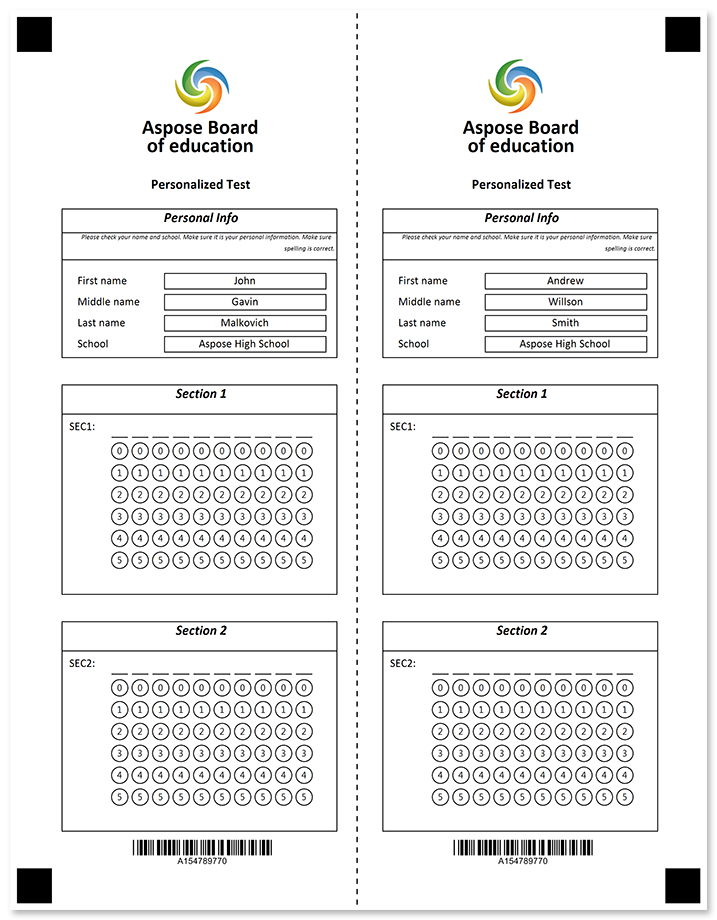
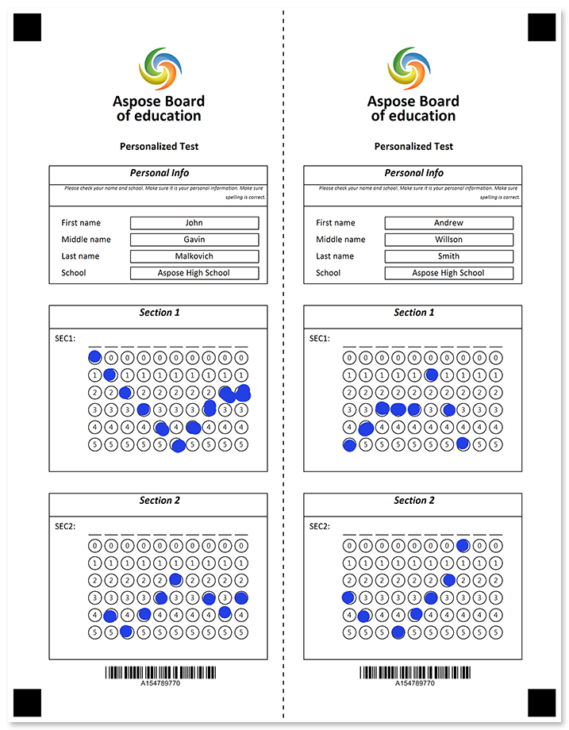

Two identical forms on one sheet separated with a horizontal or vertical tear line. Both parts are filled identically; one part remains with the respondent.



## Source code

<details>
<summary>Text markup</summary>

```
?container=main
	columns_proportions=46%-8%-46%
	block_bottom_margin=0
	block_top_padding=0
	block_right_margin=0
?block=left-header
	column=1
?paragraph=
?image=logo.jpg
	height=200
	width=200
	align=center
?empty_line=
	height=200
?content=Aspose Board
	font_style=bold
	font_size=18
	align=center
?empty_line=
	height=10
?content=of education
	font_style=bold
	font_size=18
	align=center
?font_style=Personalized test
	font_style=bold
	font_size=12
	align=center
?empty_line=100
	height=100	
?content=Personalized Test
	font_style=bold
	font_size=12
	align=center
?empty_line=100
	height=50	
&paragraph
&block
?block=left-header
	column=1
	border=square
?content=Personal Info
	font_size=12
	align=center
	font_style=bold, italic
?empty_line=50
	height=30
&block
?block=left-header-description
	column=1
	border=square
?content=Please check your name and school. Make sure it is your personal information. Make sure spelling is correct.
	font_size=6
	align=right
	font_style=italic
&block
?block=left-content
	column=1
	border=square
	is_clipped=true
?empty_line=
	height=50
?input_group=first_name
	input_border=square
?content=First name
?content=John
	align=center
&input_group
?input_group=middle_name
	input_border=square
?content=Middle name
?content=Gavin
	align=center
&input_group
?input_group=last_name
	input_border=square
?content=Last name
?content=Malkovich 
	align=center
&input_group
?input_group=school
	input_border=square
?content=School
?content=Aspose High School
	align=center
&input_group
&block
?block=left_space
	column=1
	border=none
?empty_line=
	height=100
&block
?block=left_section_1_header
	column=1
	border=square
?content=Section 1
	font_size=12
	align=center
	font_style=bold, italic
?empty_line=50
	height=50
&block
?block=left_section_1_content
	column=1
	border=square
?empty_line=25
	height=25
?grid=SEC1.
	column=1
	sections_count=10
	options_count=6
	align=right
?empty_line=25
	height=25
&block
?block=left_space
	column=1
	border=none
?empty_line=
	height=100
&block
?block=left_section_2_header
	column=1
	border=square
?content=Section 2
	font_size=12
	align=center
	font_style=bold, italic
?empty_line=50
	height=50
&block
?block=left_section_2_content
	column=1
	border=square
?empty_line=25
	height=25
?grid=SEC2.
	column=1
	sections_count=10
	options_count=6
	align=right
?empty_line=25
	height=25
&block
?block=left_footer
	column=1
?empty_line=25
	height=25
?barcode=test_id
	codetext=true
	value=15478977
	barcode_type=Code32
&block
?block=right-header
	column=3
?paragraph=
?image=logo.jpg
	height=200
	width=200
	x=1750
	y=180
?empty_line=
	height=200
?content=Aspose Board
	font_style=bold
	font_size=18
	align=center
?empty_line=
	height=10
?content=of education
	font_style=bold
	font_size=18
	align=center
?font_style=Personalized test
	font_style=bold
	font_size=12
	align=center
?empty_line=100
	height=100	
?content=Personalized Test
	font_style=bold
	font_size=12
	align=center
?empty_line=100
	height=50
&paragraph
&block
?block=right-header
	column=3
	border=square
?content=Personal Info
	font_size=12
	align=center
	font_style=bold, italic
?empty_line=50
	height=30
&block
?block=right-header-description
	column=3
	border=square
?content=Please check your name and school. Make sure it is your personal information. Make sure spelling is correct.
	font_size=6
	align=right
	font_style=italic
&block
?block=right-personal-content
	column=3
	border=square
	is_clipped=true
?empty_line=
	height=50
?input_group=first_name
	input_border=square
?content=First name
?content=Andrew
	align=center
&input_group
?input_group=middle_name
	input_border=square
?content=Middle name
?content=Willson
	align=center
&input_group
?input_group=last_name
	input_border=square
?content=Last name
?content=Smith 
	align=center
&input_group
?input_group=school
	input_border=square
?content=School
?content=Aspose High School
	align=center
&input_group
&block
?block=right_space
	column=3
	border=none
?empty_line=
	height=100
&block
?block=right_section_1_header
	column=3
	border=square
?content=Section 1
	font_size=12
	align=center
	font_style=bold, italic
?empty_line=50
	height=50
&block
?block=right_section_1_content
	column=3
	border=square
?empty_line=25
	height=25
?grid=SEC1.
	column=3
	sections_count=10
	options_count=6
	align=right
?empty_line=25
	height=25
&block
?block=right_space
	column=3
	border=none
?empty_line=
	height=100
&block
?block=right_section_2_header
	column=3
	border=square
?content=Section 2
	font_size=12
	align=center
	font_style=bold, italic
?empty_line=50
	height=50
&block
?block=right_section_2_content
	column=3
	border=square
?empty_line=25
	height=25
?grid=SEC2.
	column=3
	sections_count=10
	options_count=6
	align=right
?empty_line=25
	height=25
&block
?block=right_footer
	column=3
?empty_line=25
	height=25
?barcode=test_id
	codetext=true
	value=15478977
	barcode_type=Code32
&block
&container
?image=tear-line.png
	x=1200
	y=0
	width=150
	height=3295
```

</details>

<details>
<summary>JSON markup</summary>

```json
{
    "children": [{
            "children": [{
                    "name": "main",
                    "children": [{
                            "name": "left-header",
                            "children": [{
                                    "children": [{
                                            "align": "Center",
                                            "name": "logo.jpg",
                                            "height": 200,
                                            "width": 200,
                                            "element_type": "Image"
                                        }, {
                                            "height": 200,
                                            "element_type": "EmptyLine"
                                        }, {
                                            "name": "Aspose Board",
                                            "font_style": "Bold",
                                            "font_size": 18,
                                            "align": "Center",
                                            "element_type": "Content"
                                        }, {
                                            "height": 10,
                                            "element_type": "EmptyLine"
                                        }, {
                                            "name": "of education",
                                            "font_style": "Bold",
                                            "font_size": 18,
                                            "align": "Center",
                                            "element_type": "Content"
                                        }, {
                                            "name": "100",
                                            "height": 100,
                                            "element_type": "EmptyLine"
                                        }, {
                                            "name": "Personalized Test",
                                            "font_style": "Bold",
                                            "font_size": 12,
                                            "align": "Center",
                                            "element_type": "Content"
                                        }, {
                                            "name": "100",
                                            "height": 50,
                                            "element_type": "EmptyLine"
                                        }
                                    ],
                                    "paragraph_type": "Normal",
                                    "element_type": "Paragraph"
                                }
                            ],
                            "column": 1,
                            "element_type": "Block"
                        }, {
                            "name": "left-header",
                            "children": [{
                                    "name": "Personal Info",
                                    "font_style": [
                                        "Bold",
                                        "Italic"
                                    ],
                                    "font_size": 12,
                                    "align": "Center",
                                    "element_type": "Content"
                                }, {
                                    "name": "50",
                                    "height": 30,
                                    "element_type": "EmptyLine"
                                }
                            ],
                            "column": 1,
                            "border": "Square",
                            "element_type": "Block"
                        }, {
                            "name": "left-header-description",
                            "children": [{
                                    "name": "Please check your name and school. Make sure it is your personal information. Make sure spelling is correct.",
                                    "font_style": "Italic",
                                    "font_size": 6,
                                    "align": "Right",
                                    "element_type": "Content"
                                }
                            ],
                            "column": 1,
                            "border": "Square",
                            "element_type": "Block"
                        }, {
                            "name": "left-content",
                            "children": [{
                                    "height": 50,
                                    "element_type": "EmptyLine"
                                }, {
                                    "name": "first_name",
                                    "element_type": "InputGroup",
                                    "children": [{
                                            "name": "First name",
                                            "align": "Left",
                                            "element_type": "Content"
                                        }, {
                                            "name": "John",
                                            "align": "Center",
                                            "element_type": "Content"
                                        }
                                    ],
                                    "label_border": "None",
                                    "input_border": "Square",
                                    "border_color": "Black"
                                }, {
                                    "name": "middle_name",
                                    "element_type": "InputGroup",
                                    "children": [{
                                            "name": "Middle name",
                                            "align": "Left",
                                            "element_type": "Content"
                                        }, {
                                            "name": "Gavin",
                                            "align": "Center",
                                            "element_type": "Content"
                                        }
                                    ],
                                    "label_border": "None",
                                    "input_border": "Square",
                                    "border_color": "Black"
                                }, {
                                    "name": "last_name",
                                    "element_type": "InputGroup",
                                    "children": [{
                                            "name": "Last name",
                                            "align": "Left",
                                            "element_type": "Content"
                                        }, {
                                            "name": "Malkovich ",
                                            "align": "Center",
                                            "element_type": "Content"
                                        }
                                    ],
                                    "label_border": "None",
                                    "input_border": "Square",
                                    "border_color": "Black"
                                }, {
                                    "name": "school",
                                    "element_type": "InputGroup",
                                    "children": [{
                                            "name": "School",
                                            "align": "Left",
                                            "element_type": "Content"
                                        }, {
                                            "name": "Aspose High School",
                                            "align": "Center",
                                            "element_type": "Content"
                                        }
                                    ],
                                    "label_border": "None",
                                    "input_border": "Square",
                                    "border_color": "Black"
                                }
                            ],
                            "column": 1,
                            "border": "Square",
                            "is_clipped": true,
                            "element_type": "Block"
                        }, {
                            "name": "left_space",
                            "children": [{
                                    "height": 100,
                                    "element_type": "EmptyLine"
                                }
                            ],
                            "column": 1,
                            "element_type": "Block"
                        }, {
                            "name": "left_section_1_header",
                            "children": [{
                                    "name": "Section 1",
                                    "font_style": [
                                        "Bold",
                                        "Italic"
                                    ],
                                    "font_size": 12,
                                    "align": "Center",
                                    "element_type": "Content"
                                }, {
                                    "name": "50",
                                    "height": 50,
                                    "element_type": "EmptyLine"
                                }
                            ],
                            "column": 1,
                            "border": "Square",
                            "element_type": "Block"
                        }, {
                            "name": "left_section_1_content",
                            "children": [{
                                    "name": "25",
                                    "height": 25,
                                    "element_type": "EmptyLine"
                                }, {
                                    "bubble_size": "undefined",
                                    "name": "SEC1.",
                                    "column": 1,
                                    "sections_count": 10,
                                    "options_count": 6,
                                    "align": "Right",
                                    "header_type": "Underline",
                                    "header_border_size": 3,
                                    "header_border_color": "Black",
                                    "orientation": "Horizontal",
                                    "element_type": "Grid"
                                }, {
                                    "name": "25",
                                    "height": 25,
                                    "element_type": "EmptyLine"
                                }
                            ],
                            "column": 1,
                            "border": "Square",
                            "element_type": "Block"
                        }, {
                            "name": "left_space",
                            "children": [{
                                    "height": 100,
                                    "element_type": "EmptyLine"
                                }
                            ],
                            "column": 1,
                            "element_type": "Block"
                        }, {
                            "name": "left_section_2_header",
                            "children": [{
                                    "name": "Section 2",
                                    "font_style": [
                                        "Bold",
                                        "Italic"
                                    ],
                                    "font_size": 12,
                                    "align": "Center",
                                    "element_type": "Content"
                                }, {
                                    "name": "50",
                                    "height": 50,
                                    "element_type": "EmptyLine"
                                }
                            ],
                            "column": 1,
                            "border": "Square",
                            "element_type": "Block"
                        }, {
                            "name": "left_section_2_content",
                            "children": [{
                                    "name": "25",
                                    "height": 25,
                                    "element_type": "EmptyLine"
                                }, {
                                    "bubble_size": "undefined",
                                    "name": "SEC2",
                                    "column": 1,
                                    "sections_count": 10,
                                    "options_count": 6,
                                    "align": "Right",
                                    "header_type": "Underline",
                                    "header_border_size": 3,
                                    "header_border_color": "Black",
                                    "orientation": "Horizontal",
                                    "element_type": "Grid"
                                }, {
                                    "name": "25",
                                    "height": 25,
                                    "element_type": "EmptyLine"
                                }
                            ],
                            "column": 1,
                            "border": "Square",
                            "element_type": "Block"
                        }, {
                            "name": "left_footer",
                            "children": [{
                                    "name": "100",
                                    "height": 100,
                                    "element_type": "EmptyLine"
                                }, {
                                    "name": "test_id",
                                    "value": "15478977",
                                    "barcode_type": "code32",
                                    "align": "Center",
                                    "codetext": true,
                                    "element_type": "Barcode"
                                }
                            ],
                            "column": 1,
                            "element_type": "Block"
                        }, {
                            "name": "right-header",
                            "children": [{
                                    "children": [{
                                            "align": "Center",
                                            "name": "logo.jpg",
                                            "x": 1750,
                                            "y": 180,
                                            "height": 200,
                                            "width": 200,
                                            "element_type": "Image"
                                        }, {
                                            "height": 200,
                                            "element_type": "EmptyLine"
                                        }, {
                                            "name": "Aspose Board",
                                            "font_style": "Bold",
                                            "font_size": 18,
                                            "align": "Center",
                                            "element_type": "Content"
                                        }, {
                                            "height": 10,
                                            "element_type": "EmptyLine"
                                        }, {
                                            "name": "of education",
                                            "font_style": "Bold",
                                            "font_size": 18,
                                            "align": "Center",
                                            "element_type": "Content"
                                        }, {
                                            "name": "100",
                                            "height": 100,
                                            "element_type": "EmptyLine"
                                        }, {
                                            "name": "Personalized Test",
                                            "font_style": "Bold",
                                            "font_size": 12,
                                            "align": "Center",
                                            "element_type": "Content"
                                        }, {
                                            "name": "100",
                                            "height": 50,
                                            "element_type": "EmptyLine"
                                        }
                                    ],
                                    "paragraph_type": "Normal",
                                    "element_type": "Paragraph"
                                }
                            ],
                            "column": 3,
                            "element_type": "Block"
                        }, {
                            "name": "right-header",
                            "children": [{
                                    "name": "Personal Info",
                                    "font_style": [
                                        "Bold",
                                        "Italic"
                                    ],
                                    "font_size": 12,
                                    "align": "Center",
                                    "element_type": "Content"
                                }, {
                                    "name": "50",
                                    "height": 30,
                                    "element_type": "EmptyLine"
                                }
                            ],
                            "column": 3,
                            "border": "Square",
                            "element_type": "Block"
                        }, {
                            "name": "right-header-description",
                            "children": [{
                                    "name": "Please check your name and school. Make sure it is your personal information. Make sure spelling is correct.",
                                    "font_style": "Italic",
                                    "font_size": 6,
                                    "align": "Right",
                                    "element_type": "Content"
                                }
                            ],
                            "column": 3,
                            "border": "Square",
                            "element_type": "Block"
                        }, {
                            "name": "right-personal-content",
                            "children": [{
                                    "height": 50,
                                    "element_type": "EmptyLine"
                                }, {
                                    "name": "first_name",
                                    "element_type": "InputGroup",
                                    "children": [{
                                            "name": "First name",
                                            "align": "Left",
                                            "element_type": "Content"
                                        }, {
                                            "name": "Andrew",
                                            "align": "Center",
                                            "element_type": "Content"
                                        }
                                    ],
                                    "label_border": "None",
                                    "input_border": "Square",
                                    "border_color": "Black"
                                }, {
                                    "name": "middle_name",
                                    "element_type": "InputGroup",
                                    "children": [{
                                            "name": "Middle name",
                                            "align": "Left",
                                            "element_type": "Content"
                                        }, {
                                            "name": "Willson",
                                            "align": "Center",
                                            "element_type": "Content"
                                        }
                                    ],
                                    "label_border": "None",
                                    "input_border": "Square",
                                    "border_color": "Black"
                                }, {
                                    "name": "last_name",
                                    "element_type": "InputGroup",
                                    "children": [{
                                            "name": "Last name",
                                            "align": "Left",
                                            "element_type": "Content"
                                        }, {
                                            "name": "Smith ",
                                            "align": "Center",
                                            "element_type": "Content"
                                        }
                                    ],
                                    "label_border": "None",
                                    "input_border": "Square",
                                    "border_color": "Black"
                                }, {
                                    "name": "school",
                                    "element_type": "InputGroup",
                                    "children": [{
                                            "name": "School",
                                            "align": "Left",
                                            "element_type": "Content"
                                        }, {
                                            "name": "Aspose High School",
                                            "align": "Center",
                                            "element_type": "Content"
                                        }
                                    ],
                                    "label_border": "None",
                                    "input_border": "Square",
                                    "border_color": "Black"
                                }
                            ],
                            "column": 3,
                            "border": "Square",
                            "is_clipped": true,
                            "element_type": "Block"
                        }, {
                            "name": "right_space",
                            "children": [{
                                    "height": 100,
                                    "element_type": "EmptyLine"
                                }
                            ],
                            "column": 3,
                            "element_type": "Block"
                        }, {
                            "name": "right_section_1_header",
                            "children": [{
                                    "name": "Section 1",
                                    "font_style": [
                                        "Bold",
                                        "Italic"
                                    ],
                                    "font_size": 12,
                                    "align": "Center",
                                    "element_type": "Content"
                                }, {
                                    "name": "50",
                                    "height": 50,
                                    "element_type": "EmptyLine"
                                }
                            ],
                            "column": 3,
                            "border": "Square",
                            "element_type": "Block"
                        }, {
                            "name": "right_section_1_content",
                            "children": [{
                                    "name": "25",
                                    "height": 25,
                                    "element_type": "EmptyLine"
                                }, {
                                    "bubble_size": "undefined",
                                    "name": "SEC1.",
                                    "column": 3,
                                    "sections_count": 10,
                                    "options_count": 6,
                                    "align": "Right",
                                    "header_type": "Underline",
                                    "header_border_size": 3,
                                    "header_border_color": "Black",
                                    "orientation": "Horizontal",
                                    "element_type": "Grid"
                                }, {
                                    "name": "25",
                                    "height": 25,
                                    "element_type": "EmptyLine"
                                }
                            ],
                            "column": 3,
                            "border": "Square",
                            "element_type": "Block"
                        }, {
                            "name": "right_space",
                            "children": [{
                                    "height": 100,
                                    "element_type": "EmptyLine"
                                }
                            ],
                            "column": 3,
                            "element_type": "Block"
                        }, {
                            "name": "right_section_2_header",
                            "children": [{
                                    "name": "Section 2",
                                    "font_style": [
                                        "Bold",
                                        "Italic"
                                    ],
                                    "font_size": 12,
                                    "align": "Center",
                                    "element_type": "Content"
                                }, {
                                    "name": "50",
                                    "height": 50,
                                    "element_type": "EmptyLine"
                                }
                            ],
                            "column": 3,
                            "border": "Square",
                            "element_type": "Block"
                        }, {
                            "name": "right_section_2_content",
                            "children": [{
                                    "name": "25",
                                    "height": 25,
                                    "element_type": "EmptyLine"
                                }, {
                                    "bubble_size": "undefined",
                                    "name": "SEC2",
                                    "column": 3,
                                    "sections_count": 10,
                                    "options_count": 6,
                                    "align": "Right",
                                    "header_type": "Underline",
                                    "header_border_size": 3,
                                    "header_border_color": "Black",
                                    "orientation": "Horizontal",
                                    "element_type": "Grid"
                                }, {
                                    "name": "25",
                                    "height": 25,
                                    "element_type": "EmptyLine"
                                }
                            ],
                            "column": 3,
                            "border": "Square",
                            "element_type": "Block"
                        }, {
                            "name": "right_footer",
                            "children": [{
                                    "name": "100",
                                    "height": 100,
                                    "element_type": "EmptyLine"
                                }, {
                                    "name": "test_id",
                                    "value": "15478977",
                                    "barcode_type": "code32",
                                    "align": "Center",
                                    "codetext": true,
                                    "element_type": "Barcode"
                                }
                            ],
                            "column": 3,
                            "element_type": "Block"
                        }
                    ],
                    "columns_proportions": [
                        46,
                        8,
                        46
                    ],
                    "container_type": "Normal",
                    "block_right_margin": 0,
                    "block_bottom_margin": 0,
                    "block_top_padding": 0,
                    "element_type": "Container"
                }, {
                    "align": "Center",
                    "name": "tear-line.png",
                    "x": 1200,
                    "y": 0,
                    "height": 3295,
                    "width": 150,
                    "element_type": "Image"
                }
            ],
            "element_type": "Page"
        }
    ],
    "element_type": "Template"
}
```

</details>

## Page settings

This template was generated using the following paper size, orientation, font, and other [layout settings](/omr/net/generate-template/page-setup/):

```csharp
GlobalPageSettings settings = new GlobalPageSettings
{
    PaperSize = PaperSize.Letter,
    Orientation = Orientation.Vertical,
    BubbleColor = Color.Black,
    BubbleSize = BubbleSize.Normal,
    FontStyle = FontStyle.Regular,
    FontSize = 10,
    FontFamily = "Calibri",
};
```

## Recognition results



```
Element Name,Value,
SEC1.,"0,51,42,33,34,35,14,33,522"
SEC2,"34,454,53,42,323,043"
test_id,"154789770"
test_id,"154789770"
```

## Download

[Click here](https://github.com/aspose-omr/Aspose.OMR-Documentation/blob/master/net/showcases/download/tearline-vertical-bw.zip) to download full template sources and related files. 

**Package structure:**

File | Description
---- | -----------
**logo.jpg** | company logo
**settings.txt** | [page settings](/omr/net/generate-template/page-setup/)
**tear-line.png** | vertical tear line image
**vertical tear-line.csv** | recognition results based on the filled form available in this package
**vertical tear-line.json** | source code in [JSON markup](/omr/net/json-markup/)
**vertical tear-line.omr** | recognition pattern
**vertical tear-line.png** | source code in [text markup](/omr/net/txt-markup/)
**vertical tear-line.txt** | vertical tear line image
**vertical tear-line_clip0.png** | vertical tear line image
**vertical tear-line_clip1.png** | vertical tear line image
**vertical tear-line-recognized.png** | filled form
