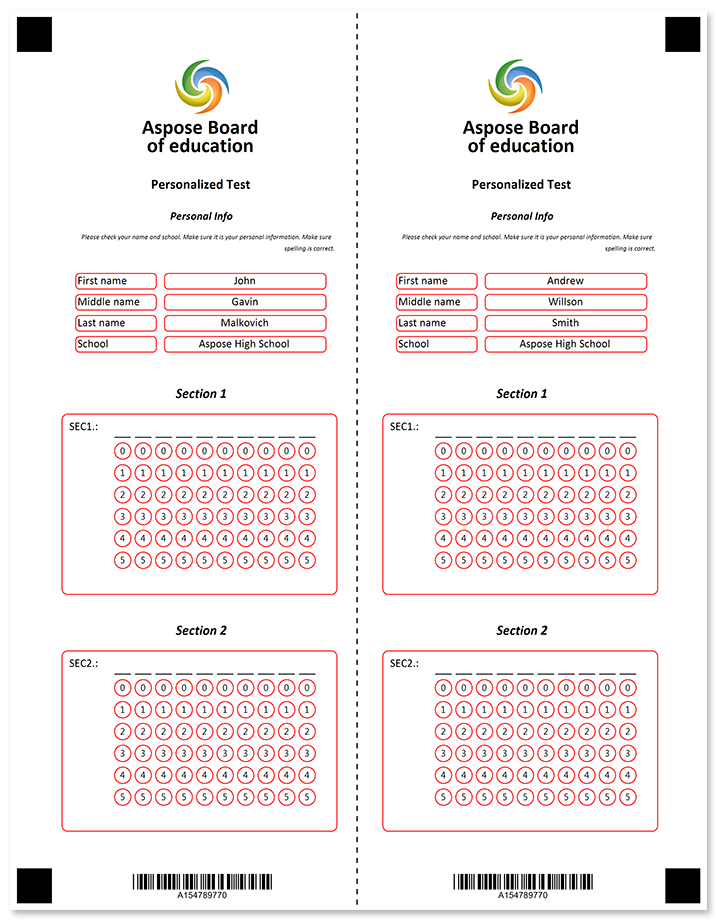
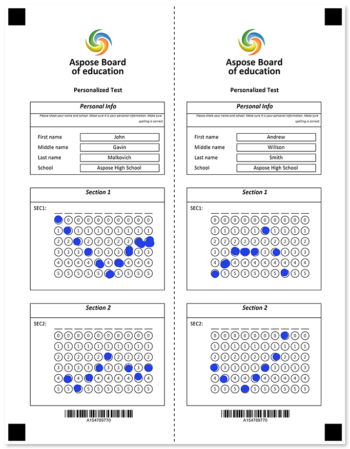

Two identical forms on one sheet separated with a horizontal or vertical tear line. Both parts are filled identically; one part remains with the respondent.



## Source code

<details>
<summary>Text markup</summary>

```
?container=main
	columns_proportions=46%-8%-46%
	block_bottom_margin=0
	block_top_padding=0
	block_right_margin=0
?block=left-header
	column=1
?paragraph=
?image=logo.jpg
	height=200
	width=200
	align=center
?content=Aspose Board
	font_style=bold
	font_size=18
	align=center
?content=of education
	font_style=bold
	font_size=18
	align=center
?content=Personalized Test
	font_style=bold
	font_size=12
	align=center
&paragraph
&block
?block=left-header
	column=1
	border=none
?content=Personal Info
	font_size=10
	align=center
	font_style=bold, italic
&block
?block=left-header-description
	column=1
	border=none
?content=Please check your name and school. Make sure it is your personal information. Make sure spelling is correct.
	font_size=6
	align=right
	font_style=italic
&block
?block=left-content
	column=1
	border=none
	is_clipped=true
?input_group=first_name
	input_border=rounded
	label_border=rounded
	border_color=Red
?content=First name
?content=John
	align=center
&input_group
?input_group=middle_name
	input_border=rounded
	label_border=rounded
	border_color=Red
?content=Middle name
?content=Gavin
	align=center
&input_group
?input_group=last_name
	input_border=rounded
	label_border=rounded
	border_color=Red
?content=Last name
?content=Malkovich 
	align=center
&input_group
?input_group=school
	input_border=rounded
	label_border=rounded
	border_color=Red
?content=School
?content=Aspose High School
	align=center
&input_group
&block
?block=left_space
	column=1
	border=none
&block
?block=left_section_1_header
	column=1
	border=none
?content=Section 1
	font_size=12
	align=center
	font_style=bold, italic
&block
?block=left_section_1_content
	column=1
	border=rounded
	border_color=Red
?grid=SEC1.
	column=1
	sections_count=10
	options_count=6
	align=center
&block
?block=left_space
	column=1
	border=none
&block
?block=left_section_2_header
	column=1
	border=none
?content=Section 2
	font_size=12
	align=center
	font_style=bold, italic
&block
?block=left_section_2_content
	column=1
	border=rounded
	border_color=Red
?grid=SEC2.
	column=1
	sections_count=10
	options_count=6
	align=center
&block
?block=left_footer
	column=1
?barcode=test_id
	codetext=true
	value=15478977
	barcode_type=Code32
&block
?block=right-header
	column=3
?paragraph=
?image=logo.jpg
	height=200
	width=200
?content=Aspose Board
	font_style=bold
	font_size=18
	align=center
?content=of education
	font_style=bold
	font_size=18
	align=center	
?content=Personalized Test
	font_style=bold
	font_size=12
	align=center
&paragraph
&block
?block=right-header
	column=3
	border=none
?content=Personal Info
	font_size=10
	align=center
	font_style=bold, italic
&block
?block=right-header-description
	column=3
	border=none
?content=Please check your name and school. Make sure it is your personal information. Make sure spelling is correct.
	font_size=6
	align=right
	font_style=italic
&block
?block=right-personal-content
	column=3
	border=none
	is_clipped=true
?input_group=first_name
	input_border=rounded
	label_border=rounded
	border_color=Red
?content=First name
?content=Andrew
	align=center
&input_group
?input_group=middle_name
	input_border=rounded
	label_border=rounded
	border_color=Red
?content=Middle name
?content=Willson
	align=center
&input_group
?input_group=last_name
	input_border=rounded
	label_border=rounded
	border_color=Red
?content=Last name
?content=Smith 
	align=center
&input_group
?input_group=school
	input_border=rounded
	label_border=rounded
	border_color=Red
?content=School
?content=Aspose High School
	align=center
&input_group
&block
?block=right_space
	column=3
	border=none
&block
?block=right_section_1_header
	column=3
	border=none
?content=Section 1
	font_size=12
	align=center
	font_style=bold, italic
&block
?block=right_section_1_content
	column=3
	border=rounded
	border_color=Red
?grid=SEC1.
	column=3
	sections_count=10
	options_count=6
	align=center
&block
?block=right_space
	column=3
	border=none
&block
?block=right_section_2_header
	column=3
	border=none
?content=Section 2
	font_size=12
	align=center
	font_style=bold, italic
&block
?block=right_section_2_content
	column=3
	border=rounded
	border_color=Red
?grid=SEC2.
	column=3
	sections_count=10
	options_count=6
	align=center
&block
?block=right_footer
	column=3
?barcode=test_id
	codetext=true
	value=15478977
	barcode_type=Code32
&block
&container
?image=tear-line.png
	x=1200
	y=0
	width=150
	height=3295
```

</details>

<details>
<summary>JSON markup</summary>

```json
{
  "name": null,
  "children": [
    {
      "name": null,
      "children": [
        {
          "name": "main",
          "children": [
            {
              "name": "left-header",
              "children": [
                {
                  "name": "",
                  "children": [
                    {
                      "align": "Center",
                      "name": "logo.jpg",
                      "image_path": null,
                      "x": -1,
                      "y": -1,
                      "height": 200,
                      "width": 200,
                      "element_type": "Image"
                    },
                    {
                      "name": "Aspose Board",
                      "font_family": "Calibri",
                      "font_style": "Bold",
                      "font_size": 18,
                      "content_type": "Normal",
                      "align": "Center",
                      "element_type": "Content"
                    },
                    {
                      "name": "of education",
                      "font_family": "Calibri",
                      "font_style": "Bold",
                      "font_size": 18,
                      "content_type": "Normal",
                      "align": "Center",
                      "element_type": "Content"
                    },
                    {
                      "name": "Personalized Test",
                      "font_family": "Calibri",
                      "font_style": "Bold",
                      "font_size": 12,
                      "content_type": "Normal",
                      "align": "Center",
                      "element_type": "Content"
                    }
                  ],
                  "paragraph_type": "Normal",
                  "element_type": "Paragraph"
                }
              ],
              "column": 1,
              "border": "None",
              "border_size": 3,
              "border_color": "Black",
              "is_clipped": false,
              "element_type": "Block"
            },
            {
              "name": "left-header",
              "children": [
                {
                  "name": "Personal Info",
                  "font_family": "Calibri",
                  "font_style": [
                    "Bold",
                    "Italic"
                  ],
                  "font_size": 10,
                  "content_type": "Normal",
                  "align": "Center",
                  "element_type": "Content"
                }
              ],
              "column": 1,
              "border": "None",
              "border_size": 3,
              "border_color": "Black",
              "is_clipped": false,
              "element_type": "Block"
            },
            {
              "name": "left-header-description",
              "children": [
                {
                  "name": "Please check your name and school. Make sure it is your personal information. Make sure spelling is correct.",
                  "font_family": "Calibri",
                  "font_style": "Italic",
                  "font_size": 6,
                  "content_type": "Normal",
                  "align": "Right",
                  "element_type": "Content"
                }
              ],
              "column": 1,
              "border": "None",
              "border_size": 3,
              "border_color": "Black",
              "is_clipped": false,
              "element_type": "Block"
            },
            {
              "name": "left-content",
              "children": [
                {
                  "name": "first_name",
                  "element_type": "InputGroup",
                  "children": [
                    {
                      "name": "First name",
                      "font_family": "Calibri",
                      "font_style": "Regular",
                      "font_size": 10,
                      "content_type": "Normal",
                      "align": "Left",
                      "element_type": "Content"
                    },
                    {
                      "name": "John",
                      "font_family": "Calibri",
                      "font_style": "Regular",
                      "font_size": 10,
                      "content_type": "Normal",
                      "align": "Center",
                      "element_type": "Content"
                    }
                  ],
                  "label_border": "Rounded",
                  "input_border": "Rounded",
                  "border_size": 3,
                  "border_color": "Red"
                },
                {
                  "name": "middle_name",
                  "element_type": "InputGroup",
                  "children": [
                    {
                      "name": "Middle name",
                      "font_family": "Calibri",
                      "font_style": "Regular",
                      "font_size": 10,
                      "content_type": "Normal",
                      "align": "Left",
                      "element_type": "Content"
                    },
                    {
                      "name": "Gavin",
                      "font_family": "Calibri",
                      "font_style": "Regular",
                      "font_size": 10,
                      "content_type": "Normal",
                      "align": "Center",
                      "element_type": "Content"
                    }
                  ],
                  "label_border": "Rounded",
                  "input_border": "Rounded",
                  "border_size": 3,
                  "border_color": "Red"
                },
                {
                  "name": "last_name",
                  "element_type": "InputGroup",
                  "children": [
                    {
                      "name": "Last name",
                      "font_family": "Calibri",
                      "font_style": "Regular",
                      "font_size": 10,
                      "content_type": "Normal",
                      "align": "Left",
                      "element_type": "Content"
                    },
                    {
                      "name": "Malkovich ",
                      "font_family": "Calibri",
                      "font_style": "Regular",
                      "font_size": 10,
                      "content_type": "Normal",
                      "align": "Center",
                      "element_type": "Content"
                    }
                  ],
                  "label_border": "Rounded",
                  "input_border": "Rounded",
                  "border_size": 3,
                  "border_color": "Red"
                },
                {
                  "name": "school",
                  "element_type": "InputGroup",
                  "children": [
                    {
                      "name": "School",
                      "font_family": "Calibri",
                      "font_style": "Regular",
                      "font_size": 10,
                      "content_type": "Normal",
                      "align": "Left",
                      "element_type": "Content"
                    },
                    {
                      "name": "Aspose High School",
                      "font_family": "Calibri",
                      "font_style": "Regular",
                      "font_size": 10,
                      "content_type": "Normal",
                      "align": "Center",
                      "element_type": "Content"
                    }
                  ],
                  "label_border": "Rounded",
                  "input_border": "Rounded",
                  "border_size": 3,
                  "border_color": "Red"
                }
              ],
              "column": 1,
              "border": "None",
              "border_size": 3,
              "border_color": "Black",
              "is_clipped": true,
              "element_type": "Block"
            },
            {
              "name": "left_space",
              "children": [],
              "column": 1,
              "border": "None",
              "border_size": 3,
              "border_color": "Black",
              "is_clipped": false,
              "element_type": "Block"
            },
            {
              "name": "left_section_1_header",
              "children": [
                {
                  "name": "Section 1",
                  "font_family": "Calibri",
                  "font_style": [
                    "Bold",
                    "Italic"
                  ],
                  "font_size": 12,
                  "content_type": "Normal",
                  "align": "Center",
                  "element_type": "Content"
                }
              ],
              "column": 1,
              "border": "None",
              "border_size": 3,
              "border_color": "Black",
              "is_clipped": false,
              "element_type": "Block"
            },
            {
              "name": "left_section_1_content",
              "children": [
                {
                  "name": "SEC1.",
                  "column": 1,
                  "sections_count": 10,
                  "options_count": 6,
                  "align": "Center",
                  "header_type": "Underline",
                  "header_border_size": 3,
                  "header_border_color": "Black",
                  "orientation": "Horizontal",
                  "vertical_margin": 0,
                  "bubble_size": "Normal",
                  "bubble_type": "Round",
                  "x": -1,
                  "y": -1,
                  "element_type": "Grid"
                }
              ],
              "column": 1,
              "border": "Rounded",
              "border_size": 3,
              "border_color": "Red",
              "is_clipped": false,
              "element_type": "Block"
            },
            {
              "name": "left_space",
              "children": [],
              "column": 1,
              "border": "None",
              "border_size": 3,
              "border_color": "Black",
              "is_clipped": false,
              "element_type": "Block"
            },
            {
              "name": "left_section_2_header",
              "children": [
                {
                  "name": "Section 2",
                  "font_family": "Calibri",
                  "font_style": [
                    "Bold",
                    "Italic"
                  ],
                  "font_size": 12,
                  "content_type": "Normal",
                  "align": "Center",
                  "element_type": "Content"
                }
              ],
              "column": 1,
              "border": "None",
              "border_size": 3,
              "border_color": "Black",
              "is_clipped": false,
              "element_type": "Block"
            },
            {
              "name": "left_section_2_content",
              "children": [
                {
                  "name": "SEC2.",
                  "column": 1,
                  "sections_count": 10,
                  "options_count": 6,
                  "align": "Center",
                  "header_type": "Underline",
                  "header_border_size": 3,
                  "header_border_color": "Black",
                  "orientation": "Horizontal",
                  "vertical_margin": 0,
                  "bubble_size": "Normal",
                  "bubble_type": "Round",
                  "x": -1,
                  "y": -1,
                  "element_type": "Grid"
                }
              ],
              "column": 1,
              "border": "Rounded",
              "border_size": 3,
              "border_color": "Red",
              "is_clipped": false,
              "element_type": "Block"
            },
            {
              "name": "left_footer",
              "children": [
                {
                  "name": "test_id",
                  "value": "15478977",
                  "barcode_type": "Code32",
                  "qr_version": "Auto",
                  "align": "Center",
                  "height": -1,
                  "codetext": true,
                  "X": -1,
                  "Y": -1,
                  "element_type": "Barcode"
                }
              ],
              "column": 1,
              "border": "None",
              "border_size": 3,
              "border_color": "Black",
              "is_clipped": false,
              "element_type": "Block"
            },
            {
              "name": "right-header",
              "children": [
                {
                  "name": "",
                  "children": [
                    {
                      "align": "Center",
                      "name": "logo.jpg",
                      "image_path": null,
                      "x": -1,
                      "y": -1,
                      "height": 200,
                      "width": 200,
                      "element_type": "Image"
                    },
                    {
                      "name": "Aspose Board",
                      "font_family": "Calibri",
                      "font_style": "Bold",
                      "font_size": 18,
                      "content_type": "Normal",
                      "align": "Center",
                      "element_type": "Content"
                    },
                    {
                      "name": "of education",
                      "font_family": "Calibri",
                      "font_style": "Bold",
                      "font_size": 18,
                      "content_type": "Normal",
                      "align": "Center",
                      "element_type": "Content"
                    },
                    {
                      "name": "Personalized Test",
                      "font_family": "Calibri",
                      "font_style": "Bold",
                      "font_size": 12,
                      "content_type": "Normal",
                      "align": "Center",
                      "element_type": "Content"
                    }
                  ],
                  "paragraph_type": "Normal",
                  "element_type": "Paragraph"
                }
              ],
              "column": 3,
              "border": "None",
              "border_size": 3,
              "border_color": "Black",
              "is_clipped": false,
              "element_type": "Block"
            },
            {
              "name": "right-header",
              "children": [
                {
                  "name": "Personal Info",
                  "font_family": "Calibri",
                  "font_style": [
                    "Bold",
                    "Italic"
                  ],
                  "font_size": 10,
                  "content_type": "Normal",
                  "align": "Center",
                  "element_type": "Content"
                }
              ],
              "column": 3,
              "border": "None",
              "border_size": 3,
              "border_color": "Black",
              "is_clipped": false,
              "element_type": "Block"
            },
            {
              "name": "right-header-description",
              "children": [
                {
                  "name": "Please check your name and school. Make sure it is your personal information. Make sure spelling is correct.",
                  "font_family": "Calibri",
                  "font_style": "Italic",
                  "font_size": 6,
                  "content_type": "Normal",
                  "align": "Right",
                  "element_type": "Content"
                }
              ],
              "column": 3,
              "border": "None",
              "border_size": 3,
              "border_color": "Black",
              "is_clipped": false,
              "element_type": "Block"
            },
            {
              "name": "right-personal-content",
              "children": [
                {
                  "name": "first_name",
                  "element_type": "InputGroup",
                  "children": [
                    {
                      "name": "First name",
                      "font_family": "Calibri",
                      "font_style": "Regular",
                      "font_size": 10,
                      "content_type": "Normal",
                      "align": "Left",
                      "element_type": "Content"
                    },
                    {
                      "name": "Andrew",
                      "font_family": "Calibri",
                      "font_style": "Regular",
                      "font_size": 10,
                      "content_type": "Normal",
                      "align": "Center",
                      "element_type": "Content"
                    }
                  ],
                  "label_border": "Rounded",
                  "input_border": "Rounded",
                  "border_size": 3,
                  "border_color": "Red"
                },
                {
                  "name": "middle_name",
                  "element_type": "InputGroup",
                  "children": [
                    {
                      "name": "Middle name",
                      "font_family": "Calibri",
                      "font_style": "Regular",
                      "font_size": 10,
                      "content_type": "Normal",
                      "align": "Left",
                      "element_type": "Content"
                    },
                    {
                      "name": "Willson",
                      "font_family": "Calibri",
                      "font_style": "Regular",
                      "font_size": 10,
                      "content_type": "Normal",
                      "align": "Center",
                      "element_type": "Content"
                    }
                  ],
                  "label_border": "Rounded",
                  "input_border": "Rounded",
                  "border_size": 3,
                  "border_color": "Red"
                },
                {
                  "name": "last_name",
                  "element_type": "InputGroup",
                  "children": [
                    {
                      "name": "Last name",
                      "font_family": "Calibri",
                      "font_style": "Regular",
                      "font_size": 10,
                      "content_type": "Normal",
                      "align": "Left",
                      "element_type": "Content"
                    },
                    {
                      "name": "Smith ",
                      "font_family": "Calibri",
                      "font_style": "Regular",
                      "font_size": 10,
                      "content_type": "Normal",
                      "align": "Center",
                      "element_type": "Content"
                    }
                  ],
                  "label_border": "Rounded",
                  "input_border": "Rounded",
                  "border_size": 3,
                  "border_color": "Red"
                },
                {
                  "name": "school",
                  "element_type": "InputGroup",
                  "children": [
                    {
                      "name": "School",
                      "font_family": "Calibri",
                      "font_style": "Regular",
                      "font_size": 10,
                      "content_type": "Normal",
                      "align": "Left",
                      "element_type": "Content"
                    },
                    {
                      "name": "Aspose High School",
                      "font_family": "Calibri",
                      "font_style": "Regular",
                      "font_size": 10,
                      "content_type": "Normal",
                      "align": "Center",
                      "element_type": "Content"
                    }
                  ],
                  "label_border": "Rounded",
                  "input_border": "Rounded",
                  "border_size": 3,
                  "border_color": "Red"
                }
              ],
              "column": 3,
              "border": "None",
              "border_size": 3,
              "border_color": "Black",
              "is_clipped": true,
              "element_type": "Block"
            },
            {
              "name": "right_space",
              "children": [],
              "column": 3,
              "border": "None",
              "border_size": 3,
              "border_color": "Black",
              "is_clipped": false,
              "element_type": "Block"
            },
            {
              "name": "right_section_1_header",
              "children": [
                {
                  "name": "Section 1",
                  "font_family": "Calibri",
                  "font_style": [
                    "Bold",
                    "Italic"
                  ],
                  "font_size": 12,
                  "content_type": "Normal",
                  "align": "Center",
                  "element_type": "Content"
                }
              ],
              "column": 3,
              "border": "None",
              "border_size": 3,
              "border_color": "Black",
              "is_clipped": false,
              "element_type": "Block"
            },
            {
              "name": "right_section_1_content",
              "children": [
                {
                  "name": "SEC1.",
                  "column": 3,
                  "sections_count": 10,
                  "options_count": 6,
                  "align": "Center",
                  "header_type": "Underline",
                  "header_border_size": 3,
                  "header_border_color": "Black",
                  "orientation": "Horizontal",
                  "vertical_margin": 0,
                  "bubble_size": "Normal",
                  "bubble_type": "Round",
                  "x": -1,
                  "y": -1,
                  "element_type": "Grid"
                }
              ],
              "column": 3,
              "border": "Rounded",
              "border_size": 3,
              "border_color": "Red",
              "is_clipped": false,
              "element_type": "Block"
            },
            {
              "name": "right_space",
              "children": [],
              "column": 3,
              "border": "None",
              "border_size": 3,
              "border_color": "Black",
              "is_clipped": false,
              "element_type": "Block"
            },
            {
              "name": "right_section_2_header",
              "children": [
                {
                  "name": "Section 2",
                  "font_family": "Calibri",
                  "font_style": [
                    "Bold",
                    "Italic"
                  ],
                  "font_size": 12,
                  "content_type": "Normal",
                  "align": "Center",
                  "element_type": "Content"
                }
              ],
              "column": 3,
              "border": "None",
              "border_size": 3,
              "border_color": "Black",
              "is_clipped": false,
              "element_type": "Block"
            },
            {
              "name": "right_section_2_content",
              "children": [
                {
                  "name": "SEC2.",
                  "column": 3,
                  "sections_count": 10,
                  "options_count": 6,
                  "align": "Center",
                  "header_type": "Underline",
                  "header_border_size": 3,
                  "header_border_color": "Black",
                  "orientation": "Horizontal",
                  "vertical_margin": 0,
                  "bubble_size": "Normal",
                  "bubble_type": "Round",
                  "x": -1,
                  "y": -1,
                  "element_type": "Grid"
                }
              ],
              "column": 3,
              "border": "Rounded",
              "border_size": 3,
              "border_color": "Red",
              "is_clipped": false,
              "element_type": "Block"
            },
            {
              "name": "right_footer",
              "children": [
                {
                  "name": "test_id",
                  "value": "15478977",
                  "barcode_type": "Code32",
                  "qr_version": "Auto",
                  "align": "Center",
                  "height": -1,
                  "codetext": true,
                  "X": -1,
                  "Y": -1,
                  "element_type": "Barcode"
                }
              ],
              "column": 3,
              "border": "None",
              "border_size": 3,
              "border_color": "Black",
              "is_clipped": false,
              "element_type": "Block"
            }
          ],
          "columns_count": 0,
          "columns_proportions": [
            46,
            8,
            46
          ],
          "container_type": "Normal",
          "block_right_margin": 0,
          "block_bottom_margin": 0,
          "block_top_padding": 0,
          "element_type": "Container"
        },
        {
          "align": "Center",
          "name": "tear-line.png",
          "image_path": null,
          "x": 1200,
          "y": 0,
          "height": 3295,
          "width": 150,
          "element_type": "Image"
        }
      ],
      "element_type": "Page"
    }
  ],
  "element_type": "Template"
}
```

</details>

## Page settings

This template was generated using the following paper size, orientation, font, and other [layout settings](/omr/net/generate-template/page-setup/):

```csharp
GlobalPageSettings settings = new GlobalPageSettings
{
    PaperSize = PaperSize.Letter,
    Orientation = Orientation.Vertical,
    BubbleColor = Color.Red,
    BubbleSize = BubbleSize.Normal,
    FontStyle = FontStyle.Regular,
    FontSize = 10,
    FontFamily = "Calibri",
};
```

## Recognition results



```
Element Name,Value,
SEC1.,"0,51,42,33,34,35,14,33,522"
SEC2,"34,454,53,42,323,043"
test_id,"154789770"
test_id,"154789770"
```

## Download

[Click here](https://github.com/aspose-omr/Aspose.OMR-Documentation/blob/master/net/showcases/download/tearline-vertical-red.zip) to download full template sources and related files. 

**Package structure:**

File | Description
---- | -----------
**logo.jpg** | company logo
**settings.json** | [page settings](/omr/net/generate-template/page-setup/)
**tear-line.png** | vertical tear line image
**vertical tear-line.csv** | recognition results based on the filled form available in this package
**vertical tear-line.json** | source code in [JSON markup](/omr/json-markup/)
**vertical tear-line.omr** | recognition pattern
**vertical tear-line.png** | source code in [text markup](/omr/txt-markup/)
**vertical tear-line.txt** | vertical tear line image
**vertical tear-line-recognized.png** | filled form
